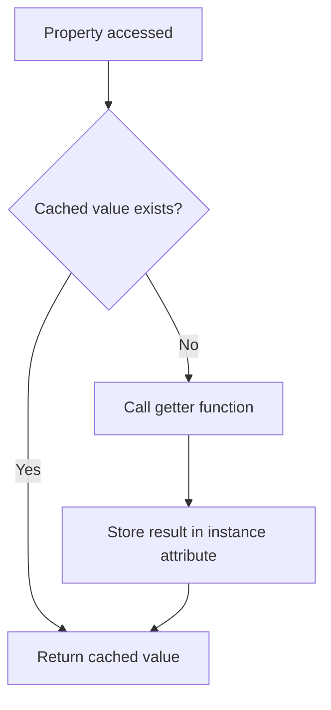
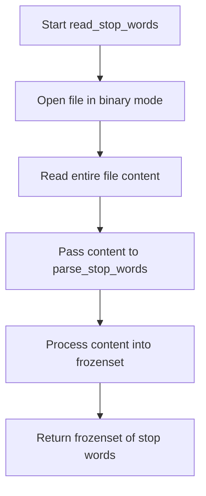

# `utils.py`

## `sumy.utils.normalize_language` · *function*

## Summary:
Converts language identifiers into standardized lowercase language names using pycountry lookup.

## Description:
Normalizes language identifiers by attempting to resolve them through the pycountry library using both alpha-2 and alpha-3 language codes. If a matching language is found, returns the standardized language name in lowercase; otherwise, returns the original identifier unchanged.

## Args:
    language (str): Language identifier that can be an alpha-2 code (e.g., "en"), alpha-3 code (e.g., "eng"), or full language name.

## Returns:
    str: Standardized lowercase language name if found in pycountry, otherwise returns the original language parameter unchanged.

## Raises:
    None explicitly raised, though KeyError exceptions from pycountry are caught and ignored.

## Constraints:
    Preconditions:
        - Input must be a string type
        - pycountry library must be available and properly installed
    
    Postconditions:
        - Return value is always a string
        - If language is found in pycountry, result is lowercase
        - If language is not found, original input is returned unchanged

## Side Effects:
    None

## Control Flow:
```mermaid
flowchart TD
    A[Start normalize_language] --> B{language lookup with alpha_2}
    B --> C{KeyError?}
    C -->|Yes| D[Continue to alpha_3 lookup]
    C -->|No| E{lang object exists?}
    E -->|Yes| F[Set language = lang.name.lower()]
    E -->|No| G[Continue to alpha_3 lookup]
    D --> H{language lookup with alpha_3}
    H --> I{KeyError?}
    I -->|Yes| J[Return original language]
    I -->|No| K{lang object exists?}
    K -->|Yes| L[Set language = lang.name.lower()]
    K -->|No| M[Return original language]
    F --> N[Return language]
    L --> N
    J --> N
    M --> N
```

## Examples:
    >>> normalize_language("en")
    "english"
    >>> normalize_language("eng")
    "english"
    >>> normalize_language("English")
    "english"
    >>> normalize_language("xyz")
    "xyz"

## `sumy.utils.fetch_url` · *function*

## Summary:
Fetches the raw content of a web resource from a given URL using HTTP GET request.

## Description:
Retrieves the binary content of a web page or resource by making an HTTP GET request. This utility function encapsulates the common pattern of fetching remote content with proper resource management and error handling for HTTP status codes.

## Args:
    url (str): The URL to fetch content from. Must be a valid HTTP or HTTPS URL.

## Returns:
    bytes: Raw binary content of the fetched resource.

## Raises:
    requests.exceptions.RequestException: When the HTTP request fails or the server returns an error status code (4xx or 5xx).

## Constraints:
    Preconditions:
        - The URL parameter must be a valid string representing a web address
        - The target resource must be accessible over HTTP/HTTPS
    Postconditions:
        - The returned bytes object contains the complete raw content of the fetched resource
        - No network resources are left open after execution

## Side Effects:
    - Makes an outbound HTTP network request to the specified URL
    - May trigger DNS resolution and TCP connection establishment
    - Consumes network bandwidth and time proportional to resource size

## Control Flow:
```mermaid
flowchart TD
    A[Start fetch_url] --> B{URL Valid?}
    B -->|No| C[Throw TypeError]
    B -->|Yes| D[Make HTTP GET request with _HTTP_HEADERS]
    D --> E{Request successful?}
    E -->|No| F[raise_for_status() raises exception]
    E -->|Yes| G[Return response.content]
```

## Examples:
```python
# Basic usage
content = fetch_url("https://example.com/page.html")

# Usage in a summarization context
try:
    raw_content = fetch_url("https://news.example.com/article")
    # Process the raw content for summarization
except requests.exceptions.RequestException as e:
    print(f"Failed to fetch URL: {e}")
```

## `sumy.utils.cached_property` · *function*

## Summary:
Creates a cached property descriptor that stores computed values in instance attributes to avoid recomputation on subsequent accesses.

## Description:
A decorator that transforms a method into a cached property. When accessed for the first time, the decorated method is called and its result is stored in a private instance attribute. Subsequent accesses return the cached value without re-executing the method.

## Args:
    getter (callable): A method that takes 'self' as its only argument and computes a value to be cached.

## Returns:
    property: A property descriptor that implements the caching behavior.

## Raises:
    None explicitly raised.

## Constraints:
    Preconditions:
    - The getter function must accept exactly one argument (self)
    - The class instance must support attribute assignment and retrieval
    - The getter should be idempotent (returning the same value when called multiple times with the same inputs)

    Postconditions:
    - The first access to the property triggers the getter function execution
    - Subsequent accesses return the cached value
    - The cached value is stored as an instance attribute with a prefixed name

## Side Effects:
    None.

## Control Flow:


## Examples:
```python
class MyClass:
    @cached_property
    def expensive_computation(self):
        # Simulate expensive operation
        return sum(range(1000))
    
    @cached_property  
    def data(self):
        return [i**2 for i in range(10)]

# Usage:
obj = MyClass()
result1 = obj.expensive_computation  # Computes and caches result
result2 = obj.expensive_computation  # Returns cached result
```

## `sumy.utils.expand_resource_path` · *function*

## Summary:
Constructs an absolute file path for a resource within the sumy package's data directory.

## Description:
Expands a relative resource path to an absolute path by joining it with the sumy package's data directory. This utility function ensures consistent access to package resources regardless of the current working directory, making it suitable for accessing internal data files such as vocabulary lists, configuration files, or model weights.

## Args:
    path (str): A relative path to a resource file within the sumy package's data directory.

## Returns:
    str: An absolute file path pointing to the resource within the sumy package's data directory.

## Raises:
    None explicitly raised.

## Constraints:
    Preconditions:
        - The "sumy" module must be installed and importable
        - The specified resource path must be valid within the package's data directory
    Postconditions:
        - Returns an absolute file path string
        - The returned path points to a location within the sumy package's data directory

## Side Effects:
    None.

## Control Flow:
```mermaid
flowchart TD
    A[expand_resource_path called with path] --> B{Get sumy module directory}
    B --> C{Convert to absolute path}
    C --> D{Join with "data" and path}
    D --> E[Return absolute path]
```

## Examples:
    # Get path to a vocabulary file
    vocab_path = expand_resource_path("vocabulary.txt")
    
    # Get path to a configuration file
    config_path = expand_resource_path("configs/default.json")

## `sumy.utils.get_stop_words` · *function*

## Summary:
Retrieves and parses stop words for a specified language from packaged data resources.

## Description:
Fetches pre-defined stop word lists for natural language processing tasks from the sumy package's embedded data files. This function serves as the primary interface for accessing stop word collections in various languages, normalizing language identifiers and handling missing language data gracefully.

The function is extracted into its own component to encapsulate the complexity of resource management, language normalization, and data parsing while providing a clean interface for downstream text processing components that require stop word filtering.

## Args:
    language (str): Language identifier that can be an alpha-2 code (e.g., "en"), alpha-3 code (e.g., "eng"), or full language name. The identifier will be normalized to a standardized lowercase language name.

## Returns:
    frozenset[str]: An immutable set of unique stop words for the specified language, with leading/trailing whitespace removed and empty lines filtered out. Each word is represented as a Unicode string.

## Raises:
    LookupError: When stop-words are not available for the specified language, indicating that no corresponding data file exists in the package resources.

## Constraints:
    Preconditions:
        - Input language must be a string type
        - The sumy package must be properly installed with embedded stop word data
        - Required pycountry library must be available for language normalization
        
    Postconditions:
        - Returns a frozenset (immutable set) of unique stop words
        - All returned words have leading/trailing whitespace stripped
        - Empty lines are completely filtered out
        - Words are returned as Unicode strings

## Side Effects:
    None

## Control Flow:
```mermaid
flowchart TD
    A[Start get_stop_words] --> B[normalize_language(language)]
    B --> C{pkgutil.get_data success?}
    C -->|Yes| D[parse_stop_words(stopwords_data)]
    C -->|No| E[Raise LookupError]
    D --> F[Return frozenset of stop words]
    E --> F
```

## Examples:
    # Get English stop words
    english_stops = get_stop_words("en")
    # Returns: frozenset({'the', 'and', 'or', ...})
    
    # Get French stop words
    french_stops = get_stop_words("French")
    # Returns: frozenset({'le', 'la', 'et', ...})
    
    # Attempt to get stop words for unsupported language
    try:
        arabic_stops = get_stop_words("arabic")
    except LookupError as e:
        print(f"Stop words not available: {e}")
        # Output: Stop words not available: Stop-words are not available for language arabic.
```

## `sumy.utils.read_stop_words` · *function*

## Summary:
Reads a stop word list from a file and parses it into a frozen set of unique words.

## Description:
Opens and reads a file containing stop words in binary mode, then processes the content through the `parse_stop_words` utility to convert it into a frozenset of unique, whitespace-stripped words. This function serves as a bridge between file I/O operations and stop word processing, enabling consistent handling of stop word data from external files.

The function is extracted into its own component to separate file reading concerns from parsing logic, promoting code reuse and testability. It allows stop word lists to be stored in external files while providing a standardized interface for loading them into memory as processed data structures.

## Args:
    filename (str): Path to the file containing stop words, one per line. The file should be readable and contain text data that can be processed by `parse_stop_words`.

## Returns:
    frozenset[str]: An immutable set of unique stop words with leading/trailing whitespace removed and empty lines filtered out. Each word is represented as a Unicode string.

## Raises:
    FileNotFoundError: When the specified filename does not exist or cannot be accessed.

## Constraints:
    Preconditions:
    - The filename parameter must be a valid string path to an existing file
    - The file must be readable and contain text data suitable for stop word processing
    
    Postconditions:
    - Returns a frozenset (immutable set) of unique words
    - All returned words have leading/trailing whitespace stripped
    - Empty lines are completely filtered out
    - Words are returned as Unicode strings

## Side Effects:
    - Reads from the filesystem at the specified filename
    - May raise file system related exceptions if the file cannot be accessed

## Control Flow:


## Examples:
    # Basic usage with a file containing stop words
    stop_words = read_stop_words("/path/to/stopwords.txt")
    # Returns: frozenset({'the', 'and', 'or', 'but', ...})
    
    # Usage in a text processing pipeline
    try:
        stop_words = read_stop_words("data/stopwords_en.txt")
        # Use stop_words in text analysis operations
    except FileNotFoundError:
        # Handle missing stop word file gracefully
        stop_words = frozenset()

## `sumy.utils.parse_stop_words` · *function*

## Summary:
Parses text data into a frozen set of non-empty stripped words, commonly used for stop word processing in natural language applications.

## Description:
Converts input data into a frozenset of unique, whitespace-stripped words by splitting on line breaks and filtering out empty lines. This utility function is primarily used for processing stop word lists in text analysis and natural language processing tasks.

The function is extracted into its own component to provide a standardized approach for parsing stop word data that may come in various formats (strings, bytes, or other objects) while ensuring consistent Unicode handling through the `_compat.to_unicode` utility.

## Args:
    data (Any): Input data containing stop words, typically a string or bytes object. Can be any object that can be converted to Unicode by the `_compat.to_unicode` function.

## Returns:
    frozenset[str]: An immutable set of unique stop words with leading/trailing whitespace removed and empty lines filtered out. Each word is represented as a Unicode string.

## Raises:
    UnicodeDecodeError: When the input data contains bytes that cannot be decoded as UTF-8 by the underlying `to_unicode` function.

## Constraints:
    Preconditions:
    - Input data must be convertible to Unicode string by the `_compat.to_unicode` function
    - The `_compat.to_unicode` function must be available and properly configured
    
    Postconditions:
    - Returns a frozenset (immutable set) of unique words
    - All returned words have leading/trailing whitespace stripped
    - Empty lines are completely filtered out
    - Words are returned as Unicode strings

## Side Effects:
    None

## Control Flow:
```mermaid
flowchart TD
    A[Start parse_stop_words] --> B[to_unicode(data)]
    B --> C[splitlines()]
    C --> D{line not empty?}
    D -->|Yes| E[rstrip() line]
    D -->|No| F[Skip line]
    E --> G[Build frozenset]
    F --> G
    G --> H[Return frozenset]
```

## Examples:
    # Parse a string of stop words
    stop_words = parse_stop_words("the\\nand\\nor\\n")
    # Returns: frozenset({'the', 'and', 'or'})
    
    # Parse bytes containing stop words
    stop_words = parse_stop_words(b"the\\nand\\nor\\n")
    # Returns: frozenset({'the', 'and', 'or'})
```

## `sumy.utils.ItemsCount` · *class*

## Summary:
A callable utility class that limits sequences to a specified number of items, supporting both absolute counts and percentage-based limits.

## Description:
The ItemsCount class provides a flexible way to truncate sequences (like lists or strings) to a specified number of elements. It can be configured to limit by absolute count or by percentage of the total sequence length. This is commonly used in text summarization systems where you want to restrict the output to a certain number of sentences or words.

## State:
- `_value`: The limit specification, which can be a string ending with "%" for percentages, an integer for absolute count, or a float for absolute count
- Valid ranges: 
  - For percentage strings: any integer followed by "%"
  - For numeric values: any positive integer or float
- Invariants: The class maintains the limit specification as provided during initialization

## Lifecycle:
- Creation: Instantiate with a value parameter (string with "%" suffix, integer, or float)
- Usage: Call the instance with a sequence (list, tuple, string, etc.) to get a truncated version
- Destruction: No special cleanup required; uses standard Python garbage collection

## Method Map:
```mermaid
graph TD
    A[ItemsCount(value)] --> B{__call__(sequence)}
    B --> C{isinstance(value, string)}
    C -->|Yes| D{value ends with "%"}
    D -->|Yes| E[Calculate percentage]
    D -->|No| F[Convert to int]
    C -->|No| G{isinstance(value, (int, float))}
    G -->|Yes| H[Convert to int]
    G -->|No| I[ValueError]
    E --> J[Return sequence[:count]]
    F --> J
    H --> J
    I --> K[ValueError raised]
```

## Raises:
- ValueError: When the value parameter is not a supported type (string, int, or float) or when a percentage string contains invalid characters

## Example:
```python
# Create an instance that limits to 5 items
limit_5 = ItemsCount(5)
result = limit_5(['a', 'b', 'c', 'd', 'e', 'f'])  # Returns ['a', 'b', 'c', 'd', 'e']

# Create an instance that limits to 50% of sequence length
limit_50_percent = ItemsCount("50%")
result = limit_50_percent(['a', 'b', 'c', 'd', 'e'])  # Returns ['a', 'b', 'c']

# Create an instance that limits to 2 items
limit_2 = ItemsCount(2.5)
result = limit_2(['a', 'b', 'c', 'd'])  # Returns ['a', 'b']
```

### `sumy.utils.ItemsCount.__init__` · *method*

## Summary:
Initializes an ItemsCount instance with a limit specification value.

## Description:
Configures the ItemsCount object with a limit specification that determines how sequences will be truncated. This constructor accepts various value types including integers, floats, and percentage strings, which are stored for later use in the callable interface.

The ItemsCount class is designed to be a flexible limit specification that can be used throughout the text summarization pipeline to control how many sentences or items are included in results. This method is called during object instantiation and sets up the internal state for subsequent limiting operations.

## Args:
    value (int, float, or str): The limit specification. Can be:
        - An integer or float for absolute count limiting
        - A string ending with "%" for percentage-based limiting (e.g., "50%" for half the sequence length)

## Returns:
    None: This method initializes the object state but does not return a value.

## Raises:
    None: This method does not explicitly raise exceptions during initialization.

## State Changes:
    Attributes READ: None
    Attributes WRITTEN: self._value - stores the limit specification as provided

## Constraints:
    Preconditions:
        - The value parameter must be a supported type (int, float, or string ending with "%")
        - For string values, the portion before "%" must be convertible to an integer
    
    Postconditions:
        - The self._value attribute is set to the exact value parameter provided
        - The object is ready for use in callable operations

## Side Effects:
    None: This method performs no I/O operations or external service calls. It only stores data locally.

### `sumy.utils.ItemsCount.__call__` · *method*

## Summary:
Returns a slice of the input sequence based on the configured count or percentage limit.

## Description:
This method implements a flexible way to limit sequences by either a fixed count or percentage. When called with a sequence, it applies the count configuration stored in `self._value` to determine how many elements to return from the beginning of the sequence. This method is designed to be called as part of a functional interface pattern where `ItemsCount` instances act as callable objects.

## Args:
    sequence (list, tuple, or other sequence type): The input sequence to be sliced according to the configured limit.

## Returns:
    sequence (same type as input): A slice of the input sequence containing up to the specified number of elements.

## Raises:
    ValueError: When `self._value` is not a supported type (string, int, or float) or when a percentage string is malformed.

## State Changes:
    Attributes READ: self._value
    Attributes WRITTEN: None

## Constraints:
    Preconditions:
    - The input `sequence` must support the `len()` function and slicing operations
    - `self._value` must be one of: string ending with "%", integer, or float
    - Percentage strings must contain valid numeric characters before the "%" suffix
    
    Postconditions:
    - The returned sequence contains at most the number of elements specified by `self._value`
    - For percentage-based limits, the result will contain at least 1 element even if the calculated percentage is 0
    - The returned sequence maintains the same type as the input sequence

## Side Effects:
    None

### `sumy.utils.ItemsCount.__repr__` · *method*

## Summary:
Returns a string representation of the ItemsCount object showing its internal value.

## Description:
The `__repr__` method provides a string representation of the ItemsCount instance that displays the class name and its internal `_value` attribute. This method is automatically called by Python's built-in `repr()` function and is useful for debugging and logging purposes.

The method is part of the ItemsCount class which is designed to handle counting operations on sequences, typically used for limiting the number of items returned from a sequence based on either an absolute count or a percentage.

## Args:
    None

## Returns:
    str: A string representation in the format "<ItemsCount: value>" where value is the repr of the internal `_value` attribute.

## Raises:
    None

## State Changes:
    Attributes READ: self._value
    Attributes WRITTEN: None

## Constraints:
    Preconditions:
    - The ItemsCount instance must be properly initialized with a `_value` attribute
    - The `_value` attribute should be a valid Python object that can be represented using repr()

    Postconditions:
    - The method returns a string representation without modifying the instance state
    - The returned string follows the pattern "<ItemsCount: value>" where value is the repr of self._value

## Side Effects:
    None

