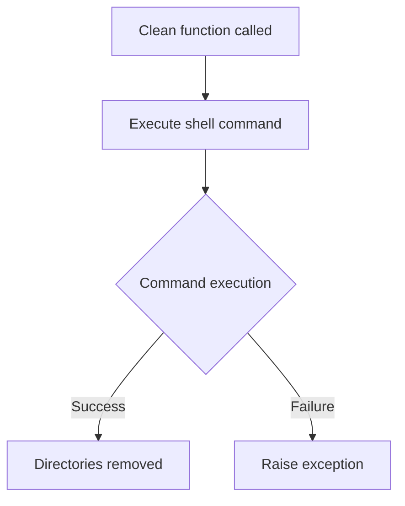
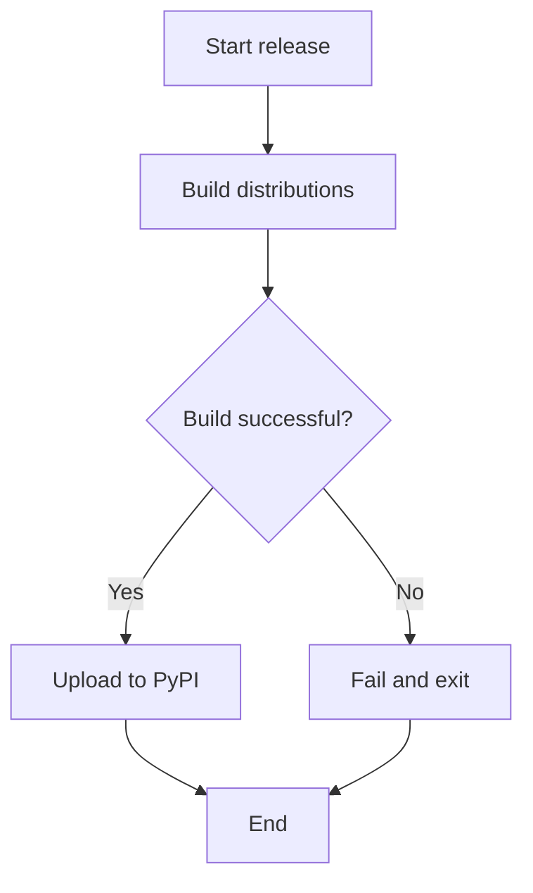
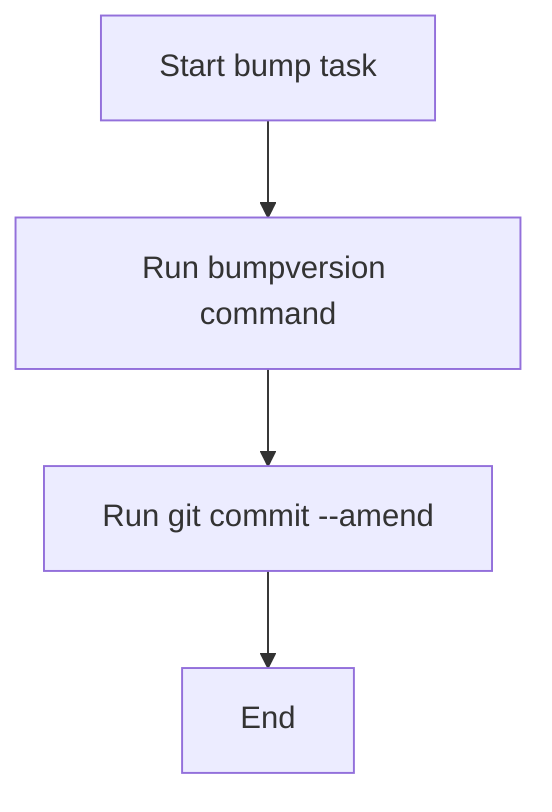
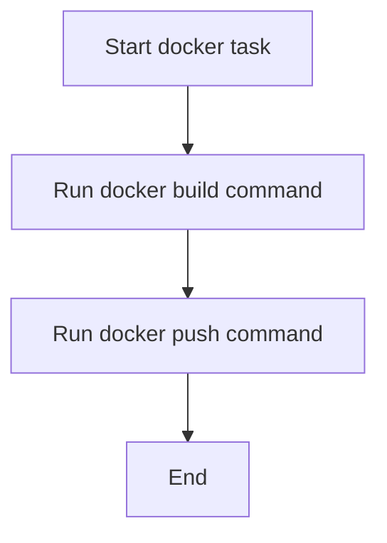

# `tasks.py`

## `clean` · *function*

## Summary:
Removes build artifacts, cache directories, and temporary files from the project workspace.

## Description:
This function serves as a cleanup task that removes common build artifacts and development cache directories including distribution folders, build directories, coverage reports, pytest cache, and mypy cache. It is designed to be used as an Invoke task to provide a standardized way to clean up the project environment.

## Args:
    context: An invoke context object that provides access to shell execution capabilities.

## Returns:
    None: This function does not return any value.

## Raises:
    Any exceptions that may be raised by the underlying shell command execution mechanism.

## Constraints:
    Preconditions:
    - The function assumes that the working directory contains the directories to be removed
    - The user running the command must have appropriate permissions to delete these directories
    
    Postconditions:
    - All specified directories and files are removed from the filesystem
    - The working directory is left in a clean state without build artifacts

## Side Effects:
    - Filesystem modifications: Directories and files matching the specified patterns are deleted
    - No external services or global state changes

## Control Flow:


## Examples:
```python
# Typical usage in an Invokefile
from invoke import task

@task
def clean(context):
    context.run("rm -rf dist build .coverage .pytest_cache .mypy_cache")

# Called via CLI: invoke clean
```

## `test` · *function*

## Summary:
Executes the pytest test suite using the invoke task framework.

## Description:
This function serves as an invoke task that runs the pytest testing framework. It is designed to be called as part of an automated build or testing workflow through the invoke task runner. The function leverages the context object provided by invoke to execute the pytest command in the shell environment.

## Args:
    context: The invoke context object containing runtime information and execution environment for the task.

## Returns:
    The return value depends on the underlying context.run() implementation and pytest execution result.

## Raises:
    Any exceptions raised by context.run() or pytest during execution.

## Constraints:
    Preconditions:
    - The pytest command must be available in the execution environment
    - The invoke task runner must be properly configured
    - The context object must be properly initialized by the invoke framework
    
    Postconditions:
    - The pytest test suite will be executed in the current environment
    - The function will return once pytest completes execution

## Side Effects:
    - Executes shell command "pytest"
    - May produce console output from pytest execution
    - May modify test-related files or directories if tests create artifacts

## Control Flow:
```mermaid
flowchart TD
    A[Invoke Task Runner] --> B[test(context) function]
    B --> C{context.run("pytest")}
    C --> D[Execute pytest command]
    D --> E[Return execution result]
```

## Examples:
```python
# Typical usage in an invokefile.py:
from invoke import task

@task
def test(context):
    context.run("pytest")

# Execution:
# $ invoke test
```

## `install` · *function*

## Summary:
Installs the Python package in development mode using setuptools.

## Description:
This function executes the command `python setup.py develop` to install the current package in development mode. It is typically used as an Invoke task to facilitate local development setup. The function leverages the context object provided by the Invoke framework to execute shell commands.

## Args:
    context: The Invoke context object containing environment and execution utilities. This parameter provides access to the run() method for executing shell commands.

## Returns:
    The return value of the underlying context.run() call, which typically indicates success or failure of the shell command execution.

## Raises:
    Any exceptions raised by context.run() when executing the shell command, such as CommandNotFound, UnexpectedExit, or other subprocess-related exceptions.

## Constraints:
    Preconditions:
    - The current working directory must contain a valid setup.py file
    - Python must be available in the execution environment
    - The user must have appropriate permissions to install packages
    
    Postconditions:
    - The package is installed in development mode in the current Python environment
    - The installation modifies the Python path to include the current package

## Side Effects:
    - Modifies the Python environment by installing the package in development mode
    - May update sys.path to include the current package location
    - Executes a subprocess command that could potentially modify system state

## Control Flow:
```mermaid
flowchart TD
    A[Install function called] --> B[Execute "python setup.py develop"]
    B --> C{Command succeeds?}
    C -->|Yes| D[Return success]
    C -->|No| E[Propagate exception]
```

## Examples:
```python
# Typical usage in an Invokefile
from invoke import task

@task
def install(context):
    context.run("python setup.py develop")

# This would be invoked as:
# invoke install
```

## `release` · *function*

## Summary:
Executes the full release process for a Python package by building distribution artifacts and uploading them to PyPI.

## Description:
This function automates the release workflow for Python packages by executing two sequential shell commands: first building the package distribution files (source distribution and wheel), then uploading those files to the Python Package Index (PyPI) using twine. It serves as a convenience wrapper around standard Python packaging tools.

## Args:
    context: The Invoke context object containing execution environment and utilities. This parameter is required and must be provided by the Invoke framework when this task is executed.

## Returns:
    None: This function does not return any value.

## Raises:
    subprocess.CalledProcessError: When either of the shell commands fails to execute successfully (exit code != 0). This occurs when:
    - setup.py command fails during distribution building
    - twine upload command fails due to network issues or authentication problems

## Constraints:
    Preconditions:
    - The project must have a properly configured setup.py file
    - The twine package must be installed in the environment
    - The dist/ directory must be writable
    - Python and pip must be available in the execution environment
    
    Postconditions:
    - Distribution files are created in the dist/ directory
    - Files are uploaded to PyPI if successful
    - No files are left in an inconsistent state

## Side Effects:
    - Creates distribution files in the local dist/ directory
    - Makes network requests to PyPI to upload package files
    - May prompt for authentication credentials during twine upload
    - Modifies the local filesystem by creating files in dist/

## Control Flow:


## Examples:
```python
# Typical usage in an Invokefile:
@task
def release(context):
    context.run("python setup.py register sdist bdist_wheel")
    context.run("twine upload dist/*")

# This would be invoked as:
# invoke release
```

## `bump` · *function*

## Summary:
Automates version bumping and git commit amending for project releases.

## Description:
This function executes two shell commands to update the project version and amend the most recent git commit. It serves as a convenience task for developers to streamline the release process by combining version incrementing and commit updating into a single operation.

## Args:
    context: The invoke context object containing execution environment and utilities
    version (str): The version part to bump (e.g., "major", "minor", "patch"). Defaults to "patch"

## Returns:
    None: This function does not return any value

## Raises:
    Any exceptions raised by the underlying shell commands or context.run() operations

## Constraints:
    Preconditions:
    - The project must be a git repository
    - The bumpversion tool must be installed and configured
    - There must be a staged commit to amend
    
    Postconditions:
    - The version file is updated according to the specified version part
    - The most recent git commit is amended with the version change

## Side Effects:
    - Modifies version files in the repository
    - Amends the most recent git commit
    - Executes shell commands via context.run()

## Control Flow:


## Examples:
```python
# Bump patch version (default)
bump(context)

# Bump minor version
bump(context, version="minor")

# Bump major version
bump(context, version="major")
```

## `docker` · *function*

## Summary:
Builds and pushes Docker images for the sumy project to a remote registry.

## Description:
This task automates the process of building Docker images with specific tags and pushing them to a remote registry. It's designed to be invoked through the invoke task runner system and encapsulates the common workflow of creating container images and making them available for deployment.

## Args:
    context: The invoke context object that provides access to the run() method for executing shell commands.

## Returns:
    None: This function does not return any value.

## Raises:
    None: No explicit exceptions are raised in the function body.

## Constraints:
    Preconditions:
    - Docker daemon must be running and accessible
    - The current working directory must contain a valid Dockerfile
    - User must have appropriate permissions to push to the misobelica/sumy registry
    
    Postconditions:
    - Docker images with tags 'latest' and '0.11.0' are built locally
    - Docker images are pushed to the remote registry 'misobelica/sumy'

## Side Effects:
    - Executes shell commands that may modify local Docker environment
    - Pushes Docker images to remote registry 'misobelica/sumy'
    - May create new Docker image layers locally

## Control Flow:


## Examples:
```python
# Execute via invoke CLI:
# $ invoke docker

# Typical usage in invoke tasks.py:
# @task
# def docker(context):
#     context.run("docker build --no-cache --rm=true --tag misobelica/sumy:latest -t misobelica/sumy:0.11.0 .")
#     context.run("docker push misobelica/sumy --all-tags")
```

