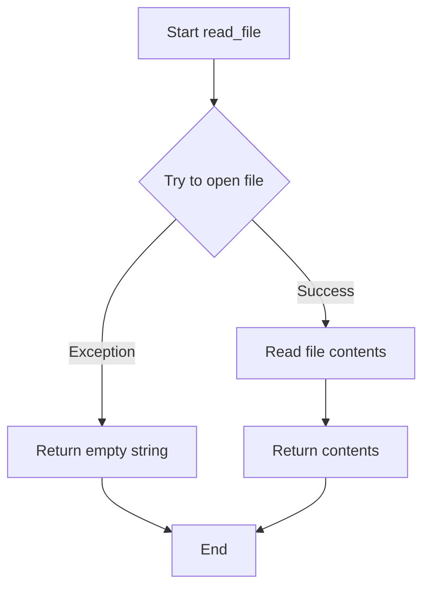

# `setup.py`

## `read_file` · *function*

## Summary:
Reads the contents of a file and returns it as a string, with graceful handling of file access errors.

## Description:
This utility function attempts to read the entire contents of a specified file and return it as a string. When the file cannot be accessed or read due to permissions, existence issues, or other I/O errors, it gracefully returns an empty string instead of propagating the exception. This function is commonly used in setup scripts to read README files or other text-based configuration files.

The function is extracted into its own utility to centralize file reading logic and provide consistent error handling behavior across different parts of the setup process. This abstraction prevents repetitive try/except blocks and ensures uniform fallback behavior when files are unavailable.

## Args:
    filename (str): Path to the file to be read. Can be absolute or relative path.

## Returns:
    str: Contents of the file as a string if successfully read, or empty string ('') if the file cannot be accessed or read.

## Raises:
    None: This function catches all exceptions internally and returns an empty string.

## Constraints:
    Precondition: The filename parameter must be a valid string representing a file path.
    Postcondition: The function always returns a string value (either file contents or empty string).

## Side Effects:
    File I/O operations: Reads from the filesystem at the specified path.
    May trigger file system access errors if the file doesn't exist or lacks read permissions.

## Control Flow:


## Examples:
```python
# Basic usage
content = read_file('README.md')
print(content)  # Prints file contents or empty string

# Usage in setup.py context
long_description = read_file('README.md')
setup(
    name='my-package',
    long_description=long_description,
    # ... other parameters
)
```

