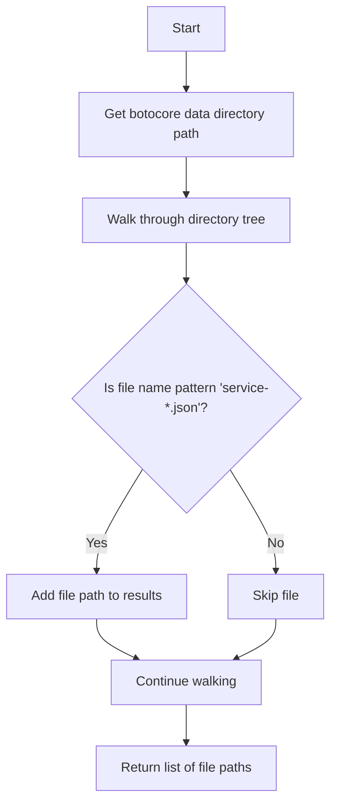
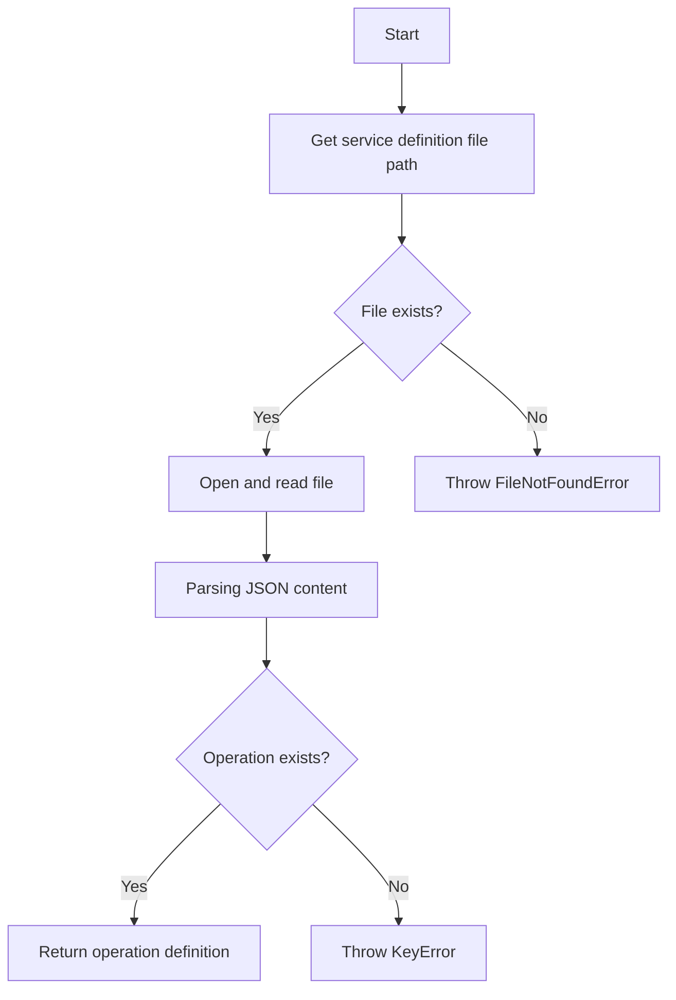

# `boto_service_definitions.py`

## `trailscraper.boto_service_definitions.boto_service_definition_files` · *function*

## Summary:
Returns a list of file paths to all AWS service definition JSON files in the botocore data directory.

## Description:
This function discovers and collects all JSON files that define AWS service APIs from the botocore package data. These service definition files follow the naming pattern 'service-*.json' and contain metadata about AWS service endpoints, operations, and data structures.

The function leverages the pkg_resources module to locate the botocore data directory and then recursively searches through it to find all matching service definition files. This utility is typically used by tools that need to process or analyze AWS service definitions programmatically.

## Args:
    None

## Returns:
    list[str]: A list of absolute file paths pointing to AWS service definition JSON files. Each path corresponds to a file matching the pattern 'service-*.json' in the botocore data directory.

## Raises:
    None explicitly raised

## Constraints:
    Preconditions:
    - The botocore package must be installed in the environment
    - The botocore data directory must exist and be readable
    
    Postconditions:
    - Returns a list of file paths (possibly empty)
    - All returned paths are absolute file paths
    - All returned files match the 'service-*.json' pattern

## Side Effects:
    - Reads from the file system to traverse the botocore data directory
    - May trigger package resource loading from the botocore installation

## Control Flow:


## Examples:
```python
# Basic usage
service_files = boto_service_definition_files()
print(f"Found {len(service_files)} AWS service definition files")

# Process each service definition
for service_file in service_files[:5]:  # Process first 5 files
    with open(service_file, 'r') as f:
        service_data = json.load(f)
        print(f"Service: {service_data.get('service', 'Unknown')}")
```

## `trailscraper.boto_service_definitions.service_definition_file` · *function*

## Summary:
Returns the most recent AWS service definition file for a given service name by filtering and sorting available service definition files.

## Description:
This function retrieves all AWS service definition files from the botocore data directory and filters them to find those belonging to a specific AWS service. It then sorts the matching files and returns the most recent one (the last in the sorted list). This is useful for tools that need to access the latest version of a service's API definition.

The function is designed to handle multiple versions of the same service definition by returning the most recent one, which typically corresponds to the latest AWS API version available in the botocore package.

## Args:
    servicename (str): The name of the AWS service to look up. This should match the service identifier used in botocore's service definition files.

## Returns:
    str: The absolute file path to the most recent service definition file for the specified service. Returns an empty string if no matching files are found.

## Raises:
    None explicitly raised

## Constraints:
    Preconditions:
    - The botocore package must be installed and accessible
    - The servicename parameter must be a valid AWS service identifier
    - The botocore data directory must exist and be readable
    
    Postconditions:
    - Returns either a valid file path string or an empty string
    - The returned file path points to a valid existing file that matches the pattern 'service-*.json'

## Side Effects:
    - Calls boto_service_definition_files() which reads from the file system
    - May trigger package resource loading from the botocore installation

## Control Flow:
```mermaid
flowchart TD
    A[Start] --> B[Call boto_service_definition_files()]
    B --> C[Filter files with pattern **/servicename/*/service-*.json]
    C --> D{Are matching files found?}
    D -->|Yes| E[Sort matching files]
    E --> F[Return last (most recent) file]
    D -->|No| G[Return empty string]
```

## Examples:
```python
# Get the latest service definition for EC2
ec2_definition = service_definition_file("ec2")
print(f"EC2 service definition: {ec2_definition}")

# Get the latest service definition for S3
s3_definition = service_definition_file("s3")
print(f"S3 service definition: {s3_definition}")

# Handle case where service is not found
unknown_definition = service_definition_file("nonexistent-service")
if unknown_definition:
    print(f"Found definition: {unknown_definition}")
else:
    print("No definition found for the specified service")
```

## `trailscraper.boto_service_definitions.operation_definition` · *function*

## Summary:
Retrieves the definition of a specific AWS service operation from the latest service definition file.

## Description:
This function accesses the AWS service definition files provided by botocore to extract the specification for a particular operation within a given service. It locates the most recent service definition file for the specified service and parses its JSON content to return the operation-specific definition.

The function serves as a key interface for accessing detailed information about AWS service operations, enabling tools to programmatically inspect API specifications without manually parsing JSON files.

## Args:
    servicename (str): The name of the AWS service (e.g., 'ec2', 's3', 'lambda') for which to retrieve operation definitions.
    operationname (str): The name of the specific operation within the service (e.g., 'DescribeInstances', 'GetObject') to retrieve.

## Returns:
    dict: The operation definition dictionary containing metadata about the specified operation, including parameters, responses, and other operation-specific attributes.

## Raises:
    FileNotFoundError: When the service definition file for the specified service cannot be found.
    KeyError: When the specified operation name does not exist in the service definition file.
    json.JSONDecodeError: When the service definition file contains invalid JSON.

## Constraints:
    Preconditions:
    - The botocore package must be installed and accessible
    - The servicename parameter must correspond to a valid AWS service identifier
    - The operationname parameter must exist in the service definition file
    - The service definition file must be readable and contain valid JSON

    Postconditions:
    - Returns a dictionary containing the operation definition
    - The returned dictionary contains all operation metadata from the service definition

## Side Effects:
    - Reads from the file system to access service definition JSON files
    - May trigger package resource loading from the botocore installation

## Control Flow:


## Examples:
```python
# Retrieve the definition for EC2's DescribeInstances operation
try:
    desc_instances_def = operation_definition("ec2", "DescribeInstances")
    print(f"Operation: {desc_instances_def['name']}")
    print(f"HTTP Method: {desc_instances_def['http']['method']}")
except FileNotFoundError:
    print("Service definition file not found")
except KeyError:
    print("Operation not found in service definition")
```

