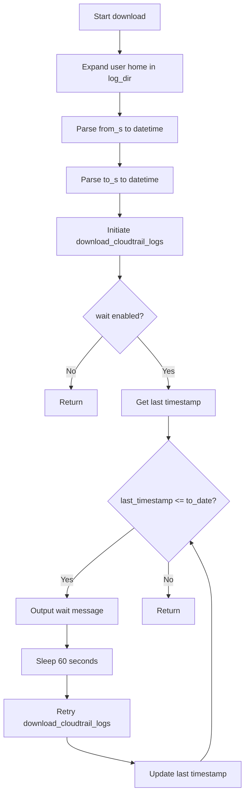
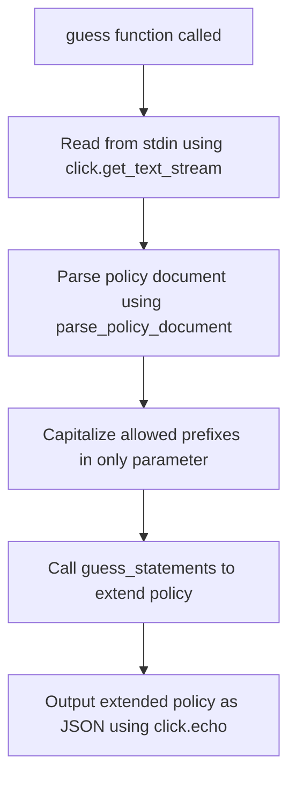

# `cli.py`

## `trailscraper.cli.root_group` · *function*

## Summary:
Configures logging verbosity for the CLI application based on the verbose flag.

## Description:
This function serves as the root command handler for the CLI application, setting appropriate logging levels for the main logger and related libraries when verbose mode is enabled. It's designed to be called as a Click command callback to initialize logging configuration before other CLI operations execute.

## Args:
    verbose (bool): When True, enables debug logging for the main logger and sets INFO level for botocore and s3transfer libraries.

## Returns:
    None: This function does not return any value.

## Raises:
    None: This function does not explicitly raise exceptions.

## Constraints:
    Preconditions:
    - The logging module must be properly imported and available
    - The function should be called before any logging operations that depend on the configured levels
    
    Postconditions:
    - Main logger level is set to DEBUG if verbose=True, otherwise remains unchanged
    - botocore and s3transfer loggers are set to INFO level when verbose=True

## Side Effects:
    - Modifies global logging configuration via logging.getLogger() calls
    - Changes logging levels for botocore and s3transfer libraries
    - May affect console output if logging was previously configured

## `trailscraper.cli.download` · *function*

## Summary
Downloads CloudTrail logs from S3 to a local directory with optional waiting for completion.

## Description
The download function retrieves CloudTrail log files from an S3 bucket and saves them to a local directory. It accepts human-readable time specifications for date ranges and supports waiting for logs to be fully downloaded before returning. This function is typically invoked through the command-line interface to fetch CloudTrail data for analysis or auditing purposes.

The function orchestrates the download process by:
1. Parsing human-readable time strings into datetime objects
2. Initiating the actual S3 download operation
3. Optionally polling for completion if the wait flag is enabled

This extraction into a dedicated function allows for clean separation between CLI argument parsing and the core download logic, enabling reuse in different contexts (CLI, automated scripts, tests) while maintaining consistent behavior.

## Args
    bucket (str): Name of the S3 bucket containing CloudTrail logs
    prefix (str): Base prefix to prepend to S3 key paths for CloudTrail logs  
    org_id (str or None): AWS organization ID to include in prefix generation, or None for account-based paths
    account_id (str): AWS account ID to include in prefix generation
    region (str): AWS region to include in prefix generation
    log_dir (str): Local directory path where downloaded CloudTrail log files will be stored
    from_s (str): Human-readable start date/time for the date range (inclusive)
    to_s (str): Human-readable end date/time for the date range (inclusive)
    wait (bool): Whether to wait for logs to be fully downloaded before returning
    parallelism (int): Maximum number of concurrent download threads to use for fetching files

## Returns
    None: This function performs side-effect operations but does not return a meaningful value

## Raises
    None explicitly raised: Exceptions from underlying operations (S3 access, file I/O, time parsing) propagate naturally

## Constraints
    Preconditions:
        - from_s and to_s must be parseable by dateparser into valid datetime objects
        - from_date must be less than or equal to to_date
        - account_id must be a valid AWS account ID string
        - region must be a valid AWS region string
        - parallelism should be a positive integer
        - The bucket must exist and be accessible with configured AWS credentials
        - The log_dir must be writable by the executing process
    
    Postconditions:
        - Files matching the generated S3 prefixes will be downloaded to log_dir
        - All necessary parent directories will be created in log_dir
        - If wait=True, the function will not return until all expected logs are downloaded

## Side Effects
    - Creates local directories in log_dir as needed
    - Writes files to the local filesystem in log_dir
    - Makes HTTP requests to S3 service via boto3
    - Logs download progress and skipped files using the logging module
    - Outputs status messages to stdout via click.echo during wait polling
    - Sleeps for 60 seconds during wait polling cycles

## Control Flow


## Examples
```python
# Basic download of CloudTrail logs for a single account and region
download(
    bucket="my-cloudtrail-bucket",
    prefix="AWSLogs/",
    org_id=None,
    account_id="123456789012",
    region="us-east-1",
    log_dir="/tmp/cloudtrail_logs",
    from_s="2023-12-25",
    to_s="2023-12-26",
    wait=False,
    parallelism=10
)

# Download with waiting for completion
download(
    bucket="aws-logs-bucket",
    prefix="trail-logs/",
    org_id="o-1234567890",
    account_id="123456789012",
    region="us-east-1",
    log_dir="./downloads",
    from_s="2023-12-25 00:00:00",
    to_s="2023-12-25 12:00:00",
    wait=True,
    parallelism=5
)
```

## `trailscraper.cli.select` · *function*

## Summary
Selects and filters CloudTrail records from either AWS API or local directory within a specified time range, then outputs the filtered records as JSON.

## Description
The `select` function serves as a command-line interface utility for extracting CloudTrail records within a specified time range. It provides flexibility in sourcing records from either the AWS CloudTrail API or local log files while applying filtering logic to exclude assumed role ARNs. The function acts as a bridge between different data sources and the filtering pipeline, enabling users to query CloudTrail data for policy analysis or auditing purposes.

This logic is extracted into its own function to encapsulate the complete workflow of record selection, filtering, and output formatting, making it reusable across different CLI commands and simplifying the main processing pipeline.

## Args
- log_dir (str): Path to the local directory containing CloudTrail log files. Required when `use_cloudtrail_api` is False.
- filter_assumed_role_arn (str or None): ARN of assumed role to filter out from records. If None, no role-based filtering is applied.
- use_cloudtrail_api (bool): Flag indicating whether to fetch records from AWS CloudTrail API (True) or local directory (False).
- from_s (str): Human-readable start time for the record selection range.
- to_s (str): Human-readable end time for the record selection range.

## Returns
- None: This function does not return a value directly. Instead, it outputs JSON-formatted records via `click.echo`.

## Raises
- None explicitly raised by this function.
- Exceptions may be raised by underlying components like:
  - `CloudTrailAPIRecordSource.load_from_api()` when AWS API calls fail
  - `LocalDirectoryRecordSource.load_from_dir()` when local file operations fail
  - `time_utils.parse_human_readable_time()` when time parsing fails

## Constraints
- Preconditions:
  - When `use_cloudtrail_api` is False, `log_dir` must point to a valid directory containing CloudTrail log files
  - `from_s` and `to_s` must be parseable by `time_utils.parse_human_readable_time`
  - `from_date` must be less than or equal to `to_date`
  
- Postconditions:
  - All returned records are within the specified time range
  - Records matching `filter_assumed_role_arn` are excluded from results (when provided)
  - Output is formatted as JSON with a "Records" key containing the filtered records

## Side Effects
- Performs I/O operations to read CloudTrail log files from disk or make API calls to AWS
- Outputs JSON data to stdout via `click.echo`
- May log warnings when all records are filtered out (via `filter_records`)

## Control Flow
```mermaid
flowchart TD
    A[select called] --> B[Expand user path for log_dir]
    B --> C[Parse from_s to datetime]
    C --> D[Parse to_s to datetime]
    D --> E{use_cloudtrail_api flag}
    E -- True --> F[CloudTrailAPIRecordSource().load_from_api]
    E -- False --> G[LocalDirectoryRecordSource(log_dir).load_from_dir]
    F --> H[filter_records applied]
    G --> H
    H --> I[Extract raw_source from records]
    I --> J[Output JSON via click.echo]
```

## Examples
```python
# Select records from local directory for a specific time range
select(
    log_dir="/home/user/cloudtrail-logs",
    filter_assumed_role_arn="arn:aws:iam::123456789012:role/AdminRole",
    use_cloudtrail_api=False,
    from_s="2023-01-01 00:00:00",
    to_s="2023-01-01 12:00:00"
)

# Select records from AWS API for a specific time range
select(
    log_dir="/unused/path",
    filter_assumed_role_arn=None,
    use_cloudtrail_api=True,
    from_s="yesterday",
    to_s="today"
)
```

## `trailscraper.cli.generate` · *function*

## Summary:
Generates an AWS IAM policy document from CloudTrail event records provided via standard input.

## Description:
Reads CloudTrail event records from standard input, parses them into structured records, generates IAM policy statements from the events, and outputs the resulting policy as JSON to standard output. This function serves as the main entry point for the CLI-based policy generation workflow.

The function is extracted into its own component to encapsulate the complete end-to-end processing pipeline from raw CloudTrail JSON input to structured IAM policy output, separating the CLI interface from the core business logic.

## Args:
    None

## Returns:
    None

## Raises:
    json.JSONDecodeError: When the input from stdin is not valid JSON
    KeyError: When CloudTrail records are missing required fields like 'eventSource', 'eventName', or 'eventTime'
    Exception: Any exceptions raised during the parsing or policy generation process

## Constraints:
    Preconditions:
        - Standard input must contain valid JSON with a 'Records' key containing a list of CloudTrail event records
        - Each CloudTrail record must contain required fields: 'eventSource', 'eventName', and 'eventTime'
        
    Postconditions:
        - Outputs a valid JSON-formatted IAM policy document to standard output
        - The generated policy contains appropriate Statement blocks based on the input CloudTrail events

## Side Effects:
    - Reads from standard input stream
    - Writes JSON-formatted policy output to standard output
    - May produce warning messages to stderr during record parsing failures
    - Uses the logging system for parsing warnings

## Control Flow:
```mermaid
flowchart TD
    A[Start generate()] --> B[Read stdin with click.get_text_stream]
    B --> C[Parse JSON from stdin using json.load]
    C --> D{Valid JSON with Records key?}
    D -- No --> E[Raise JSONDecodeError]
    D -- Yes --> F[Call parse_records(json.load(stdin)['Records'])]
    F --> G{Records parsed successfully?}
    G -- No --> H[Return empty policy or handle gracefully]
    G -- Yes --> I[Call policy_generator.generate_policy(records)]
    I --> J[Call policy.to_json()]
    J --> K[Output JSON to stdout with click.echo]
    K --> L[End]
```

## Examples:
    # Basic usage
    echo '{"Records": [{"eventSource": "s3.amazonaws.com", "eventName": "GetObject", "eventTime": "2023-01-01T12:00:00Z"}]}' | python -m trailscraper.cli generate
    # Output: A JSON-formatted IAM policy document
    
    # With multiple records
    cat cloudtrail_events.json | python -m trailscraper.cli generate
    # Where cloudtrail_events.json contains a "Records" array of CloudTrail events

## `trailscraper.cli.guess` · *function*

## Summary:
Processes an IAM policy from standard input and extends it with wildcard resource coverage based on allowed action prefixes.

## Description:
This function serves as a command-line interface entry point for extending IAM policy documents with wildcard resource coverage. It reads a JSON-formatted IAM policy from standard input, processes it to identify actions matching specified prefixes, and extends the policy with additional statements that cover broader resource patterns. The result is output as a JSON-formatted policy document to standard output.

The function is designed to be used as a CLI command through the Click framework, allowing users to pipe IAM policy documents through a pipeline to enhance their resource coverage automatically.

## Args:
    only (list[str]): A list of string prefixes that identify actions which should trigger resource extension. Each prefix is capitalized before processing.

## Returns:
    None: This function does not return a value directly, but outputs the extended policy as JSON to standard output.

## Raises:
    json.JSONDecodeError: When the input policy document contains malformed JSON that cannot be parsed.
    KeyError: When the parsed policy JSON is missing required keys ('Statement' or 'Version').
    TypeError: When the input stream is neither a string nor a file-like object with a .read() method.

## Constraints:
    Preconditions:
        - Input must be a valid JSON-formatted IAM policy document on standard input
        - The policy must contain 'Version' and 'Statement' fields
        - The 'Statement' field must be a valid list or dictionary of policy statements
        - The 'only' parameter must be a list of strings
        
    Postconditions:
        - Outputs a valid JSON-formatted IAM policy document to standard output
        - The output policy contains the original statements plus potentially extended statements

## Side Effects:
    - Reads from standard input (stdin)
    - Writes to standard output (stdout) in JSON format
    - No external state mutations

## Control Flow:


## Examples:
```bash
# Basic usage piping a policy to the command
cat my-policy.json | trailscraper guess --only s3:Get s3:List

# Using with multiple prefixes
echo '{"Version":"2012-10-17","Statement":[{"Effect":"Allow","Action":"s3:GetObject","Resource":"arn:aws:s3:::bucket/*"}]}' | trailscraper guess --only s3:Get s3:List

# With a file input
trailscraper guess --only ec2:Describe --input policy.json
```

## `trailscraper.cli.last_event_timestamp` · *function*

## Summary:
Retrieves and displays the timestamp of the most recent CloudTrail event from a local directory of log files.

## Description:
This function serves as a command-line utility that processes CloudTrail log files stored in a local directory and outputs the timestamp of the latest event recorded. It expands user home directory references in the provided path and delegates the actual timestamp calculation to the LocalDirectoryRecordSource class.

The function is designed to be used as part of a command-line interface for inspecting CloudTrail log data offline. It provides a quick way to determine when the most recent activity occurred in a set of CloudTrail logs without having to parse all the log files manually.

## Args:
    log_dir (str): Path to the directory containing CloudTrail log files. This can be an absolute path or a path relative to the current working directory, and may include a tilde (~) to represent the user's home directory.

## Returns:
    None: This function does not return a value directly. Instead, it prints the timestamp to standard output using click.echo().

## Raises:
    None: This function does not explicitly raise exceptions. However, underlying operations in LocalDirectoryRecordSource may raise exceptions if:
    - The directory path is invalid or inaccessible
    - No valid CloudTrail log files exist in the specified directory
    - Log files are corrupted or unreadable

## Constraints:
    Preconditions:
    - The log_dir parameter must point to a valid directory containing CloudTrail log files
    - The directory must be readable by the executing process
    - At least one valid CloudTrail log file must exist in the directory
    
    Postconditions:
    - The function will output exactly one line containing the timestamp of the most recent event
    - The output format matches the timestamp format used by CloudTrail events

## Side Effects:
    - Prints the timestamp to standard output using click.echo()
    - Expands user home directory references in the provided path using os.path.expanduser()

## Control Flow:
```mermaid
flowchart TD
    A[Call last_event_timestamp(log_dir)] --> B{Expand user path}
    B --> C[Create LocalDirectoryRecordSource]
    C --> D[Call last_event_timestamp_in_dir()]
    D --> E[Print result with click.echo()]
```

## Examples:
    # Display the last event timestamp from a local CloudTrail directory
    $ trailscraper last-event-timestamp ~/Downloads/cloudtrail-logs
    
    # Display the last event timestamp from a specific directory
    $ trailscraper last-event-timestamp /var/log/cloudtrail/

