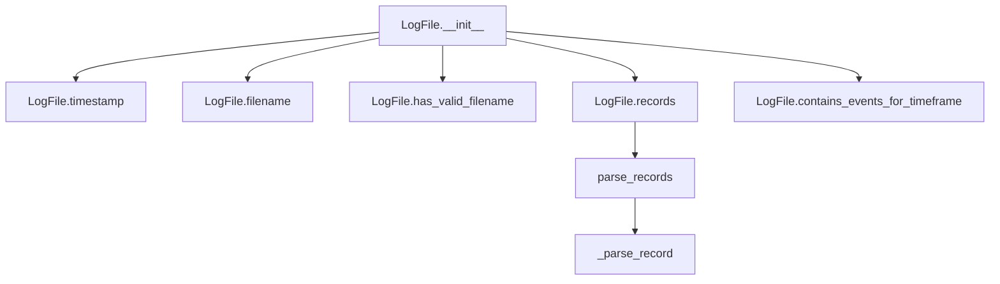
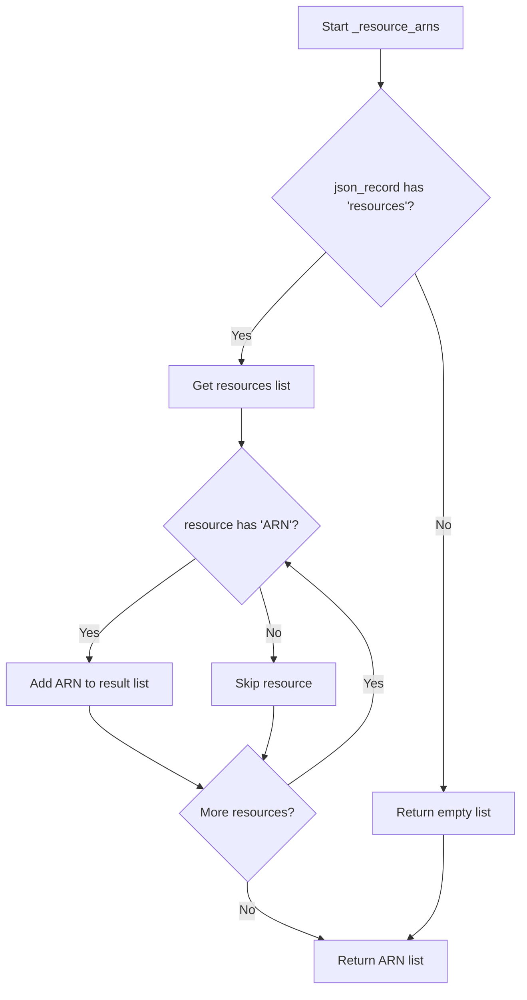
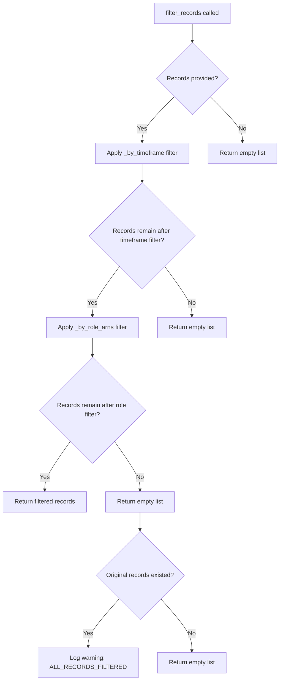

# `cloudtrail.py`

## `trailscraper.cloudtrail.Record` · *class*

## Summary:
Encapsulates CloudTrail event data for conversion into IAM policy statements.

## Description:
The Record class serves as a structured representation of AWS CloudTrail event data, enabling transformation of CloudTrail events into standardized IAM policy statements. This abstraction facilitates permission analysis and policy generation by mapping CloudTrail event attributes to their corresponding IAM action and resource representations.

The class is typically instantiated by CloudTrail log processors and used in permission auditing workflows where CloudTrail events need to be translated into IAM policy representations for analysis or comparison.

## State:
- event_source (str): The AWS service that generated the event (e.g., "s3.amazonaws.com", "ec2.amazonaws.com")
- event_name (str): The specific operation performed (e.g., "GetObject", "RunInstances")
- raw_source (Any): Original raw event data, preserved for debugging or extended processing
- event_time (datetime): Timestamp when the event occurred
- resource_arns (list[str]): List of ARNs representing resources affected by the event, defaults to ["*"] 
- assumed_role_arn (str): ARN of the assumed role if the event was performed via a role, can be None

## Lifecycle:
- Creation: Instantiate with event_source and event_name; optional parameters include resource_arns, assumed_role_arn, event_time, and raw_source
- Usage: Call to_statement() to convert the record into an IAM Statement object for policy analysis
- Destruction: Standard Python object lifecycle management applies

## Method Map:
```mermaid
graph TD
    A[Record] --> B[to_statement()]
    B --> C{_to_api_gateway_statement()}
    B --> D{_source_to_iam_prefix()}
    B --> E{_event_name_to_iam_action()}
    C --> F[Statement for API Gateway]
    D --> G[IAM prefix conversion]
    E --> H[IAM action conversion]
```

## Raises:
- None explicitly raised by __init__ method
- The to_statement() method returns None for STS GetCallerIdentity events (which don't represent actionable permissions) and delegates to other methods for other event types

## Example:
```python
# Create a record for an S3 PutObject event
record = Record(
    event_source="s3.amazonaws.com",
    event_name="PutObject",
    resource_arns=["arn:aws:s3:::my-bucket/*"],
    event_time=datetime.datetime.now(pytz.UTC)
)

# Convert to IAM statement for permission analysis
statement = record.to_statement()
print(statement.json_repr())
```

### `trailscraper.cloudtrail.Record.__init__` · *method*

## Summary:
Initializes a CloudTrail event record with essential metadata for IAM policy conversion.

## Description:
Constructs a Record object that encapsulates AWS CloudTrail event data, preparing it for conversion into IAM policy statements. This method establishes the fundamental attributes of a CloudTrail event including the event source, operation name, and associated metadata such as timestamps and resource identifiers.

The initialization process creates a structured representation of CloudTrail events that can later be transformed into IAM Statement objects for permission analysis and policy generation. This separation of concerns allows for clean event processing and flexible policy conversion logic.

## Args:
    event_source (str): The AWS service that generated the event (e.g., "s3.amazonaws.com", "ec2.amazonaws.com")
    event_name (str): The specific operation performed (e.g., "GetObject", "RunInstances")
    resource_arns (list[str], optional): List of ARNs representing resources affected by the event. Defaults to ["*"] when None
    assumed_role_arn (str, optional): ARN of the assumed role if the event was performed via a role. Defaults to None
    event_time (datetime, optional): Timestamp when the event occurred. Defaults to None
    raw_source (Any, optional): Original raw event data, preserved for debugging or extended processing. Defaults to None

## Returns:
    None: This method initializes instance attributes and does not return a value

## Raises:
    None: This method does not explicitly raise exceptions

## State Changes:
    Attributes READ: None
    Attributes WRITTEN: 
    - self.event_source: Assigned from event_source parameter
    - self.event_name: Assigned from event_name parameter  
    - self.raw_source: Assigned from raw_source parameter
    - self.event_time: Assigned from event_time parameter
    - self.resource_arns: Assigned from resource_arns parameter, defaults to ["*"] if None
    - self.assumed_role_arn: Assigned from assumed_role_arn parameter

## Constraints:
    Preconditions:
    - event_source and event_name must be provided (no default values)
    - resource_arns, if provided, should be a list of ARN strings
    - event_time should be a datetime object or None
    - assumed_role_arn should be a string or None
    
    Postconditions:
    - All instance attributes are initialized with provided values or defaults
    - self.resource_arns is guaranteed to be a list (defaults to ["*"])

## Side Effects:
    None: This method performs only attribute assignment with no external I/O or service calls

### `trailscraper.cloudtrail.Record.__repr__` · *method*

## Summary:
Returns a string representation of the CloudTrail record showing key identifying attributes.

## Description:
Provides a human-readable string representation of a Record object for debugging and logging purposes. This method is automatically called when displaying Record instances in interactive environments or when using repr() on Record objects.

## Args:
    self: The Record instance being represented.

## Returns:
    str: A formatted string containing the event_source, event_name, event_time, and resource_arns attributes.

## Raises:
    None: This method does not raise any exceptions.

## State Changes:
    Attributes READ: event_source, event_name, event_time, resource_arns
    Attributes WRITTEN: None

## Constraints:
    Preconditions: The Record instance must have all required attributes initialized (event_source, event_name, event_time, resource_arns).
    Postconditions: The returned string is a consistent format showing all key record attributes.

## Side Effects:
    None: This method performs no I/O operations or external service calls.

### `trailscraper.cloudtrail.Record.__eq__` · *method*

## Summary:
Compares two Record objects for equality based on key event attributes.

## Description:
Implements the equality operator (`==`) for Record objects, determining when two records should be considered equivalent based on their core event properties. This method is part of Python's object comparison protocol and is automatically invoked when using the `==` operator between Record instances.

## Args:
    other (object): Another object to compare with this Record instance.

## Returns:
    bool: True if the other object is a Record instance with identical values for event_source, event_name, event_time, resource_arns, and assumed_role_arn; False otherwise.

## Raises:
    None: This method does not raise exceptions.

## State Changes:
    Attributes READ: event_source, event_name, event_time, resource_arns, assumed_role_arn
    Attributes WRITTEN: None

## Constraints:
    Preconditions: The other object must be comparable (typically another Record instance)
    Postconditions: Returns boolean indicating equality status based on all specified attributes

## Side Effects:
    None: This method performs only attribute comparisons and has no side effects.

### `trailscraper.cloudtrail.Record.__hash__` · *method*

## Summary:
Computes a hash value for the CloudTrail record based on its core identifying attributes.

## Description:
Implements Python's magic `__hash__` method for the Record class, enabling instances to be used in hash-based collections such as sets and as dictionary keys. This method computes a hash value using the same attributes that define record equality (`event_source`, `event_name`, `event_time`, `resource_arns`, and `assumed_role_arn`), ensuring consistency with the `__eq__` method implementation.

## Args:
    None: This method takes no arguments beyond the implicit `self` parameter.

## Returns:
    int: An integer hash value uniquely representing the combination of the record's identifying attributes.

## Raises:
    TypeError: May raise TypeError if any of the attributes contain unhashable types (though this would indicate a programming error in the class implementation).

## State Changes:
    Attributes READ: event_source, event_name, event_time, resource_arns, assumed_role_arn
    Attributes WRITTEN: None

## Constraints:
    Preconditions: All attributes used in the hash computation must be hashable types.
    Postconditions: The returned hash value remains consistent for the same set of attribute values throughout the object's lifetime.

## Side Effects:
    None: This method performs only hash computation and has no side effects.

### `trailscraper.cloudtrail.Record.__ne__` · *method*

## Summary:
Defines the "not equal" comparison behavior for Record objects by negating the result of equality comparison.

## Description:
Implements the inequality operator (`!=`) for Record objects. This method is automatically invoked when using the `!=` operator between Record instances. It returns the logical negation of the result from the `__eq__` method, making it consistent with Python's comparison protocol.

This method serves as a standard implementation of the inequality operator and ensures that `a != b` is equivalent to `not (a == b)` for Record instances.

## Args:
    other (object): Another object to compare with this Record instance.

## Returns:
    bool: True if the other object is not equal to this Record instance according to the `__eq__` implementation; False if they are equal.

## Raises:
    None: This method does not raise exceptions.

## State Changes:
    Attributes READ: event_source, event_name, event_time, resource_arns, assumed_role_arn (through __eq__ call)
    Attributes WRITTEN: None

## Constraints:
    Preconditions: The other object must be comparable (typically another Record instance)
    Postconditions: Returns boolean indicating inequality status based on all specified attributes

## Side Effects:
    None: This method performs only attribute comparisons and has no side effects.

### `trailscraper.cloudtrail.Record._source_to_iam_prefix` · *method*

## Summary:
Converts an AWS service endpoint to its corresponding IAM action prefix, handling special cases for specific services.

## Description:
This method transforms an AWS service endpoint (like 'ec2.amazonaws.com') into the appropriate IAM action prefix (like 'ec2'). It handles special cases where the standard pattern doesn't apply, such as CloudWatch monitoring services, Lex services, DynamoDB streams, and others. This conversion is essential for creating proper IAM policy statements from CloudTrail events.

The method is called during the process of converting CloudTrail records into IAM policy statements, specifically in the `to_statement` method of the Record class.

## Args:
    self: The Record instance containing the event_source attribute to convert

## Returns:
    str: The IAM action prefix derived from the event source, either from special cases or by taking the first part of the event source before the first dot

## Raises:
    None explicitly raised

## State Changes:
    Attributes READ: self.event_source
    Attributes WRITTEN: None

## Constraints:
    Preconditions: 
    - self.event_source must be a string representing a valid AWS service endpoint
    - The method assumes the event_source follows the standard AWS endpoint format (service.region.amazonaws.com)
    
    Postconditions:
    - Returns a valid IAM action prefix string
    - The returned string is suitable for use in IAM Action construction

## Side Effects:
    None

### `trailscraper.cloudtrail.Record._event_name_to_iam_action` · *method*

## Summary:
Maps AWS CloudTrail event names to their corresponding IAM action names using service-specific mappings and regex transformations.

## Description:
This method converts AWS CloudTrail event names into standardized IAM action names for security analysis and policy evaluation. It handles special case mappings for services like S3 and KMS, applies regex-based normalization patterns, and returns the corresponding IAM action. The method is designed as a separate unit to encapsulate the complex mapping logic, providing a clean interface for transforming CloudTrail events into IAM-compatible action representations.

## Args:
    None - This is a method that operates on instance attributes

## Returns:
    str: The corresponding IAM action name derived from the CloudTrail event name, or the original event name if no transformation is applied

## Raises:
    None explicitly raised - The method uses dictionary lookups and regex operations that don't raise exceptions

## State Changes:
    Attributes READ: self.event_source, self.event_name
    Attributes WRITTEN: None - This is a pure transformation method

## Constraints:
    Preconditions: 
    - self.event_source must be a string containing the AWS service identifier (e.g., 's3.amazonaws.com')
    - self.event_name must be a string containing the CloudTrail event name
    - Both attributes must be properly initialized on the Record instance
    
    Postconditions:
    - Returns a string representing a valid IAM action pattern
    - The returned string follows AWS IAM action naming conventions

## Side Effects:
    None - This method performs only in-memory string transformations and does not cause any I/O operations or external service calls

### `trailscraper.cloudtrail.Record._to_api_gateway_statement` · *method*

## Summary:
Converts an API Gateway CloudTrail event into an IAM statement with appropriate Allow effect, action, and resource ARN.

## Description:
Transforms a CloudTrail record representing an API Gateway operation into a structured IAM Statement object. This method specifically handles API Gateway events by extracting HTTP method and request URI information from service definitions, processing URI paths to normalize path parameters, and constructing an appropriate IAM policy statement.

The method is invoked exclusively from the `to_statement()` method when processing CloudTrail records with event source "apigateway.amazonaws.com". It provides specialized handling for API Gateway operations that differs from the general IAM action mapping used for other AWS services.

## Args:
    None - This is a method that operates on the instance attributes of the Record class.

## Returns:
    Statement: An IAM Statement object with:
        - Effect: "Allow"
        - Action: Single Action object representing the API Gateway HTTP method
        - Resource: ARN string formatted as "arn:aws:apigateway:*::[processed_request_uri]"

## Raises:
    KeyError: When the operation definition for the event name does not exist in the API Gateway service definitions
    FileNotFoundError: When the API Gateway service definition file cannot be located
    json.JSONDecodeError: When the service definition file contains invalid JSON

## State Changes:
    Attributes READ: 
        - self.event_name: Used to lookup operation definition
    Attributes WRITTEN: 
        - None: This method is read-only and doesn't modify instance state

## Constraints:
    Preconditions:
        - The Record instance must have a valid event_name attribute
        - The event_source must be "apigateway.amazonaws.com" for this method to be called
        - The operation definition for the event_name must exist in the API Gateway service definitions
        - The boto service definitions must be properly installed and accessible

    Postconditions:
        - Returns a properly formatted IAM Statement object
        - The returned statement represents a valid Allow permission for the API Gateway operation
        - Path parameters in request URIs are normalized to wildcard (*) characters

## Side Effects:
    - Calls operation_definition() which reads from the file system to access service definition JSON files
    - May trigger package resource loading from the botocore installation
    - Uses regular expression compilation and substitution operations

### `trailscraper.cloudtrail.Record.to_statement` · *method*

## Summary:
Converts a CloudTrail record into an IAM Statement representation for permission analysis.

## Description:
Transforms a CloudTrail event record into an AWS IAM Statement that captures the permissions granted by that event. This method handles special cases for STS GetCallerIdentity and API Gateway events while generating standard IAM actions for other services. The resulting statement can be used for policy analysis, permission mapping, and access control evaluation.

Known callers:
- The method is typically invoked during CloudTrail log processing pipelines when converting raw event records into IAM permission representations for further analysis
- Called as part of the broader trailscraper workflow for generating IAM policies from CloudTrail data

This logic is separated into its own method because it encapsulates the complex mapping logic between CloudTrail event data and IAM action representations, including special case handling and service-specific transformations that would clutter the main processing flow.

## Args:
    self: The Record instance containing CloudTrail event data

## Returns:
    Statement: An IAM Statement object representing the permissions captured by this CloudTrail event
    None: When the event is STS GetCallerIdentity, which doesn't represent actionable permissions

## State Changes:
- Attributes READ: self.event_source, self.event_name, self.resource_arns
- Attributes WRITTEN: None (this is a pure transformation method)

## Constraints:
- Preconditions: The Record instance must have valid event_source and event_name attributes
- Postconditions: The returned Statement object will have properly formatted Action and Resource components

## Side Effects:
- Calls internal helper methods (_to_api_gateway_statement, _source_to_iam_prefix, _event_name_to_iam_action)
- May trigger file system access when operation_definition is called (in _to_api_gateway_statement)

## `trailscraper.cloudtrail.LogFile` · *class*

## Summary:
Represents a CloudTrail log file with methods for parsing and analyzing its contents.

## Description:
The LogFile class encapsulates a CloudTrail log file, providing methods to extract metadata such as timestamps and filenames, validate file formats, and parse the JSON records contained within the gzipped file. It serves as a central abstraction for working with CloudTrail log files in the trailscraper system, enabling operations like time-based filtering and event analysis.

This class is typically instantiated by log file processors or scanners that discover and process CloudTrail log files from storage. It provides a clean interface for accessing log file properties and extracting structured event data for IAM policy analysis.

## State:
- _path (str): The absolute or relative filesystem path to the CloudTrail log file. Must be a valid path to a gzipped JSON file matching the CloudTrail naming convention.

## Lifecycle:
- Creation: Instantiate with a file path string pointing to a valid CloudTrail log file
- Usage: Call methods in sequence to validate, extract metadata, and parse records
- Destruction: Standard Python object lifecycle management applies

## Method Map:


## Raises:
- None explicitly raised by __init__
- The records() method may raise IOError or OSError when the file cannot be opened or read (as documented in the parse_records function)

## Example:
```python
# Create a LogFile instance
log_file = LogFile("/path/to/CloudTrail/123456789012_CloudTrail_us-east-1_20230101T1200Z_A1B2C3D4E5F6G7H8.json.gz")

# Check if filename is valid
if log_file.has_valid_filename():
    print(f"Valid CloudTrail file: {log_file.filename()}")

# Get timestamp
timestamp = log_file.timestamp()
print(f"Log file timestamp: {timestamp}")

# Parse records
records = log_file.records()
print(f"Parsed {len(records)} records")

# Filter by timeframe
from datetime import datetime
start_time = datetime(2023, 1, 1, 10, 0, 0, tzinfo=pytz.UTC)
end_time = datetime(2023, 1, 1, 14, 0, 0, tzinfo=pytz.UTC)
if log_file.contains_events_for_timeframe(start_time, end_time):
    print("Events in this log file fall within the specified timeframe")
```

### `trailscraper.cloudtrail.LogFile.__init__` · *method*

## Summary:
Initializes a LogFile instance with the path to a CloudTrail log file.

## Description:
Constructs a LogFile object by storing the filesystem path to a CloudTrail log file. This constructor is typically called by log file processors or scanners that discover and process CloudTrail log files from storage. The path is stored internally as _path and is used by other methods in the class to access and parse the log file contents.

## Args:
    path (str): Absolute or relative filesystem path to a CloudTrail log file. Must point to a valid gzipped JSON file matching the CloudTrail naming convention.

## Returns:
    None: This method initializes the object's state but does not return a value.

## Raises:
    None: This method does not explicitly raise exceptions.

## State Changes:
    Attributes READ: None
    Attributes WRITTEN: _path (str): Stores the provided file path for later use by other methods in the class

## Constraints:
    Preconditions: The path argument must be a valid string representing a filesystem path to an existing CloudTrail log file.
    Postconditions: The LogFile instance will have its _path attribute set to the provided path value.

## Side Effects:
    None: This method performs no I/O operations or external service calls. It only stores the provided path in an instance variable.

### `trailscraper.cloudtrail.LogFile.timestamp` · *method*

## Summary:
Extracts and parses a timestamp from the CloudTrail log filename, returning a timezone-aware datetime object.

## Description:
Parses the timestamp portion of a CloudTrail log filename and converts it into a UTC-aware datetime object. This method extracts the fourth underscore-separated component from the filename and interprets it as a timestamp in the format YYYYMMDDTHHMMSSZ, where T and Z are literal characters.

The method splits the filename by underscores and takes the fourth component (index 3), then parses it by extracting year, month, day, hour, and minute components using specific string slicing operations:
- Positions 0-3: Year (YYYY)
- Positions 4-5: Month (MM) 
- Positions 6-7: Day (DD)
- Position 8: Literal character 'T'
- Positions 9-10: Hour (HH)
- Positions 11-12: Minute (MM)
- Position 13: Literal character 'Z'

This method is used primarily for time-based filtering and sorting of CloudTrail log files, enabling operations such as determining if a log file contains events within a specific timeframe.

## Args:
    None

## Returns:
    datetime.datetime: A timezone-aware datetime object representing the timestamp extracted from the filename, with UTC timezone applied.

## Raises:
    ValueError: When the timestamp string cannot be converted to integers (e.g., invalid date/time values).
    IndexError: When the filename does not contain at least 4 underscore-separated components.
    TypeError: When the filename is not a string or when the timestamp string cannot be processed by the parsing logic.

## State Changes:
    Attributes READ: self._path (via filename() method)
    Attributes WRITTEN: None

## Constraints:
    Preconditions:
        - The filename must follow the AWS CloudTrail naming convention with at least 4 underscore-separated components
        - The fourth component must contain a timestamp string in the format YYYYMMDDTHHMMSSZ where T and Z are literal characters
        - The timestamp string must be parseable into integers for year, month, day, hour, and minute components

    Postconditions:
        - Returns a datetime object with UTC timezone information
        - The returned datetime object represents the date and time portion of the CloudTrail log file

## Side Effects:
    None

### `trailscraper.cloudtrail.LogFile.filename` · *method*

## Summary:
Returns the filename portion of the log file's full path.

## Description:
Extracts and returns only the filename component from the full file path stored in the LogFile instance. This method provides a clean abstraction for accessing just the filename portion, which is frequently needed when processing CloudTrail log files. The method is used internally by other methods such as `timestamp()` and `has_valid_filename()` to parse and validate log file names.

## Args:
    None

## Returns:
    str: The filename portion of the full file path stored in `self._path`. Returns an empty string if the path is empty or contains only a directory separator.

## Raises:
    None

## State Changes:
    Attributes READ: self._path
    Attributes WRITTEN: None

## Constraints:
    Preconditions:
    - The LogFile instance must have been initialized with a valid path string in `self._path`
    
    Postconditions:
    - The returned string contains only the filename portion of the path
    - The method does not modify any state of the LogFile object

## Side Effects:
    None

### `trailscraper.cloudtrail.LogFile.has_valid_filename` · *method*

## Summary:
Determines if the log file's filename matches the CloudTrail log file naming convention.

## Description:
Evaluates whether the filename of a CloudTrail log file conforms to the expected naming pattern using regular expression matching. This method serves as a basic validation check to ensure that the file follows the standard CloudTrail log file format before further processing.

The method is designed to be lightweight and efficient, providing a quick validation of filename format without requiring file I/O operations. It's typically called during log file discovery and filtering processes to exclude malformed filenames from subsequent processing steps.

## Args:
    None

## Returns:
    re.Match or None: A regex match object if the filename matches the CloudTrail pattern, or None if it does not match.

## Raises:
    None

## State Changes:
    Attributes READ: self._path (through self.filename())
    Attributes WRITTEN: None

## Constraints:
    Preconditions:
    - The LogFile instance must have been initialized with a valid path
    - The filename method must return a string
    
    Postconditions:
    - The method returns either a regex Match object or None
    - No modification to the LogFile object's state occurs

## Side Effects:
    None

### `trailscraper.cloudtrail.LogFile.records` · *method*

## Summary:
Loads and parses CloudTrail log records from a gzipped JSON file into structured Record objects.

## Description:
Retrieves and processes CloudTrail event records from the file path stored in the LogFile instance. This method handles decompressing the gzipped JSON file, parsing the JSON structure, extracting the 'Records' array, and converting each record into a structured Record object for further analysis.

The method is designed as a separate component to encapsulate the file loading and parsing logic, allowing the LogFile class to maintain clean separation between file I/O operations and record processing. It provides a consistent interface for accessing CloudTrail records regardless of the underlying file format.

This method is typically called during CloudTrail log processing pipelines when individual log files need to be examined for IAM policy analysis or event auditing purposes.

## Args:
    None

## Returns:
    list[Record]: A list of Record objects representing the parsed CloudTrail events. Returns an empty list if the file cannot be loaded or contains no valid records.

## Raises:
    None explicitly raised by this method. Exceptions from file I/O or JSON parsing are caught and logged as warnings, with an empty list returned as fallback.

## State Changes:
    Attributes READ: self._path
    Attributes WRITTEN: None

## Constraints:
    Preconditions:
        - The LogFile instance must have a valid _path attribute pointing to an existing gzipped JSON file
        - The file must contain valid JSON with a 'Records' key at the root level
        
    Postconditions:
        - Returns a list of Record objects or an empty list if parsing fails
        - The original file remains unchanged
        - No modifications are made to the LogFile instance's state

## Side Effects:
    - Performs file I/O operations to read the gzipped JSON file
    - May emit warning log messages if file loading fails
    - May emit debug log messages during normal operation

### `trailscraper.cloudtrail.LogFile.contains_events_for_timeframe` · *method*

## Summary:
Determines whether the log file contains events within a specified time range, including a one-hour buffer at the end of the range.

## Description:
This method checks if the timestamp of the log file falls within the provided date range, with an inclusive upper bound extended by one hour. It's used to efficiently filter log files that may contain events matching a specific timeframe, particularly useful when dealing with CloudTrail log files that are partitioned by hour.

## Args:
    from_date (datetime.datetime): The start of the time range to check against.
    to_date (datetime.datetime): The end of the time range to check against.

## Returns:
    bool: True if the log file's timestamp is within the range [from_date, to_date + 1 hour), False otherwise.

## Raises:
    None explicitly raised.

## State Changes:
    Attributes READ: self._path (through filename() method), self._path (directly)
    Attributes WRITTEN: None

## Constraints:
    Preconditions: 
    - from_date and to_date must be timezone-aware datetime objects
    - The LogFile instance must have a valid filename format that can be parsed by the timestamp() method
    
    Postconditions:
    - Returns a boolean indicating time range inclusion
    - Does not modify any state of the LogFile object

## Side Effects:
    None

## `trailscraper.cloudtrail._resource_arns` · *function*

## Summary:
Extracts Amazon Resource Names (ARNs) from the resources section of a CloudTrail event record.

## Description:
This utility function processes a CloudTrail JSON event record to extract all ARNs from the resources section. It filters out any resource entries that don't contain an 'ARN' field, making it safe to process records with varying resource structures.

## Args:
    json_record (dict): A CloudTrail event record dictionary containing a 'resources' key

## Returns:
    list[str]: A list of ARN strings extracted from resources that contain an 'ARN' field. Returns an empty list if no resources exist or none contain ARNs.

## Raises:
    None explicitly raised

## Constraints:
    Preconditions:
        - The input `json_record` must be a dictionary-like object
        - The 'resources' key in `json_record` should be iterable (list-like)
    
    Postconditions:
        - The returned list contains only strings that represent valid ARNs
        - The function never raises exceptions regardless of input structure

## Side Effects:
    None

## Control Flow:


## Examples:
    >>> record = {'resources': [{'ARN': 'arn:aws:s3:::my-bucket'}, {'name': 'test'}]}
    >>> _resource_arns(record)
    ['arn:aws:s3:::my-bucket']
    
    >>> record = {'resources': []}
    >>> _resource_arns(record)
    []
    
    >>> record = {'resources': [{'name': 'test'}, {'name': 'another'}]}
    >>> _resource_arns(record)
    []

## `trailscraper.cloudtrail._assumed_role_arn` · *function*

## Summary:
Extracts the ARN of the role that was assumed from a CloudTrail event record.

## Description:
This function processes CloudTrail JSON records to identify when an AWS principal has assumed a role and returns the ARN of that role. It specifically handles events where the user identity type is 'AssumedRole' and contains session context information. This utility function helps in analyzing CloudTrail logs to track role assumption activities.

## Args:
    json_record (dict): A CloudTrail event record as a dictionary containing user identity information

## Returns:
    str or None: The ARN of the assumed role if the record represents an AssumedRole event with session context, otherwise None

## Raises:
    KeyError: When accessing nested dictionary keys that don't exist in the input record (e.g., 'userIdentity', 'type', 'sessionContext', 'sessionIssuer', 'arn')
    TypeError: When the input is not a dictionary or when accessing keys on non-dictionary objects

## Constraints:
    Preconditions:
        - The input must be a dictionary-like object
        - The dictionary must contain a 'userIdentity' key
        - The 'userIdentity' value must be a dictionary
        - For successful extraction, the 'userIdentity' must have 'type' equal to 'AssumedRole'
        - The 'userIdentity' must contain 'sessionContext' key
        - The 'sessionContext' must contain 'sessionIssuer' key
        - The 'sessionIssuer' must contain an 'arn' key

    Postconditions:
        - Returns either a string ARN or None
        - Does not modify the input json_record

## Side Effects:
    None

## Control Flow:
```mermaid
flowchart TD
    A[Start _assumed_role_arn] --> B{userIdentity exists?}
    B -- No --> C[Return None]
    B -- Yes --> D{type in userIdentity?}
    D -- No --> C
    D -- Yes --> E{userIdentity[type] == 'AssumedRole'?}
    E -- No --> C
    E -- Yes --> F{sessionContext in userIdentity?}
    F -- No --> C
    F -- Yes --> G[Return sessionIssuer ARN]
```

## Examples:
    # Successful case
    record = {
        "userIdentity": {
            "type": "AssumedRole",
            "sessionContext": {
                "sessionIssuer": {
                    "arn": "arn:aws:iam::123456789012:role/MyRole"
                }
            }
        }
    }
    result = _assumed_role_arn(record)  # Returns "arn:aws:iam::123456789012:role/MyRole"

    # Failed case - not an AssumedRole
    record = {
        "userIdentity": {
            "type": "Root"
        }
    }
    result = _assumed_role_arn(record)  # Returns None

    # Failed case - missing sessionContext
    record = {
        "userIdentity": {
            "type": "AssumedRole"
        }
    }
    result = _assumed_role_arn(record)  # Returns None

## `trailscraper.cloudtrail._parse_record` · *function*

## Summary:
Parses a CloudTrail JSON event record into a structured Record object for IAM policy analysis.

## Description:
Converts a raw CloudTrail event JSON dictionary into a Record object that encapsulates the event's metadata and can be transformed into IAM policy statements. This function extracts key event attributes including the service source, operation name, timestamp, associated resource ARNs, and assumed role information.

The parsing logic is extracted into its own function to separate the data extraction concerns from the higher-level processing logic, allowing for easier testing and maintenance of the parsing behavior independently from the rest of the CloudTrail processing pipeline.

## Args:
    json_record (dict): A CloudTrail event record dictionary containing at minimum 'eventSource', 'eventName', and 'eventTime' keys

## Returns:
    Record or None: A Record object populated with parsed event data if successful, or None if the record is malformed and cannot be parsed

## Raises:
    KeyError: When the input json_record is missing required keys such as 'eventSource', 'eventName', or 'eventTime'

## Constraints:
    Preconditions:
        - The input json_record must be a dictionary-like object
        - The json_record must contain 'eventSource', 'eventName', and 'eventTime' keys
        - The 'eventTime' value must be in ISO format "%Y-%m-%dT%H:%M:%SZ"
        
    Postconditions:
        - If successful, returns a properly initialized Record object with all fields populated
        - If parsing fails due to missing keys, returns None and logs a warning message

## Side Effects:
    - Writes warning messages to the logging system when parsing fails due to missing keys
    - No external state mutations or I/O operations beyond logging

## Control Flow:
```mermaid
flowchart TD
    A[Start _parse_record] --> B{Required keys present?}
    B -- No --> C[Log warning]
    C --> D[Return None]
    B -- Yes --> E[Parse eventTime]
    E --> F[Call _resource_arns()]
    F --> G[Call _assumed_role_arn()]
    G --> H[Create Record object]
    H --> I[Return Record]
```

## Examples:
    # Valid usage
    record_data = {
        "eventSource": "s3.amazonaws.com",
        "eventName": "GetObject",
        "eventTime": "2023-01-01T12:00:00Z",
        "resources": [{"ARN": "arn:aws:s3:::my-bucket/*"}],
        "userIdentity": {
            "type": "AssumedRole",
            "sessionContext": {
                "sessionIssuer": {"arn": "arn:aws:iam::123456789012:role/MyRole"}
            }
        }
    }
    
    parsed_record = _parse_record(record_data)
    # Returns a Record object with the parsed data
    
    # Invalid usage - missing required keys
    invalid_record = {
        "eventSource": "s3.amazonaws.com",
        "eventName": "GetObject"
        # Missing eventTime
    }
    
    parsed_record = _parse_record(invalid_record)
    # Logs warning and returns None

## `trailscraper.cloudtrail.parse_records` · *function*

## Summary:
Processes a list of CloudTrail JSON event records into structured Record objects for IAM policy analysis.

## Description:
Converts raw CloudTrail event JSON dictionaries into structured Record objects that can be analyzed for IAM policy generation. This function applies the parsing logic to each record in the input list and filters out any malformed records that cannot be processed.

The parsing logic is extracted into its own function (`_parse_record`) to separate data extraction concerns from higher-level processing, enabling easier testing and maintenance of parsing behavior independently from the rest of the CloudTrail processing pipeline.

## Args:
    json_records (list[dict]): A list of CloudTrail event record dictionaries containing at minimum 'eventSource', 'eventName', and 'eventTime' keys

## Returns:
    list[Record]: A list of Record objects populated with parsed event data. Malformed records that fail parsing are filtered out, returning an empty list if all records are invalid.

## Raises:
    None explicitly raised by this function. If individual records cause exceptions during parsing (such as KeyError from missing required fields), those exceptions will propagate up from the underlying `_parse_record` function.

## Constraints:
    Preconditions:
        - The input json_records must be a list-like object
        - Each item in json_records must be a dictionary-like object with required keys
        
    Postconditions:
        - Returns a list of successfully parsed Record objects
        - All returned records are guaranteed to be valid Record instances (not None)
        - Invalid records are silently filtered out rather than raising exceptions

## Side Effects:
    - May write warning messages to the logging system when individual records fail to parse due to missing keys
    - No external state mutations or I/O operations beyond logging

## Control Flow:
```mermaid
flowchart TD
    A[Start parse_records] --> B[Iterate json_records]
    B --> C[_parse_record(record)]
    C --> D{Record parsed successfully?}
    D -- No --> E[Return None]
    D -- Yes --> F[Add to parsed_records]
    E --> G[Continue iteration]
    F --> G
    G --> H{All records processed?}
    H -- No --> B
    H -- Yes --> I[Filter None values]
    I --> J[Return filtered records]
```

## Examples:
    # Basic usage with valid records
    records_data = [
        {
            "eventSource": "s3.amazonaws.com",
            "eventName": "GetObject",
            "eventTime": "2023-01-01T12:00:00Z",
            "resources": [{"ARN": "arn:aws:s3:::my-bucket/*"}]
        },
        {
            "eventSource": "ec2.amazonaws.com",
            "eventName": "RunInstances",
            "eventTime": "2023-01-01T12:01:00Z"
        }
    ]
    
    parsed_records = parse_records(records_data)
    # Returns list of two Record objects
    
    # Usage with mixed valid/invalid records
    mixed_records_data = [
        {
            "eventSource": "s3.amazonaws.com",
            "eventName": "GetObject",
            "eventTime": "2023-01-01T12:00:00Z"
        },
        {
            "eventSource": "ec2.amazonaws.com",
            "eventName": "RunInstances"
            # Missing eventTime - will be filtered out
        }
    ]
    
    parsed_records = parse_records(mixed_records_data)
    # Returns list with one Record object (the second record is filtered out)

## `trailscraper.cloudtrail._by_timeframe` · *function*

## Summary:
Creates a time-range filter predicate for CloudTrail records that includes records with no timestamp or those occurring within the specified date range.

## Description:
This function generates a predicate function that can be used to filter CloudTrail records based on their event timestamps. It's designed to handle records that may not have timestamps (where event_time is None) and to include only records that fall within a specified time range.

The function is typically used in data processing pipelines where CloudTrail logs need to be filtered by time periods, such as when analyzing security events or audit trails within specific windows.

## Args:
    from_date (datetime.datetime): The start of the time range (inclusive). Records with event_time before this date are excluded.
    to_date (datetime.datetime): The end of the time range (inclusive). Records with event_time after this date are excluded.

## Returns:
    callable: A predicate function that accepts a record object and returns True if the record should be included in the filtered results. The predicate returns True for records where:
        - record.event_time is None (records without timestamps)
        - record.event_time is within the inclusive range [from_date, to_date]

## Raises:
    None explicitly raised by this function.

## Constraints:
    Preconditions:
        - Both from_date and to_date should be datetime objects
        - from_date should be less than or equal to to_date
    Postconditions:
        - The returned predicate function will always return a boolean value
        - The predicate correctly handles None event_time values

## Side Effects:
    None.

## Control Flow:
```mermaid
flowchart TD
    A[Call _by_timeframe(from_date, to_date)] --> B[Returns predicate function]
    B --> C[Predicate receives record]
    C --> D{record.event_time is None?}
    D -- Yes --> E[Return True]
    D -- No --> F{from_date ≤ record.event_time ≤ to_date?}
    F -- Yes --> E
    F -- No --> G[Return False]
```

## Examples:
```python
# Filter records from January 1, 2023 to January 31, 2023
from_date = datetime.datetime(2023, 1, 1)
to_date = datetime.datetime(2023, 1, 31)
time_filter = _by_timeframe(from_date, to_date)

# Apply filter to a list of CloudTrail records
filtered_records = list(filter(time_filter, cloudtrail_records))
```

## `trailscraper.cloudtrail._by_role_arns` · *function*

## Summary:
Generates a predicate function to filter CloudTrail records by assumed role ARNs.

## Description:
Creates a closure that returns a boolean predicate function for filtering CloudTrail records. The predicate determines whether a given record should be included based on its assumed role ARN matching a provided list of role ARNs, or if no filtering is desired when the filter list is empty.

## Args:
    arns_to_filter_for (list[str] or None): List of role ARN strings to filter records by. If None, defaults to empty list.

## Returns:
    callable: A predicate function that accepts a CloudTrail record and returns True if the record's assumed_role_arn matches any in the filter list or if the filter list is empty, False otherwise.

## Raises:
    None explicitly raised.

## Constraints:
    Preconditions:
    - arns_to_filter_for should be a list of strings or None
    - Record objects passed to the returned predicate must have an assumed_role_arn attribute
    
    Postconditions:
    - Returned predicate function will always return a boolean value
    - When arns_to_filter_for is empty, all records will pass the filter (return True)

## Side Effects:
    None.

## Control Flow:
```mermaid
flowchart TD
    A[Call _by_role_arns] --> B{arns_to_filter_for is None?}
    B -- Yes --> C[Set arns_to_filter_for = []]
    B -- No --> C
    C --> D[Return lambda function]
    D --> E[lambda record: (record.assumed_role_arn in arns_to_filter_for) or (len(arns_to_filter_for) == 0)]
    E --> F{record.assumed_role_arn in arns_to_filter_for?}
    F -- Yes --> G[Return True]
    F -- No --> H{len(arns_to_filter_for) == 0?}
    H -- Yes --> G
    H -- No --> I[Return False]
```

## Examples:
```python
# Filter for specific roles
role_filter = _by_role_arns(['arn:aws:iam::123456789012:role/AdminRole'])
filtered_records = list(filter(role_filter, cloudtrail_records))

# No filtering (include all records)
no_filter = _by_role_arns([])
all_records = list(filter(no_filter, cloudtrail_records))
```

## `trailscraper.cloudtrail.filter_records` · *function*

## Summary:
Filters CloudTrail records by time range and assumed role ARNs, returning only records that match both criteria.

## Description:
Processes a collection of CloudTrail records to filter them based on a specified time range and a list of assumed role ARNs. This function applies two sequential filters: first by timestamp range, then by role ARN matching. When no records remain after filtering but records were originally present, a warning is logged.

This logic is extracted into its own function to separate the concerns of record filtering from the broader data processing pipeline, making the filtering logic reusable and testable independently.

## Args:
    records (list): Collection of CloudTrail record objects to filter
    arns_to_filter_for (list[str] or None): List of role ARN strings to filter records by. If None, no role-based filtering is applied.
    from_date (datetime.datetime): Start of the time range (inclusive) for filtering records. Defaults to Unix epoch (1970-01-01 UTC).
    to_date (datetime.datetime): End of the time range (inclusive) for filtering records. Defaults to current UTC time.

## Returns:
    list: A list of CloudTrail records that match both the time range criteria and role ARN criteria. Returns an empty list if no records match the filters.

## Raises:
    None explicitly raised by this function.

## Constraints:
    Preconditions:
        - Records should be iterable objects with appropriate attributes for filtering
        - from_date should be less than or equal to to_date
        - If arns_to_filter_for is provided, it should be a list of strings or None
        
    Postconditions:
        - The returned list contains only records that satisfy both filtering conditions
        - If no records match the filters but records were originally provided, a warning is logged

## Side Effects:
    - Logs a warning message via the logging module when all records are filtered out but records were originally present

## Control Flow:


## Examples:
```python
import datetime
import pytz

# Filter records from last 24 hours for specific roles
from_date = datetime.datetime.now(tz=pytz.utc) - datetime.timedelta(hours=24)
to_date = datetime.datetime.now(tz=pytz.utc)
filtered_records = filter_records(
    records=cloudtrail_records,
    arns_to_filter_for=['arn:aws:iam::123456789012:role/AdminRole'],
    from_date=from_date,
    to_date=to_date
)

# Filter all records from a specific date range (no role filtering)
filtered_records = filter_records(
    records=cloudtrail_records,
    from_date=datetime.datetime(2023, 1, 1, tzinfo=pytz.utc),
    to_date=datetime.datetime(2023, 1, 31, tzinfo=pytz.utc)
)
```

