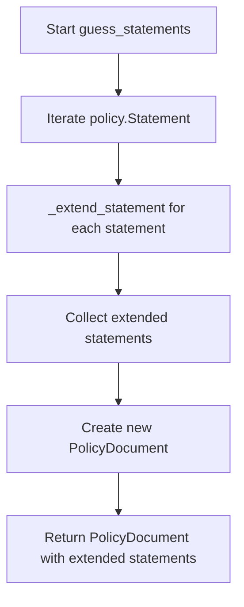

# `guess.py`

## `trailscraper.guess._guess_actions` · *function*

## Summary:
Flattens and filters action objects by matching them against allowed action prefixes.

## Description:
This function processes a collection of action objects and returns a flattened list of action items that match the specified allowed prefixes. It's designed to extract relevant actions from potentially complex action objects that support prefix-based matching operations, commonly used in IAM policy analysis and validation workflows.

## Args:
    actions: An iterable of action objects that must implement a `matching_actions` method
    allowed_prefixes: A collection of string prefixes used to filter matching actions

## Returns:
    A flattened list containing all action items that match the allowed prefixes for each action object. Returns an empty list if no matches are found or if the input collections are empty.

## Raises:
    AttributeError: If any action object in the actions iterable does not implement a `matching_actions` method

## Constraints:
    Preconditions:
    - The `actions` parameter must be iterable
    - Each item in `actions` must have a `matching_actions` method that accepts `allowed_prefixes` as a parameter
    - The `allowed_prefixes` parameter must be iterable
    
    Postconditions:
    - Returns a flat list of action items (no nested structure)
    - All returned actions must match at least one of the allowed prefixes
    - Empty collections result in empty return lists

## Side Effects:
    None

## Control Flow:
```mermaid
flowchart TD
    A[Start _guess_actions] --> B[Iterate actions]
    B --> C{action.has_matching_actions?}
    C -->|Yes| D[Call action.matching_actions(allowed_prefixes)]
    D --> E[Flatten results]
    C -->|No| F[Skip action]
    E --> G[Return flattened list]
```

## Examples:
```python
# Basic usage with action objects that support matching_actions
actions = [action1, action2, action3]
allowed_prefixes = ["s3:Get", "s3:List"]
result = _guess_actions(actions, allowed_prefixes)
# Returns flattened list of actions matching the prefixes

# Empty collections
empty_result = _guess_actions([], ["s3:Get"])
# Returns []

# No matches
no_match_result = _guess_actions([action1], ["nonexistent:*"])
# Returns []
```

## `trailscraper.guess._extend_statement` · *function*

## Summary:
Extends an IAM policy statement with additional actions and a wildcard resource when applicable.

## Description:
Processes an IAM policy statement to determine if additional actions matching allowed prefixes exist. When such actions are found, the function returns a list containing both the original statement and a new statement with wildcard resource. This enables more comprehensive policy coverage while maintaining the original statement's integrity.

## Args:
    statement (Statement): An IAM policy statement object containing Action, Effect, and Resource components
    allowed_prefixes (iterable): Collection of string prefixes used to filter and extend actions

## Returns:
    list[Statement]: Either a list containing just the original statement, or a list containing the original statement plus a new statement with wildcard resource when extended actions are found

## Raises:
    None explicitly raised by this function

## Constraints:
    Preconditions:
    - The statement parameter must be a valid Statement object
    - The allowed_prefixes parameter must be iterable
    - The statement's Action attribute must be compatible with _guess_actions function requirements
    
    Postconditions:
    - Returns either 1 or 2 Statement objects in a list
    - When returning 2 statements, the second statement has Resource set to ["*"]

## Side Effects:
    None

## Control Flow:
```mermaid
flowchart TD
    A[Start _extend_statement] --> B[Call _guess_actions]
    B --> C{extended_actions found?}
    C -->|Yes| D[Create new Statement with wildcard resource]
    D --> E[Return [original_statement, extended_statement]]
    C -->|No| F[Return [original_statement]]
```

## Examples:
```python
# Basic usage with no extended actions
statement = Statement(Action=["s3:GetObject"], Effect="Allow", Resource=["arn:aws:s3:::bucket/*"])
result = _extend_statement(statement, ["s3:List"])
# Returns [statement] - no change since no extended actions found

# Usage with extended actions
statement = Statement(Action=["s3:GetObject"], Effect="Allow", Resource=["arn:aws:s3:::bucket/*"])
result = _extend_statement(statement, ["s3:Get", "s3:List"])
# Returns [statement, Statement(Action=["s3:GetObject", "s3:List"], Effect="Allow", Resource=["*"])]
```

## `trailscraper.guess.guess_statements` · *function*

## Summary:
Processes IAM policy statements to extend them with wildcard resources when matching allowed prefixes are found.

## Description:
Transforms a policy document by extending each statement with additional wildcard resource coverage when applicable. This function iterates through all statements in the input policy, applies the `_extend_statement` helper to each one, and constructs a new policy document with the extended statements. The extension process adds a new statement with a wildcard resource when actions matching allowed prefixes are detected, enabling broader policy coverage while preserving the original statement structure.

## Args:
    policy (PolicyDocument): The input IAM policy document containing statements to be processed
    allowed_prefixes (iterable): Collection of string prefixes used to identify actions that should trigger resource extension

## Returns:
    PolicyDocument: A new policy document containing the processed statements

## Raises:
    None explicitly raised by this function

## Constraints:
    Preconditions:
    - The policy parameter must be a valid PolicyDocument object
    - The policy.Statement attribute must be iterable
    - The allowed_prefixes parameter must be iterable
    
    Postconditions:
    - Returns a PolicyDocument object
    - The Statement list in returned document may be longer than input due to statement expansion

## Side Effects:
    None

## Control Flow:


## Examples:
```python
# Basic usage
from trailscraper.iam import PolicyDocument, Statement

# Create a policy with a statement
statement = Statement(
    Action=["s3:GetObject"],
    Effect="Allow", 
    Resource=["arn:aws:s3:::bucket/*"]
)
policy = PolicyDocument(Version="2012-10-17", Statement=[statement])

# Process with allowed prefixes
extended_policy = guess_statements(policy, ["s3:Get", "s3:List"])

# Result will contain the original statement plus potentially an extended statement
```

