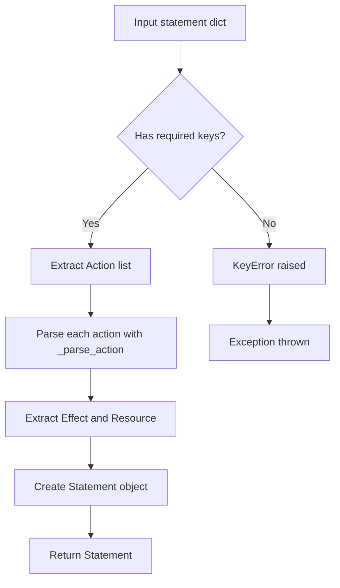
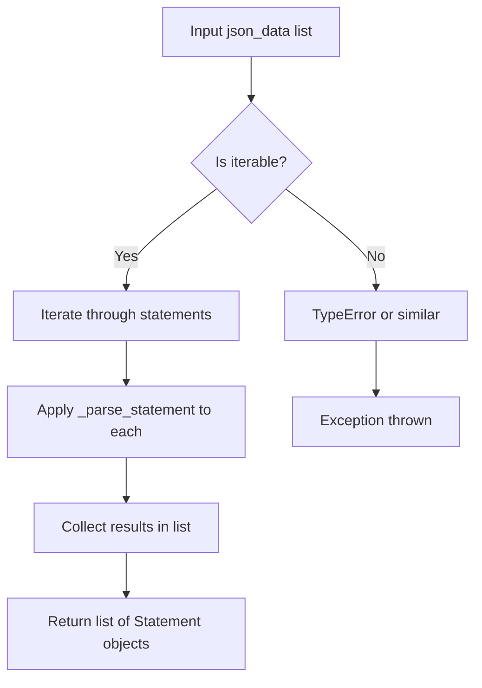
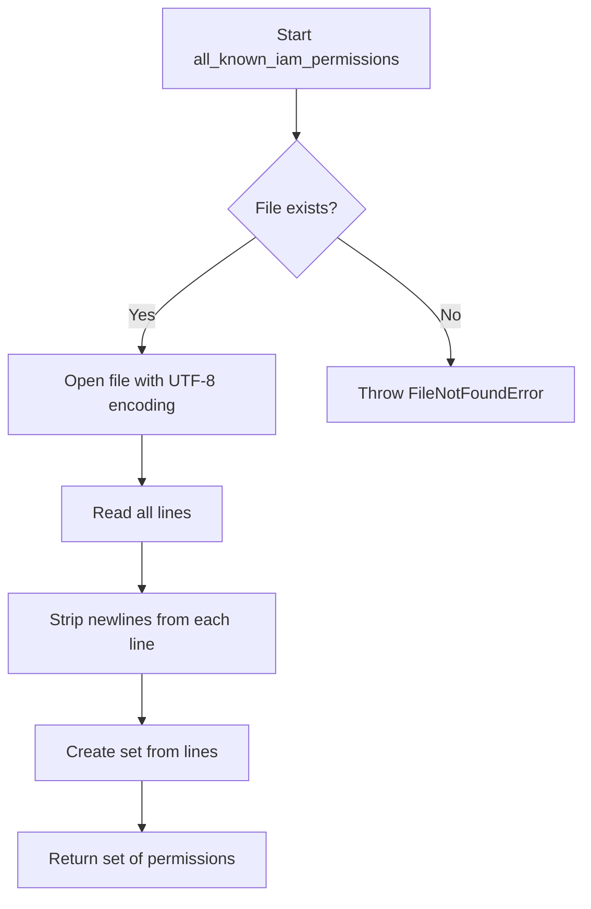
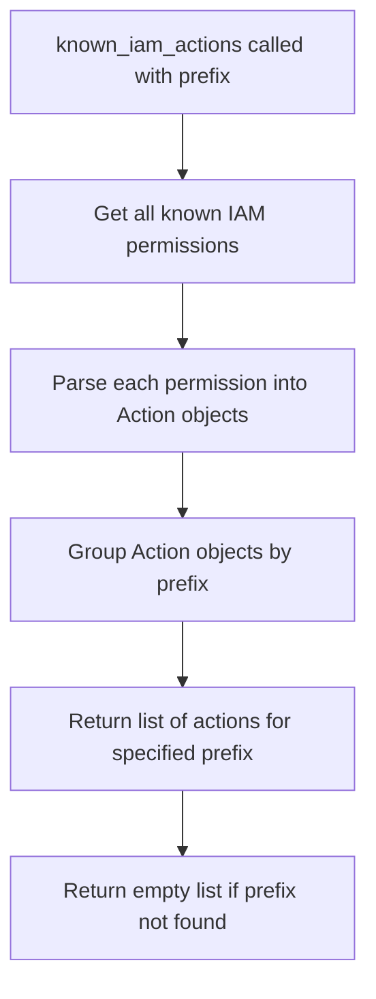

# `iam.py`

## `trailscraper.iam.BaseElement` · *class*

## Summary:
BaseElement is an abstract base class that defines a common interface for IAM (Identity and Access Management) elements, providing standardized equality, hashing, and representation behaviors based on JSON serialization.

## Description:
BaseElement serves as a foundation for IAM-related objects that need consistent comparison, hashing, and string representation capabilities. It establishes a contract requiring subclasses to implement the json_repr() method, which provides the canonical JSON representation of the element. This enables uniform handling of IAM entities across the system while allowing specific implementations to define their unique data structures and behaviors.

The class is designed to be subclassed rather than instantiated directly, with subclasses implementing the required json_repr() method to provide their specific JSON serialization logic.

## State:
- json_repr(): Abstract method that must be implemented by subclasses to return a JSON-serializable representation of the element
- No instance attributes are defined in BaseElement itself, as it's meant to be extended

## Lifecycle:
- Creation: Instances are created through subclass constructors, not directly from BaseElement
- Usage: Subclasses should implement json_repr() and can leverage the inherited comparison and representation methods
- Destruction: No special cleanup required; inherits standard Python object lifecycle management

## Method Map:
```mermaid
graph TD
    A[BaseElement] --> B[json_repr()]
    A --> C[__eq__(other)]
    A --> D[__hash__()]
    A --> E[__repr__()]
    B --> F[Subclass Implementation]
```

## Raises:
- NotImplementedError: Raised by json_repr() method when called directly on BaseElement (not implemented)
- TypeError: May be raised during equality comparisons if other is not of compatible type

## Example:
```python
# Typical usage pattern
class User(BaseElement):
    def __init__(self, user_id, name):
        self.user_id = user_id
        self.name = name
    
    def json_repr(self):
        return {
            "type": "user",
            "id": self.user_id,
            "name": self.name
        }

# Create instances
user1 = User("123", "Alice")
user2 = User("123", "Alice")
user3 = User("456", "Bob")

# Use inherited methods
print(user1)  # Shows JSON representation
print(user1 == user2)  # True - same JSON representation
print(user1 == user3)  # False - different JSON representation
print(hash(user1))  # Hash based on JSON representation
```

### `trailscraper.iam.BaseElement.json_repr` · *method*

## Summary:
Returns a JSON-serializable representation of the IAM element for use in equality comparisons, hashing, and string representation.

## Description:
This abstract method must be implemented by subclasses to provide a structured representation of the IAM element that can be serialized to JSON. The returned representation is used by other methods in the class to enable equality comparison (`__eq__`), hashing (`__hash__`), and string representation (`__repr__`). 

The method is called internally by:
- `__eq__()` method when comparing two elements
- `__hash__()` method when computing hash values  
- `__repr__()` method when creating string representations

This separation allows subclasses to define their own JSON-compatible representation while maintaining consistent behavior across the class hierarchy.

## Args:
    None

## Returns:
    A JSON-serializable object (dict, list, str, int, float, bool, or None) representing the element's state and properties.

## Raises:
    NotImplementedError: Always raised by the base implementation, must be overridden by subclasses.

## State Changes:
    Attributes READ: None
    Attributes WRITTEN: None

## Constraints:
    Preconditions: Must be implemented by all subclasses
    Postconditions: Return value must be JSON serializable and represent the element's state consistently

## Side Effects:
    None

### `trailscraper.iam.BaseElement.__eq__` · *method*

## Summary:
Compares two BaseElement instances for equality based on their JSON representations.

## Description:
Implements the equality comparison operator (`==`) for BaseElement subclasses. This method ensures that two instances of the same subclass are considered equal if and only if their `json_repr()` methods return identical results. This approach provides a consistent and meaningful comparison mechanism across all BaseElement subclasses (Action, Statement, PolicyDocument).

The method is part of Python's comparison protocol and is automatically invoked when using the `==` operator between BaseElement instances. It follows the standard pattern of checking class identity before performing value comparison.

## Args:
    other (object): Another object to compare with this BaseElement instance.

## Returns:
    bool: True if the other object is an instance of the same class and has identical JSON representation; False otherwise.

## Raises:
    None: This method does not raise exceptions.

## State Changes:
    Attributes READ: self.json_repr() (via method call)
    Attributes WRITTEN: None

## Constraints:
    Preconditions:
    - The other object must be comparable (typically another BaseElement instance)
    - Both instances must have implemented `json_repr()` method
    Postconditions:
    - Returns boolean indicating equality based on JSON representation
    - Class identity check prevents comparison with unrelated types

## Side Effects:
    None: This method performs only attribute comparisons and has no side effects.

### `trailscraper.iam.BaseElement.__ne__` · *method*

## Summary:
Implements the "not equal" comparison operator for BaseElement instances, returning the logical negation of equality comparison.

## Description:
This method defines the behavior of the `!=` operator for BaseElement subclasses. It returns `True` when two BaseElement instances are not equal according to the `__eq__` method's logic, and `False` when they are equal. This method is part of Python's comparison protocol and is automatically invoked when using the `!=` operator between BaseElement instances.

The implementation delegates to the `__eq__` method by returning `not self == other`, ensuring consistency with the equality comparison logic. This approach maintains the invariant that equal objects must have equal hash values, as required by Python's object protocol.

This method is essential for proper object comparison and is commonly used in data structures like sets and dictionaries where element uniqueness is important.

## Args:
    other (object): Another object to compare with this BaseElement instance.

## Returns:
    bool: True if the other object is not equal to this instance according to BaseElement's equality logic; False otherwise.

## Raises:
    None: This method does not raise exceptions.

## State Changes:
    Attributes READ: None (relies on self.__eq__() which reads self.json_repr())
    Attributes WRITTEN: None

## Constraints:
    Preconditions:
    - The other object must be comparable (typically another BaseElement instance)
    - Both instances must have implemented `json_repr()` method
    Postconditions:
    - Returns boolean indicating inequality based on JSON representation
    - Class identity check in `__eq__` prevents comparison with unrelated types

## Side Effects:
    None: This method performs only attribute comparisons and has no side effects.

### `trailscraper.iam.BaseElement.__hash__` · *method*

## Summary:
Computes and returns a hash value based on the JSON representation of the IAM element.

## Description:
This method implements the Python magic method `__hash__` to enable instances of IAM elements to be used as dictionary keys or members of sets. The hash is computed by calling `json_repr()` on the instance and applying Python's built-in `hash()` function to the result. This ensures that two logically equivalent IAM elements will have the same hash value, enabling proper set membership testing and dictionary key lookup.

The method is called during Python's hash table operations when an instance needs to be stored in a set or used as a dictionary key. It's part of the standard Python object protocol for making objects hashable. This implementation follows the principle that equal objects must have equal hash values, as defined by the `__eq__` method in BaseElement which also compares `json_repr()` results.

## Args:
    None beyond implicit self parameter

## Returns:
    int: An integer hash value derived from the JSON representation of the IAM element

## Raises:
    TypeError: If `json_repr()` returns an unhashable type (which would violate the hash contract and indicate a bug in the subclass implementation)

## State Changes:
    Attributes READ: None (reads from self indirectly via json_repr())
    Attributes WRITTEN: None

## Constraints:
    Preconditions:
    - The instance must be a subclass of BaseElement
    - The `json_repr()` method must return a hashable type (typically a string)
    Postconditions:
    - Returns an integer hash value
    - Equal objects must have equal hash values (as per Python's hash contract)

## Side Effects:
    None

### `trailscraper.iam.BaseElement.__repr__` · *method*

## Summary:
Returns a string representation of the IAM element based on its JSON representation.

## Description:
This method provides a standardized string representation for all IAM elements by delegating to the `json_repr()` method. It ensures consistent formatting of IAM elements when displayed in debug contexts or logs. The method is part of the base class implementation that all IAM element subclasses inherit.

## Args:
    None

## Returns:
    str: A string representation of the IAM element, derived from its JSON representation.

## Raises:
    NotImplementedError: When called on the base `BaseElement` class directly (since `json_repr()` is not implemented in the base class).

## State Changes:
    Attributes READ: self.json_repr()
    Attributes WRITTEN: None

## Constraints:
    Preconditions: The object must be an instance of a subclass that implements `json_repr()`.
    Postconditions: Returns a string representation of the element's JSON structure.

## Side Effects:
    None

## `trailscraper.iam.Action` · *class*

## Summary:
Represents an AWS IAM action with a service prefix and action name, enabling standardized comparison, serialization, and action variant generation.

## Description:
The Action class encapsulates an AWS IAM action by storing its service prefix and action name. It provides standardized methods for JSON serialization, base action extraction, and generating potential action variants based on prefix combinations. This abstraction enables consistent handling of IAM permissions throughout the system, particularly for permission analysis, validation, and action variant discovery tasks.

The class is designed to work with a curated set of known IAM actions and supports generating potential action variants through the matching_actions() method, which combines allowed prefixes with normalized base action names and filters against known IAM actions.

## State:
- prefix (str): The AWS service prefix (e.g., "ec2", "s3", "lambda") associated with this action
- action (str): The specific action name (e.g., "DescribeInstances", "GetObject")

## Lifecycle:
- Creation: Instantiate with prefix and action string arguments using Action(prefix, action)
- Usage: Typically used in collections of IAM permissions, with methods for serialization and action variant generation
- Destruction: Inherits standard Python object lifecycle management

## Method Map:
```mermaid
graph TD
    A[Action] --> B[json_repr()]
    A --> C[_base_action()]
    A --> D[matching_actions(allowed_prefixes)]
    B --> E[Returns prefix:action format]
    C --> F[Strips prefixes and removes plural 's']
    D --> G[Generates potential variants and filters against known actions]
```

## Raises:
- None explicitly raised by __init__ method
- The matching_actions method may raise exceptions from known_iam_actions() or other internal operations

## Example:
```python
# Create an action
action = Action("ec2", "DescribeInstances")

# Get JSON representation
json_repr = action.json_repr()  # Returns "ec2:DescribeInstances"

# Extract base action
base = action._base_action()  # Returns "DescribeInstance"

# Generate matching actions
matches = action.matching_actions(["Describe", "Get"])  # Generates variants with different prefixes
```

### `trailscraper.iam.Action.__init__` · *method*

## Summary:
Initializes an IAM action object with a service prefix and action name, establishing the fundamental identity of the action for permission processing.

## Description:
Constructs an Action instance by storing the provided service prefix and action name as instance attributes. This constructor is called during the creation of IAM action objects and serves as the foundation for all subsequent action processing operations including JSON serialization, base action normalization, and action variant generation.

The method is typically invoked by passing a service prefix (e.g., "ec2", "s3") and an action name (e.g., "DescribeInstances", "GetObject") to create a standardized representation of an AWS IAM permission. This initialization enables consistent handling of IAM actions throughout the system for policy analysis and validation tasks.

## Args:
    prefix (str): The AWS service prefix associated with the IAM action (e.g., "ec2", "s3", "lambda")
    action (str): The specific action name within the service context (e.g., "DescribeInstances", "GetObject")

## Returns:
    None: This method initializes instance attributes and does not return a value

## Raises:
    None: This method does not explicitly raise exceptions

## State Changes:
    Attributes READ: None
    Attributes WRITTEN: 
    - self.prefix: Assigned from the prefix parameter
    - self.action: Assigned from the action parameter

## Constraints:
    Preconditions:
    - Both prefix and action parameters must be provided and be strings
    - The prefix should correspond to a valid AWS service identifier
    - The action should represent a valid IAM action name for the given service
    
    Postconditions:
    - The Action instance will have its prefix and action attributes properly initialized
    - The instance is ready for use with other Action methods like json_repr(), _base_action(), and matching_actions()

## Side Effects:
    None: This method performs only attribute assignment with no external I/O or service calls

### `trailscraper.iam.Action.json_repr` · *method*

## Summary:
Returns a colon-separated string representation of the IAM action combining prefix and action components.

## Description:
This method provides a standardized JSON representation of an IAM action by concatenating the action's prefix and action components with a colon separator. It is part of the IAM action processing pipeline used for identifying and matching AWS IAM permissions.

## Args:
    None beyond implicit self parameter

## Returns:
    str: A colon-separated string in the format "prefix:action" representing the IAM action

## Raises:
    None explicitly raised

## State Changes:
    Attributes READ: self.prefix, self.action
    Attributes WRITTEN: None

## Constraints:
    Preconditions: 
    - self.prefix must be a string
    - self.action must be a string
    Postconditions:
    - Returns a string with format "prefix:action"
    - The returned string contains exactly one colon separator

## Side Effects:
    None

### `trailscraper.iam.Action._base_action` · *method*

## Summary:
Normalizes IAM action names by removing common prefixes and converting plural forms to singular.

## Description:
Processes the action name stored in `self.action` to create a canonical representation by stripping predefined prefixes and removing trailing 's' characters to convert plurals to singular form. This normalization is used primarily for matching IAM actions across different naming conventions and for generating potential action variants during action resolution.

The method is called internally by `matching_actions()` to standardize action names before constructing potential matches with different prefixes.

## Args:
    None

## Returns:
    str: The normalized action name with prefixes removed and trailing 's' characters stripped.

## Raises:
    None explicitly raised

## State Changes:
    Attributes READ: self.action
    Attributes WRITTEN: None

## Constraints:
    Preconditions: 
    - `self.action` must be a string
    - `BASE_ACTION_PREFIXES` must be defined in the module scope
    
    Postconditions:
    - Returns a string with common action prefixes removed
    - Returns a string with trailing 's' characters removed (plural to singular conversion)

## Side Effects:
    None

### `trailscraper.iam.Action.matching_actions` · *method*

## Summary:
Generates a list of potential IAM action variants by combining allowed prefixes with the normalized base action name, then filters them against known IAM actions.

## Description:
This method creates potential IAM action matches by taking allowed action prefixes and combining them with the normalized base action name derived from the current action. It generates both singular and plural forms of potential matches, then filters them against known IAM actions for the same service prefix. The method excludes the current action instance from the results to avoid self-matching.

The method is designed to help identify equivalent IAM actions that may be expressed with different prefixes (like "ec2:" vs "aws:"), enabling better action resolution and comparison in IAM policy analysis.

## Args:
    allowed_prefixes (list[str], optional): A list of IAM action prefixes to test against the base action. If None or empty, defaults to the module-level BASE_ACTION_PREFIXES constant.

## Returns:
    list[Action]: A list of Action objects representing potential IAM action matches that exist in the known IAM actions database for the same service prefix, excluding the current action instance.

## Raises:
    None explicitly raised by this method, though underlying operations may raise exceptions from:
    - File I/O operations when accessing known IAM actions database
    - String manipulation operations in _base_action method
    - List comprehension operations

## State Changes:
    Attributes READ: 
    - self.prefix
    - self.action
    - self._base_action()

    Attributes WRITTEN: None

## Constraints:
    Preconditions:
    - The current instance must have valid prefix and action attributes
    - BASE_ACTION_PREFIXES must be defined in the module scope
    - The known_iam_actions function must be available and working correctly
    
    Postconditions:
    - Returns a list of Action objects with matching service prefix
    - All returned actions are valid IAM actions according to the known actions database
    - The current action instance is excluded from results

## Side Effects:
    - Calls the known_iam_actions function which reads from the filesystem ('known-iam-actions.txt')
    - May raise file I/O related exceptions if the IAM actions database file is inaccessible

## `trailscraper.iam.Statement` · *class*

## Summary:
Represents an AWS IAM policy statement with Action, Effect, and Resource components, enabling policy merging and comparison operations.

## Description:
The Statement class encapsulates the core components of an AWS Identity and Access Management (IAM) policy statement. It provides functionality for combining similar statements, serializing to JSON format, and establishing ordering relationships for sorting policy statements. This class is designed to work with IAM policy elements that require consistent comparison and representation behaviors.

## State:
- Action: Collection of action objects that must implement a json_repr() method
- Effect: Scalar value representing the statement's effect (typically "Allow" or "Deny")
- Resource: Collection of resource identifiers

## Lifecycle:
- Creation: Instantiate with Action, Effect, and Resource parameters
- Usage: Typically used in policy building and manipulation workflows where statements need to be merged or compared
- Destruction: Standard Python object lifecycle management applies

## Method Map:
```mermaid
graph TD
    A[Statement] --> B[json_repr()]
    A --> C[merge(other)]
    A --> D[__lt__(other)]
    A --> E[__action_list_strings()]
    B --> F[Returns dict with Action, Effect, Resource]
    C --> G[Merges two statements with same Effect]
    D --> H[Lexicographic comparison of statements]
    E --> I[Helper for action string comparison]
```

## Raises:
- ValueError: Raised by merge() when attempting to combine statements with different Effect values

## Example:
```python
# Create two statements with same Effect
statement1 = Statement(
    Action=[action1, action2],
    Effect="Allow",
    Resource=["arn:aws:s3:::bucket/*"]
)

statement2 = Statement(
    Action=[action3],
    Effect="Allow",
    Resource=["arn:aws:s3:::bucket2/*"]
)

# Merge statements (same Effect)
merged = statement1.merge(statement2)

# Compare statements
is_less = statement1 < statement2

# Get JSON representation
json_repr = statement1.json_repr()
```

### `trailscraper.iam.Statement.__init__` · *method*

## Summary:
Initializes an AWS IAM policy statement with Action, Effect, and Resource components.

## Description:
Constructs a new Statement object by assigning the provided Action, Effect, and Resource values to instance attributes. This constructor serves as the foundation for creating IAM policy statements that can be merged, compared, and serialized to JSON format. The method is called during object instantiation and sets up the core components required for IAM policy operations.

## Args:
    Action (list): Collection of action objects that must implement a json_repr() method, representing the permissions granted or denied by this statement
    Effect (str): Scalar value representing the statement's effect, typically "Allow" or "Deny"
    Resource (list): Collection of resource identifiers that the statement applies to

## Returns:
    None: This method initializes instance attributes and does not return a value

## Raises:
    None: This method does not explicitly raise exceptions

## State Changes:
    Attributes READ: None
    Attributes WRITTEN: 
    - self.Action: Assigned the Action parameter value
    - self.Effect: Assigned the Effect parameter value  
    - self.Resource: Assigned the Resource parameter value

## Constraints:
    Preconditions:
    - Action parameter should be iterable and contain objects with json_repr() method
    - Effect parameter should be a string value like "Allow" or "Deny"
    - Resource parameter should be iterable containing resource identifiers
    Postconditions:
    - All three attributes are properly assigned to the instance
    - Instance is ready for use in policy operations like merge(), __lt__(), and json_repr()

## Side Effects:
    None: This method performs only attribute assignment with no external I/O or side effects

### `trailscraper.iam.Statement.json_repr` · *method*

*No documentation generated.*

### `trailscraper.iam.Statement.merge` · *method*

*No documentation generated.*

### `trailscraper.iam.Statement.__action_list_strings` · *method*

## Summary:
Creates a hyphen-delimited string representation of all action objects in the statement for comparison purposes.

## Description:
This private method generates a single string by joining the JSON representations of all action objects in the statement's Action collection, separated by hyphens. It is primarily used for sorting and comparing statements in the `__lt__` method to establish a consistent ordering of statements based on their actions. When the Action collection is empty, it returns an empty string.

## Args:
    None

## Returns:
    str: A hyphen-delimited string containing the JSON representation of each action object in the statement's Action collection. Returns an empty string if the Action collection is empty.

## Raises:
    AttributeError: If any object in self.Action does not have a json_repr() method.

## State Changes:
    Attributes READ: self.Action
    Attributes WRITTEN: None

## Constraints:
    Preconditions: 
    - self.Action must be iterable
    - Each item in self.Action must have a json_repr() method that returns a string
    Postconditions: 
    - Returns a string representation of all actions joined by hyphens
    - Returns empty string when self.Action is empty

## Side Effects:
    None

### `trailscraper.iam.Statement.__lt__` · *method*

## Summary:
Compares two IAM statement objects to determine if the current statement is lexicographically less than another statement.

## Description:
Implements custom less-than comparison logic for Statement objects, enabling sorting and ordering of IAM statements. This method follows a hierarchical comparison approach prioritizing Effect, then Action, then Resource fields. The comparison is used in sorting operations and determining statement precedence in policy evaluation contexts.

## Args:
    other (Statement): Another Statement object to compare against

## Returns:
    bool: True if this statement is lexicographically less than the other statement, False otherwise

## Raises:
    None explicitly raised

## State Changes:
    Attributes READ: self.Effect, self.Action, self.Resource
    Attributes WRITTEN: None

## Constraints:
    Preconditions:
    - The other parameter must be a Statement instance
    - self.Action must be iterable and contain objects with json_repr() method
    - other.Action must be iterable and contain objects with json_repr() method
    Postconditions:
    - Returns boolean indicating lexicographic ordering relationship
    - Comparison is deterministic and consistent

## Side Effects:
    None

## `trailscraper.iam.PolicyDocument` · *class*

## Summary:
Represents an AWS Identity and Access Management (IAM) policy document with version and statement components.

## Description:
The PolicyDocument class encapsulates the structure of an AWS IAM policy document, providing a standardized way to represent and serialize IAM policies. It inherits from BaseElement, which provides equality, hashing, and representation capabilities based on JSON serialization. This class is designed to be used as part of the trailscraper IAM policy processing pipeline.

## State:
- Version (str): The IAM policy version, defaults to "2012-10-17" if not specified
- Statement (list or dict): The policy statement(s) that define the permissions

## Lifecycle:
- Creation: Instantiate with a Statement parameter and optional Version parameter
- Usage: Use json_repr() to get the JSON representation or to_json() to get a formatted JSON string
- Destruction: Standard Python object destruction via garbage collection

## Method Map:
```mermaid
graph TD
    A[PolicyDocument] --> B[json_repr()]
    A --> C[to_json()]
    B --> D[dict{'Version': Version, 'Statement': Statement}]
    C --> E[json.dumps with IAMJSONEncoder]
```

## Raises:
- None explicitly raised by __init__ (though invalid arguments could cause downstream issues)
- TypeError: May be raised by json.dumps() if the data contains unserializable objects

## Example:
```python
from trailscraper.iam import PolicyDocument

# Create a policy document
statement = {
    "Effect": "Allow",
    "Action": "s3:GetObject",
    "Resource": "arn:aws:s3:::example-bucket/*"
}
policy = PolicyDocument(Statement=statement)

# Get JSON representation
json_repr = policy.json_repr()
# Returns: {'Version': '2012-10-17', 'Statement': {...}}

# Get formatted JSON string
json_string = policy.to_json()
# Returns a formatted JSON string with indentation
```

### `trailscraper.iam.PolicyDocument.__init__` · *method*

## Summary:
Initializes a PolicyDocument object with a specified version and statement configuration.

## Description:
This constructor method creates a new PolicyDocument instance by setting the version and statement attributes. PolicyDocument objects represent AWS IAM policy documents that define permissions and access control rules. This initialization method prepares the object for further processing within the IAM module's policy management workflow.

## Args:
    Statement (list or dict): The statement(s) defining the policy permissions and conditions. Typically contains one or more permission statements.
    Version (str, optional): The AWS IAM policy document version format. Defaults to "2012-10-17" which represents the standard IAM policy version.

## Returns:
    None: This method initializes the object's attributes but does not return any value.

## Raises:
    None: This method does not explicitly raise exceptions.

## State Changes:
    Attributes READ: None
    Attributes WRITTEN: 
        - self.Version: Assigned the provided Version parameter value
        - self.Statement: Assigned the provided Statement parameter value

## Constraints:
    Preconditions: 
        - The Statement parameter must be a valid IAM policy statement structure (typically a dict or list of dicts)
        - The Version parameter must be a recognized IAM policy version string
    Postconditions:
        - The PolicyDocument instance will have its Version attribute set to the provided value
        - The PolicyDocument instance will have its Statement attribute set to the provided value

## Side Effects:
    None: This method performs no I/O operations, external service calls, or mutations to objects outside the instance.

### `trailscraper.iam.PolicyDocument.json_repr` · *method*

## Summary:
Returns a dictionary representation of the IAM policy document suitable for JSON serialization.

## Description:
This method provides a structured dictionary view of the policy document containing the version and statement components. It is primarily used internally by the `to_json` method to create JSON representations of IAM policies. The method extracts the `Version` and `Statement` attributes from the policy document instance and formats them into a standard AWS IAM policy structure.

## Args:
    None

## Returns:
    dict: A dictionary with two keys:
        - 'Version' (str): The IAM policy version string
        - 'Statement' (varies): The policy statement(s) which can be a dict, list of dicts, or other data structure depending on the policy complexity

## Raises:
    None

## State Changes:
    Attributes READ: self.Version, self.Statement
    Attributes WRITTEN: None

## Constraints:
    Preconditions: The PolicyDocument instance must have both `Version` and `Statement` attributes properly initialized
    Postconditions: The returned dictionary maintains the exact structure expected by AWS IAM policy format

## Side Effects:
    None

### `trailscraper.iam.PolicyDocument.to_json` · *method*

## Summary:
Converts the policy document to a formatted JSON string representation.

## Description:
Serializes the IAM policy document to a JSON-formatted string using a custom JSON encoder. This method is typically called during policy export operations or when generating human-readable policy representations for debugging and validation purposes.

## Args:
    None beyond implicit self parameter

## Returns:
    str: A formatted JSON string containing the policy document with indentation and sorted keys for readability.

## Raises:
    TypeError: If the policy document's data structure contains non-serializable objects that cannot be handled by the JSON encoder.

## State Changes:
    Attributes READ: self.Version, self.Statement
    Attributes WRITTEN: None

## Constraints:
    Preconditions:
    - The PolicyDocument instance must have valid `Version` and `Statement` attributes
    - Both `Version` and `Statement` must be JSON serializable
    Postconditions:
    - Returns a properly formatted JSON string with 4-space indentation
    - Keys in the JSON output are sorted alphabetically
    - The resulting string represents a valid AWS IAM policy structure

## Side Effects:
    None

## `trailscraper.iam.IAMJSONEncoder` · *class*

## Summary:
Custom JSON encoder that serializes objects with a json_repr() method by calling that method instead of using default serialization.

## Description:
The IAMJSONEncoder class extends json.JSONEncoder to provide custom JSON serialization behavior. When serializing an object, it first checks if the object has a json_repr() method. If so, it calls that method to get the JSON-serializable representation. Otherwise, it delegates to the parent JSONEncoder's default handling. This allows objects to define their own JSON serialization logic while maintaining compatibility with standard JSON serialization processes.

## State:
- Inherits all state from json.JSONEncoder base class
- No additional instance attributes beyond those inherited from the parent class

## Lifecycle:
- Creation: Instantiated like any other json.JSONEncoder subclass
- Usage: Used with json.dumps() or json.dump() functions by passing it as the cls parameter
- Destruction: Cleanup handled automatically by Python's garbage collector

## Method Map:
```mermaid
graph TD
    A[json.dumps()] --> B[IAMJSONEncoder]
    B --> C{Object has json_repr?}
    C -->|Yes| D[object.json_repr()]
    C -->|No| E[json.JSONEncoder.default]
```

## Raises:
- No explicit exceptions raised by __init__
- May raise exceptions from json.JSONEncoder.default() when handling unsupported object types

## Example:
```python
import json
from trailscraper.iam import IAMJSONEncoder

class MyObject:
    def __init__(self, name, value):
        self.name = name
        self.value = value
    
    def json_repr(self):
        return {"name": self.name, "value": self.value}

obj = MyObject("test", 42)
json_string = json.dumps(obj, cls=IAMJSONEncoder)
# Result: '{"name": "test", "value": 42}'
```

### `trailscraper.iam.IAMJSONEncoder.default` · *method*

## Summary:
Handles serialization of objects with custom JSON representations by delegating to their `json_repr()` method when available.

## Description:
This method overrides the default JSON encoding behavior to support objects that implement a custom `json_repr()` method. When serializing an object, if that object has a `json_repr()` method, this encoder will call it to obtain a JSON-serializable representation instead of falling back to the standard encoder behavior.

## Args:
    o (Any): The object to serialize to JSON

## Returns:
    Any: Either the result of calling `o.json_repr()` if the object has that method, or falls back to the parent JSONEncoder's default handling

## Raises:
    TypeError: When the object doesn't have a `json_repr()` method and the parent encoder cannot serialize it

## State Changes:
    Attributes READ: None
    Attributes WRITTEN: None

## Constraints:
    Preconditions: The object being serialized must either have a `json_repr()` method that returns a JSON-serializable value, or be compatible with the parent JSONEncoder's default handling
    Postconditions: The returned value is JSON-serializable or raises a TypeError

## Side Effects:
    None

## `trailscraper.iam._parse_action` · *function*

## Summary:
Parses an action string into a structured Action object with prefix and action components.

## Description:
Converts a colon-delimited action string into an Action object by splitting on the first colon character. This function serves as a parsing utility that transforms string representations of IAM actions into structured objects for further processing.

## Args:
    action (str): A string representing an IAM action in the format "prefix:action" where prefix and action are separated by a colon character.

## Returns:
    Action: An Action object containing the parsed prefix and action components as separate attributes.

## Raises:
    IndexError: When the input action string does not contain a colon separator, resulting in insufficient parts for indexing.

## Constraints:
    Preconditions:
        - The input action parameter must be a string
        - The action string must contain at least one colon character to properly split into two parts
    Postconditions:
        - Returns an Action object with valid prefix and action attributes
        - The returned Action object maintains the original prefix and action values from the input string

## Side Effects:
    None

## Control Flow:
```mermaid
flowchart TD
    A[Input action string] --> B{Contains colon?}
    B -- Yes --> C[Split by ":"]
    C --> D[Create Action(parts[0], parts[1])]
    D --> E[Return Action object]
    B -- No --> F[IndexError raised]
    F --> G[Exception thrown]
```

## Examples:
    >>> _parse_action("ec2:DescribeInstances")
    Action(prefix="ec2", action="DescribeInstances")
    
    >>> _parse_action("s3:GetObject")
    Action(prefix="s3", action="GetObject")

## `trailscraper.iam._parse_statement` · *function*

## Summary:
Converts a raw IAM policy statement dictionary into a structured Statement object with parsed action components.

## Description:
Transforms a dictionary representation of an AWS IAM policy statement into a structured Statement object by parsing individual actions using the internal _parse_action function. This function serves as a bridge between raw policy data structures and the domain-specific Statement objects used throughout the IAM processing pipeline.

## Args:
    statement (dict): A dictionary containing IAM policy statement components with keys 'Action', 'Effect', and 'Resource'

## Returns:
    Statement: A structured Statement object with parsed Action components, Effect value, and Resource collection

## Raises:
    KeyError: When the input statement dictionary is missing required keys ('Action', 'Effect', or 'Resource')
    IndexError: When any action string in the statement's Action list does not contain a colon separator (propagated from _parse_action)

## Constraints:
    Preconditions:
        - The statement parameter must be a dictionary with 'Action', 'Effect', and 'Resource' keys
        - Each item in the statement['Action'] list must be a string containing a colon separator
        - The statement['Effect'] value must be a valid string (typically "Allow" or "Deny")
    Postconditions:
        - Returns a properly initialized Statement object with parsed action components
        - The returned Statement object maintains the semantic meaning of the original policy statement

## Side Effects:
    None

## Control Flow:


## Examples:
    >>> statement_dict = {
    ...     'Action': ['ec2:DescribeInstances', 's3:GetObject'],
    ...     'Effect': 'Allow',
    ...     'Resource': ['arn:aws:ec2:*:*/*', 'arn:aws:s3:::bucket/*']
    ... }
    >>> parsed_statement = _parse_statement(statement_dict)
    >>> print(parsed_statement.Effect)
    'Allow'
    >>> len(parsed_statement.Action)
    2
```

## `trailscraper.iam._parse_statements` · *function*

## Summary:
Processes a collection of IAM policy statements by converting each raw statement dictionary into a structured Statement object.

## Description:
Transforms a list of raw IAM policy statement dictionaries into a list of structured Statement objects by applying the internal `_parse_statement` function to each individual statement. This function serves as the entry point for bulk processing of IAM policy statements within the IAM module's data transformation pipeline.

## Args:
    json_data (list[dict]): A list of dictionaries representing raw IAM policy statements, where each dictionary contains keys such as 'Action', 'Effect', and 'Resource'

## Returns:
    list[Statement]: A list of structured Statement objects with parsed action components, effect values, and resource collections

## Raises:
    KeyError: When any statement dictionary in the input list is missing required keys ('Action', 'Effect', or 'Resource') - propagated from `_parse_statement`
    IndexError: When any action string in a statement's Action list does not contain a colon separator - propagated from `_parse_statement`

## Constraints:
    Preconditions:
        - The json_data parameter must be an iterable containing statement dictionaries
        - Each statement dictionary must contain the required keys: 'Action', 'Effect', and 'Resource'
        - Each item in the statement['Action'] list must be a string containing a colon separator
        - The statement['Effect'] value must be a valid string (typically "Allow" or "Deny")
    Postconditions:
        - Returns a list of properly initialized Statement objects with parsed action components
        - The order of statements in the returned list matches the order in the input json_data

## Side Effects:
    None

## Control Flow:


## Examples:
    >>> statements_data = [
    ...     {
    ...         'Action': ['ec2:DescribeInstances'],
    ...         'Effect': 'Allow',
    ...         'Resource': ['arn:aws:ec2:*:*/*']
    ...     },
    ...     {
    ...         'Action': ['s3:GetObject'],
    ...         'Effect': 'Deny',
    ...         'Resource': ['arn:aws:s3:::bucket/*']
    ...     }
    ... ]
    >>> parsed_statements = _parse_statements(statements_data)
    >>> len(parsed_statements)
    2
    >>> parsed_statements[0].Effect
    'Allow'
```

## `trailscraper.iam.parse_policy_document` · *function*

## Summary:
Parses an AWS IAM policy document from a JSON string or stream into a structured PolicyDocument object.

## Description:
Converts a JSON-formatted IAM policy document into a structured PolicyDocument object by first parsing the JSON data and then processing the policy statements. This function serves as the primary entry point for transforming raw IAM policy data into a usable object representation within the trailscraper IAM processing pipeline.

The function handles both string inputs (containing JSON) and stream inputs (file-like objects) by detecting the input type and using the appropriate JSON parsing method. This extraction into a dedicated function allows for clean separation between input parsing and object construction, making the code more testable and maintainable.

## Args:
    stream (str or file-like object): Either a JSON string containing the policy document or a file-like object with a .read() method that yields JSON data. The stream must contain valid JSON with 'Statement' and 'Version' keys.

## Returns:
    PolicyDocument: A structured PolicyDocument object containing the parsed policy version and statements. The Statement attribute holds a list of parsed Statement objects created by _parse_statements.

## Raises:
    json.JSONDecodeError: When the input stream contains malformed JSON that cannot be parsed.
    KeyError: When the parsed JSON dictionary is missing required keys ('Statement' or 'Version').
    TypeError: When the input stream is neither a string nor a file-like object with a .read() method.

## Constraints:
    Preconditions:
        - The input stream must contain valid JSON data
        - The JSON data must include both 'Statement' and 'Version' keys
        - The 'Statement' value must be a valid list or dictionary of policy statements
        - The 'Version' value must be a valid string representing an IAM policy version
    Postconditions:
        - Returns a properly initialized PolicyDocument object
        - The returned object contains parsed Statement objects in the Statement attribute
        - The Version attribute of the returned object matches the input Version field

## Side Effects:
    None

## Control Flow:
```mermaid
flowchart TD
    A[parse_policy_document called] --> B{stream is string?}
    B -- Yes --> C[json.loads(stream)]
    B -- No --> D[json.load(stream)]
    C --> E[Extract Statement and Version]
    D --> E
    E --> F[_parse_statements applied to Statement]
    F --> G[PolicyDocument constructed]
    G --> H[Return PolicyDocument]
```

## Examples:
    >>> import json
    >>> policy_json = '''
    ... {
    ...     "Version": "2012-10-17",
    ...     "Statement": [
    ...         {
    ...             "Effect": "Allow",
    ...             "Action": ["s3:GetObject"],
    ...             "Resource": ["arn:aws:s3:::example-bucket/*"]
    ...         }
    ...     ]
    ... }
    ... '''
    >>> policy_doc = parse_policy_document(policy_json)
    >>> print(policy_doc.Version)
    '2012-10-17'
    >>> print(len(policy_doc.Statement))
    1
```

## `trailscraper.iam.all_known_iam_permissions` · *function*

## Summary:
Returns a set of all known IAM permissions by reading from a predefined file.

## Description:
This function provides access to a curated list of AWS IAM permissions stored in a text file. It reads the file line-by-line, strips trailing newlines, and returns the permissions as a set for efficient lookup operations.

## Args:
    None

## Returns:
    set[str]: A set containing all known IAM permissions, with each permission as a string without trailing newlines.

## Raises:
    FileNotFoundError: If the 'known-iam-actions.txt' file does not exist in the same directory as this module.
    UnicodeDecodeError: If the file cannot be decoded using UTF-8 encoding.

## Constraints:
    Preconditions:
        - The file 'known-iam-actions.txt' must exist in the same directory as this module
        - The file must be readable and properly formatted with one permission per line
    
    Postconditions:
        - Returns a set of strings representing IAM permissions
        - Each string in the returned set has no trailing newline characters

## Side Effects:
    - Reads from the filesystem (specifically from 'known-iam-actions.txt')
    - May raise file I/O related exceptions if the file is inaccessible

## Control Flow:


## Examples:
```python
# Basic usage
permissions = all_known_iam_permissions()
print(len(permissions))  # Number of known IAM permissions
print("s3:GetObject" in permissions)  # Check if specific permission exists
```

## `trailscraper.iam.known_iam_actions` · *function*

## Summary:
Retrieves all known IAM actions for a specified service prefix from a curated knowledge base.

## Description:
This function provides access to a curated collection of AWS IAM permissions by filtering them based on a given service prefix. It processes all known IAM permissions, parses each into structured components, and returns only those actions that match the requested prefix. This extraction allows for efficient querying of IAM permissions by service namespace.

The function is designed to be a reusable utility for accessing IAM action data, separating the data processing logic from the business logic that consumes these permissions.

## Args:
    prefix (str): The AWS service prefix (e.g., "ec2", "s3", "lambda") to filter IAM actions by. Must be a non-empty string.

## Returns:
    list[Action]: A list of Action objects representing IAM actions that match the specified prefix. Each Action object contains 'prefix' and 'action' attributes. Returns an empty list if no actions match the prefix.

## Raises:
    None explicitly raised by this function, though underlying operations may raise exceptions from file I/O or parsing.

## Constraints:
    Preconditions:
        - The input prefix parameter must be a string
        - The 'known-iam-actions.txt' file must exist in the same directory as this module
        - The file must be readable and properly formatted with one permission per line
    
    Postconditions:
        - Returns a list of Action objects with valid prefix and action attributes
        - The returned list is empty if no matching actions are found for the prefix

## Side Effects:
    - Reads from the filesystem (specifically from 'known-iam-actions.txt')
    - May raise file I/O related exceptions if the file is inaccessible

## Control Flow:


## Examples:
    >>> known_iam_actions("s3")
    [Action(prefix="s3", action="GetObject"), Action(prefix="s3", action="PutObject"), ...]
    
    >>> known_iam_actions("nonexistent")
    []

