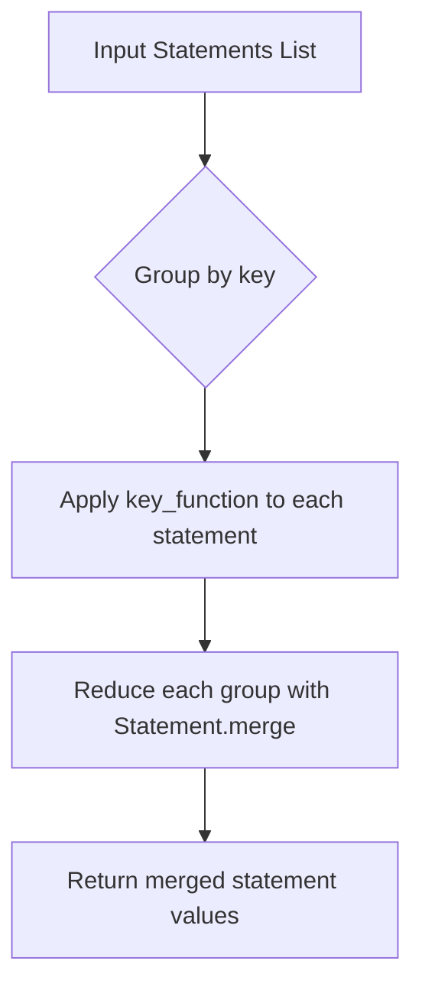

# `policy_generator.py`

## `trailscraper.policy_generator._combine_statements_by` · *function*

## Summary:
Merges IAM policy statements that share the same key attributes.

## Description:
This higher-order function returns a function that groups policy statements by a specified key and merges statements within each group using Statement.merge. The returned function accepts a list of Statement objects and produces a list of merged Statement objects.

## Args:
    key (callable): A function that takes a Statement object and returns a hashable key used for grouping statements.

## Returns:
    callable: A function that accepts a list of Statement objects and returns a list of Statement objects, where statements with identical keys have been merged.

## Raises:
    ValueError: When attempting to merge two statements with different Effect values (this is enforced by Statement.merge).

## Constraints:
    Preconditions:
    - All input statements must be valid Statement objects
    - Statements with different Effect values cannot be merged (this is enforced by Statement.merge)
    - The key function must return hashable values that can be used for grouping
    
    Postconditions:
    - The result contains merged statements for each group identified by the key function
    - Each merged statement contains combined actions and resources from all input statements in that group (when Effect values match)

## Side Effects:
    None

## Control Flow:


## Examples:
```python
# Example usage for grouping by Effect
from trailscraper.iam import Statement

# Create sample statements
stmt1 = Statement(Effect="Allow", Action=["s3:GetObject"], Resource=["arn:aws:s3:::bucket/*"])
stmt2 = Statement(Effect="Allow", Action=["s3:PutObject"], Resource=["arn:aws:s3:::bucket/*"])
stmt3 = Statement(Effect="Deny", Action=["s3:DeleteObject"], Resource=["arn:aws:s3:::bucket/*"])

# Group and merge by Effect
combiner = _combine_statements_by(lambda stmt: stmt.Effect)
result = combiner([stmt1, stmt2, stmt3])

# Result will contain 2 statements: one Allow with both actions, one Deny with DeleteObject
```

## `trailscraper.policy_generator.generate_policy` · *function*

## Summary
Generates an IAM policy document from a collection of CloudTrail records.

## Description
Converts a list of CloudTrail event records into a structured IAM policy document. This function transforms each record into an IAM statement, filters out invalid statements, combines similar statements, and sorts the results for consistent output.

Known callers:
- This function is typically invoked during CloudTrail log analysis workflows when generating IAM policies from audit logs
- Called as part of the trailscraper policy generation pipeline to transform raw CloudTrail events into actionable IAM policy representations

This logic is extracted into its own function to separate the policy generation business logic from the data processing pipeline, making the code more modular and testable.

## Args
    selected_records (list[Record]): A list of CloudTrail Record objects to be converted into policy statements

## Returns
    PolicyDocument: An IAM policy document containing the combined statements derived from the input records

## Raises
    ValueError: When attempting to merge two statements with different Effect values (enforced by Statement.merge)

## Constraints
    Preconditions:
    - Input selected_records must be a list of valid Record objects
    - Each Record object must have valid event_source and event_name attributes
    
    Postconditions:
    - The returned PolicyDocument will contain a Version field set to "2012-10-17"
    - The Statement field will contain a list of merged and sorted Statement objects

## Side Effects
    None

## Control Flow
```mermaid
flowchart TD
    A[Input selected_records] --> B[Map to statements using Record.to_statement]
    B --> C[Filter out None statements]
    C --> D[Group and merge by Resource]
    D --> E[Group and merge by Action]
    E --> F[Sort statements]
    F --> G[Create PolicyDocument with Version="2012-10-17"]
    G --> H[Return PolicyDocument]
```

## Examples
```python
from trailscraper.cloudtrail import Record
from trailscraper.policy_generator import generate_policy

# Create sample records
record1 = Record(event_source="s3.amazonaws.com", event_name="GetObject", resource_arns=["arn:aws:s3:::bucket/*"])
record2 = Record(event_source="s3.amazonaws.com", event_name="PutObject", resource_arns=["arn:aws:s3:::bucket/*"])

# Generate policy from records
policy = generate_policy([record1, record2])
print(policy.to_json())
```

