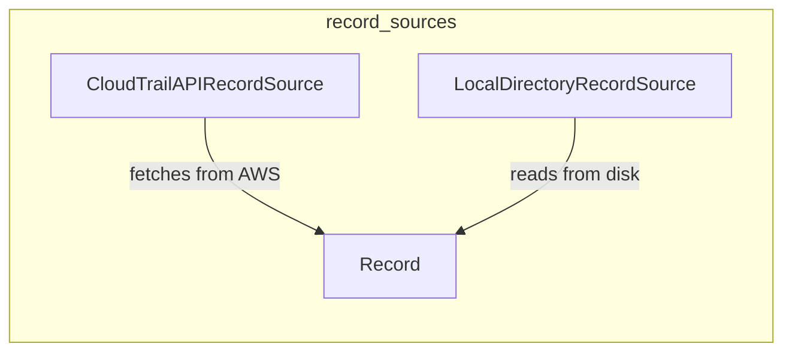

# `trailscraper.record_sources`

## Tree:
record_sources/
├── cloudtrail_api_record_source.py
└── local_directory_record_source.py

## Role:
Provides unified interfaces for accessing CloudTrail log data from different sources - either AWS CloudTrail API or local filesystem directories.

## Description:
The record_sources module encapsulates the various ways CloudTrail log data can be accessed within the trailscraper system. It provides abstractions for different data sources, allowing the rest of the system to consume CloudTrail events uniformly regardless of whether they come from AWS API calls or local log files. This module serves as a bridge between the data acquisition layer and the policy analysis layer, ensuring that different data sources can be treated consistently.

The module is used primarily by the main scraper logic and policy analysis components that need to ingest CloudTrail events for further processing. It enables flexible deployment scenarios where data might be sourced from cloud APIs or local archives.

## Components:
- CloudTrailAPIRecordSource: Implements a record source that fetches CloudTrail events from AWS CloudTrail API via the `load_from_api` method
- LocalDirectoryRecordSource: Implements a record source that reads CloudTrail log files from a local directory via the `load_from_dir` and `last_event_timestamp_in_dir` methods

## Public API:
- CloudTrailAPIRecordSource: Class for creating AWS-based CloudTrail record sources with `load_from_api` method
- LocalDirectoryRecordSource: Class for creating local directory-based CloudTrail record sources with `load_from_dir` and `last_event_timestamp_in_dir` methods

## Dependencies:
- Internal: Uses common Record data structures and utility functions from the core module
- External: boto3 for AWS API interactions, gzip for decompressing log files, json for parsing event data

## Constraints:
- Both record source implementations must provide compatible interfaces for the consuming code
- CloudTrailAPIRecordSource requires valid AWS credentials and permissions to access CloudTrail API
- LocalDirectoryRecordSource requires the specified directory to exist and contain valid CloudTrail log files
- All date/time parameters must be timezone-aware datetime objects

---

## Files

- [`cloudtrail_api_record_source.py`](record_sources/cloudtrail_api_record_source.md)
- [`local_directory_record_source.py`](record_sources/local_directory_record_source.md)

