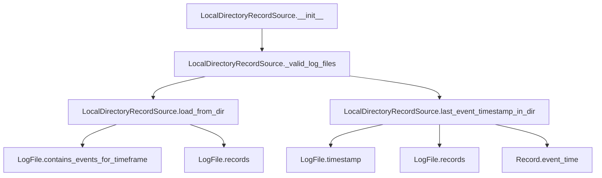

# `local_directory_record_source.py`

## `trailscraper.record_sources.local_directory_record_source.LocalDirectoryRecordSource` · *class*

## Summary:
A record source that reads CloudTrail log files from a local directory and provides access to log records within a specified time range.

## Description:
The LocalDirectoryRecordSource class implements a record source that scans a local directory for CloudTrail log files, validates them, and provides methods to load records within a specific time range or retrieve the timestamp of the most recent event. This class serves as an abstraction layer for accessing CloudTrail data stored locally on disk, making it suitable for offline processing or testing scenarios where network access to cloud storage is not available.

The class is typically instantiated by systems that need to process CloudTrail logs from a local filesystem, such as during batch processing jobs or when analyzing historical CloudTrail data that has been downloaded locally.

## State:
- _log_dir (str): The absolute or relative path to the directory containing CloudTrail log files. Must be a valid directory path that exists on the filesystem.

## Lifecycle:
- Creation: Instantiate with a directory path string pointing to a location containing CloudTrail log files
- Usage: Call load_from_dir() to retrieve records within a time range, or last_event_timestamp_in_dir() to get the latest event timestamp
- Destruction: Standard Python object lifecycle management applies

## Method Map:


## Raises:
- None explicitly raised by __init__
- The _valid_log_files() method may raise exceptions from os.walk() if the directory path is invalid or inaccessible
- The load_from_dir() method may raise exceptions from LogFile operations if files are corrupted or inaccessible, or IndexError if no valid CloudTrail log files exist in the configured directory
- The last_event_timestamp_in_dir() method may raise exceptions from LogFile operations if files are corrupted or inaccessible, or IndexError if no valid CloudTrail log files exist in the configured directory

## Example:
```python
from datetime import datetime
from trailscraper.record_sources.local_directory_record_source import LocalDirectoryRecordSource

# Create a record source for a directory containing CloudTrail logs
record_source = LocalDirectoryRecordSource("/path/to/cloudtrail/logs")

# Load records from a specific time range
from_date = datetime(2023, 1, 1, 0, 0, 0)
to_date = datetime(2023, 1, 1, 12, 0, 0)
records = record_source.load_from_dir(from_date, to_date)

# Get the timestamp of the most recent event in the directory
latest_timestamp = record_source.last_event_timestamp_in_dir()
```

### `trailscraper.record_sources.local_directory_record_source.LocalDirectoryRecordSource.__init__` · *method*

## Summary:
Initializes a LocalDirectoryRecordSource instance with the specified directory path for CloudTrail log files.

## Description:
This constructor method sets up the record source by storing the directory path where CloudTrail log files are located. The directory path is validated indirectly through subsequent operations when the record source methods are called, rather than being validated immediately during initialization.

## Args:
    log_dir (str): The absolute or relative path to the directory containing CloudTrail log files. This directory must exist and contain valid CloudTrail log files for subsequent operations to succeed.

## Returns:
    None: This method does not return a value.

## Raises:
    None: This method does not explicitly raise exceptions during initialization.

## State Changes:
    Attributes READ: None
    Attributes WRITTEN: 
        - self._log_dir: Stores the provided directory path for later use in log file operations

## Constraints:
    Preconditions:
        - The log_dir parameter should be a valid directory path string
        - The directory pointed to by log_dir should exist and be readable
        - The directory should contain CloudTrail log files for meaningful operation of other methods
    
    Postconditions:
        - The instance's _log_dir attribute is set to the provided log_dir parameter
        - The instance is ready for subsequent operations that require a log directory

## Side Effects:
    None: This method performs no I/O operations or external service calls during initialization.

### `trailscraper.record_sources.local_directory_record_source.LocalDirectoryRecordSource._valid_log_files` · *method*

## Summary:
Returns an iterator of valid CloudTrail log file objects from the configured directory, filtering out files with invalid filenames and logging warnings for invalid ones.

## Description:
This method performs a recursive directory traversal to discover all CloudTrail log files, validates each file's name format, and returns only those that conform to the expected CloudTrail naming convention. Invalid filenames trigger warning messages to aid in debugging and monitoring.

The method is designed as a reusable component that encapsulates the complex logic of directory traversal, file path construction, log file instantiation, and validation. It's used by other methods in the class like `load_from_dir` and `last_event_timestamp_in_dir` to access valid log files for processing.

## Args:
    None

## Returns:
    Iterator[LogFile]: An iterator of LogFile objects representing valid CloudTrail log files found in the directory tree. Invalid files are filtered out and logged as warnings.

## Raises:
    None explicitly raised by this method

## State Changes:
    Attributes READ: self._log_dir
    Attributes WRITTEN: None

## Constraints:
    Preconditions:
    - The LocalDirectoryRecordSource instance must have been initialized with a valid directory path
    - The directory path stored in self._log_dir must be readable and accessible
    
    Postconditions:
    - The returned iterator yields only LogFile objects with valid filenames
    - Invalid filenames encountered during processing will generate warning log messages
    - The method does not modify any state of the LocalDirectoryRecordSource object

## Side Effects:
    I/O: Reads directory structure using os.walk
    Logging: Writes warning messages to the logging system for invalid filenames
    External service calls: None

### `trailscraper.record_sources.local_directory_record_source.LocalDirectoryRecordSource.load_from_dir` · *method*

## Summary:
Collects CloudTrail log records from valid log files within a specified date range.

## Description:
Filters valid CloudTrail log files in the configured directory by the provided date range and aggregates all matching records into a single list. This method is used to gather CloudTrail events for analysis or processing within a specific timeframe.

The method iterates through all valid log files discovered in the directory tree, checking each file's timestamp against the provided date range. Files that contain events within the specified timeframe (including a one-hour buffer at the end) have their records extracted and added to the result set.

## Args:
    from_date (datetime.datetime): The start of the time range to filter log files by. Must be a timezone-aware datetime object.
    to_date (datetime.datetime): The end of the time range to filter log files by. Must be a timezone-aware datetime object.

## Returns:
    list[Record]: A list of Record objects representing CloudTrail events from log files that fall within the specified date range. Returns an empty list if no matching log files are found.

## Raises:
    None explicitly raised by this method. Exceptions from file I/O or JSON parsing within LogFile methods are handled internally and logged as warnings.

## State Changes:
    Attributes READ: self._log_dir (through _valid_log_files method)
    Attributes WRITTEN: None

## Constraints:
    Preconditions:
    - from_date and to_date must be timezone-aware datetime objects
    - The LocalDirectoryRecordSource instance must have been initialized with a valid directory path
    - The directory path stored in self._log_dir must be readable and accessible
    
    Postconditions:
    - Returns a list of Record objects or an empty list if no matching records exist
    - Does not modify any state of the LocalDirectoryRecordSource object

## Side Effects:
    I/O: Reads directory structure using os.walk (through _valid_log_files)
    I/O: Reads gzipped JSON files to extract records (through LogFile.records)
    Logging: May emit warning messages for invalid filenames (through _valid_log_files)
    Logging: May emit warning messages for file loading failures (through LogFile.records)

### `trailscraper.record_sources.local_directory_record_source.LocalDirectoryRecordSource.last_event_timestamp_in_dir` · *method*

## Summary:
Returns the latest event timestamp found in the most recent CloudTrail log file within the configured directory.

## Description:
This method identifies the most recent CloudTrail log file by timestamp, extracts all its event records, sorts them chronologically, and returns the timestamp of the most recent event. It serves as a utility for determining the latest activity time in a CloudTrail log directory, which is useful for incremental processing and determining when to resume log collection.

The method follows a functional pipeline approach using toolz functions to process the log files:
1. Retrieves all valid log files from the directory using `_valid_log_files()`
2. Sorts them by timestamp to find the most recent file
3. Extracts records from that file
4. Sorts the records chronologically
5. Returns the timestamp of the final record

This method is specifically designed to be a standalone utility for timestamp discovery rather than being inlined because it encapsulates complex logic for finding the latest event time across potentially many log files and records, making it reusable and testable.

## Args:
    None

## Returns:
    datetime.datetime: A timezone-aware datetime object representing the latest event time found in the most recent CloudTrail log file. The returned datetime is in UTC timezone.

## Raises:
    IndexError: When no valid CloudTrail log files exist in the configured directory, causing the pipeline to fail when trying to access elements from an empty sequence.

## State Changes:
    Attributes READ: self._log_dir (through _valid_log_files)
    Attributes WRITTEN: None

## Constraints:
    Preconditions:
    - The LocalDirectoryRecordSource instance must have been initialized with a valid directory path
    - The directory path stored in self._log_dir must be readable and contain at least one valid CloudTrail log file
    - Valid CloudTrail log files must exist in the directory tree with proper naming conventions
    
    Postconditions:
    - Returns a datetime object representing the latest event time in the most recent log file
    - The method does not modify any state of the LocalDirectoryRecordSource object

## Side Effects:
    I/O: Reads directory structure using os.walk and file contents from CloudTrail log files
    Logging: May emit warning messages if invalid filenames are encountered during log file discovery

