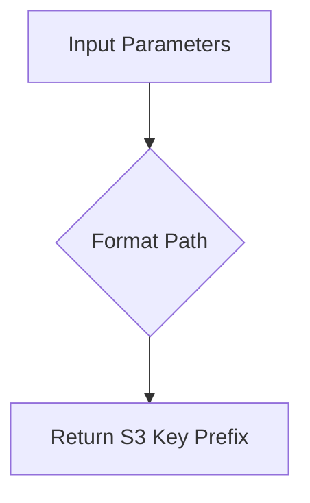
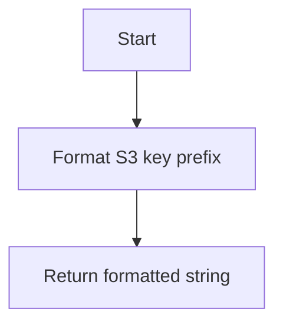
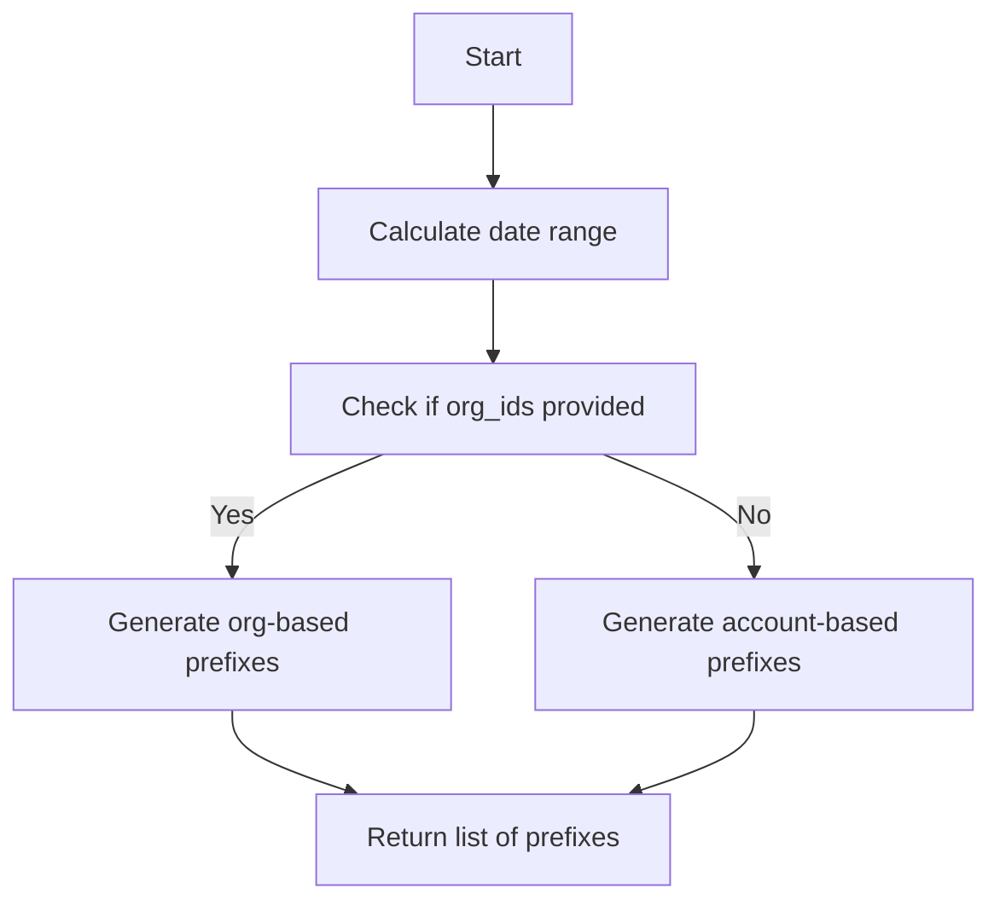
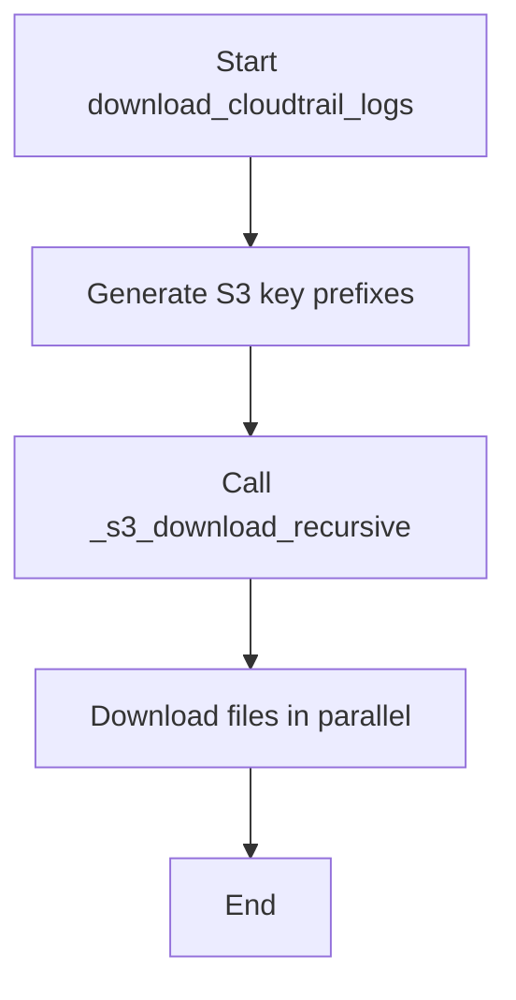

# `s3_download.py`

## `trailscraper.s3_download._s3_key_prefix` · *function*

## Summary:
Generates an S3 key prefix path for AWS CloudTrail log files based on account, region, and date information.

## Description:
Creates a standardized S3 object key prefix for AWS CloudTrail logs following the AWS naming convention. This function is used internally by the s3_download module to construct the appropriate S3 path where CloudTrail log files are stored.

## Args:
    prefix (str): The base prefix to prepend to the S3 key path
    date (datetime.date): The date for which to generate the log path
    account_id (str): AWS account ID associated with the logs
    region (str): AWS region where the logs were generated

## Returns:
    str: A formatted S3 key prefix in the pattern: "{prefix}AWSLogs/{account_id}/CloudTrail/{region}/{year}/{month:02d}/{day:02d}/"

## Raises:
    None explicitly raised

## Constraints:
    Preconditions:
        - date must be a valid datetime.date object
        - account_id must be a non-empty string
        - region must be a non-empty string
        - prefix should be a string (though no validation is performed)

    Postconditions:
        - Returns a properly formatted S3 key prefix string
        - All date components are zero-padded to ensure consistent path structure

## Side Effects:
    None

## Control Flow:


## Examples:
    >>> _s3_key_prefix("logs/", datetime.date(2023, 12, 25), "123456789012", "us-east-1")
    "logs/AWSLogs/123456789012/CloudTrail/us-east-1/2023/12/25/"
    
    >>> _s3_key_prefix("", datetime.date(2023, 1, 1), "999999999999", "eu-west-1")
    "AWSLogs/999999999999/CloudTrail/eu-west-1/2023/01/01/"
``

## `trailscraper.s3_download._s3_key_prefix_for_org_trails` · *function*

## Summary:
Constructs an S3 key prefix for AWS CloudTrail logs within an organization structure.

## Description:
Generates a standardized S3 object key prefix for accessing CloudTrail log files stored in AWS S3 buckets under an organization hierarchy. This function formats the path according to AWS CloudTrail's standard directory structure for organization-based log storage.

## Args:
    prefix (str): The base prefix to prepend to the S3 key path
    date (datetime.date): The date for which to construct the log path
    org_id (str): The AWS organization ID
    account_id (str): The AWS account ID
    region (str): The AWS region where the logs were generated

## Returns:
    str: A formatted S3 key prefix in the pattern: {prefix}AWSLogs/{org_id}/{account_id}/CloudTrail/{region}/{year}/{month:02d}/{day:02d}/

## Raises:
    None explicitly raised

## Constraints:
    Preconditions:
        - prefix must be a string
        - date must be a datetime.date object
        - org_id must be a string
        - account_id must be a string
        - region must be a string
    Postconditions:
        - Returns a properly formatted S3 key prefix string
        - Month and day values are zero-padded to two digits

## Side Effects:
    None

## Control Flow:


## Examples:
    >>> _s3_key_prefix_for_org_trails("logs/", datetime.date(2023, 12, 25), "o-1234567890", "123456789012", "us-east-1")
    "logs/AWSLogs/o-1234567890/123456789012/CloudTrail/us-east-1/2023/12/25/"
```

## `trailscraper.s3_download._s3_key_prefixes` · *function*

## Summary:
Generates a list of S3 key prefixes for AWS CloudTrail log files across a date range, account IDs, regions, and optionally organization IDs.

## Description:
Constructs S3 object key prefixes for retrieving CloudTrail log files from AWS S3 buckets. When organization IDs are provided, it generates paths following the organization hierarchy structure. Otherwise, it creates standard account-based paths. The function handles date ranges by generating prefixes for each day in the specified period.

## Args:
    prefix (str): Base prefix to prepend to S3 key paths
    org_ids (list[str] or None): List of AWS organization IDs, or None for account-based paths
    account_ids (list[str]): List of AWS account IDs to generate prefixes for
    regions (list[str]): List of AWS regions to generate prefixes for
    from_date (datetime.datetime): Start date for the date range (inclusive)
    to_date (datetime.datetime): End date for the date range (inclusive)

## Returns:
    list[str]: A list of S3 key prefixes for CloudTrail log files matching the specified criteria

## Raises:
    None explicitly raised

## Constraints:
    Preconditions:
        - from_date must be a datetime.datetime object
        - to_date must be a datetime.datetime object
        - from_date must be less than or equal to to_date
        - account_ids must be a non-empty list
        - regions must be a non-empty list
        - org_ids, if provided, must be a list of strings

    Postconditions:
        - Returns a list of properly formatted S3 key prefixes
        - All dates in the range are covered
        - All combinations of account IDs, regions, and dates are included

## Side Effects:
    None

## Control Flow:


## Examples:
    >>> from datetime import datetime
    >>> _s3_key_prefixes("logs/", None, ["123456789012"], ["us-east-1"], datetime(2023, 12, 25), datetime(2023, 12, 26))
    ['logs/AWSLogs/123456789012/CloudTrail/us-east-1/2023/12/25/', 'logs/AWSLogs/123456789012/CloudTrail/us-east-1/2023/12/26/']
    
    >>> _s3_key_prefixes("trail-logs/", ["o-1234567890"], ["123456789012"], ["us-east-1", "us-west-2"], datetime(2023, 12, 25), datetime(2023, 12, 25))
    ['trail-logs/AWSLogs/o-1234567890/123456789012/CloudTrail/us-east-1/2023/12/25/', 'trail-logs/AWSLogs/o-1234567890/123456789012/CloudTrail/us-west-2/2023/12/25/']

## `trailscraper.s3_download._s3_download_recursive` · *function*

## Summary:
Downloads files from an S3 bucket recursively based on specified prefixes, avoiding duplicates and supporting parallel downloads.

## Description:
This function recursively lists and downloads files from an S3 bucket that match the provided prefixes. It manages S3 client connections per thread for thread safety, creates local directories as needed, and skips files that already exist locally. Downloads are performed in parallel using a thread pool to improve performance.

The function is designed to be called internally by the trailscraper system for efficiently retrieving AWS CloudTrail logs from S3 storage. It handles recursive directory traversal in S3 and ensures efficient download operations while avoiding redundant work.

## Args:
    bucket (str): Name of the S3 bucket to download from
    prefixes (list[str]): List of S3 object key prefixes to match for download
    target_dir (str): Local directory path where downloaded files will be stored
    parallelism (int): Maximum number of concurrent download threads to use

## Returns:
    None: This function performs side-effect operations but does not return a meaningful value

## Raises:
    None explicitly raised: The function relies on boto3 exceptions for S3-related errors, which propagate naturally

## Constraints:
    Preconditions:
        - The bucket must exist and be accessible with configured AWS credentials
        - The target_dir must be writable by the executing process
        - The prefixes list should contain valid S3 key prefixes
        - Parallelism should be a positive integer
    
    Postconditions:
        - Files matching the prefixes will be downloaded to target_dir
        - All necessary parent directories will be created in target_dir
        - No duplicate downloads will occur for existing files

## Side Effects:
    - Creates local directories in target_dir as needed
    - Writes files to the local filesystem in target_dir
    - Makes HTTP requests to S3 service via boto3
    - Logs download progress and skipped files using the logging module
    - Uses thread-local storage for managing S3 clients

## Control Flow:
```mermaid
flowchart TD
    A[Start _s3_download_recursive] --> B{Get S3 client}
    B --> C[List files with paginator}
    C --> D{Has CommonPrefixes?}
    D -- Yes --> E[Recursively list prefixes]
    D -- No --> F{Has Contents?}
    F -- Yes --> G[Check prefix match]
    G -- Match --> H[Check if file exists]
    H -- No --> I[Add to download list]
    H -- Yes --> J[Skip - exists]
    F -- No --> K[Return files to download]
    E --> K
    I --> K
    J --> K
    K --> L[Download files in parallel]
    L --> M[End]
```

## Examples:
```python
# Download all CloudTrail logs from a specific date prefix
_s3_download_recursive(
    bucket="my-cloudtrail-bucket",
    prefixes=["2023/12/01/"],
    target_dir="/tmp/cloudtrail_logs",
    parallelism=10
)

# Download logs from multiple date ranges
_s3_download_recursive(
    bucket="aws-logs-bucket",
    prefixes=["2023/12/", "2023/11/"],
    target_dir="./downloads",
    parallelism=5
)
```

## `trailscraper.s3_download.download_cloudtrail_logs` · *function*

## Summary:
Downloads AWS CloudTrail logs from S3 by generating date-range and account-specific prefixes, then recursively fetching matching files.

## Description:
This function serves as the main entry point for downloading CloudTrail logs from an S3 bucket. It generates the appropriate S3 key prefixes based on the provided date range, account IDs, regions, and optional organization IDs, then initiates a recursive download process for all matching files.

The function is designed to be called by the trailscraper system to efficiently retrieve CloudTrail logs across multiple accounts, regions, and time periods. It abstracts away the complexity of prefix generation and parallel downloading into a single, easy-to-use interface.

## Args:
    target_dir (str): Local directory path where downloaded CloudTrail log files will be stored
    bucket (str): Name of the S3 bucket containing CloudTrail logs
    cloudtrail_prefix (str): Base prefix to prepend to S3 key paths for CloudTrail logs
    org_ids (list[str] or None): List of AWS organization IDs to include in prefix generation, or None for account-based paths
    account_ids (list[str]): List of AWS account IDs to include in prefix generation
    regions (list[str]): List of AWS regions to include in prefix generation
    from_date (datetime.datetime): Start date for the date range (inclusive)
    to_date (datetime.datetime): End date for the date range (inclusive)
    parallelism (int): Maximum number of concurrent download threads to use for fetching files

## Returns:
    None: This function performs side-effect operations but does not return a meaningful value

## Raises:
    None explicitly raised: The function relies on boto3 exceptions for S3-related errors, which propagate naturally

## Constraints:
    Preconditions:
        - from_date must be a datetime.datetime object
        - to_date must be a datetime.datetime object
        - from_date must be less than or equal to to_date
        - account_ids must be a non-empty list
        - regions must be a non-empty list
        - parallelism should be a positive integer
        - The bucket must exist and be accessible with configured AWS credentials
        - The target_dir must be writable by the executing process
    
    Postconditions:
        - Files matching the generated prefixes will be downloaded to target_dir
        - All necessary parent directories will be created in target_dir
        - No duplicate downloads will occur for existing files

## Side Effects:
    - Creates local directories in target_dir as needed
    - Writes files to the local filesystem in target_dir
    - Makes HTTP requests to S3 service via boto3
    - Logs download progress and skipped files using the logging module

## Control Flow:


## Examples:
```python
# Download CloudTrail logs for a single account and region over a date range
download_cloudtrail_logs(
    target_dir="/tmp/cloudtrail_logs",
    bucket="my-cloudtrail-bucket",
    cloudtrail_prefix="AWSLogs/",
    org_ids=None,
    account_ids=["123456789012"],
    regions=["us-east-1"],
    from_date=datetime.datetime(2023, 12, 25),
    to_date=datetime.datetime(2023, 12, 26),
    parallelism=10
)

# Download CloudTrail logs for multiple accounts and regions under an organization
download_cloudtrail_logs(
    target_dir="./downloads",
    bucket="aws-logs-bucket",
    cloudtrail_prefix="trail-logs/",
    org_ids=["o-1234567890"],
    account_ids=["123456789012", "210987654321"],
    regions=["us-east-1", "us-west-2"],
    from_date=datetime.datetime(2023, 12, 25),
    to_date=datetime.datetime(2023, 12, 25),
    parallelism=5
)
```

