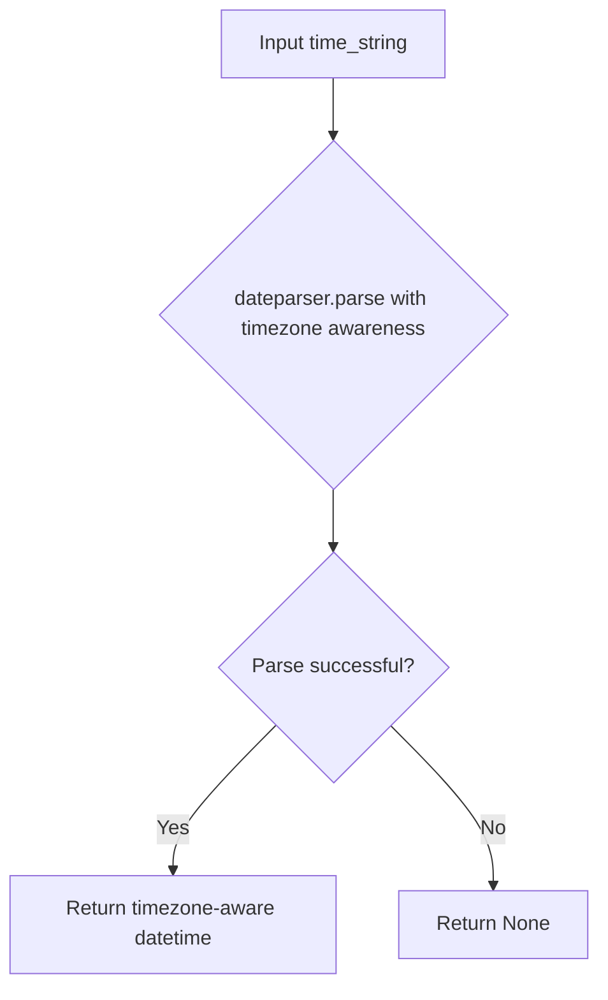

# `time_utils.py`

## `trailscraper.time_utils.parse_human_readable_time` · *function*

## Summary:
Converts human-readable time strings into timezone-aware datetime objects.

## Description:
Parses human-readable time expressions (such as "today", "yesterday", "2 hours ago", "Jan 1, 2023") into timezone-aware datetime objects using the dateparser library. This utility function centralizes time string parsing logic to ensure consistent interpretation of temporal expressions throughout the application.

## Args:
    time_string (str): A human-readable time string that dateparser can interpret, such as "now", "tomorrow", "3 days ago", "January 1, 2023", etc.

## Returns:
    datetime.datetime or None: A timezone-aware datetime object representing the parsed time, or None if the input string cannot be parsed.

## Raises:
    None explicitly raised by this function, though dateparser.parse may raise exceptions for malformed inputs.

## Constraints:
    Preconditions:
    - Input must be a string that can be parsed by the dateparser library
    - The string should represent a valid time expression
    
    Postconditions:
    - When successful, the returned datetime object will include timezone information due to the RETURN_AS_TIMEZONE_AWARE setting
    - When parsing fails, None is returned

## Side Effects:
    None

## Control Flow:


## Examples:
    >>> parse_human_readable_time("today")
    datetime.datetime(2023, 10, 15, 0, 0, tzinfo=<UTC>)
    
    >>> parse_human_readable_time("2 hours ago")
    datetime.datetime(2023, 10, 14, 22, 0, tzinfo=<UTC>)
    
    >>> parse_human_readable_time("January 1, 2023")
    datetime.datetime(2023, 1, 1, 0, 0, tzinfo=<UTC>)
```

