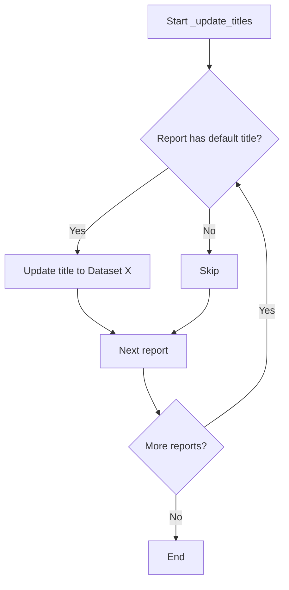
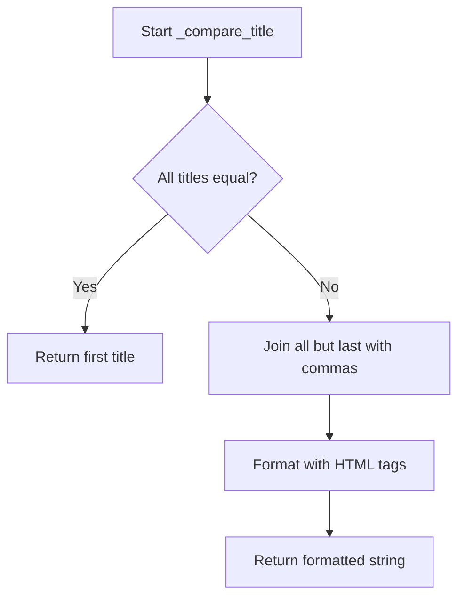
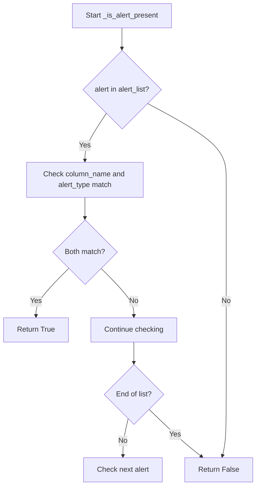
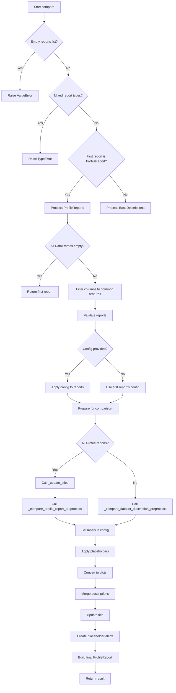

# `compare_reports.py`

## `src.ydata_profiling.compare_reports._should_wrap` · *function*

## Summary:
Determines whether two values should be considered equivalent for comparison purposes.

## Description:
This helper function evaluates whether two values are equivalent enough to avoid additional processing or wrapping in comparison operations. It specifically prevents wrapping for container types (lists, dicts) and uses appropriate comparison methods for pandas objects (DataFrames, Series). The function returns True when values should be treated as equivalent (and thus potentially wrapped), and False when they should not be wrapped due to type or content differences.

## Args:
    v1 (Any): First value to compare
    v2 (Any): Second value to compare

## Returns:
    bool: True if the values should be considered equivalent (and potentially wrapped), False otherwise

## Raises:
    None explicitly raised, though ValueError may be caught internally when comparing incompatible types

## Constraints:
    Preconditions:
    - Both arguments can be of any type (Any)
    - The function assumes valid pandas objects if isinstance checks for DataFrame/Series are true
    
    Postconditions:
    - Always returns a boolean value
    - For pandas objects, uses appropriate .equals() methods for comparison
    - For other types, falls back to direct equality comparison with error handling

## Side Effects:
    None

## Control Flow:
```mermaid
flowchart TD
    A[Start _should_wrap] --> B{v1 is list or dict?}
    B -- Yes --> C[Return False]
    B -- No --> D{v1 is DataFrame AND v2 is DataFrame?}
    D -- Yes --> E[Return v1.equals(v2)]
    D -- No --> F{v1 is Series AND v2 is Series?}
    F -- Yes --> G[Return v1.equals(v2)]
    F -- No --> H[Try v1 == v2]
    H --> I{ValueError caught?}
    I -- Yes --> J[Return False]
    I -- No --> K[Return v1 == v2]
```

## Examples:
    # Comparing identical DataFrames - returns True (considered equivalent)
    df1 = pd.DataFrame({'a': [1, 2], 'b': [3, 4]})
    df2 = pd.DataFrame({'a': [1, 2], 'b': [3, 4]})
    result = _should_wrap(df1, df2)  # Returns True
    
    # Comparing different DataFrames - returns False (not equivalent)
    df1 = pd.DataFrame({'a': [1, 2], 'b': [3, 4]})
    df2 = pd.DataFrame({'a': [1, 2], 'b': [3, 5]})
    result = _should_wrap(df1, df2)  # Returns False
    
    # Comparing lists - returns False (never wrapped)
    result = _should_wrap([1, 2, 3], [1, 2, 3])  # Returns False
    
    # Comparing scalars - returns True (considered equivalent)
    result = _should_wrap(5, 5)  # Returns True

## `src.ydata_profiling.compare_reports._update_merge_dict` · *function*

## Summary:
Merges two dictionaries with special handling for overlapping keys by either wrapping values in a list or recursively merging them.

## Description:
This function performs a deep merge of two dictionaries, combining all keys from both dictionaries. For keys that exist in both dictionaries, it applies special logic to determine how to handle the overlapping values. If the values should be considered equivalent (based on `_should_wrap`), they are wrapped in a list. Otherwise, it delegates to `_update_merge_mixed` for further processing. This function is part of a larger system for comparing and merging profile reports, ensuring consistent handling of nested data structures.

## Args:
    d1 (Any): First dictionary to merge
    d2 (Any): Second dictionary to merge

## Returns:
    dict: A new dictionary containing all keys from both input dictionaries. For overlapping keys, values are either wrapped in a list if they are considered equivalent, or processed by `_update_merge_mixed` if they are not equivalent.

## Raises:
    None explicitly raised

## Constraints:
    Preconditions:
    - Both arguments must be dictionaries or other mapping-like objects
    - The function assumes valid inputs for the helper functions (_should_wrap, _update_merge_mixed)
    
    Postconditions:
    - Returns a dictionary with all keys from both input dictionaries
    - Overlapping keys are processed according to the merge strategy
    - The returned dictionary is a new object, not modifying the originals

## Side Effects:
    None

## Control Flow:
```mermaid
flowchart TD
    A[Start _update_merge_dict(d1,d2)] --> B{Merge all keys from d1 and d2}
    B --> C{Check for overlapping keys}
    C --> D{For each overlapping key k}
    D --> E{_should_wrap(d1[k], d2[k])?}
    E -- Yes --> F{Wrap in list: [d1[k], d2[k]]}
    E -- No --> G{_update_merge_mixed(d1[k], d2[k])}
    F --> H[Add to result dict]
    G --> H
    H --> I[Return merged dictionary]
```

## Examples:
    # Basic merge with no overlapping keys
    result = _update_merge_dict({"a": 1, "b": 2}, {"c": 3, "d": 4})
    # Returns {"a": 1, "b": 2, "c": 3, "d": 4}
    
    # Merge with overlapping keys that should be wrapped
    result = _update_merge_dict({"a": 1, "b": 2}, {"b": 2, "c": 3})
    # Returns {"a": 1, "b": [2, 2], "c": 3} (assuming _should_wrap returns True for value 2)
    
    # Merge with overlapping keys that shouldn't be wrapped
    result = _update_merge_dict({"a": 1, "b": 2}, {"b": 3, "c": 4})
    # Returns {"a": 1, "b": <result_from_update_merge_mixed>, "c": 4}

## `src.ydata_profiling.compare_reports._update_merge_seq` · *function*

## Summary:
Merges two sequence-like objects (lists or tuples) according to specific type-based rules.

## Description:
This utility function handles the merging of two sequence-like objects (lists or tuples) by applying different strategies based on their types. It's designed to process data structures in a consistent manner when comparing or combining profile reports. The function is typically used internally during report comparison operations where different data structures need to be merged appropriately.

## Args:
    d1 (Any): First sequence-like object (list, tuple, or other type)
    d2 (Any): Second sequence-like object (list, tuple, or other type)

## Returns:
    Union[list, tuple]: 
    - If both d1 and d2 are lists: returns a tuple containing (d1, d2)
    - If d1 is a tuple and d2 is a list: returns a tuple with d1 unpacked and d2 as the last element
    - Otherwise: returns a list containing both elements converted to lists if needed

## Raises:
    None explicitly raised

## Constraints:
    Preconditions:
    - Both arguments can be of any type (though behavior varies based on type)
    - Function handles various combinations of list/tuple types gracefully
    
    Postconditions:
    - Return value is either a list or tuple as determined by the type logic
    - Elements are properly wrapped in lists when needed for consistency

## Side Effects:
    None

## Control Flow:
```mermaid
flowchart TD
    A[Start _update_merge_seq(d1,d2)] --> B{isinstance(d1,list) AND isinstance(d2,list)?}
    B -- Yes --> C[return (d1,d2)]
    B -- No --> D{isinstance(d1,tuple) AND isinstance(d2,list)?}
    D -- Yes --> E[return (*d1, d2)]
    D -- No --> F[return [*(d1 if list else [d1]), *(d2 if list else [d2])]]
```

## Examples:
    # Both are lists
    result = _update_merge_seq([1, 2], [3, 4])  # Returns ([1, 2], [3, 4])
    
    # Tuple and list
    result = _update_merge_seq((1, 2), [3, 4])  # Returns ((1, 2), [3, 4])
    
    # Other types
    result = _update_merge_seq("hello", "world")  # Returns (['hello'], ['world'])
```

## `src.ydata_profiling.compare_reports._update_merge_mixed` · *function*

## Summary:
Dispatches between dictionary and sequence merging strategies based on input types.

## Description:
This utility function acts as a dispatcher that selects the appropriate merging strategy based on the types of the input arguments. When both inputs are dictionaries, it delegates to `_update_merge_dict` for deep merging with special handling for overlapping keys. For all other cases, it delegates to `_update_merge_seq` which handles sequence merging by returning a list containing both elements converted to lists if needed.

The function is part of a larger system for comparing and merging profile reports, where different data structures need to be handled consistently. It enables recursive merging of nested data structures while preserving type information and applying appropriate comparison logic.

## Args:
    d1 (Any): First data structure to merge (can be dict, list, tuple, or other type)
    d2 (Any): Second data structure to merge (can be dict, list, tuple, or other type)

## Returns:
    Union[dict, list, tuple]: 
    - If both inputs are dictionaries: returns a merged dictionary with combined keys
    - Otherwise: returns a list containing both elements converted to lists if needed (from `_update_merge_seq`)

## Raises:
    None explicitly raised

## Constraints:
    Preconditions:
    - Both arguments can be of any type
    - The function assumes valid inputs for the underlying helper functions
    
    Postconditions:
    - Returns the same type as would be returned by the dispatched helper function
    - Maintains the recursive nature of merging for nested structures

## Side Effects:
    None

## Control Flow:
```mermaid
flowchart TD
    A[Start _update_merge_mixed(d1,d2)] --> B{isinstance(d1,dict) AND isinstance(d2,dict)?}
    B -- Yes --> C[Call _update_merge_dict(d1,d2)]
    B -- No --> D[Call _update_merge_seq(d1,d2)]
    C --> E[Return merged dict]
    D --> E
```

## Examples:
    # Merging dictionaries
    result = _update_merge_mixed({"a": 1, "b": 2}, {"b": 3, "c": 4})
    # Returns {"a": 1, "b": [2, 3], "c": 4} (assuming b values should be wrapped)
    
    # Merging lists
    result = _update_merge_mixed([1, 2], [3, 4])
    # Returns ([1, 2], [3, 4]) (from _update_merge_seq)
    
    # Merging mixed types
    result = _update_merge_mixed((1, 2), [3, 4])
    # Returns ((1, 2), [3, 4]) (from _update_merge_seq)

## `src.ydata_profiling.compare_reports._update_merge` · *function*

## Summary:
Merges two dictionary objects with type validation and None handling, delegating the actual merge operation to a helper function.

## Description:
This function provides a safe interface for merging two dictionary objects. It handles the special case where the first dictionary might be None, returning the second dictionary directly in such cases. It also validates that both arguments are dictionaries before proceeding with the merge operation. The actual merging logic is delegated to `_update_merge_dict`.

## Args:
    d1 (Optional[dict]): First dictionary to merge, can be None
    d2 (dict): Second dictionary to merge, must be a dictionary

## Returns:
    dict: A merged dictionary containing all keys from both input dictionaries. If d1 is None, returns d2 directly.

## Raises:
    TypeError: When either d1 or d2 is not a dictionary type

## Constraints:
    Preconditions:
    - d2 must be a dictionary
    - d1 can be None or a dictionary
    
    Postconditions:
    - Returns a new dictionary object
    - Neither input dictionary is modified
    - The returned dictionary contains all keys from both inputs

## Side Effects:
    None

## Control Flow:
```mermaid
flowchart TD
    A[Start _update_merge(d1, d2)] --> B{Is d1 None?}
    B -- Yes --> C[Return d2]
    B -- No --> D{Are both d1 and d2 dictionaries?}
    D -- No --> E[Raise TypeError]
    D -- Yes --> F[Call _update_merge_dict(d1, d2)]
    F --> G[Return merged result]
```

## `src.ydata_profiling.compare_reports._placeholders` · *function*

## Summary:
Ensures consistent data structure across multiple profile reports by populating missing scatter plot and table type entries with default values.

## Description:
This function standardizes the data structures of multiple profile reports to facilitate comparison operations. It ensures that all reports have consistent entries in their scatter plot data and table type information, filling in missing entries with appropriate default values. This is particularly important when comparing reports generated from datasets with different characteristics or when some reports may have incomplete data structures.

The function is extracted to separate the data structure standardization concern from the actual comparison logic, promoting cleaner code organization and reusability.

## Args:
    reports (List[BaseDescription]): A list of profile report descriptions that need structural consistency. Each report object contains:
        - scatter: A nested dictionary structure representing scatter plot relationships
        - table: A dictionary containing a "types" key with type count information

## Returns:
    None: This function modifies the report objects in-place and does not return any value.

## Raises:
    None explicitly raised, but may raise exceptions from underlying dictionary operations if report structures are malformed or incompatible.

## Constraints:
    Preconditions:
    - Reports must be a list of BaseDescription objects
    - Each report's scatter attribute must support dictionary operations (has __contains__ and assignment)
    - Each report's table attribute must have a "types" key that maps to a dictionary-like object
    
    Postconditions:
    - All reports will have consistent scatter plot entry structures
    - All reports will have consistent table type entry structures
    - Missing scatter plot entries are populated with empty strings
    - Missing table type entries are populated with zero counts

## Side Effects:
    - Modifies the scatter and table["types"] dictionaries of each report object in-place
    - No external I/O operations or state mutations beyond modifying the input report objects

## Control Flow:
```mermaid
flowchart TD
    A[Start _placeholders] --> B[Collect all scatter keys from reports]
    B --> C[Collect all table type keys from reports]
    C --> D[For each report in reports]
    D --> E[For each scatter key k1]
    E --> F[If k1 not in report.scatter]
    F -- Yes --> G[Create report.scatter[k1] = {}]
    G --> H[For each scatter key k2]
    H --> I[If k2 not in report.scatter[k1]]
    I -- Yes --> J[Set report.scatter[k1][k2] = ""]
    J --> K[Next k2]
    K --> L[Next k1]
    L --> M[For each table type key]
    M --> N[If type key not in report.table["types"]]
    N -- Yes --> O[Set report.table["types"][type_key] = 0]
    O --> P[Next type key]
    P --> Q[End]
```

## Examples:
```python
# Basic usage in a comparison workflow
from ydata_profiling.model import BaseDescription

# Create two reports with different data structures
report1 = BaseDescription(...)
report1.scatter = {"A": {"B": "value1"}}
report1.table["types"] = {"int": 5}

report2 = BaseDescription(...)
report2.scatter = {"A": {}}  # Missing "B" key
report2.table["types"] = {"float": 3}  # Missing "int" key

reports = [report1, report2]
_placeholders(reports)

# After execution:
# report1.scatter will have {"A": {"B": "value1", "B": ""}} (ensuring all combinations exist)
# report2.scatter will have {"A": {"B": "", "B": ""}} (ensuring all combinations exist)
# Both will have table["types"] with both "int" and "float" keys
```

## `src.ydata_profiling.compare_reports._update_titles` · *function*

## Summary:
Updates default report titles in a list of ProfileReport objects to meaningful dataset labels.

## Description:
Modifies the title attribute of ProfileReport objects in-place to replace default titles with dataset identifiers. When multiple reports are compared, this function ensures each report has a distinctive title rather than the generic "Pandas Profiling Report" default.

This function is called internally by the compare functionality to enhance user experience by providing clear identification of datasets in comparison reports.

## Args:
    reports (List[ProfileReport]): A list of ProfileReport objects whose titles need to be updated

## Returns:
    None: This function modifies the report objects in-place and does not return anything

## Raises:
    None: This function does not explicitly raise exceptions

## Constraints:
    Preconditions:
    - Input must be a list of ProfileReport objects
    - Each ProfileReport object must have a config attribute with a title field
    
    Postconditions:
    - All ProfileReport objects in the input list will have their title attribute modified in-place if they had the default title
    - Reports with non-default titles remain unchanged

## Side Effects:
    - Modifies the config.title attribute of each ProfileReport object in the input list
    - No external I/O operations or state mutations beyond the report objects themselves

## Control Flow:


## Examples:
```python
# Basic usage in comparison workflow
from ydata_profiling import ProfileReport

# Create reports with default titles
report1 = ProfileReport(df1)
report2 = ProfileReport(df2)

# Update titles for comparison
_update_titles([report1, report2])
# report1.title becomes "Dataset A"
# report2.title becomes "Dataset B"
```

## `src.ydata_profiling.compare_reports._compare_title` · *function*

## Summary:
Generates a formatted title string for comparing multiple report titles, handling both uniform and mixed title cases.

## Description:
Formats a list of report titles into a readable comparison title. When all titles are identical, it returns that single title. When titles differ, it creates a formatted string indicating the comparison operation with proper conjunctions.

## Args:
    titles (List[str]): A list of title strings to compare and format. Must contain at least one title.

## Returns:
    str: A formatted title string. If all titles are identical, returns the common title. Otherwise, returns a formatted string like "<em>Comparing</em> title1, title2 <em>and</em> title3".

## Raises:
    None explicitly raised.

## Constraints:
    Preconditions:
        - The input `titles` list must contain at least one element
        - All elements in `titles` must be strings
    
    Postconditions:
        - Always returns a string
        - For single title, returns that exact title
        - For multiple titles, returns properly formatted HTML with emphasis tags

## Side Effects:
    None.

## Control Flow:


## Examples:
    >>> _compare_title(["Report A", "Report A", "Report A"])
    'Report A'
    
    >>> _compare_title(["Report A", "Report B"])
    '<em>Comparing</em> Report A <em>and</em> Report B'
    
    >>> _compare_title(["Report A", "Report B", "Report C"])
    '<em>Comparing</em> Report A, Report B <em>and</em> Report C'

## `src.ydata_profiling.compare_reports._compare_profile_report_preprocess` · *function*

## Summary:
Prepares a list of profile reports for comparison by normalizing configurations, synchronizing typesets, and extracting labeled descriptions.

## Description:
Processes multiple ProfileReport objects to standardize their configurations and prepare them for comparison operations. This function ensures that all reports have consistent styling configurations and synchronized data structures before being compared. It extracts titles as labels and retrieves descriptions from each report while maintaining proper metadata association.

The function is extracted into its own component to separate the preprocessing logic from the actual comparison algorithm, enforcing a clear responsibility boundary between data preparation and comparison operations.

## Args:
    reports (List[ProfileReport]): A list of ProfileReport objects to be prepared for comparison
    config (Optional[Settings], optional): Configuration settings to apply to all reports. If None, uses the first report's configuration. Defaults to None.

## Returns:
    Tuple[List[str], List[BaseDescription]]: A tuple containing:
        - labels (List[str]): List of report titles used as labels for identification
        - descriptions (List[BaseDescription]): List of descriptions from each report with associated labels

## Raises:
    None explicitly raised

## Constraints:
    Preconditions:
        - reports must be a non-empty list of ProfileReport objects
        - Each report must have a valid config attribute with html.style.primary_colors
        - Each report must have a valid description_set property
    
    Postconditions:
        - All reports in the list have their primary_colors properly configured
        - All reports (except the first) have their _typeset attribute synchronized with the first report
        - Each description in the returned list has its analysis.title field updated with the corresponding label

## Side Effects:
    - Modifies the primary_colors attribute of each ProfileReport in the reports list
    - Modifies the _typeset attribute of each ProfileReport (starting from index 1) to reference the first report's typeset
    - Updates the analysis.title field of each BaseDescription in the returned descriptions

## Control Flow:
```mermaid
flowchart TD
    A[Start _compare_profile_report_preprocess] --> B{config is None?}
    B -- Yes --> C{reports[0].config.html.style.primary_colors length > 1?}
    C -- Yes --> D[Set each report's primary_colors to single color from its own list]
    C -- No --> E[Skip primary color processing]
    B -- No --> F{config.html.style.primary_colors length > 1?}
    F -- Yes --> G[Set all reports' primary_colors to config's primary_colors]
    F -- No --> H[Skip primary color processing]
    D --> I[Sync _typeset from first report to others]
    E --> I
    G --> I
    H --> I
    I --> J[Get descriptions from all reports]
    J --> K[Assign labels to description titles]
    K --> L[Return labels and descriptions]
```

## Examples:
```python
# Basic usage with multiple reports
from ydata_profiling import ProfileReport

# Create two profile reports
report1 = ProfileReport(df1)
report2 = ProfileReport(df2)

# Prepare reports for comparison
labels, descriptions = _compare_profile_report_preprocess([report1, report2])

# Usage with custom configuration
custom_config = Settings(title="Custom Report")
labels, descriptions = _compare_profile_report_preprocess([report1, report2], custom_config)
```

## `src.ydata_profiling.compare_reports._compare_dataset_description_preprocess` · *function*

## Summary:
Extracts dataset titles from profile report descriptions for comparison visualization.

## Description:
This function processes a list of dataset profile descriptions to extract human-readable titles for labeling datasets in comparison views. It separates the title extraction logic from the main comparison processing to maintain clean separation of concerns.

The function is designed to be used in the preprocessing phase of dataset comparison operations, where it prepares metadata (titles) for display while preserving the original report objects for further processing. It enables consistent labeling of datasets across different comparison visualizations.

## Args:
    reports (List[BaseDescription]): A list of dataset profile descriptions, each containing analysis metadata including a title field.

## Returns:
    Tuple[List[str], List[BaseDescription]]: A tuple containing:
        - labels (List[str]): A list of dataset titles extracted from each report's analysis.title field
        - reports (List[BaseDescription]): The original list of report objects unchanged

## Raises:
    AttributeError: If any report in the input list does not have an analysis attribute, or if analysis does not have a title attribute.

## Constraints:
    Preconditions:
        - Input reports list must not be None
        - Each report in the list must have an analysis attribute
        - Each report's analysis must have a title attribute that is a string
    
    Postconditions:
        - The returned labels list will have the same length as the input reports list
        - The returned reports list will be identical to the input reports list
        - All titles in the returned labels list will be strings

## Side Effects:
    None

## Control Flow:
```mermaid
flowchart TD
    A[Input reports list] --> B{Reports exist?}
    B -- Yes --> C[Extract titles from report.analysis.title]
    C --> D[Return (labels, reports)]
    B -- No --> D
```

## Examples:
```python
# Basic usage
from ydata_profiling.model import BaseDescription
from ydata_profiling.compare_reports import _compare_dataset_description_preprocess

# Create mock reports with titles
mock_report1 = BaseDescription(...)
mock_report1.analysis.title = "Dataset 1"

mock_report2 = BaseDescription(...)
mock_report2.analysis.title = "Dataset 2"

reports = [mock_report1, mock_report2]
labels, processed_reports = _compare_dataset_description_preprocess(reports)

# Result:
# labels = ["Dataset 1", "Dataset 2"]
# processed_reports = [mock_report1, mock_report2]
```

## `src.ydata_profiling.compare_reports.validate_reports` · *function*

## Summary:
Validates that profile reports are compatible for comparison by checking count, type consistency, data availability, and feature sets.

## Description:
This function ensures that profile reports can be properly compared by performing several validation checks. It verifies that at least two reports are provided, that all reports are of the same type (either all timeseries or all tabular), that ProfileReport objects have associated DataFrames, and that all reports share the same set of features/columns. This validation is necessary before performing report comparisons to avoid unexpected behavior or errors.

## Args:
    reports (Union[List[ProfileReport], List[BaseDescription]]): A list of profile reports to validate, either ProfileReport or BaseDescription instances
    configs (List[dict]): A list of configuration dictionaries corresponding to each report, used to determine report types

## Returns:
    None: This function does not return any value but raises exceptions when validation fails

## Raises:
    ValueError: Raised when fewer than two reports are provided, or when trying to compare timeseries and tabular reports together, or when ProfileReport objects lack DataFrames
    Warning: Issued when more than two reports are provided or when reports have different column sets

## Constraints:
    Preconditions:
    - At least two reports must be provided
    - Reports must be either all ProfileReport or all BaseDescription instances
    - Configurations must be provided for each report
    - All reports must be of the same type (timeseries or tabular)

    Postconditions:
    - All reports have valid DataFrames (for ProfileReport instances)
    - All reports have matching feature sets
    - Report types are consistent across all reports

## Side Effects:
    - Issues warnings via Python's warnings module for non-critical issues
    - Raises ValueError exceptions for critical validation failures

## Control Flow:
```mermaid
flowchart TD
    A[Start validate_reports] --> B{len(reports) < 2?}
    B -- Yes --> C[Raise ValueError]
    B -- No --> D{len(reports) > 2?}
    D -- Yes --> E[Warn about >2 reports]
    D -- No --> F{All report_types same?}
    F -- No --> G[Raise ValueError]
    F -- Yes --> H{isinstance(reports[0], ProfileReport)?}
    H -- Yes --> I{All df available?}
    I -- No --> J[Raise ValueError]
    H -- No --> K[Skip DataFrame check]
    I -- Yes --> L[Get features from df.columns]
    K --> L
    H --> L
    L --> M{All features equal?}
    M -- No --> N[Warn about different columns]
    M -- Yes --> O[End]
```

## Examples:
```python
# Valid usage with two compatible reports
reports = [profile_report_1, profile_report_2]
configs = [config_1, config_2]
validate_reports(reports, configs)

# This would raise ValueError due to insufficient reports
reports = [profile_report_1]
validate_reports(reports, configs)  # Raises ValueError

# This would warn about more than two reports
reports = [profile_report_1, profile_report_2, profile_report_3]
validate_reports(reports, configs)  # Issues warning
```

## `src.ydata_profiling.compare_reports._apply_config` · *function*

## Summary:
Filters and modifies a profile description based on configuration settings to control which elements are included in the final report.

## Description:
Applies configuration settings to a BaseDescription object by filtering out elements that are disabled in the settings. This function selectively retains or removes various profiling components based on user-defined preferences. It is primarily used during report comparison operations to ensure consistent filtering of profiling results according to specified settings.

## Args:
    description (BaseDescription): The profile description object containing various profiling results and metadata
    config (Settings): Configuration object containing user preferences for what elements to include in the report

## Returns:
    BaseDescription: The modified description object with filtered elements according to the configuration settings

## Raises:
    KeyError: If a key in description.missing or description.correlations doesn't exist in the corresponding config dictionaries

## Constraints:
    Preconditions:
    - description must be a valid BaseDescription instance with all expected attributes initialized
    - config must be a valid Settings instance with properly configured missing_diagrams and correlations dictionaries
    - All keys referenced in description.missing and description.correlations must exist in the corresponding config dictionaries
    
    Postconditions:
    - description.missing will only contain entries where config.missing_diagrams[key] is True
    - description.correlations will only contain entries where config.correlations.get(key, Correlation(calculate=False)).calculate is True
    - description.sample will be cleared (set to empty list) if none of the sample configurations (head, tail, random) are enabled
    - description.duplicates will be cleared (set to None) if config.duplicates.head <= 0
    - description.scatter will be cleared (set to empty dict) if config.interactions.continuous is False

## Side Effects:
    - Modifies the description object in-place by updating its attributes
    - No external I/O operations or state mutations beyond modifying the input description object

## Control Flow:
```mermaid
flowchart TD
    A[Start _apply_config] --> B[Filter description.missing]
    B --> C[description.missing = {k:v for k,v in description.missing.items() if config.missing_diagrams[k]}]
    C --> D[Filter description.correlations]
    D --> E[description.correlations = {k:v for k,v in description.correlations.items() if config.correlations.get(k, Correlation(calculate=False)).calculate}]
    E --> F[Check sample configurations]
    F --> G[samples = [config.samples.head, config.samples.tail, config.samples.random]]
    G --> H[samples = [s > 0 for s in samples]]
    H --> I{any(samples)}
    I -->|Yes| J[description.sample = description.sample]
    I -->|No| K[description.sample = []]
    J --> L[Update description.duplicates]
    K --> L
    L --> M{config.duplicates.head > 0}
    M -->|Yes| N[description.duplicates = description.duplicates]
    M -->|No| O[description.duplicates = None]
    N --> P[Update description.scatter]
    O --> P
    P --> Q{config.interactions.continuous}
    Q -->|Yes| R[description.scatter = description.scatter]
    Q -->|No| S[description.scatter = {}]
    R --> T[Return description]
    S --> T
```

## Examples:
    # Basic usage with a profile description and settings
    filtered_description = _apply_config(profile_description, settings)
    
    # Usage in a report comparison context
    config = Settings()
    config.missing_diagrams["bar"] = False  # Disable bar chart
    config.correlations["spearman"].calculate = False  # Disable spearman correlation
    config.samples.head = 0  # Disable head samples
    config.duplicates.head = 0  # Disable duplicate detection
    config.interactions.continuous = False  # Disable continuous interactions
    
    filtered_desc = _apply_config(base_description, config)

## `src.ydata_profiling.compare_reports._is_alert_present` · *function*

## Summary:
Determines whether a specific alert is already present in a collection of alerts based on column name and alert type.

## Description:
This function checks if an alert with the same column name and alert type already exists in a given list of alerts. It's used during report comparison operations to avoid duplicate alerts when merging or processing alert collections.

## Args:
    alert (Alert): The alert object to search for in the alert list
    alert_list (list): A list of Alert objects to search through

## Returns:
    bool: True if an alert with matching column_name and alert_type is found in the alert_list, False otherwise

## Raises:
    None explicitly raised

## Constraints:
    Preconditions:
    - The alert parameter must be an instance of the Alert class
    - The alert_list parameter must be iterable (list-like structure)
    
    Postconditions:
    - Returns a boolean value indicating presence of matching alert
    - Does not modify either input parameters

## Side Effects:
    None

## Control Flow:


## Examples:
    # Example 1: Alert not found in list
    alert1 = Alert(alert_type="HIGH_CORRELATION", column_name="feature1")
    alerts_list = [Alert(alert_type="MISSING_VALUES", column_name="feature2")]
    result = _is_alert_present(alert1, alerts_list)  # Returns False
    
    # Example 2: Alert found in list
    alert1 = Alert(alert_type="HIGH_CORRELATION", column_name="feature1")
    alerts_list = [Alert(alert_type="HIGH_CORRELATION", column_name="feature1")]
    result = _is_alert_present(alert1, alerts_list)  # Returns True

## `src.ydata_profiling.compare_reports._create_placehoder_alerts` · *function*

## Summary:
Creates placeholder alerts for report comparison by ensuring each alert appears in all report positions, filling missing alerts with empty placeholders.

## Description:
This function processes a tuple of alert collections from multiple reports and ensures consistent alert structure across all reports. For each alert in each report's alert collection, it adds that alert to the corresponding position in the result, and then adds empty placeholder alerts for any alerts that don't appear in other reports' collections. This maintains alignment between reports during comparison operations.

The function is called during report comparison workflows to normalize alert structures across different profile reports, ensuring that when comparing multiple reports, each alert type appears consistently across all report positions even if it wasn't detected in some reports.

## Args:
    report_alerts (tuple): A tuple containing lists of Alert objects from different reports. Each element in the tuple corresponds to a report's alert collection.

## Returns:
    tuple: A tuple of lists where each list contains the original alerts plus placeholder empty alerts for alerts that don't appear in other reports. The structure preserves the original number of reports and ensures consistent alert positioning.

## Raises:
    None explicitly raised

## Constraints:
    Preconditions:
    - report_alerts must be a tuple of iterable alert collections
    - Each element in report_alerts should contain Alert objects
    - The function assumes all Alert objects have proper column_name and alert_type attributes
    
    Postconditions:
    - Returns a tuple with the same length as report_alerts
    - Each returned list contains at least the original alerts from the corresponding report
    - Empty placeholder alerts are created with _is_empty=True flag

## Side Effects:
    None

## Control Flow:
```mermaid
flowchart TD
    A[Start _create_placehoder_alerts] --> B[Initialize fixed list]
    B --> C[For each report's alerts (idx, alerts)]
    C --> D[For each alert in alerts]
    D --> E[Add alert to fixed[idx]]
    E --> F[For each other report (i, fix)]
    F --> G{i == idx?}
    G -->|Yes| H[Skip to next report]
    G -->|No| I[Check if alert present in report_alerts[i]]
    I --> J{Not present?}
    J -->|Yes| K[Create copy of alert]
    K --> L[Set _is_empty = True]
    L --> M[Add to fix]
    J -->|No| N[Continue to next report]
    N --> O[Next alert or report]
    O --> P[Return tuple(fixed)]
```

## Examples:
    # Example usage in report comparison context
    report1_alerts = [Alert(alert_type="HIGH_CORRELATION", column_name="feature1")]
    report2_alerts = [Alert(alert_type="MISSING_VALUES", column_name="feature2")]
    report_alerts = (report1_alerts, report2_alerts)
    
    result = _create_placehoder_alerts(report_alerts)
    # Result will contain two lists:
    # - First list: [original_alert_from_report1, empty_placeholder_for_missing_alert]
    # - Second list: [original_alert_from_report2, empty_placeholder_for_missing_alert]
``

## `src.ydata_profiling.compare_reports.compare` · *function*

## Summary:
Compares multiple profile reports or dataset descriptions and generates a unified comparison report with aligned data structures and consistent formatting.

## Description:
The compare function orchestrates the process of combining multiple profile reports or dataset descriptions into a single comparative view. It handles validation of input reports, synchronization of data structures, application of configuration settings, and generation of a unified report that presents insights from all input datasets side-by-side. This function serves as the main entry point for creating comparison reports in the ydata-profiling library.

The function supports two input types: ProfileReport objects (full reports with DataFrames) and BaseDescription objects (summary descriptions from get_description() method). It ensures all reports are compatible before attempting comparison and handles various edge cases such as empty reports, mismatched columns, and configuration conflicts.

## Args:
    reports (Union[List[ProfileReport], List[BaseDescription]]): A list of profile reports or dataset descriptions to compare. All items must be of the same type (either all ProfileReport or all BaseDescription instances).
    config (Optional[Settings], optional): Configuration settings to apply to the comparison output. If None, uses the configuration from the first report. Defaults to None.
    compute (bool, optional): Flag indicating whether to recompute the report descriptions. When True, clears existing descriptions and recomputes them. Defaults to False.

## Returns:
    ProfileReport: A new ProfileReport object containing the comparison results with synchronized data structures, aligned configurations, and unified presentation.

## Raises:
    ValueError: Raised when no reports are provided or when ProfileReport objects lack associated DataFrames.
    TypeError: Raised when reports contain mixed types (ProfileReport and BaseDescription) or when report types are inconsistent.

## Constraints:
    Preconditions:
    - At least one report must be provided in the reports list
    - All reports in the list must be of the same type (either all ProfileReport or all BaseDescription)
    - For ProfileReport objects, each must have a valid DataFrame attached
    - Configuration objects must be compatible with the report types
    
    Postconditions:
    - All input reports are validated and compatible for comparison
    - Data structures are synchronized across all reports
    - Configuration settings are properly applied to the output report
    - The returned ProfileReport contains a complete comparison view

## Side Effects:
    - Modifies the DataFrames of ProfileReport objects in-place when filtering columns to common features
    - Updates configuration settings of input ProfileReport objects when config parameter is provided
    - May modify the _description_set attribute of ProfileReport objects when compute=True
    - Creates new ProfileReport objects with merged configurations and descriptions

## Control Flow:


## Examples:
    # Compare two ProfileReport objects
    from ydata_profiling import ProfileReport
    
    report1 = ProfileReport(df1)
    report2 = ProfileReport(df2)
    
    comparison_report = compare([report1, report2])
    
    # Compare with custom configuration
    from ydata_profiling.config import Settings
    
    custom_config = Settings(title="My Comparison Report")
    comparison_report = compare([report1, report2], config=custom_config)
    
    # Compare BaseDescription objects (from get_description())
    desc1 = report1.get_description()
    desc2 = report2.get_description()
    
    comparison_report = compare([desc1, desc2])

