# `config.py`

## `src.ydata_profiling.config._merge_dictionaries` · *function*

## Summary:
Merges two dictionaries recursively, preserving existing keys in the target dictionary.

## Description:
Recursively merges the contents of dict1 into dict2. When encountering nested dictionaries, it performs a deep merge. For non-dictionary values, it only adds keys from dict1 to dict2 if they don't already exist in dict2. This function is commonly used to merge configuration settings, where default values should not override user-defined values.

## Args:
    dict1 (dict): Source dictionary containing values to be merged
    dict2 (dict): Target dictionary that will be modified and returned with merged values

## Returns:
    dict: The modified dict2 with values from dict1 merged in

## Raises:
    None

## Constraints:
    Preconditions:
    - Both arguments must be dictionaries
    - dict1 should not contain circular references to avoid infinite recursion
    
    Postconditions:
    - dict2 is modified in-place and returned
    - All non-overlapping keys from dict1 are added to dict2
    - Nested dictionaries are merged recursively
    - Existing keys in dict2 are preserved and not overwritten

## Side Effects:
    None

## Control Flow:
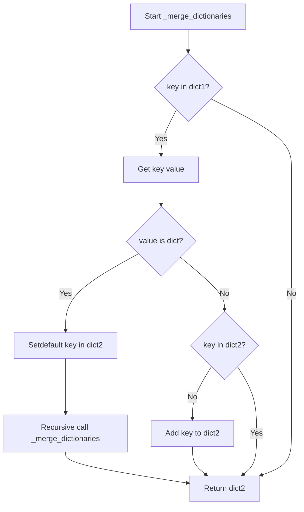

## Examples:
```python
# Basic merge
dict1 = {"a": 1, "b": 2}
dict2 = {"c": 3}
result = _merge_dictionaries(dict1, dict2)
# result = {"a": 1, "b": 2, "c": 3}

# Nested merge
dict1 = {"a": {"x": 1}, "b": 2}
dict2 = {"a": {"y": 2}}
result = _merge_dictionaries(dict1, dict2)
# result = {"a": {"x": 1, "y": 2}, "b": 2}

# Preserve existing keys
dict1 = {"a": 1, "b": 2}
dict2 = {"b": 20, "c": 3}
result = _merge_dictionaries(dict1, dict2)
# result = {"a": 1, "b": 20, "c": 3}
```

## `src.ydata_profiling.config.Dataset` · *class*

## Summary:
Configuration class for storing dataset metadata information including description, creator, author, copyright details, and URL.

## Description:
The Dataset class is a Pydantic BaseModel designed to encapsulate metadata about a dataset. It provides a structured way to store and validate dataset-related information such as descriptive text, creator details, author information, copyright holder and year, and a URL reference. This class serves as a configuration object that can be used throughout the ydata-profiling system to maintain consistent dataset metadata representation.

## State:
- description: str, default ""
  - Stores a textual description of the dataset
  - Valid range: any string value (including empty string)
  - Invariant: Always a string value
- creator: str, default ""
  - Stores the creator or originator of the dataset
  - Valid range: any string value (including empty string)
  - Invariant: Always a string value
- author: str, default ""
  - Stores the author or primary contact for the dataset
  - Valid range: any string value (including empty string)
  - Invariant: Always a string value
- copyright_holder: str, default ""
  - Stores the copyright holder of the dataset
  - Valid range: any string value (including empty string)
  - Invariant: Always a string value
- copyright_year: str, default ""
  - Stores the copyright year of the dataset
  - Valid range: any string value (including empty string)
  - Invariant: Always a string value
- url: str, default ""
  - Stores a URL reference to the dataset
  - Valid range: any string value (including empty string)
  - Invariant: Always a string value

## Lifecycle:
- Creation: Instantiate using standard Pydantic BaseModel construction with optional keyword arguments for each field
- Usage: Access fields directly as attributes; validation occurs automatically during instantiation
- Destruction: Managed by Python's garbage collection; no explicit cleanup required

## Method Map:
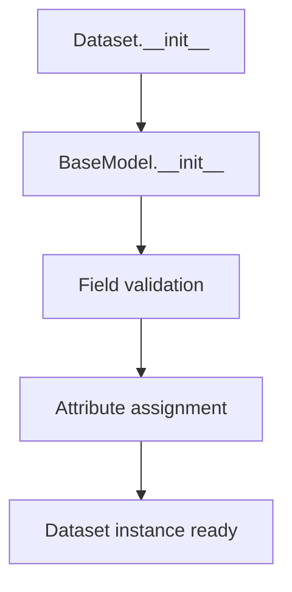

## Raises:
- No explicit exceptions raised by __init__
- Validation errors may occur during instantiation if Pydantic validation fails (inherited from BaseModel)

## Example:
```python
# Create a dataset configuration
dataset_config = Dataset(
    description="Sales data for Q1 2023",
    creator="Data Science Team",
    author="John Doe",
    copyright_holder="Acme Corp",
    copyright_year="2023",
    url="https://example.com/datasets/sales-q1-2023"
)

# Access dataset properties
print(dataset_config.description)  # "Sales data for Q1 2023"
print(dataset_config.author)       # "John Doe"

# Create minimal dataset configuration
minimal_dataset = Dataset()
print(minimal_dataset.description)  # ""
```

## `src.ydata_profiling.config.NumVars` · *class*

## Summary:
Configuration class for numerical variable analysis parameters in data profiling.

## Description:
The NumVars class defines configuration parameters used for analyzing numerical variables in data profiling. It specifies thresholds and quantile settings that control how numerical data is processed and evaluated during statistical analysis. This class is typically instantiated as part of a larger configuration object for data profiling workflows.

## State:
- quantiles: List[float], default=[0.05, 0.25, 0.5, 0.75, 0.95]
  - Valid range: List of floats between 0 and 1 representing quantile percentages
  - Invariant: Must be sorted in ascending order for proper quantile calculation
- skewness_threshold: int, default=20
  - Valid range: Positive integers
  - Invariant: Used to detect extreme skewness in numerical distributions
- low_categorical_threshold: int, default=5
  - Valid range: Non-negative integers
  - Invariant: Threshold to determine when a numerical variable should be treated as categorical
- chi_squared_threshold: float, default=0.999
  - Valid range: Float between 0 and 1
  - Invariant: Threshold for chi-squared statistical test significance

## Lifecycle:
- Creation: Instantiate directly with optional parameter overrides
- Usage: Access attributes for numerical variable analysis configuration
- Destruction: Automatic cleanup via Python garbage collection

## Method Map:
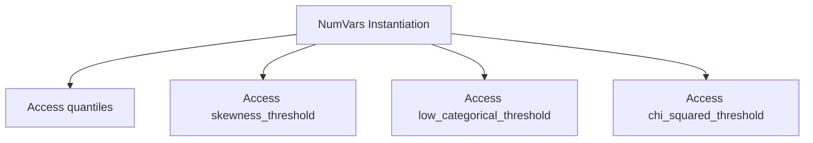

## Raises:
- No explicit exceptions raised during initialization
- Validation errors may occur if invalid values are provided (handled by Pydantic)

## Example:
```python
# Create default configuration
config = NumVars()

# Override specific parameters
custom_config = NumVars(
    quantiles=[0.1, 0.5, 0.9],
    skewness_threshold=15,
    chi_squared_threshold=0.99
)

# Access configuration values
print(config.quantiles)  # [0.05, 0.25, 0.5, 0.75, 0.95]
print(custom_config.skewness_threshold)  # 15
```

## `src.ydata_profiling.config.TextVars` · *class*

## Summary:
Configuration class for text variable analysis settings.

## Description:
TextVars is a Pydantic-based configuration class that defines which text analysis features should be enabled. It is used to control the computation of various text statistics such as length, word count, character count, and redaction options.

## State:
- length: bool = True - Enables/disables calculation of text length
- words: bool = True - Enables/disables calculation of word count  
- characters: bool = True - Enables/disables calculation of character count
- redact: bool = False - Enables/disables text redaction functionality

All attributes are boolean flags with default values set to enable core text analysis features while keeping redaction disabled by default.

## Lifecycle:
- Creation: Instantiate with optional keyword arguments to override defaults
- Usage: Access attributes directly to check configuration state
- Destruction: Managed automatically by Python garbage collection

## Method Map:
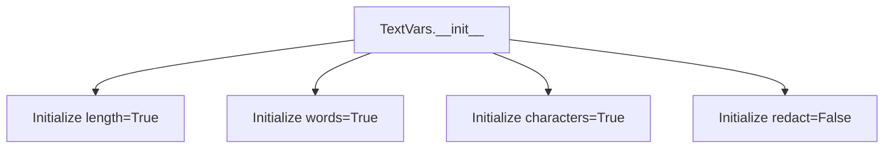

## Raises:
No exceptions are raised during initialization as all fields have default values and are boolean type.

## Example:
```python
# Create default configuration
config = TextVars()

# Create custom configuration
custom_config = TextVars(length=False, redact=True)

# Check configuration
print(config.length)  # True
print(custom_config.redact)  # True
```

## `src.ydata_profiling.config.CatVars` · *class*

## Summary:
Configuration class for categorical variable analysis settings in data profiling.

## Description:
CatVars is a Pydantic BaseModel that defines configurable parameters for analyzing categorical variables in data profiling. It controls various aspects of how categorical data is processed, including feature extraction options, thresholds for cardinality and imbalance detection, and visualization parameters. This class is typically instantiated by the profiling system to configure categorical variable analysis behavior.

## State:
- length: bool = True - Whether to compute string length statistics for categorical variables
- characters: bool = True - Whether to extract character-level features from categorical variables  
- words: bool = True - Whether to extract word-level features from categorical variables
- cardinality_threshold: int = 50 - Threshold for determining high cardinality categorical variables
- percentage_cat_threshold: float = 0.5 - Threshold for percentage of categorical values to consider a variable as predominantly categorical
- imbalance_threshold: float = 0.5 - Threshold for detecting class imbalance in categorical variables
- n_obs: int = 5 - Minimum number of observations required for statistical analysis
- chi_squared_threshold: float = 0.999 - Chi-squared test threshold for statistical significance
- coerce_str_to_date: bool = False - Whether to attempt conversion of string values to dates
- redact: bool = False - Whether to redact sensitive information in categorical variables
- histogram_largest: int = 50 - Maximum number of categories to display in histograms
- stop_words: List[str] = [] - List of words to exclude from analysis

## Lifecycle:
- Creation: Instantiate with optional keyword arguments to override defaults
- Usage: Used as a configuration object passed to categorical analysis functions
- Destruction: Automatic cleanup via Python garbage collection

## Method Map:
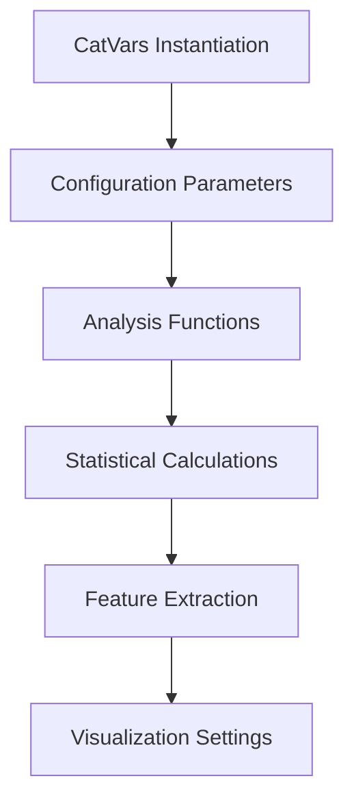

## Raises:
- ValidationError: Raised by Pydantic during initialization if validation fails (e.g., invalid types)

## Example:
```python
# Create default configuration
config = CatVars()

# Create custom configuration
custom_config = CatVars(
    cardinality_threshold=100,
    chi_squared_threshold=0.95,
    redact=True
)

# Use in analysis
# analysis_function(categorical_config=config)
```

## `src.ydata_profiling.config.BoolVars` · *class*

## Summary:
Configuration class for boolean-related variables and mappings used in data profiling.

## Description:
BoolVars is a Pydantic BaseModel subclass that provides configuration settings for boolean handling in the ydata-profiling library. It stores parameters related to observation counts, imbalance thresholds, and string-to-boolean mappings that are commonly used throughout the profiling process.

This class serves as a centralized configuration container for boolean-related settings, making it easier to manage and pass these parameters through various components of the profiling pipeline.

## State:
- n_obs: int = 3
  - Type: int
  - Valid range: Any positive integer
  - Purpose: Number of observations threshold for certain operations
- imbalance_threshold: float = 0.5
  - Type: float
  - Valid range: 0.0 to 1.0 (inclusive)
  - Purpose: Threshold for detecting class imbalance in categorical data
- mappings: Dict[str, bool] = {"t": True, "f": False, "yes": True, "no": False, "y": True, "n": False, "true": True, "false": False}
  - Type: Dict[str, bool]
  - Valid keys: String representations of boolean values
  - Valid values: Boolean True or False
  - Purpose: Mapping of string representations to their boolean equivalents

## Lifecycle:
- Creation: Instantiate directly with optional field overrides
- Usage: Access fields as attributes; typically used as a configuration object passed to various profiling components
- Destruction: Managed automatically by Python's garbage collection

## Method Map:
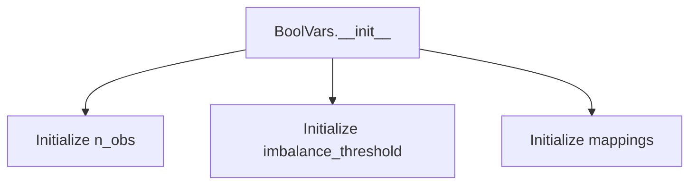

## Raises:
- No explicit exceptions raised during initialization
- Pydantic validation may raise ValidationError if invalid values are provided during instantiation

## Example:
```python
# Create default configuration
config = BoolVars()

# Access configuration values
print(config.n_obs)  # Output: 3
print(config.imbalance_threshold)  # Output: 0.5
print(config.mappings)  # Output: {'t': True, 'f': False, ...}

# Override defaults
custom_config = BoolVars(n_obs=5, imbalance_threshold=0.7)
```

## `src.ydata_profiling.config.FileVars` · *class*

## Summary:
Configuration class for managing file-related variables, specifically tracking whether file operations are active.

## Description:
The FileVars class serves as a configuration container for file operation settings. It provides a structured way to manage file-related flags within the ydata-profiling system. This class is typically used to control whether certain file processing operations should be enabled or disabled, with a default setting of inactive (active=False).

## State:
- active: bool, default=False
  - Controls whether file operations are currently active
  - Valid values: True or False
  - When True, file processing features are enabled
  - When False, file processing features are disabled

## Lifecycle:
- Creation: Instantiate with optional active parameter (defaults to False)
- Usage: Access the active attribute to determine file operation status
- Destruction: Managed automatically by Python's garbage collection

## Method Map:
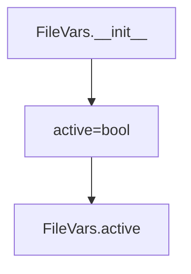

## Raises:
- No exceptions are raised during initialization as this is a simple Pydantic model with a default value

## Example:
```python
# Create a new FileVars instance with default settings
file_config = FileVars()

# Check if file operations are active
if file_config.active:
    # Perform file operations
    pass

# Create a FileVars instance with active operations
file_config_active = FileVars(active=True)
```

## `src.ydata_profiling.config.PathVars` · *class*

## Summary:
Represents a configuration flag for enabling or disabling path-related functionality in the profiling system.

## Description:
The PathVars class serves as a configuration parameter that controls whether path-related operations are active within the ydata profiling framework. It is designed to be part of a larger configuration hierarchy, likely used to enable/disable specific path handling behaviors such as file system operations, path validation, or path-based feature extraction.

This class follows the pattern of Pydantic configuration models, providing structured configuration with type safety and validation capabilities.

## State:
- active: bool
  - Type: boolean
  - Default value: False
  - Valid values: True or False
  - Purpose: Controls activation state of path-related features
  - Invariant: This is a simple configuration flag with no complex invariants

## Lifecycle:
- Creation: Instantiate with optional 'active' parameter (defaults to False)
- Usage: Typically accessed as part of a larger configuration object
- Destruction: Managed automatically by Python's garbage collection

## Method Map:
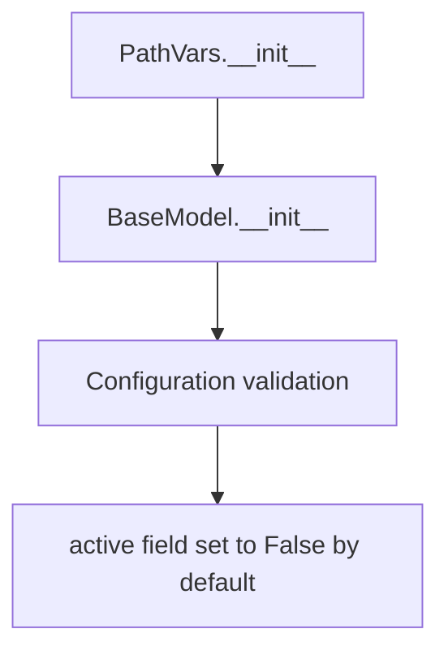

## Raises:
- No explicit exceptions raised by __init__
- Validation errors may occur during instantiation if invalid values are provided (inherited from BaseModel)

## Example:
```python
# Create instance with default settings
path_config = PathVars()

# Create instance with explicit activation
path_config = PathVars(active=True)

# Access the configuration
if path_config.active:
    # Enable path-related operations
    pass
```

## `src.ydata_profiling.config.ImageVars` · *class*

## Summary:
Configuration class for image-related variables in profiling reports.

## Description:
The ImageVars class defines a set of boolean flags that control various aspects of image processing and analysis within profiling configurations. It serves as a structured way to enable or disable specific image-related features such as EXIF data extraction and image hashing.

This class is typically instantiated as part of a larger configuration object and is used internally by profiling tools to determine which image analysis features should be activated during report generation.

## State:
- active: bool = False
  - Controls whether image processing is enabled
  - Valid values: True or False
  - Default value: False
- exif: bool = True
  - Controls whether EXIF metadata extraction is enabled
  - Valid values: True or False
  - Default value: True
- hash: bool = True
  - Controls whether image hashing is enabled
  - Valid values: True or False
  - Default value: True

All fields are boolean flags with no additional constraints or invariants.

## Lifecycle:
- Creation: Instantiate directly with optional keyword arguments for field values
- Usage: Access field values as attributes after instantiation
- Destruction: Managed automatically by Python's garbage collection

## Method Map:
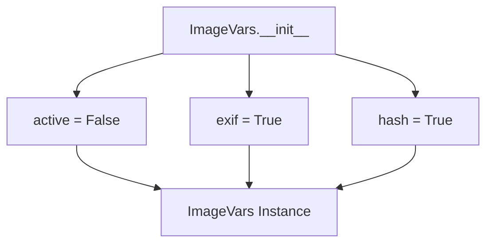

## Raises:
No exceptions are raised during initialization as this is a simple Pydantic model with default values for all fields.

## Example:
```python
# Create instance with default values
image_config = ImageVars()

# Create instance with custom values
image_config = ImageVars(active=True, exif=False, hash=True)

# Access field values
print(image_config.active)  # False
print(image_config.exif)    # True
print(image_config.hash)    # True
```

## `src.ydata_profiling.config.UrlVars` · *class*

## Summary:
Configuration class for URL variable settings in profiling reports.

## Description:
The UrlVars class is a Pydantic BaseModel that manages URL-related configuration settings. It provides a structured approach to handle boolean flags related to URL activation in profiling reports. This class follows the pattern of configuration classes in the ydata-profiling library, allowing for easy serialization, validation, and management of URL-related settings.

## State:
- active: bool - Boolean flag indicating whether URLs should be activated. Defaults to False.
  - Type: bool
  - Default value: False
  - Valid values: True or False
  - Constraints: No validation constraints beyond standard boolean type

## Lifecycle:
- Creation: Instantiate with optional active parameter (defaults to False)
- Usage: Typically accessed as part of a configuration hierarchy for profiling operations
- Destruction: Managed automatically by Python's garbage collection

## Method Map:
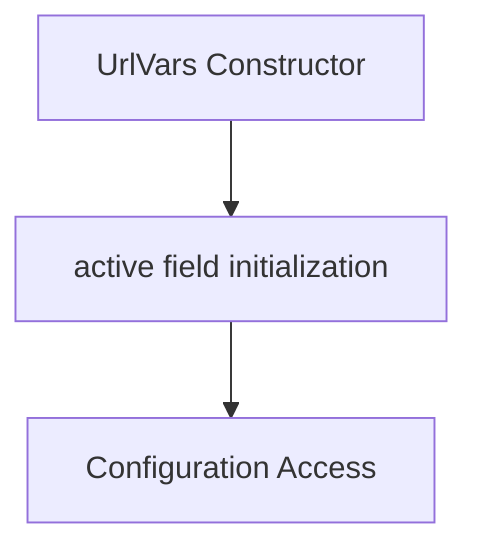

## Raises:
- No exceptions are raised during instantiation as this is a simple Pydantic model with a basic field

## Example:
```python
# Create UrlVars instance with default settings
url_config = UrlVars()

# Create UrlVars instance with active URLs
url_config = UrlVars(active=True)

# Access the active setting
print(url_config.active)  # Output: True

# Serialize to dict
config_dict = url_config.dict()  # {'active': True}
```

## `src.ydata_profiling.config.TimeseriesVars` · *class*

## Summary:
Configuration class for time series analysis parameters in ydata-profiling.

## Description:
TimeseriesVars is a Pydantic BaseModel that encapsulates configuration parameters for time series data analysis. This class defines various settings that control how time series data is processed and analyzed, including activation flags, sorting options, autocorrelation thresholds, lag specifications, and statistical significance levels. It serves as a centralized configuration object for time series-specific profiling operations.

## State:
- active: bool, default=False - Flag indicating whether time series analysis is enabled
- sortby: Optional[str], default=None - Column name to sort time series data by
- autocorrelation: float, default=0.7 - Threshold for autocorrelation analysis
- lags: List[int], default=[1, 7, 12, 24, 30] - List of lag periods to analyze
- significance: float, default=0.05 - Statistical significance threshold for tests
- pacf_acf_lag: int, default=100 - Maximum lag for partial autocorrelation and autocorrelation functions

## Lifecycle:
Creation: Instantiate with optional keyword arguments to override defaults
Usage: Typically accessed as part of a larger configuration object during profiling operations
Destruction: Managed automatically by Python's garbage collection

## Method Map:
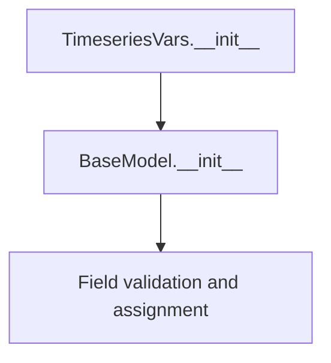

## Raises:
- ValidationError: Raised by Pydantic during initialization if field values don't meet validation requirements

## Example:
```python
# Create default configuration
config = TimeseriesVars()

# Create with custom settings
custom_config = TimeseriesVars(
    active=True,
    sortby="timestamp",
    autocorrelation=0.8,
    lags=[1, 2, 3, 7, 14],
    significance=0.01
)
```

## `src.ydata_profiling.config.Univariate` · *class*

## Summary:
Configuration class that aggregates variable-specific settings for univariate data analysis in profiling reports.

## Description:
The Univariate class serves as a centralized configuration container that groups various variable type-specific settings used in univariate data analysis. It acts as a composite configuration object that brings together specialized configuration classes for different data types (numerical, text, categorical, image, boolean, path, file, URL, and time series variables). This class enables users to configure analysis parameters for different variable types through a unified interface.

## State:
- num: NumVars = NumVars()
  - Type: NumVars
  - Purpose: Configuration for numerical variable analysis
- text: TextVars = TextVars()
  - Type: TextVars
  - Purpose: Configuration for text variable analysis
- cat: CatVars = CatVars()
  - Type: CatVars
  - Purpose: Configuration for categorical variable analysis
- image: ImageVars = ImageVars()
  - Type: ImageVars
  - Purpose: Configuration for image variable analysis
- bool: BoolVars = BoolVars()
  - Type: BoolVars
  - Purpose: Configuration for boolean variable analysis
- path: PathVars = PathVars()
  - Type: PathVars
  - Purpose: Configuration for path variable analysis
- file: FileVars = FileVars()
  - Type: FileVars
  - Purpose: Configuration for file variable analysis
- url: UrlVars = UrlVars()
  - Type: UrlVars
  - Purpose: Configuration for URL variable analysis
- timeseries: TimeseriesVars = TimeseriesVars()
  - Type: TimeseriesVars
  - Purpose: Configuration for time series variable analysis

## Lifecycle:
- Creation: Instantiate directly with optional keyword arguments to override default configuration objects
- Usage: Access individual configuration objects through their respective attributes for configuring specific variable types
- Destruction: Managed automatically by Python's garbage collection

## Method Map:
```mermaid
graph TD
    A[Univariate.__init__] --> B[Initialize num=NumVars()]
    A --> C[Initialize text=TextVars()]
    A --> D[Initialize cat=CatVars()]
    A --> E[Initialize image=ImageVars()]
    A --> F[Initialize bool=BoolVars()]
    A --> G[Initialize path=PathVars()]
    A --> H[Initialize file=FileVars()]
    A --> I[Initialize url=UrlVars()]
    A --> J[Initialize timeseries=TimeseriesVars()]
    B --> K[Univariate Instance]
    C --> K
    D --> K
    E --> K
    F --> K
    G --> K
    H --> K
    I --> K
    J --> K
```

## Raises:
- ValidationError: May be raised by Pydantic during initialization if any of the nested configuration objects fail validation
- No explicit exceptions are raised directly by Univariate.__init__ as all fields have default values

## Example:
```python
# Create default univariate configuration
univariate_config = Univariate()

# Access specific variable type configurations
num_config = univariate_config.num  # Get numerical config
text_config = univariate_config.text  # Get text config

# Modify specific configuration
univariate_config.num.quantiles = [0.1, 0.5, 0.9]

# Create with custom configurations
custom_univariate = Univariate(
    num=NumVars(quantiles=[0.25, 0.75]),
    text=TextVars(length=False)
)
```

## `src.ydata_profiling.config.MissingPlot` · *class*

## Summary:
Configuration class for missing data plot settings in ydata-profiling.

## Description:
The MissingPlot class defines configuration parameters for visualizing missing data patterns in datasets. It is used to customize the appearance and behavior of missing data plots, particularly controlling label display and color mapping. This class is typically instantiated as part of a larger configuration object for profiling reports.

## State:
- force_labels: bool, default=True
  - Controls whether axis labels are displayed on missing data plots
  - Valid values: True or False
  - When True, labels are always shown; when False, labels may be omitted for cleaner visuals
- cmap: str, default="RdBu"
  - Specifies the matplotlib colormap used for displaying missing data patterns
  - Valid values: String representing a matplotlib colormap name
  - Default "RdBu" provides a diverging color scheme suitable for highlighting missing vs. present data

## Lifecycle:
- Creation: Instantiate directly with optional keyword arguments for force_labels and cmap
- Usage: Typically accessed as an attribute of a parent configuration object
- Destruction: No special cleanup required; follows standard Python garbage collection

## Method Map:
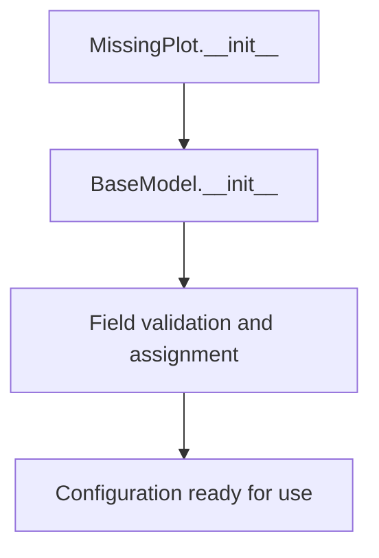

## Raises:
- ValidationError: May be raised by Pydantic during field validation if invalid values are provided (though defaults prevent this)

## Example:
```python
# Create default configuration
missing_config = MissingPlot()

# Create custom configuration
custom_missing_config = MissingPlot(force_labels=False, cmap="Blues")

# Access configuration values
print(missing_config.force_labels)  # True
print(missing_config.cmap)          # "RdBu"
```

## `src.ydata_profiling.config.ImageType` · *class*

## Summary:
Represents supported image output formats for profiling visualizations.

## Description:
An enumeration defining the supported image formats that can be used for generating profiling visualizations. This enum is used throughout the ydata-profiling library to specify the desired output format for generated images such as charts and plots.

## State:
- `svg` (str): SVG image format identifier
- `png` (str): PNG image format identifier

## Lifecycle:
- Creation: Instantiated automatically when referenced as an enum member
- Usage: Used as an argument to functions or methods that require image format specification
- Destruction: Managed automatically by Python's garbage collection

## Method Map:
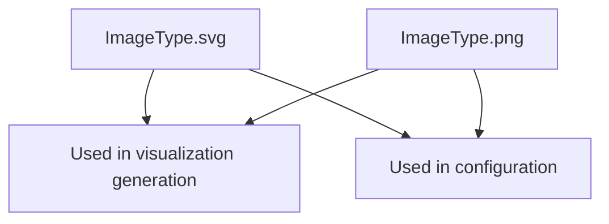

## Raises:
- No exceptions raised during initialization as this is a simple enum

## Example:
```python
from src.ydata_profiling.config import ImageType

# Specify image format for visualization
format_type = ImageType.svg  # or ImageType.png

# Use in configuration context
config = {
    "image_format": format_type.value  # Returns "svg" or "png"
}
```

## `src.ydata_profiling.config.CorrelationPlot` · *class*

## Summary:
Configuration class for correlation plot styling parameters.

## Description:
The CorrelationPlot class defines styling parameters for correlation heatmaps, specifically controlling color mapping and handling of invalid data values. This class is typically used as part of a larger configuration object to customize the visual appearance of correlation plots in data profiling reports.

## State:
- cmap: str, default="RdBu" - Color map name for the correlation heatmap
- bad: str, default="#000000" - Color code for invalid/missing data values in the correlation plot

## Lifecycle:
- Creation: Instantiate with optional custom color map and bad value colors
- Usage: Used as a configuration object within larger profiling configurations
- Destruction: Managed automatically by Python's garbage collection

## Method Map:
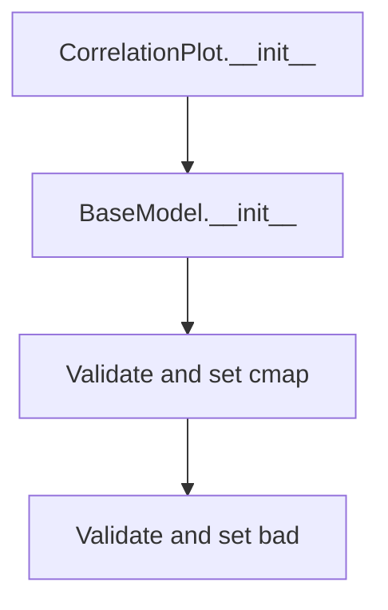

## Raises:
- ValidationError: When invalid values are provided for cmap or bad parameters (inherited from Pydantic BaseModel validation)

## Example:
```python
# Create default correlation plot configuration
config = CorrelationPlot()

# Create custom correlation plot configuration
custom_config = CorrelationPlot(cmap="viridis", bad="#FF0000")

# Access configuration values
print(config.cmap)  # Output: "RdBu"
print(config.bad)   # Output: "#000000"
```

## `src.ydata_profiling.config.Histogram` · *class*

## Summary:
Configuration class for histogram visualization settings.

## Description:
The Histogram class defines configuration parameters for creating histograms in data profiling reports. It specifies bin count, maximum bins allowed, axis label visibility, and density calculation options. This class is typically instantiated as part of a larger configuration object and used by visualization components to render histograms with consistent settings.

## State:
- bins: int = 50
  - Type: int
  - Valid range: positive integers (typically 1-1000)
  - Purpose: Number of bins to use for histogram calculation
- max_bins: int = 250
  - Type: int
  - Valid range: positive integers (typically 1-1000)
  - Purpose: Maximum number of bins allowed for histogram calculation
- x_axis_labels: bool = True
  - Type: bool
  - Valid values: True or False
  - Purpose: Whether to display x-axis labels on the histogram
- density: bool = False
  - Type: bool
  - Valid values: True or False
  - Purpose: Whether to normalize the histogram to form a probability density

## Lifecycle:
- Creation: Instantiate directly with optional keyword arguments for any field
- Usage: Used as a configuration object by visualization components that require histogram settings
- Destruction: No special cleanup required; follows standard Python garbage collection

## Method Map:
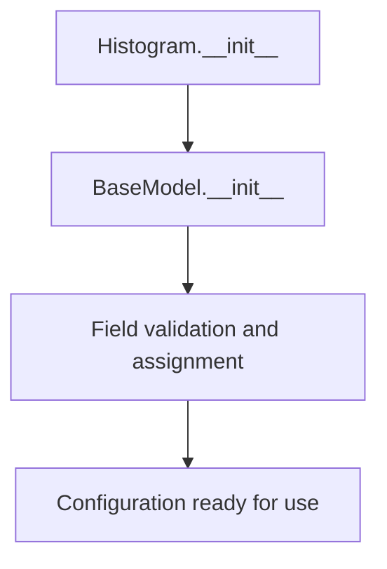

## Raises:
- ValidationError: May be raised by Pydantic's BaseModel validation if invalid values are provided for fields (though defaults prevent this in normal usage)

## Example:
```python
from src.ydata_profiling.config import Histogram

# Create default histogram configuration
hist_config = Histogram()

# Create custom histogram configuration
custom_hist = Histogram(bins=100, max_bins=500, x_axis_labels=False)

# Access configuration values
print(hist_config.bins)  # Output: 50
print(custom_hist.density)  # Output: False
```

## `src.ydata_profiling.config.CatFrequencyPlot` · *class*

## Summary:
Configuration class for category frequency plot settings in data profiling.

## Description:
The CatFrequencyPlot class defines configuration parameters for rendering category frequency plots in data profiling reports. It controls whether category frequency plots are displayed, what visualization type to use (bar or pie charts), the maximum number of unique categories to show, and custom color schemes.

This class is typically instantiated by the profiling system when configuring report generation settings, particularly for categorical data analysis sections.

## State:
- show: bool, default=True
  - Controls whether the category frequency plot is displayed
  - Valid values: True or False
  - When False, the category frequency plot is turned off
- type: str, default="bar"
  - Specifies the visualization type for category frequency plots
  - Valid values: "bar" or "pie"
  - Options: 'bar', 'pie'
- max_unique: int, default=10
  - Maximum number of unique categories to display in the plot
  - Valid range: positive integers
  - Controls data aggregation for large categorical datasets
- colors: Optional[List[str]], default=None
  - Custom color scheme for the plot elements
  - Valid values: List of color strings (e.g., ['#FF0000', '#00FF00'])
  - When None, uses default color scheme

## Lifecycle:
- Creation: Instantiate with optional configuration parameters
- Usage: Used by profiling system to determine category frequency plot rendering behavior
- Destruction: No special cleanup required; standard Python object lifecycle applies

## Method Map:
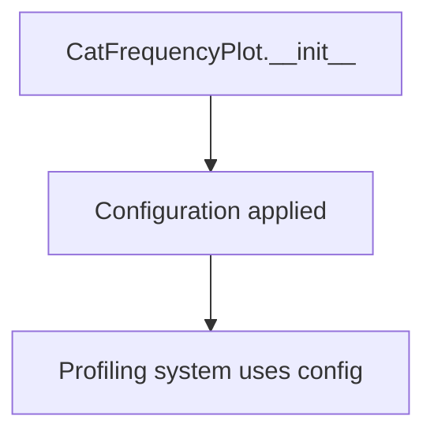

## Raises:
- No explicit exceptions raised by __init__
- Validation occurs automatically through Pydantic field validation

## Example:
```python
# Create default configuration
config = CatFrequencyPlot()

# Create custom configuration
custom_config = CatFrequencyPlot(
    show=True,
    type="pie",
    max_unique=15,
    colors=["#FF0000", "#00FF00", "#0000FF"]
)

# Disable category frequency plots
disabled_config = CatFrequencyPlot(show=False)
```

## `src.ydata_profiling.config.Plot` · *class*

## Summary:
Configuration class for plot generation settings in ydata-profiling reports.

## Description:
The Plot class defines configuration parameters for generating visualizations in data profiling reports. It aggregates multiple specialized configuration objects that control specific aspects of plot generation including missing data visualization, correlation heatmaps, histogram settings, and general image formatting. This class provides a centralized configuration interface for all plot-related parameters in the profiling system.

## State:
- missing: MissingPlot, default=MissingPlot()
  - Configuration for missing data plot settings
  - Controls label display and color mapping for missing data visualizations
- image_format: ImageType, default=ImageType.svg
  - Specifies the output format for generated plots
  - Valid values: ImageType.svg or ImageType.png
- correlation: CorrelationPlot, default=CorrelationPlot()
  - Configuration for correlation heatmap styling
  - Controls color mapping and invalid data value handling
- dpi: int, default=800
  - DPI setting for PNG image output
  - Valid range: positive integers (typically 100-3000)
- histogram: Histogram, default=Histogram()
  - Configuration for histogram visualization parameters
  - Controls bin count, maximum bins, axis labels, and density calculation
- scatter_threshold: int, default=1000
  - Threshold for determining when to use scatter plots vs. other visualization methods
  - Valid range: positive integers
- cat_freq: CatFrequencyPlot, default=CatFrequencyPlot()
  - Configuration for category frequency plot settings
  - Controls display options, visualization type, and category limits for categorical data

## Lifecycle:
- Creation: Instantiate directly with optional keyword arguments for any field
- Usage: Typically accessed as part of a larger configuration object during report generation
- Destruction: Managed automatically by Python's garbage collection

## Method Map:
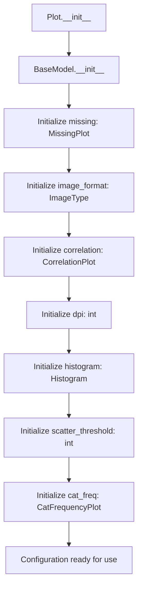

## Raises:
- ValidationError: May be raised by Pydantic's BaseModel validation if invalid values are provided for fields

## Example:
```python
from src.ydata_profiling.config import Plot

# Create default plot configuration
plot_config = Plot()

# Create custom plot configuration
custom_plot_config = Plot(
    image_format="png",
    dpi=300,
    scatter_threshold=500
)

# Access configuration values
print(plot_config.image_format)  # Output: ImageType.svg
print(plot_config.dpi)           # Output: 800
```

## `src.ydata_profiling.config.Theme` · *class*

## Summary:
Represents available CSS themes for web-based data profiling report styling.

## Description:
The Theme enum defines a set of predefined CSS themes that can be applied to data profiling reports generated by the ydata-profiling library. This abstraction provides a type-safe way to specify visual themes for the generated HTML reports, ensuring consistency and preventing invalid theme values.

This class serves as a configuration option for report styling, allowing users to choose from a predefined set of Bootstrap-based themes that enhance the visual presentation of data profiling results.

## State:
- `united` (str): Bootstrap theme name "united" 
- `flatly` (str): Bootstrap theme name "flatly"
- `cosmo` (str): Bootstrap theme name "cosmo"
- `simplex` (str): Bootstrap theme name "simplex"

All enum values are string constants with fixed values matching Bootstrap CSS theme names.

## Lifecycle:
- Creation: Instantiated automatically when referenced; no explicit construction required
- Usage: Used as a type-safe enumeration in configuration objects or function parameters
- Destruction: Managed automatically by Python's garbage collector

## Method Map:
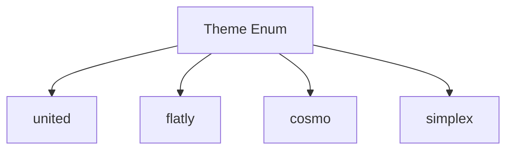

## Raises:
None - This is a simple Enum class with no constructor or initialization logic that could raise exceptions.

## Example:
```python
from src.ydata_profiling.config import Theme

# Using the theme in configuration
theme = Theme.united
print(theme.value)  # Output: "united"

# Valid theme usage
valid_themes = [Theme.united, Theme.flatly, Theme.cosmo, Theme.simplex]
```

## `src.ydata_profiling.config.Style` · *class*

## Summary:
Defines styling configuration for data profiling reports with color schemes, themes, and branding options.

## Description:
The Style class represents a configuration object that manages visual styling parameters for data profiling reports. It provides a structured way to define color palettes, themes, and branding elements that control the appearance of generated HTML reports. This abstraction allows users to customize the visual presentation of profiling results while maintaining type safety and validation through Pydantic's BaseModel.

The class is designed to be used as part of a larger configuration system for the ydata-profiling library, specifically for controlling the visual aspects of generated reports.

## State:
- `primary_colors` (List[str]): A list of color hex codes defining the primary color palette. Default value is ["#377eb8", "#e41a1c", "#4daf4a"]. Must contain at least one color.
- `logo` (str): A string representing the logo path or identifier. Default is empty string.
- `theme` (Optional[Theme]): An optional reference to a predefined CSS theme from the Theme enum. Default is None.
- `_labels` (List[str]): Private attribute containing label definitions. Default value is ["_"].

## Lifecycle:
- Creation: Instantiate using standard Python object construction with optional keyword arguments for configuration
- Usage: Access properties like `primary_color` to retrieve the first color from the palette, or modify attributes as needed
- Destruction: Managed automatically by Python's garbage collection

## Method Map:
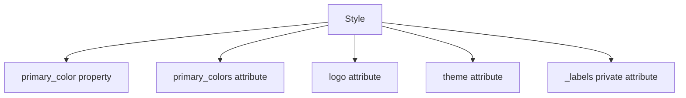

## Raises:
None - The class uses Pydantic's built-in validation which handles type checking and validation internally.

## Example:
```python
from src.ydata_profiling.config import Style, Theme

# Create a style configuration with default values
style = Style()

# Create a style with custom settings
custom_style = Style(
    primary_colors=["#ff0000", "#00ff00", "#0000ff"],
    logo="path/to/logo.png",
    theme=Theme.flatly
)

# Access the primary color (first color in the palette)
primary = style.primary_color  # Returns "#377eb8"

# Modify attributes
style.logo = "new_logo.png"
```

### `src.ydata_profiling.config.Style.primary_color` · *method*

## Summary:
Returns the primary color from the style configuration's color palette.

## Description:
Provides access to the first color in the primary_colors list, which serves as the main accent color for visual elements in the profiling report. This property abstracts access to the color configuration while ensuring consistent color usage throughout the application.

## Args:
    None

## Returns:
    str: The first color string from the primary_colors list, typically used as the main accent color.

## Raises:
    IndexError: If primary_colors list is empty, though this is prevented by the default initialization.

## State Changes:
    Attributes READ: self.primary_colors
    Attributes WRITTEN: None

## Constraints:
    Preconditions: The primary_colors attribute must be initialized as a list with at least one element.
    Postconditions: Returns a valid color string from the configured palette.

## Side Effects:
    None

## `src.ydata_profiling.config.Html` · *class*

## Summary:
Configures HTML report generation settings for data profiling reports.

## Description:
The Html class represents a configuration object that manages settings for generating HTML reports in the ydata-profiling library. It provides a structured way to control various aspects of HTML output including styling, asset handling, and report layout. This abstraction allows users to customize the visual presentation and technical aspects of generated HTML reports while maintaining type safety and validation through Pydantic's BaseModel.

This class is typically used as part of a larger configuration system where it's combined with other configuration objects to define complete reporting behavior.

## State:
- `style` (Style): Configuration object for report styling including color schemes and themes. Defaults to a new Style() instance.
- `navbar_show` (bool): Whether to display the navigation bar in the HTML report. Defaults to True.
- `minify_html` (bool): Whether to minify the generated HTML output. Defaults to True.
- `use_local_assets` (bool): Whether to use local copies of assets instead of CDN references. Defaults to True.
- `inline` (bool): Whether to inline CSS and JavaScript in the HTML output. Defaults to True.
- `assets_prefix` (Optional[str]): Prefix to add to asset URLs. Defaults to None.
- `assets_path` (Optional[str]): Local path to assets directory. Defaults to None.
- `full_width` (bool): Whether to render the report in full width mode. Defaults to False.

## Lifecycle:
- Creation: Instantiate using standard Python object construction with optional keyword arguments for configuration
- Usage: Access configuration properties to control HTML report generation behavior
- Destruction: Managed automatically by Python's garbage collection

## Method Map:
```mermaid
graph TD
    A[Html] --> B[style]
    A --> C[navbar_show]
    A --> D[minify_html]
    A --> E[use_local_assets]
    A --> F[inline]
    A --> G[assets_prefix]
    A --> H[assets_path]
    A --> I[full_width]
```

## Raises:
None - The class uses Pydantic's built-in validation which handles type checking and validation internally.

## Example:
```python
from src.ydata_profiling.config import Html

# Create HTML configuration with default values
html_config = Html()

# Create HTML configuration with custom settings
custom_html = Html(
    navbar_show=False,
    minify_html=False,
    full_width=True
)

# Access configuration properties
print(html_config.navbar_show)  # True
print(custom_html.full_width)   # True
```

## `src.ydata_profiling.config.Duplicates` · *class*

## Summary:
Configuration class for managing duplicate data reporting settings.

## Description:
The Duplicates class defines configuration parameters for handling duplicate records in data profiling. It specifies how many duplicate entries to display and what key label to use for identifying duplicates in reports.

## State:
- head: int = 10
  - Type: integer
  - Valid range: positive integers
  - Purpose: Number of duplicate entries to display in reports
- key: str = "# duplicates"
  - Type: string
  - Valid values: any string value
  - Purpose: Label or identifier used to mark duplicate entries in reports

## Lifecycle:
- Creation: Instantiate with optional head and key parameters
- Usage: Used as a configuration object to store duplicate reporting settings
- Destruction: Managed automatically by Python's garbage collection

## Method Map:
```mermaid
graph TD
    A[Create Duplicates] --> B[Use in profiling]
    B --> C[Access head property]
    B --> D[Access key property]
```

## Raises:
- No exceptions raised during initialization as this is a simple Pydantic model with default values

## Example:
```python
from src.ydata_profiling.config import Duplicates

# Create with defaults
config = Duplicates()

# Create with custom values
custom_config = Duplicates(head=5, key="# dup")

# Access properties
print(config.head)  # Output: 10
print(config.key)   # Output: "# duplicates"
```

## `src.ydata_profiling.config.Correlation` · *class*

## Summary:
Configuration class for correlation analysis settings in data profiling.

## Description:
The Correlation class defines configuration parameters for calculating and analyzing correlations between variables in a dataset. It serves as a settings container that controls various aspects of the correlation computation process, including whether to calculate correlations, the threshold for warning about high correlations, and binning parameters for correlation analysis.

This class is typically instantiated by the main profiling configuration system and used internally by correlation calculation modules to control their behavior.

## State:
- key: str - Identifier for the correlation configuration, defaults to empty string
- calculate: bool - Flag indicating whether to compute correlations, defaults to True
- warn_high_correlations: int - Number of high correlations to warn about, defaults to 10
- threshold: float - Correlation threshold for considering relationships significant, defaults to 0.5
- n_bins: int - Number of bins to use for discretizing continuous variables during correlation calculation, defaults to 10

All fields are public attributes that can be accessed and modified after instantiation. The class maintains consistency through Pydantic's validation mechanisms.

## Lifecycle:
Creation: Instantiate with optional keyword arguments to override defaults
Usage: Access fields directly for configuration purposes; typically used by correlation analysis modules
Destruction: No special cleanup required; follows standard Python object lifecycle

## Method Map:
```mermaid
graph TD
    A[Correlation.__init__] --> B[Field validation]
    B --> C[Attribute assignment]
    C --> D[Object ready for use]
```

## Raises:
- ValidationError: May be raised by Pydantic during initialization if field values don't meet validation requirements (though none are explicitly defined in this class)

## Example:
```python
# Create default correlation configuration
config = Correlation()

# Create custom correlation configuration
custom_config = Correlation(
    key="my_correlation_settings",
    calculate=True,
    warn_high_correlations=5,
    threshold=0.7,
    n_bins=20
)

# Use the configuration
print(config.calculate)  # True
print(custom_config.threshold)  # 0.7
```

## `src.ydata_profiling.config.Correlations` · *class*

## Summary:
Configuration class for managing correlation analysis settings in data profiling.

## Description:
The Correlations class is a Pydantic BaseModel that manages three different correlation calculation methods (Pearson, Spearman, and Auto) for data profiling. It serves as a centralized configuration container that allows users to control how correlations are computed and displayed in the profiling report.

This class is typically instantiated as part of the main profiling configuration system and provides easy access to different correlation calculation strategies through its three predefined attributes.

## State:
- pearson: Correlation - Configuration for Pearson correlation calculations, initialized with key="pearson"
- spearman: Correlation - Configuration for Spearman correlation calculations, initialized with key="spearman"  
- auto: Correlation - Configuration for automatic correlation selection, initialized with key="auto"

All attributes are Correlation objects with their respective keys set. The class inherits validation and serialization capabilities from Pydantic's BaseModel.

## Lifecycle:
Creation: Instantiated automatically as part of the main configuration system; no direct instantiation required by users
Usage: Access individual correlation configurations via dot notation (correlations.pearson, correlations.spearman, correlations.auto)
Destruction: Follows standard Python object lifecycle; no special cleanup required

## Method Map:
```mermaid
graph TD
    A[Correlations.__init__] --> B[Initialize pearson Correlation]
    A --> C[Initialize spearman Correlation]
    A --> D[Initialize auto Correlation]
    B --> E[Object ready for use]
    C --> E
    D --> E
```

## Raises:
- ValidationError: May be raised by Pydantic during initialization if field values don't meet validation requirements (though none are explicitly defined in this class)

## Example:
```python
# Access correlation configurations from main config
from src.ydata_profiling.config import Correlations

# Create correlations configuration (automatically done by main config)
correlations = Correlations()

# Access individual correlation settings
pearson_config = correlations.pearson
spearman_config = correlations.spearman
auto_config = correlations.auto

# Modify individual correlation settings
correlations.pearson.calculate = False
correlations.spearman.threshold = 0.8
```

## `src.ydata_profiling.config.Interactions` · *class*

## Summary:
Configuration class for defining interaction settings in data profiling, specifically controlling continuous variable interactions and target variables.

## Description:
The Interactions class serves as a configuration container that defines how interactions between variables should be handled during data profiling. It controls whether continuous variable interactions are computed and specifies which target variables to consider for interaction analysis. This class is typically instantiated as part of a larger configuration object for data profiling workflows.

## State:
- continuous: bool, default=True
  - Controls whether interactions involving continuous variables should be computed
  - Valid values: True or False
  - When True, continuous variable interactions are enabled
  - When False, continuous variable interactions are disabled

- targets: List[str], default=[]
  - Specifies target variables to consider for interaction analysis
  - Valid values: List of string variable names
  - Empty list means no specific targets are defined
  - When populated, only interactions with these target variables are considered

## Lifecycle:
- Creation: Instantiate with optional parameters for continuous and targets
- Usage: Used as part of a configuration object passed to profiling functions
- Destruction: Managed automatically by Python's garbage collection

## Method Map:
```mermaid
graph TD
    A[Interactions.__init__] --> B[Initialize continuous=bool]
    A --> C[Initialize targets=list]
    B --> D[BaseModel initialization]
    C --> D
```

## Raises:
- No explicit exceptions raised by __init__
- Pydantic validation may raise ValueError for invalid field types during instantiation

## Example:
```python
# Create default configuration
config = Interactions()

# Create custom configuration
config = Interactions(continuous=False, targets=['target1', 'target2'])

# Access configuration values
print(config.continuous)  # True
print(config.targets)     # []
```

## `src.ydata_profiling.config.Samples` · *class*

## Summary:
Configuration class for specifying sample data points to include in profiling reports, defining how many head, tail, and random samples to display.

## Description:
The Samples class is a configuration container that defines how many sample data points should be included in profiling reports. It controls the display of the beginning (head), end (tail), and randomly selected (random) samples from datasets during data analysis. This configuration is typically used in data profiling tools to provide quick insights into dataset structure and content without displaying the entire dataset.

## State:
- head: int, default=10
  - Number of rows to display from the beginning of the dataset
  - Valid range: non-negative integers
- tail: int, default=10  
  - Number of rows to display from the end of the dataset
  - Valid range: non-negative integers
- random: int, default=0
  - Number of random rows to display from the dataset
  - Valid range: non-negative integers

## Lifecycle:
- Creation: Instantiate with optional parameters for head, tail, and random values
- Usage: Typically passed to profiling functions or stored as part of a larger configuration object
- Destruction: Managed automatically by Python's garbage collection

## Method Map:
```mermaid
graph TD
    A[Samples.__init__] --> B[Validate and set head, tail, random]
    B --> C[Samples instance ready for use]
```

## Raises:
- No explicit exceptions raised by __init__
- Pydantic validation may raise ValueError for invalid input types

## Example:
```python
# Create default samples configuration (10 head, 10 tail, 0 random)
samples = Samples()

# Create custom samples configuration
samples = Samples(head=5, tail=5, random=3)

# Access configuration values
print(samples.head)   # Output: 5
print(samples.tail)   # Output: 5
print(samples.random) # Output: 3
```

## `src.ydata_profiling.config.Variables` · *class*

## Summary:
A configuration class for variable descriptions in data profiling, inheriting from Pydantic's BaseModel.

## Description:
The Variables class serves as a configuration container for storing variable descriptions within a data profiling context. It is designed to hold metadata about variables being profiled, specifically mapping variable names to their descriptive information. This class is likely used to customize or extend the profiling behavior for specific variables in datasets.

## State:
- descriptions: dict - A dictionary mapping variable names to their descriptive information. Default value is an empty dictionary {}.

## Lifecycle:
- Creation: Instantiated with optional descriptions dictionary parameter
- Usage: Typically accessed to retrieve or modify variable description mappings
- Destruction: Managed automatically by Python's garbage collection

## Method Map:
```mermaid
graph TD
    A[Variables.__init__] --> B[BaseModel.__init__]
    B --> C[descriptions field set]
```

## Raises:
- No explicit exceptions raised by __init__
- Inherited validation errors from BaseModel if invalid data is provided

## Example:
```python
# Create with default empty descriptions
config = Variables()

# Create with initial descriptions
config = Variables(descriptions={"age": "Age of the person", "income": "Annual income"})

# Access descriptions
print(config.descriptions)  # {"age": "Age of the person", "income": "Annual income"}
```

## `src.ydata_profiling.config.IframeAttribute` · *class*

## Summary:
An enumeration representing HTML iframe attributes for embedding content.

## Description:
This enum defines valid attributes that can be used for configuring iframe elements in HTML documents. It provides a type-safe way to specify iframe attributes such as 'src' (the URL of the page to embed) and 'srcdoc' (the HTML content to display inside the iframe) when generating HTML reports or embedded content.

## State:
- `src` (str): Represents the HTML iframe 'src' attribute, used to specify the URL of the embedded content
- `srcdoc` (str): Represents the HTML iframe 'srcdoc' attribute, used to specify inline HTML content to display inside the iframe

## Lifecycle:
- Creation: Instantiated automatically when referenced as `IframeAttribute.src` or `IframeAttribute.srcdoc`
- Usage: Used as an enumeration value in configuration or rendering logic that handles iframe attributes
- Destruction: Managed by Python's garbage collection

## Method Map:
```mermaid
graph TD
    A[IframeAttribute.src] --> B[Used in HTML generation]
    C[IframeAttribute.srcdoc] --> B
```

## Raises:
No exceptions are raised during instantiation or usage of enum values.

## Example:
```python
from src.ydata_profiling.config import IframeAttribute

# Access enum values
iframe_attr = IframeAttribute.src
print(iframe_attr.value)  # Output: "src"

# Use in configuration context
config_value = IframeAttribute.srcdoc
```

## `src.ydata_profiling.config.Iframe` · *class*

## Summary:
Represents configuration settings for HTML iframe elements used in report embedding.

## Description:
The Iframe class provides a structured way to configure HTML iframe attributes when generating embedded reports or dashboards. It defines dimensions and the attribute type for iframe elements, making it easier to customize how embedded content appears in HTML reports.

This class is typically used in the context of YData Profiling's reporting system where HTML content needs to be embedded within iframes for display in web applications or notebooks.

## State:
- `height` (str): The height dimension of the iframe, defaults to "800px"
- `width` (str): The width dimension of the iframe, defaults to "100%"
- `attribute` (IframeAttribute): The HTML attribute used for iframe content specification, defaults to IframeAttribute.srcdoc

## Lifecycle:
- Creation: Instantiate with optional height, width, and attribute parameters
- Usage: Typically accessed as part of a larger configuration object for report generation
- Destruction: Managed by Python's garbage collection

## Method Map:
```mermaid
graph TD
    A[Iframe.__init__] --> B[Iframe.height]
    A --> C[Iframe.width]
    A --> D[Iframe.attribute]
```

## Raises:
No exceptions are raised during initialization as all parameters have default values.

## Example:
```python
from src.ydata_profiling.config import Iframe, IframeAttribute

# Create iframe with default settings
iframe_config = Iframe()

# Create iframe with custom settings
custom_iframe = Iframe(height="600px", width="50%", attribute=IframeAttribute.src)

# Access iframe properties
print(iframe_config.height)  # Output: "800px"
print(iframe_config.attribute)  # Output: IframeAttribute.srcdoc
```

## `src.ydata_profiling.config.Notebook` · *class*

## Summary:
Represents configuration settings for notebook report embedding using HTML iframes.

## Description:
The Notebook class provides a structured configuration for embedding YData Profiling reports within HTML iframes in notebook environments. It encapsulates iframe-specific settings that control how generated reports appear when displayed in Jupyter notebooks or other web-based development environments.

This class serves as a configuration container that enables customization of iframe dimensions and content attributes for embedded report display. It is typically used internally by the profiling system when generating HTML reports intended for notebook consumption.

## State:
- `iframe` (Iframe): Configuration object for HTML iframe attributes used in report embedding. Defaults to a new Iframe instance with default settings (height="800px", width="100%", attribute=IframeAttribute.srcdoc).

## Lifecycle:
- Creation: Instantiate with optional iframe configuration or use default constructor
- Usage: Typically accessed as part of a larger configuration object during report generation
- Destruction: Managed by Python's garbage collection

## Method Map:
```mermaid
graph TD
    A[Notebook.__init__] --> B[Notebook.iframe]
    B --> C[Iframe.__init__]
```

## Raises:
No exceptions are raised during initialization as all parameters have default values.

## Example:
```python
from src.ydata_profiling.config import Notebook, Iframe

# Create notebook configuration with default iframe settings
notebook_config = Notebook()

# Create notebook configuration with custom iframe
custom_iframe = Iframe(height="600px", width="50%")
notebook_config = Notebook(iframe=custom_iframe)

# Access iframe configuration
print(notebook_config.iframe.height)  # Output: "800px" (default)
print(notebook_config.iframe.width)   # Output: "100%" (default)
```

## `src.ydata_profiling.config.Report` · *class*

## Summary:
Configuration class for report generation settings, controlling numerical precision display.

## Description:
The Report class is a Pydantic BaseModel that defines configuration parameters for report generation. It provides a structured way to specify formatting options for numerical values in generated reports, with precision being the primary configurable setting.

## State:
- precision: int = 8
  - Type: int
  - Default value: 8
  - Purpose: Controls the number of decimal places displayed for numerical values in reports

## Lifecycle:
- Creation: Instantiate with optional precision parameter (defaults to 8)
- Usage: Used as part of configuration objects in the profiling system
- Destruction: Managed automatically by Python's garbage collection

## Method Map:
```mermaid
graph TD
    A[Report.__init__] --> B[BaseModel.__init__]
    B --> C[Validate precision field]
    C --> D[Store configuration]
```

## Raises:
- ValidationError: Raised by Pydantic validation if precision is not a valid integer type

## Example:
```python
from src.ydata_profiling.config import Report

# Create report configuration with default precision
config = Report()

# Create report configuration with custom precision
config = Report(precision=4)

# Access configuration value
print(config.precision)  # Output: 8 (or custom value)
```

## `src.ydata_profiling.config.Settings` · *class*

## Summary
Configuration class that manages all settings for data profiling reports in the ydata-profiling library.

## Description
The Settings class is a Pydantic BaseSettings class that serves as the central configuration container for data profiling operations. It aggregates various configuration objects and parameters that control different aspects of the profiling process, from basic report settings to detailed analysis parameters. This class provides a unified interface for configuring the entire profiling workflow, enabling users to customize report generation, analysis behavior, visualization settings, and data handling parameters.

The class is designed to be easily extensible and maintainable, with nested configuration objects that handle specific aspects of profiling. It supports configuration loading from files and dynamic updates, making it flexible for different use cases and deployment scenarios.

## State
- title: str = "Pandas Profiling Report"
  - Type: str
  - Valid values: Any string
  - Purpose: Title to display on the generated report
  - Invariant: Always a string value

- dataset: Dataset = Dataset()
  - Type: Dataset
  - Purpose: Configuration for dataset metadata including description, creator, author, copyright, and URL
  - Invariant: Always a valid Dataset instance

- variables: Variables = Variables()
  - Type: Variables
  - Purpose: Configuration for variable descriptions and metadata
  - Invariant: Always a valid Variables instance

- infer_dtypes: bool = True
  - Type: bool
  - Valid values: True or False
  - Purpose: Whether to infer data types from the data
  - Invariant: Always a boolean value

- show_variable_description: bool = True
  - Type: bool
  - Valid values: True or False
  - Purpose: Whether to show variable descriptions in the report
  - Invariant: Always a boolean value

- pool_size: int = 0
  - Type: int
  - Valid range: Non-negative integers
  - Purpose: Number of worker processes to use for parallel processing (0 = no parallelization)
  - Invariant: Always a non-negative integer

- progress_bar: bool = True
  - Type: bool
  - Valid values: True or False
  - Purpose: Whether to display a progress bar during analysis
  - Invariant: Always a boolean value

- vars: Univariate = Univariate()
  - Type: Univariate
  - Purpose: Configuration for univariate analysis settings for different variable types
  - Invariant: Always a valid Univariate instance

- sort: Optional[str] = None
  - Type: Optional[str]
  - Valid values: String or None
  - Purpose: Sort order for variables in the report (e.g., "freq", "name")
  - Invariant: Either a string or None

- missing_diagrams: Dict[str, bool] = {"bar": True, "matrix": True, "heatmap": True}
  - Type: Dict[str, bool]
  - Valid keys: "bar", "matrix", "heatmap"
  - Valid values: True or False
  - Purpose: Controls which missing data diagrams to display
  - Invariant: Keys are limited to the specified diagram types

- correlation_table: bool = True
  - Type: bool
  - Valid values: True or False
  - Purpose: Whether to include a correlation table in the report
  - Invariant: Always a boolean value

- correlations: Dict[str, Correlation] = {...}
  - Type: Dict[str, Correlation]
  - Valid keys: "auto", "spearman", "pearson", "phi_k", "cramers", "kendall"
  - Valid values: Correlation instances
  - Purpose: Configuration for different correlation methods, where each key maps to a Correlation configuration object that defines how to compute that specific correlation type
  - Invariant: Keys are limited to the specified correlation types; values are valid Correlation instances

- interactions: Interactions = Interactions()
  - Type: Interactions
  - Purpose: Configuration for interaction analysis settings
  - Invariant: Always a valid Interactions instance

- categorical_maximum_correlation_distinct: int = 100
  - Type: int
  - Valid range: Positive integers
  - Purpose: Maximum number of distinct values for categorical variables to consider for correlation analysis
  - Invariant: Always a positive integer

- memory_deep: bool = False
  - Type: bool
  - Valid values: True or False
  - Purpose: Whether to use deep memory optimization
  - Invariant: Always a boolean value

- plot: Plot = Plot()
  - Type: Plot
  - Purpose: Configuration for plot generation settings
  - Invariant: Always a valid Plot instance

- duplicates: Duplicates = Duplicates()
  - Type: Duplicates
  - Purpose: Configuration for duplicate record reporting
  - Invariant: Always a valid Duplicates instance

- samples: Samples = Samples()
  - Type: Samples
  - Purpose: Configuration for sample data display settings
  - Invariant: Always a valid Samples instance

- reject_variables: bool = True
  - Type: bool
  - Valid values: True or False
  - Purpose: Whether to reject variables that cause issues during analysis
  - Invariant: Always a boolean value

- n_obs_unique: int = 10
  - Type: int
  - Valid range: Non-negative integers
  - Purpose: Number of unique observations to display
  - Invariant: Always a non-negative integer

- n_freq_table_max: int = 10
  - Type: int
  - Valid range: Non-negative integers
  - Purpose: Maximum number of rows to display in frequency tables
  - Invariant: Always a non-negative integer

- n_extreme_obs: int = 10
  - Type: int
  - Valid range: Non-negative integers
  - Purpose: Number of extreme observations to display
  - Invariant: Always a non-negative integer

- report: Report = Report()
  - Type: Report
  - Purpose: Configuration for report formatting and numerical precision
  - Invariant: Always a valid Report instance

- html: Html = Html()
  - Type: Html
  - Purpose: Configuration for HTML report generation
  - Invariant: Always a valid Html instance

- notebook: Notebook = Notebook()
  - Type: Notebook
  - Purpose: Configuration for notebook embedding settings
  - Invariant: Always a valid Notebook instance

## Lifecycle
Creation: Instantiate using standard Python object construction with optional keyword arguments for any field, or use static methods `from_file()` or `update()`. The class inherits from Pydantic BaseSettings, so environment variables prefixed with "profile_" are automatically loaded.

Usage: Access configuration attributes directly for reading settings. Use the `update()` method to create modified copies of the configuration, or use `from_file()` to load configuration from a YAML file.

Destruction: Managed automatically by Python's garbage collection; no explicit cleanup required.

## Method Map
```mermaid
graph TD
    A[Settings.__init__] --> B[BaseSettings.__init__]
    B --> C[Initialize all configuration attributes]
    C --> D[Settings instance ready]
    
    E[Settings.update] --> F[_merge_dictionaries]
    F --> G[Create merged configuration]
    G --> H[Parse merged config into new Settings object]
    H --> I[Return updated Settings object]
    
    J[Settings.from_file] --> K[Open YAML file]
    K --> L[yaml.safe_load]
    L --> M[Settings.parse_obj]
    M --> N[Return parsed Settings object]
```

## Raises
- ValidationError: May be raised by Pydantic's BaseModel validation if invalid values are provided for fields
- FileNotFoundError: Raised by `from_file()` if the specified configuration file does not exist
- yaml.YAMLError: Raised by `from_file()` if the YAML file contains invalid syntax
- TypeError: May occur if invalid types are passed to methods or during configuration updates

## Example
```python
from src.ydata_profiling.config import Settings

# Create default settings
settings = Settings()

# Create settings with custom values
custom_settings = Settings(
    title="My Custom Report",
    infer_dtypes=False,
    pool_size=4
)

# Update settings dynamically
updated_settings = settings.update({"title": "Updated Report Title"})

# Load settings from file
from pathlib import Path
file_settings = Settings.from_file(Path("config.yaml"))

# Access configuration values
print(settings.title)  # "Pandas Profiling Report"
print(settings.pool_size)  # 0
print(settings.report.precision)  # 8
```

## `src.ydata_profiling.config.Config` · *class*

## Summary:
Base configuration class for ydata-profiling that establishes environment variable prefix convention.

## Description:
The Config class serves as a base configuration class for the ydata-profiling library. It is designed to be inherited by more specific configuration classes and provides a standardized way to handle configuration settings with environment variable support. The class defines a default environment variable prefix of "profile_" which is used by Pydantic's BaseSettings to automatically load configuration values from environment variables.

This class establishes a foundational configuration pattern that other configuration classes in the system can extend to provide specific settings while maintaining consistent environment variable handling.

## State:
- `env_prefix` (str): Class attribute set to "profile_" which defines the prefix for environment variables that should be loaded into configuration subclasses. This follows Pydantic's BaseSettings convention.

## Lifecycle:
- Creation: Intended to be subclassed by specific configuration classes rather than instantiated directly. The actual configuration loading happens through Pydantic's BaseSettings mechanism when subclasses are instantiated.
- Usage: Configuration values are accessed as attributes on subclasses that inherit from this base class.
- Destruction: Managed automatically by Python's garbage collection.

## Method Map:
```mermaid
graph TD
    A[Config (Base)] --> B[BaseSettings]
    B --> C[Environment Variable Loading]
    B --> D[Config File Loading]
    B --> E[Direct Instantiation]
    C --> F[profile_* variables]
    D --> F
    E --> F
```

## Raises:
- `pydantic.error_wrappers.ValidationError`: May be raised during instantiation of subclasses if configuration values fail validation.
- `TypeError`: May be raised if invalid types are provided during instantiation of subclasses.

## Example:
```python
from src.ydata_profiling.config import Config

# This class is typically subclassed for specific configurations
class MyConfig(Config):
    title: str = "Default Title"
    max_rows: int = 1000

# Configuration loading happens automatically through BaseSettings
config = MyConfig()  # Loads from environment variables with profile_ prefix
title = config.title  # Accesses configuration value
```

### `src.ydata_profiling.config.Settings.update` · *method*

## Summary:
Updates the configuration settings with new values while preserving existing configurations.

## Description:
Creates a new Settings object by merging the current settings with the provided updates. This method enables partial configuration updates without requiring full object reconstruction. The merge operation preserves existing values in the current settings and only applies updates where new values are provided.

## Args:
    updates (dict): Dictionary containing configuration key-value pairs to update

## Returns:
    Settings: A new Settings instance with updated configuration values

## Raises:
    None

## State Changes:
    Attributes READ: All attributes of the current Settings instance via self.dict()
    Attributes WRITTEN: None (returns new instance rather than modifying self)

## Constraints:
    Preconditions:
    - The updates parameter must be a dictionary
    - All keys in updates must correspond to valid Settings attributes
    - The Settings instance must be properly initialized
    
    Postconditions:
    - Returns a new Settings instance with merged configuration
    - Original Settings instance remains unchanged
    - Configuration values are merged using deep merge strategy

## Side Effects:
    None

### `src.ydata_profiling.config.Settings.from_file` · *method*

## Summary:
Loads configuration settings from a YAML file and returns a new Settings object initialized with those values.

## Description:
This static method provides a convenient way to load profiling configuration from external YAML files. It opens the specified file, parses its YAML content into a Python dictionary, and then uses Pydantic's validation system to construct a Settings object. This approach enables users to maintain configuration separately from their code, making it easier to manage different profiling setups without modifying source code.

The method is typically called during application startup or when initializing a profiling session with predefined configurations. It's particularly useful for sharing configurations between team members or for running profiling jobs with consistent settings.

## Args:
    config_file (Union[Path, str]): Path to the YAML configuration file. Can be either a string path or a pathlib.Path object pointing to a valid YAML file containing configuration data.

## Returns:
    Settings: A new Settings object populated with values from the YAML file. All configuration fields are validated according to their type annotations and default values.

## Raises:
    FileNotFoundError: If the specified config_file does not exist or cannot be opened for reading.
    yaml.YAMLError: If the YAML file contains invalid syntax or cannot be parsed.
    pydantic.ValidationError: If the loaded data does not conform to the expected Settings structure or field types.

## State Changes:
    None: This is a static method that doesn't modify any existing object state. It creates and returns a new Settings instance.

## Constraints:
    Preconditions:
    - The config_file parameter must point to a valid file that exists and is readable
    - The YAML file must contain valid YAML syntax
    - The YAML content must represent a structure compatible with the Settings class schema
    
    Postconditions:
    - Returns a properly validated Settings object with all fields populated
    - All field types conform to their declared annotations
    - Default values are applied for any missing configuration options

## Side Effects:
    I/O operations: Reads from the filesystem to load the YAML configuration file
    Parsing: Processes YAML content into Python data structures
    Validation: Performs Pydantic validation against the Settings schema

## `src.ydata_profiling.config.SparkSettings` · *class*

## Summary:
Configuration class for Spark data profiling that extends base Settings with Spark-specific defaults and overrides.

## Description:
The SparkSettings class is a specialized configuration container designed for profiling data in Apache Spark environments. It inherits from the base Settings class and provides Spark-specific default values and configurations that optimize the profiling process for distributed computing scenarios. This class ensures that profiling operations are appropriately tuned for Spark's distributed architecture while maintaining compatibility with the standard profiling workflow.

SparkSettings is typically used when working with large-scale datasets that require distributed processing capabilities. It overrides several default settings from the base Settings class to better suit Spark's characteristics, such as disabling certain correlation calculations that may not be efficient in distributed environments and adjusting sample configurations.

## State:
- vars: Univariate = Univariate()
  - Type: Univariate
  - Purpose: Configuration for univariate analysis settings for different variable types
  - Default value: Univariate() instance with default settings
  - Note: Specifically sets `vars.num.low_categorical_threshold = 0` to optimize categorical handling in Spark

- infer_dtypes: bool = False
  - Type: bool
  - Valid values: True or False
  - Purpose: Whether to infer data types from the data
  - Default value: False (disabled for Spark to avoid performance overhead)

- correlations: Dict[str, Correlation] = {
    "spearman": Correlation(key="spearman", calculate=True),
    "pearson": Correlation(key="pearson", calculate=True),
  }
  - Type: Dict[str, Correlation]
  - Valid keys: "spearman", "pearson"
  - Valid values: Correlation instances with calculate=True
  - Purpose: Configuration for correlation analysis methods
  - Default value: Dictionary with spearman and pearson correlations enabled

- correlation_table: bool = True
  - Type: bool
  - Valid values: True or False
  - Purpose: Whether to include a correlation table in the report
  - Default value: True

- interactions: Interactions = Interactions()
  - Type: Interactions
  - Purpose: Configuration for interaction analysis settings
  - Default value: Interactions() instance with continuous=True, targets=[]
  - Note: Overrides continuous to False to disable continuous variable interactions in Spark

- missing_diagrams: Dict[str, bool] = {
    "bar": False,
    "matrix": False,
    "dendrogram": False,
    "heatmap": False,
  }
  - Type: Dict[str, bool]
  - Valid keys: "bar", "matrix", "dendrogram", "heatmap"
  - Valid values: True or False
  - Purpose: Controls which missing data diagrams to display
  - Default value: All False to reduce computational overhead in Spark

- samples: Samples = Samples()
  - Type: Samples
  - Purpose: Configuration for sample data display settings
  - Default value: Samples() instance with head=10, tail=10, random=0
  - Note: Overrides tail to 0 and random to 0 to limit sample display in Spark

## Lifecycle:
Creation: Instantiate using standard Python object construction. The class inherits from BaseSettings, so environment variables prefixed with "profile_" are automatically loaded. SparkSettings can also be created by updating a base Settings object.

Usage: Access configuration attributes directly for reading settings. The class is typically used as a configuration object passed to Spark-based profiling functions.

Destruction: Managed automatically by Python's garbage collection; no explicit cleanup required.

## Method Map:
```mermaid
graph TD
    A[SparkSettings.__init__] --> B[BaseSettings.__init__]
    B --> C[Set default values for Spark-specific configurations]
    C --> D[Initialize nested configuration objects]
    D --> E[Apply Spark-specific overrides]
    E --> F[SparkSettings instance ready]
```

## Raises:
- ValidationError: May be raised by Pydantic's BaseModel validation if invalid values are provided for fields
- No explicit exceptions are raised directly by SparkSettings.__init__ due to all fields having default values

## Example:
```python
from src.ydata_profiling.config import SparkSettings

# Create default Spark settings
spark_settings = SparkSettings()

# Create Spark settings with custom values
custom_spark_settings = SparkSettings(
    infer_dtypes=True,
    correlation_table=False
)

# Access configuration values
print(spark_settings.infer_dtypes)  # False
print(spark_settings.correlations["spearman"].calculate)  # True
print(spark_settings.missing_diagrams["bar"])  # False
```

### `src.ydata_profiling.config.Config.get_arg_groups` · *method*

## Summary:
Retrieves and processes argument group configurations for a specified key by normalizing shorthand argument formats.

## Description:
This method serves as a utility for accessing and preprocessing configuration argument groups from the global Config class. It retrieves the argument group associated with the provided key and applies shorthand normalization to ensure consistent argument formatting for downstream processing in the profiling system.

## Args:
    key (str): The configuration key used to lookup argument groups in Config.arg_groups dictionary.

## Returns:
    dict: A dictionary containing normalized shorthand arguments derived from the specified argument group configuration.

## Raises:
    KeyError: When the provided key does not exist in Config.arg_groups dictionary.

## State Changes:
    Attributes READ: 
        - Config.arg_groups
        - Config._shorthands

## Constraints:
    Preconditions:
        - The Config class must be properly initialized with arg_groups and _shorthands attributes
        - The provided key must exist in Config.arg_groups dictionary
    Postconditions:
        - Returns a dictionary with normalized shorthand argument formats
        - Does not modify any global state

## Side Effects:
    None: This method performs no I/O operations or external service calls.

### `src.ydata_profiling.config.Config.shorthands` · *method*

## Summary:
Processes keyword arguments to expand None values using predefined shorthand mappings from Config._shorthands.

## Description:
This utility function expands configuration parameters by replacing None values with shorthand definitions. When a key in kwargs has a value of None and exists in Config._shorthands, the None value is replaced with the corresponding shorthand value. This allows for flexible configuration where users can specify None to trigger automatic expansion of common parameter sets.

## Args:
    kwargs (dict): Dictionary of configuration parameters, where some values may be None
    split (bool): When True, separates shorthand-expanded arguments from remaining arguments; when False, returns all processed arguments

## Returns:
    Tuple[dict, dict]: When split=True, returns (shorthand_args, remaining_kwargs) where shorthand_args contains expanded shorthand values and remaining_kwargs contains the rest of the kwargs. When split=False, returns (shorthand_args, {}) where shorthand_args contains all processed kwargs.

## Raises:
    None explicitly raised

## State Changes:
    Attributes READ: Config._shorthands
    Attributes WRITTEN: None

## Constraints:
    Preconditions: 
    - kwargs must be a dictionary
    - Config._shorthands must be accessible as a dictionary-like object
    - Keys in kwargs that are None and exist in Config._shorthands will be processed
    
    Postconditions:
    - If split=True, shorthand_args will contain keys from kwargs that were None and existed in Config._shorthands
    - If split=True, remaining_kwargs will contain the original kwargs minus the processed keys
    - If split=False, shorthand_args will contain all processed kwargs

## Side Effects:
    None

