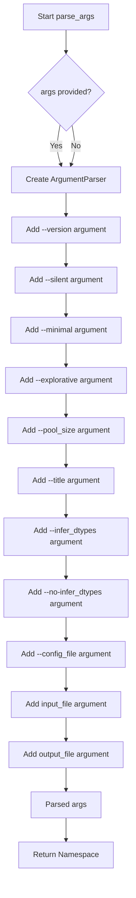
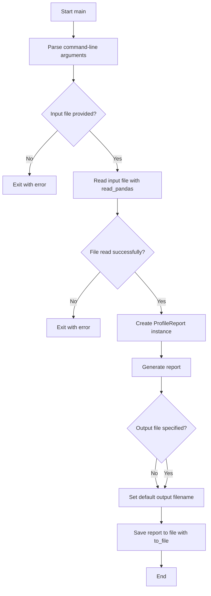

# `console.py`

## `src.ydata_profiling.controller.console.parse_args` · *function*

## Summary:
Parses command-line arguments for the pandas profiling tool to configure report generation settings.

## Description:
Creates and configures an argument parser for the profiling command-line interface, defining available options for report generation including file paths, configuration settings, and reporting modes. This function encapsulates all argument parsing logic to provide a clean interface for command-line interaction with the profiling tool.

## Args:
    args (Optional[List[Any]], optional): Command-line arguments to parse. If None, uses sys.argv. Defaults to None.

## Returns:
    argparse.Namespace: Parsed arguments containing all configured options for report generation.

## Raises:
    SystemExit: When --version flag is provided or when required arguments are missing.

## Constraints:
    Preconditions:
        - Input file must exist and be readable if provided
        - Config file (if specified) must be valid YAML format
        - Pool size must be a non-negative integer
    Postconditions:
        - All arguments are validated according to their specified types
        - Required arguments are present in the returned namespace
        - Default values are applied for unspecified optional arguments

## Side Effects:
    - May print version information and exit when --version flag is provided
    - May print usage information and exit when invalid arguments are provided

## Control Flow:


## Examples:
    # Basic usage with default arguments
    parsed_args = parse_args(['data.csv'])
    
    # Usage with specific options
    parsed_args = parse_args(['-s', '--minimal', '--pool_size', '4', 'data.csv', 'report.html'])
    
    # Usage with configuration file
    parsed_args = parse_args(['--config_file', 'custom_config.yaml', 'data.csv'])
```

## `src.ydata_profiling.controller.console.main` · *function*

## Summary:
Entry point for the command-line interface that generates statistical profiling reports from data files.

## Description:
Processes command-line arguments to configure report generation, reads data from a specified input file, creates a statistical profile report, and saves it to an output file. This function serves as the primary interface for users to generate profiling reports via the command line.

## Args:
    args (Optional[List[Any]], optional): Command-line arguments to parse. If None, uses sys.argv. Defaults to None.

## Returns:
    None: This function does not return any value.

## Raises:
    SystemExit: When --version flag is provided or when required arguments are missing (handled by parse_args).
    FileNotFoundError: When the input file does not exist or cannot be read.
    ValueError: When the input file is empty or contains invalid data.
    Exception: Various exceptions that may occur during file reading or report generation.

## Constraints:
    Preconditions:
        - Input file must exist and be readable
        - Input file must contain valid tabular data that can be loaded by pandas
        - Valid command-line arguments must be provided
    Postconditions:
        - Output file is created with the profiling report
        - Report is saved in either HTML or JSON format based on file extension

## Side Effects:
    - Reads data from the input file
    - Writes output file to disk
    - May print version information or usage help to stderr when --version or invalid arguments are provided
    - May launch browser to display report in Google Colab environment

## Control Flow:


## Examples:
    # Generate report with default settings
    main(['data.csv'])
    
    # Generate report with custom output file
    main(['data.csv', 'report.html'])
    
    # Generate minimal report
    main(['--minimal', 'data.csv'])
    
    # Generate report silently (no progress bar)
    main(['--silent', 'data.csv', 'report.html'])
```

