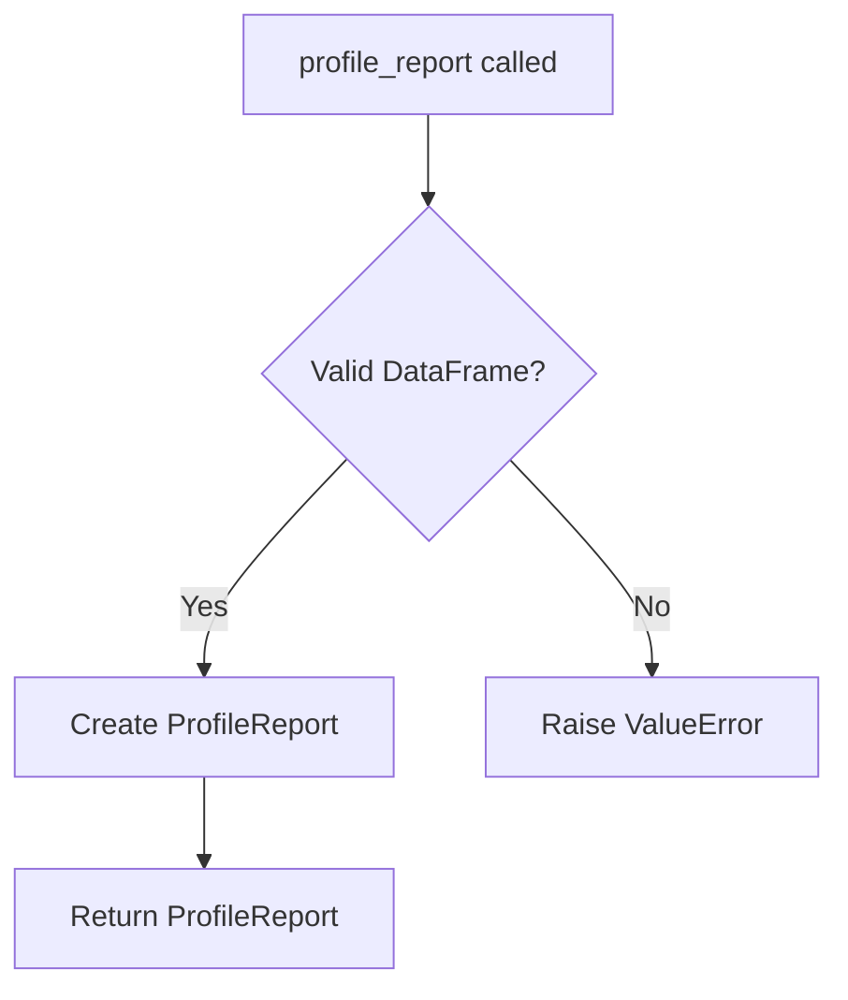

# `pandas_decorator.py`

## `src.ydata_profiling.controller.pandas_decorator.profile_report` · *function*

## Summary:
Creates a ProfileReport object for exploratory data analysis from a pandas DataFrame.

## Description:
This function serves as a factory method for creating ProfileReport instances. It encapsulates the instantiation logic for ProfileReport objects, allowing users to easily generate comprehensive data profiling reports from pandas DataFrames. The function acts as a decorator pattern that enables DataFrame objects to be profiled through a simple function call.

## Args:
    df (DataFrame): A pandas DataFrame containing the data to be profiled.
    **kwargs: Additional keyword arguments passed to the ProfileReport constructor for configuration. These may include settings like minimal, tsmode, sortby, sensitive, explorative, dark_mode, orange_mode, sample, config_file, lazy, typeset, summarizer, config, and type_schema.

## Returns:
    ProfileReport: An instance of ProfileReport configured with the provided DataFrame and optional settings.

## Raises:
    ValueError: Raised by ProfileReport.__init__ when invalid combinations of parameters are provided (e.g., config_file and minimal both specified, or empty DataFrame). Other exceptions may be raised by ProfileReport.__init__ for invalid parameter values.

## Constraints:
    Preconditions:
    - The input df must be a valid pandas DataFrame or None (when lazy=True)
    - If df is provided and not lazy, it must not be empty
    - Config parameters must be compatible (e.g., config_file and minimal are mutually exclusive)
    
    Postconditions:
    - Returns a properly initialized ProfileReport object
    - The returned object contains the original DataFrame and configured settings

## Side Effects:
    None

## Control Flow:


## Examples:
```python
import pandas as pd
from ydata_profiling import profile_report

# Basic usage
df = pd.DataFrame({'A': [1, 2, 3], 'B': [4, 5, 6]})
report = profile_report(df)

# With custom configuration
report = profile_report(df, minimal=True, dark_mode=True)
```

