# `alerts.py`

## `src.ydata_profiling.model.alerts.fmt_percent` · *function*

## Summary:
Formats a floating-point percentage value into a human-readable string representation with special handling for near-zero and near-100% values.

## Description:
This function converts a decimal fraction (0.0 to 1.0) into a percentage string format. It provides special formatting for edge cases where the value is very close to 0% or 100% to improve readability by showing "< 0.1%" for values that round to 0 but are greater than 0, and "> 99.9%" for values that round to 1 but are less than 1. For normal cases, it displays the percentage with one decimal place.

## Args:
    value (float): The decimal fraction to format as a percentage (should be between 0 and 1 inclusive)
    edge_cases (bool): Flag to enable special edge case handling. When True (default), applies special formatting for near-zero and near-100% values. When False, always uses standard formatting.

## Returns:
    str: A formatted percentage string. Possible return values include:
        - "< 0.1%" when edge_cases=True and value rounds to 0 but is > 0
        - "> 99.9%" when edge_cases=True and value rounds to 1 but is < 1  
        - "{value*100:2.1f}%" for normal cases (e.g., "50.0%", "12.3%")

## Raises:
    None explicitly raised

## Constraints:
    Preconditions:
        - value should be a float between 0 and 1 inclusive
        - When edge_cases=True, special rounding logic applies to detect values that round to 0 or 1
    
    Postconditions:
        - Always returns a string ending with "%"
        - For edge_cases=True, returns one of the three specific string formats mentioned above
        - For edge_cases=False, returns a standard formatted percentage string

## Side Effects:
    None

## Control Flow:
```mermaid
flowchart TD
    A[Start fmt_percent] --> B{edge_cases == True?}
    B -- Yes --> C{round(value,3) == 0 AND value > 0?}
    C -- Yes --> D[Return "< 0.1%"]
    C -- No --> E{round(value,3) == 1 AND value < 1?}
    E -- Yes --> F[Return "> 99.9%"]
    E -- No --> G[Return "{value*100:2.1f}%"]
    B -- No --> G
```

## Examples:
    >>> fmt_percent(0.0005)
    '< 0.1%'
    
    >>> fmt_percent(0.9995)
    '> 99.9%'
    
    >>> fmt_percent(0.5)
    '50.0%'
    
    >>> fmt_percent(0.12345, edge_cases=False)
    '12.3%'
```

## `src.ydata_profiling.model.alerts.AlertType` · *class*

## Summary:
Represents a collection of predefined alert types used to categorize data quality issues detected during profiling.

## Description:
AlertType is an enumeration that defines various categories of data quality problems or anomalies that can be identified in datasets during the profiling process. Each enum member corresponds to a specific type of alert that may be generated by the profiling system when it detects problematic patterns in the data.

This enum serves as a standardized way to classify different types of data quality issues, enabling consistent handling and reporting of various data anomalies throughout the profiling pipeline. It provides a clear taxonomy of potential problems such as constant values, duplicates, missing data, correlation issues, and more.

## State:
- Each enum member represents a distinct alert type with no associated data
- All members are created using the `auto()` function which automatically assigns incrementing integer values starting from 1
- The enum values are immutable once defined
- No instance variables or mutable state exists

## Lifecycle:
- Creation: Automatically created at import time when the module loads
- Usage: Used as constants to identify alert types throughout the profiling system
- Destruction: Managed by Python's garbage collector when the module is unloaded

## Method Map:
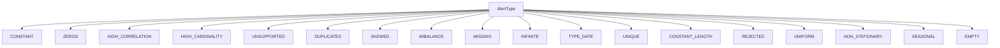

## Raises:
- No exceptions are raised during initialization as this is a simple Enum definition
- All enum members are created at class definition time with no runtime validation

## Example:
```python
from ydata_profiling.model.alerts import AlertType

# Using alert types as constants
alert_type = AlertType.HIGH_CORRELATION
print(alert_type)  # Output: AlertType.HIGH_CORRELATION

# Checking alert type equality
if alert_type == AlertType.HIGH_CORRELATION:
    print("High correlation detected")

# Iterating over all alert types
for alert in AlertType:
    print(alert.name)
```

## `src.ydata_profiling.model.alerts.Alert` · *class*

## Summary:
Represents an alert generated during data profiling, containing information about the type of alert, associated data, and column context.

## Description:
The Alert class encapsulates information about various data quality issues or observations detected during the profiling process. It serves as a standardized way to represent alerts such as high correlation warnings, missing value indicators, or other data anomalies. The class is designed to be instantiated by profiling components when data quality issues are detected and provides methods for formatting and identifying these alerts.

## State:
- fields: Set[str], optional set of field names related to this alert
- alert_type: AlertType, enum representing the type of alert (e.g., HIGH_CORRELATION, MISSING_VALUES)
- values: Dict[str, Any], dictionary containing additional values or metadata specific to the alert type
- column_name: str, optional name of the column this alert relates to
- _is_empty: bool, internal flag indicating if the alert is empty or placeholder

## Lifecycle:
- Creation: Instantiate with alert_type and optional parameters (values, column_name, fields, is_empty)
- Usage: Access properties like alert_type_name and anchor_id, call fmt() for formatted display
- Destruction: No special cleanup required, relies on Python's garbage collection

## Method Map:
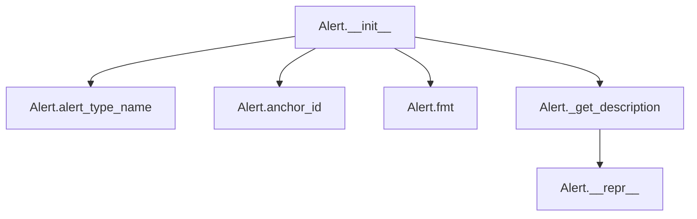

## Raises:
- No explicit exceptions raised in __init__ method

## Example:
```python
# Create an alert for high correlation
alert = Alert(
    alert_type=AlertType.HIGH_CORRELATION,
    values={"fields": ["col1", "col2"], "corr": "positive"},
    column_name="col3"
)

# Format the alert for display
formatted = alert.fmt()  # Returns formatted string with tooltip for high correlation

# Get alert identifier
identifier = alert.anchor_id  # Returns hash-based identifier
```

### `src.ydata_profiling.model.alerts.Alert.__init__` · *method*

## Summary:
Initializes an Alert object with type, values, column name, fields, and empty status flags.

## Description:
The Alert constructor creates a new Alert instance with the specified parameters. This method sets up the core state attributes that define what kind of alert this object represents and its associated metadata. The initialization handles default values for optional parameters and ensures proper data structures are created for internal use.

## Args:
    alert_type (AlertType): The type of alert being created, determining its category and behavior.
    values (Optional[Dict], optional): Additional data associated with the alert, defaults to None.
    column_name (Optional[str], optional): Name of the column this alert relates to, defaults to None.
    fields (Optional[Set], optional): Set of field names related to this alert, defaults to None.
    is_empty (bool, optional): Flag indicating if the alert is empty or not, defaults to False.

## Returns:
    None: This method initializes the object's attributes and does not return a value.

## Raises:
    None: This method does not explicitly raise exceptions.

## State Changes:
    Attributes READ: None
    Attributes WRITTEN: 
        - self.fields: Set of field names related to this alert
        - self.alert_type: The type of alert being created
        - self.values: Additional data associated with the alert
        - self.column_name: Name of the column this alert relates to
        - self._is_empty: Flag indicating if the alert is empty or not

## Constraints:
    Preconditions:
        - alert_type must be a valid AlertType enum value
        - fields must be a set or None
        - values must be a dictionary or None
    Postconditions:
        - self.fields will be a set (empty if fields was None)
        - self.values will be a dictionary (empty if values was None)
        - All other attributes will be assigned their respective parameter values

## Side Effects:
    None: This method performs no I/O operations or external service calls.

### `src.ydata_profiling.model.alerts.Alert.alert_type_name` · *method*

## Summary:
Returns a human-readable title-cased version of the alert type name by converting underscores to spaces and applying title capitalization.

## Description:
Provides a formatted string representation of the alert type that is suitable for display in user interfaces or reports. This property transforms the underlying enum name (which uses uppercase snake_case convention) into a more readable title-cased format with spaces instead of underscores.

The method is used primarily for generating user-friendly labels for alerts during data profiling and reporting. It's part of the Alert class's interface for accessing formatted alert type information.

## Args:
    None: This is a property method that takes no arguments beyond the implicit `self` parameter.

## Returns:
    str: A title-cased string representation of the alert type name where underscores are replaced with spaces and the first letter of each word is capitalized.

## Raises:
    None: This method does not explicitly raise exceptions.

## State Changes:
    Attributes READ: 
    - self.alert_type: Reads the alert_type enum member to access its name attribute
    Attributes WRITTEN: None

## Constraints:
    Preconditions:
    - The Alert instance must be properly initialized with a valid `alert_type` attribute
    - The `alert_type` attribute must be a member of the AlertType enum
    - The enum name attribute must be a valid string
    
    Postconditions:
    - The returned string will be properly formatted with spaces instead of underscores
    - The returned string will be title-cased (first letter of each word capitalized)
    - The method will not modify any instance attributes

## Side Effects:
    None: This method performs no I/O operations or external service calls. It only accesses existing instance attributes and returns a formatted string.

### `src.ydata_profiling.model.alerts.Alert.anchor_id` · *method*

## Summary:
Returns a stable anchor identifier for the alert based on its column name, initializing it lazily if needed.

## Description:
Provides a unique, stable identifier for an alert that can be used for HTML anchors or linking purposes. The anchor ID is computed once and cached in the `_anchor_id` attribute to avoid repeated hashing operations. This method is typically called during report generation to create consistent identifiers for alerts that can be referenced in web interfaces.

## Args:
    None: This method takes no arguments beyond the implicit `self` parameter.

## Returns:
    Optional[str]: A string representation of the hash of the alert's column name, or None if the column name is None. The returned value is cached after the first call.

## Raises:
    None: This method does not explicitly raise exceptions.

## State Changes:
    Attributes READ: 
    - self._anchor_id: Checks if the anchor ID has already been computed
    - self.column_name: Reads the column name to compute the hash
    Attributes WRITTEN: 
    - self._anchor_id: Sets the computed anchor ID for future calls

## Constraints:
    Preconditions:
    - The Alert instance must be properly initialized
    - The `column_name` attribute should be a string or None
    
    Postconditions:
    - The method returns a consistent string identifier for the same column name
    - The `_anchor_id` attribute is set after the first call
    - Subsequent calls return the cached value without recomputing

## Side Effects:
    None: This method performs no I/O operations or external service calls. It only accesses and modifies instance attributes.

### `src.ydata_profiling.model.alerts.Alert.fmt` · *method*

*No documentation generated.*

### `src.ydata_profiling.model.alerts.Alert._get_description` · *method*

## Summary:
Generates a formatted string description of an alert including its type and associated column name.

## Description:
Creates a descriptive string representation of an alert by combining the alert type name and column name. This method is primarily used by the `__repr__` method to provide a human-readable representation of Alert instances during debugging and logging operations.

## Args:
    None: This method takes no arguments beyond the implicit `self` parameter.

## Returns:
    str: A formatted string in the pattern "[ALERT_TYPE] alert on column {column_name}", where ALERT_TYPE is the name of the alert type enum member and column_name is the associated column identifier.

## Raises:
    None: This method does not explicitly raise exceptions.

## State Changes:
    Attributes READ: 
    - self.alert_type: Accesses the alert type enum to retrieve its name
    - self.column_name: Retrieves the column name associated with this alert
    Attributes WRITTEN: None

## Constraints:
    Preconditions:
    - The Alert instance must be properly initialized with valid `alert_type` and `column_name` attributes
    - The `alert_type` attribute must be a member of the AlertType enum
    - The `column_name` attribute should be either a string or None
    
    Postconditions:
    - The returned string follows the format "[ALERT_TYPE] alert on column {column_name}"
    - The method will not modify any instance attributes
    - The returned string will be properly formatted regardless of whether column_name is None

## Side Effects:
    None: This method performs no I/O operations or external service calls. It only accesses existing instance attributes and returns a formatted string.

### `src.ydata_profiling.model.alerts.Alert.__repr__` · *method*

## Summary:
Returns a string representation of the alert by calling the description method.

## Description:
The `__repr__` method provides a human-readable string representation of an Alert instance. It delegates to the `_get_description()` method to generate a formatted description that includes the alert type and column name. This method is automatically called when the object is printed or converted to a string, making it easier to debug and understand alert instances during data profiling.

## Args:
    None: This method takes no arguments beyond the implicit `self` parameter.

## Returns:
    str: A formatted string describing the alert in the format "[ALERT_TYPE] alert on column {column_name}".

## Raises:
    None: This method does not explicitly raise exceptions.

## State Changes:
    Attributes READ: 
    - self.alert_type: Used to get the alert type name for description
    - self.column_name: Used to identify which column this alert relates to
    Attributes WRITTEN: None

## Constraints:
    Preconditions:
    - The Alert instance must be properly initialized with valid alert_type and column_name attributes
    - The `_get_description()` method must be implemented and return a string
    
    Postconditions:
    - The returned string will follow the format "[ALERT_TYPE] alert on column {column_name}"
    - The method will not modify any instance attributes

## Side Effects:
    None: This method performs no I/O operations or external service calls. It only accesses existing instance attributes and returns a formatted string.

## `src.ydata_profiling.model.alerts.ConstantLengthAlert` · *class*

*No documentation generated.*

### `src.ydata_profiling.model.alerts.ConstantLengthAlert.__init__` · *method*

## Summary:
Initializes a ConstantLengthAlert instance that indicates a column has constant length values.

## Description:
This constructor creates an alert indicating that a specific column in a dataset has values of constant length. It inherits from the Alert base class and configures the alert with the appropriate type and field information.

## Args:
    values (Optional[Dict], default=None): Dictionary containing alert-specific data
    column_name (Optional[str], default=None): Name of the column being analyzed
    is_empty (bool, default=False): Flag indicating if the column is empty

## Returns:
    None: This is a constructor method that initializes the object state

## Raises:
    None: This method does not explicitly raise exceptions

## State Changes:
    Attributes READ: None
    Attributes WRITTEN: 
    - self.fields: Set containing {"composition_min_length", "composition_max_length"}
    - self.alert_type: Set to AlertType.CONSTANT_LENGTH
    - self.values: Set to the provided values parameter or empty dict
    - self.column_name: Set to the provided column_name parameter
    - self._is_empty: Set to the provided is_empty parameter

## Constraints:
    Preconditions: 
    - The alert_type parameter must be a valid AlertType enum value
    - Fields parameter must be a set of field names
    Postconditions:
    - The alert instance will have its fields attribute populated with {"composition_min_length", "composition_max_length"}
    - The alert_type will be set to AlertType.CONSTANT_LENGTH

## Side Effects:
    None: This method performs no I/O operations or external service calls

### `src.ydata_profiling.model.alerts.ConstantLengthAlert._get_description` · *method*

## Summary:
Returns a formatted description indicating that a specific column has a constant length.

## Description:
Generates a human-readable description string that identifies a column with constant length values. This method is part of the Alert class hierarchy and is specifically implemented by ConstantLengthAlert to provide a descriptive message about columns where all values have identical lengths.

The method is typically called by higher-level formatting methods like `Alert.fmt()` or `Alert.__repr__()` to generate user-facing descriptions of data quality issues.

## Args:
    None: This method takes no arguments beyond the implicit `self` parameter.

## Returns:
    str: A formatted string in the pattern "[column_name] has a constant length" where column_name is the name of the column being analyzed.

## Raises:
    None: This method does not explicitly raise exceptions.

## State Changes:
    Attributes READ: 
    - self.column_name: Reads the column name to include in the description
    Attributes WRITTEN: None

## Constraints:
    Preconditions:
    - The ConstantLengthAlert instance must be properly initialized with a valid `column_name` attribute
    - The `column_name` attribute should be a string or None
    
    Postconditions:
    - The returned string follows the format "[column_name] has a constant length"
    - The method will not modify any instance attributes

## Side Effects:
    None: This method performs no I/O operations or external service calls. It only accesses existing instance attributes and returns a formatted string.

## `src.ydata_profiling.model.alerts.ConstantAlert` · *class*

## Summary:
Represents an alert for columns with constant values during data profiling.

## Description:
The ConstantAlert class extends the base Alert functionality to specifically identify columns that contain only identical values. This alert type is part of the standard data profiling alert system and provides a mechanism for detecting and reporting constant-value columns in datasets.

## State:
- values: Optional[Dict], dictionary containing additional metadata about the alert
- column_name: Optional[str], name of the column that contains constant values
- _is_empty: bool, internal flag indicating if the alert is empty or placeholder (default: False)
- fields: Set[str], set containing "n_distinct" field indicating the number of distinct values was checked

## Lifecycle:
- Creation: Instantiate with optional values, column_name, and is_empty parameters
- Usage: Call fmt() method to get formatted display string, access alert_type_name property to get alert type name
- Destruction: No special cleanup required, relies on Python's garbage collection

## Method Map:


## Raises:
- No explicit exceptions raised in __init__ method

## Example:
```python
# Create a constant alert for a column named "status"
alert = ConstantAlert(
    values={"constant_value": "active"},
    column_name="status"
)

# Get formatted display string
formatted_alert = alert.fmt()  # Returns "[status] has a constant value"

# Get alert identifier
identifier = alert.anchor_id  # Returns hash-based identifier
```

### `src.ydata_profiling.model.alerts.ConstantAlert.__init__` · *method*

## Summary:
Initializes a ConstantAlert instance to detect columns with constant values during data profiling.

## Description:
Creates a ConstantAlert object that identifies when a dataset column contains only a single unique value. This alert type is used in the data profiling pipeline to flag columns that have no variation, which may indicate data quality issues or uninformative features in machine learning contexts.

The method sets up the alert with the appropriate alert type (CONSTANT), initializes the required fields for analysis, and stores metadata about the column being analyzed.

## Args:
    values (Optional[Dict], default=None): Dictionary containing additional values for the alert, typically including statistical information about the column.
    column_name (Optional[str], default=None): Name of the column being analyzed for constant values.
    is_empty (bool, default=False): Flag indicating whether the column is empty, which affects how the alert is processed.

## Returns:
    None: This method initializes the object's state but does not return a value.

## Raises:
    No explicit exceptions are raised by this method. Any exceptions would originate from the parent Alert.__init__ method if invalid arguments are passed.

## State Changes:
    Attributes READ: No self attributes are read during initialization.
    Attributes WRITTEN: 
    - self.alert_type: Set to AlertType.CONSTANT
    - self.values: Set to the provided values parameter or empty dict
    - self.column_name: Set to the provided column_name parameter
    - self.fields: Set to {"n_distinct"} - the field required for constant value detection
    - self._is_empty: Set to the provided is_empty parameter

## Constraints:
    Preconditions:
    - The alert_type parameter must be a valid AlertType enum member
    - The fields parameter must be a set containing required field names for analysis
    - Values should be a dictionary or None
    - Column name should be a string or None
    
    Postconditions:
    - The alert instance will have alert_type set to AlertType.CONSTANT
    - The fields attribute will contain exactly {"n_distinct"}
    - All provided parameters will be stored in their respective instance attributes

## Side Effects:
    None: This method performs no I/O operations, external service calls, or mutations to objects outside the instance being initialized.

### `src.ydata_profiling.model.alerts.ConstantAlert._get_description` · *method*

## Summary:
Returns a formatted string describing that a column contains a constant value.

## Description:
This method generates a human-readable description indicating that a specific column in the dataset has a constant value across all rows. It is part of the ConstantAlert class which represents alerts for columns with no variation in their data values.

The method is called during the formatting of alerts for display purposes, providing a clear textual representation of the detected issue. This method is specifically designed to be overridden by subclasses to provide type-specific descriptions while maintaining a consistent interface.

## Args:
    None

## Returns:
    str: A formatted string in the pattern "[column_name] has a constant value" where column_name is the name of the column that has constant values.

## Raises:
    None

## State Changes:
    Attributes READ: self.column_name
    Attributes WRITTEN: None

## Constraints:
    Preconditions:
    - The method assumes that self.column_name is properly initialized in the parent Alert class
    - The column_name attribute should contain a valid string representing the column name
    
    Postconditions:
    - The returned string follows a consistent format for all constant value alerts
    - The method always returns a string with the expected pattern

## Side Effects:
    None

## `src.ydata_profiling.model.alerts.DuplicatesAlert` · *class*

## Summary:
Represents an alert specifically for detecting duplicate rows in a dataset during data profiling.

## Description:
The DuplicatesAlert class is a specialized alert type that identifies and reports on duplicate rows within a dataset. It extends the base Alert class to provide specific functionality for handling duplicate detection scenarios. This alert is typically generated by profiling components when they detect that a dataset contains duplicate records, providing both count and percentage information about the duplication.

The alert is particularly useful in data quality assessment, helping analysts understand the extent of data redundancy in their datasets. It's part of the broader alert system that enables consistent identification and reporting of various data quality issues.

## State:
- values: Optional[Dict[str, Any]], dictionary containing duplicate statistics with keys 'n_duplicates' (integer count) and 'p_duplicates' (float percentage between 0 and 1). When None, indicates a general duplicate presence without specific counts.
- column_name: Optional[str], name of the column this alert relates to, or None if the alert applies to the entire dataset
- _is_empty: bool, internal flag indicating if the alert is empty or placeholder, defaults to False

## Lifecycle:
- Creation: Instantiate with optional values dictionary, column_name, and is_empty flag. The alert_type is automatically set to AlertType.DUPLICATES
- Usage: Call the inherited fmt() method to get a formatted display string, or access the description via _get_description() method
- Destruction: No special cleanup required, relies on Python's garbage collection

## Method Map:
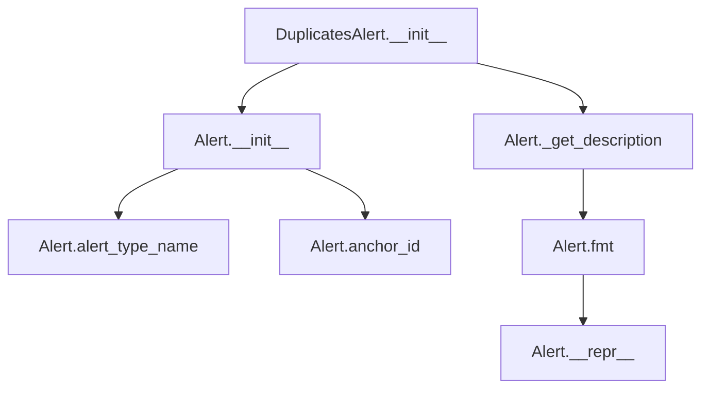

## Raises:
- No explicit exceptions raised during initialization
- Inherits all exception handling from the parent Alert class

## Example:
```python
# Create a duplicates alert with specific counts
alert = DuplicatesAlert(
    values={'n_duplicates': 150, 'p_duplicates': 0.05},  # 150 duplicates (5%)
    column_name='customer_id'
)

# Get formatted description
description = alert._get_description()  # "Dataset has 150 (5.0%) duplicate rows"

# Format for display
formatted_alert = alert.fmt()  # Returns formatted string with tooltip

# Create a general duplicates alert without specific counts
general_alert = DuplicatesAlert(is_empty=True)
description = general_alert._get_description()  # "Dataset has duplicated values"
```

### `src.ydata_profiling.model.alerts.DuplicatesAlert.__init__` · *method*

## Summary:
Initializes a DuplicatesAlert instance to represent duplicate data detection alerts in profiling reports.

## Description:
Creates a new DuplicatesAlert object that identifies and categorizes duplicate data issues in datasets. This method configures the alert with the specific DUPLICATES alert type and establishes the required fields for duplicate counting.

The method is designed as a specialized constructor that sets up the alert with appropriate metadata for duplicate detection, including the field name for duplicate counts and the alert type identifier.

## Args:
    values (Optional[Dict]): Dictionary containing duplicate statistics including 'n_duplicates' and 'p_duplicates'. Defaults to None.
    column_name (Optional[str]): Name of the column being analyzed for duplicates. Defaults to None.
    is_empty (bool): Flag indicating if the dataset is empty. Defaults to False.

## Returns:
    None: This method initializes the object's state and does not return a value.

## Raises:
    No explicit exceptions are raised by this method. Exceptions may occur in the parent Alert.__init__ method if invalid parameters are passed.

## State Changes:
    Attributes READ: None
    Attributes WRITTEN: 
    - self.fields: Set to {"n_duplicates"}
    - self.alert_type: Set to AlertType.DUPLICATES
    - self.values: Set to the provided values parameter or empty dict
    - self.column_name: Set to the provided column_name parameter
    - self._is_empty: Set to the provided is_empty parameter

## Constraints:
    Preconditions:
    - The AlertType enum must be properly initialized
    - The parent Alert class must be available and functional
    - Parameter types must match expected types (Dict for values, str for column_name, bool for is_empty)
    
    Postconditions:
    - The alert instance will have alert_type set to AlertType.DUPLICATES
    - The fields attribute will contain exactly {"n_duplicates"}
    - All provided parameters will be stored in their respective instance attributes

## Side Effects:
    None: This method performs no I/O operations or external service calls. It only initializes object attributes.

### `src.ydata_profiling.model.alerts.DuplicatesAlert._get_description` · *method*

## Summary:
Returns a human-readable description of duplicate row counts in the dataset.

## Description:
This method generates a descriptive string that indicates the number and percentage of duplicate rows found in the dataset. It's used by the alert system to provide meaningful feedback about data duplication issues. The method is called during the formatting of alerts to display information about duplicate rows to users.

This logic is separated into its own method to allow for consistent formatting of duplicate-related alert messages while keeping the alert creation logic separate from presentation logic.

## Args:
    None

## Returns:
    str: A formatted description string. When duplicate values are available, returns a detailed message including count and percentage (e.g., "Dataset has 100 (5.2%) duplicate rows"). When no duplicate values are available, returns a general message (e.g., "Dataset has duplicated values").

## Raises:
    None

## State Changes:
    Attributes READ: 
    - self.values: Dictionary containing duplicate statistics ('n_duplicates', 'p_duplicates')
    - self.alert_type: Enum value indicating the alert type (used by parent class)

## Constraints:
    Preconditions:
    - self.values should either be None or contain keys 'n_duplicates' and 'p_duplicates' when not None
    - The method assumes self.values['p_duplicates'] is a float between 0 and 1

    Postconditions:
    - Always returns a string describing duplicate rows
    - When values are present, the returned string follows the format "Dataset has {count} ({percentage}) duplicate rows"
    - When values are None, returns a generic message about duplicated values

## Side Effects:
    None

## `src.ydata_profiling.model.alerts.EmptyAlert` · *class*

## Summary:
Represents an alert indicating that a dataset is empty, used during data profiling to signal when no data is present.

## Description:
The EmptyAlert class is a specialized alert type that signals when a dataset contains no records or data. It inherits from the base Alert class and is specifically designed to handle scenarios where data profiling operations detect an empty dataset. This alert is typically generated during the profiling process when the system determines that the dataset has zero rows.

## State:
- Inherits all state from Alert parent class including:
  - alert_type: AlertType.EMPTY (constant indicating empty dataset alert)
  - values: Optional[Dict], additional metadata about the alert (defaults to None)
  - column_name: Optional[str], name of column this alert relates to (defaults to None)
  - fields: Set[str], set of field names related to this alert (hardcoded to {"n"})
  - _is_empty: bool, internal flag indicating if the alert is empty or placeholder (passed as parameter)

## Lifecycle:
- Creation: Instantiate with optional values, column_name, and is_empty parameters
- Usage: Typically created by profiling components when dataset size is checked and found to be zero
- Destruction: Managed by Python's garbage collection

## Method Map:
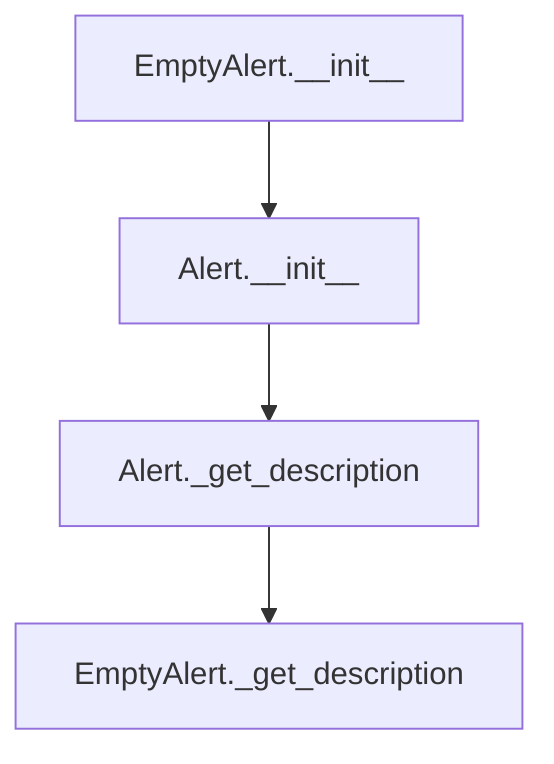

## Raises:
- No explicit exceptions raised during initialization
- Inherits all exception handling from Alert parent class

## Example:
```python
# Create an empty alert
empty_alert = EmptyAlert(
    values={"row_count": 0},
    column_name="my_column",
    is_empty=True
)

# Get the alert description
description = empty_alert._get_description()  # Returns "Dataset is empty"

# Access alert properties
alert_type = empty_alert.alert_type  # Returns AlertType.EMPTY
```

### `src.ydata_profiling.model.alerts.EmptyAlert.__init__` · *method*

## Summary:
Initializes an EmptyAlert instance with specific alert type and configuration for empty dataset detection.

## Description:
This constructor creates an EmptyAlert object that extends the base Alert class specifically for detecting empty datasets. It sets up the alert with the EMPTY alert type, configures the fields to track "n" (likely number of records), and stores optional metadata about the dataset state.

## Args:
    values (Optional[Dict], default=None): Additional values or metadata associated with the alert
    column_name (Optional[str], default=None): Name of the column this alert relates to, if applicable
    is_empty (bool, default=False): Boolean flag indicating whether the dataset is empty

## Returns:
    None: This method initializes the object's state but does not return a value

## Raises:
    None: This method does not explicitly raise exceptions

## State Changes:
    Attributes READ: None
    Attributes WRITTEN: 
    - self.fields: Set containing field names to track (hardcoded to {"n"})
    - self.alert_type: Set to AlertType.EMPTY
    - self.values: Set to provided values or empty dict
    - self.column_name: Set to provided column_name or None
    - self._is_empty: Set to provided is_empty value

## Constraints:
    Preconditions: 
    - The AlertType enum must include an EMPTY member
    - The parent Alert class must be properly initialized with valid parameters
    - All parameters should conform to their type annotations
    
    Postconditions:
    - The alert instance will have alert_type set to AlertType.EMPTY
    - The fields attribute will contain exactly {"n"}
    - All provided parameters will be stored in their respective instance attributes

## Side Effects:
    None: This method performs no I/O operations or external service calls

### `src.ydata_profiling.model.alerts.EmptyAlert._get_description` · *method*

## Summary:
Returns a fixed descriptive message indicating that the dataset is empty.

## Description:
Provides a human-readable description for empty dataset alerts. This method is part of the Alert class hierarchy and specifically overrides the base implementation to return a static message indicating that the dataset is empty. It's called by the `__repr__` method to provide a string representation of the alert instance.

This logic is separated into its own method to maintain consistency with the alert system's design pattern where each alert type provides its own description format. Unlike other alert types that may incorporate column names or statistical values, this alert provides a simple, universal message about dataset emptiness.

## Args:
    None: This method takes no arguments beyond the implicit `self` parameter.

## Returns:
    str: A fixed string "Dataset is empty" that describes the alert condition.

## Raises:
    None: This method does not explicitly raise exceptions.

## State Changes:
    Attributes READ: 
    - self.alert_type: Accessed by parent class methods but not directly used in this implementation
    - self.column_name: Accessed by parent class methods but not directly used in this implementation
    Attributes WRITTEN: None

## Constraints:
    Preconditions:
    - The EmptyAlert instance must be properly initialized
    - The method assumes no specific state requirements beyond normal initialization
    
    Postconditions:
    - Always returns the exact string "Dataset is empty"
    - The method will not modify any instance attributes
    - The returned string is invariant regardless of the alert's context

## Side Effects:
    None: This method performs no I/O operations or external service calls. It only returns a hardcoded string value.

## `src.ydata_profiling.model.alerts.HighCardinalityAlert` · *class*

## Summary:
Represents an alert indicating that a column has high cardinality, meaning it contains a large number of distinct values.

## Description:
The HighCardinalityAlert class is used to signal when a data column exhibits high cardinality, which can impact data analysis and modeling decisions. This alert is typically generated during data profiling when a column's distinct value count exceeds predefined thresholds. The alert provides detailed information about the cardinality, including both absolute counts and percentages of distinct values relative to the total row count.

## State:
- values: Optional[Dict], dictionary containing cardinality information with keys 'n_distinct' (number of distinct values) and 'p_distinct' (percentage of distinct values)
- column_name: Optional[str], name of the column that triggered this alert
- is_empty: bool, flag indicating if this is an empty/placeholder alert instance

## Lifecycle:
- Creation: Instantiate with optional values dict, column_name, and is_empty flag
- Usage: Call _get_description() to retrieve formatted alert message
- Destruction: No special cleanup required, relies on Python's garbage collection

## Method Map:
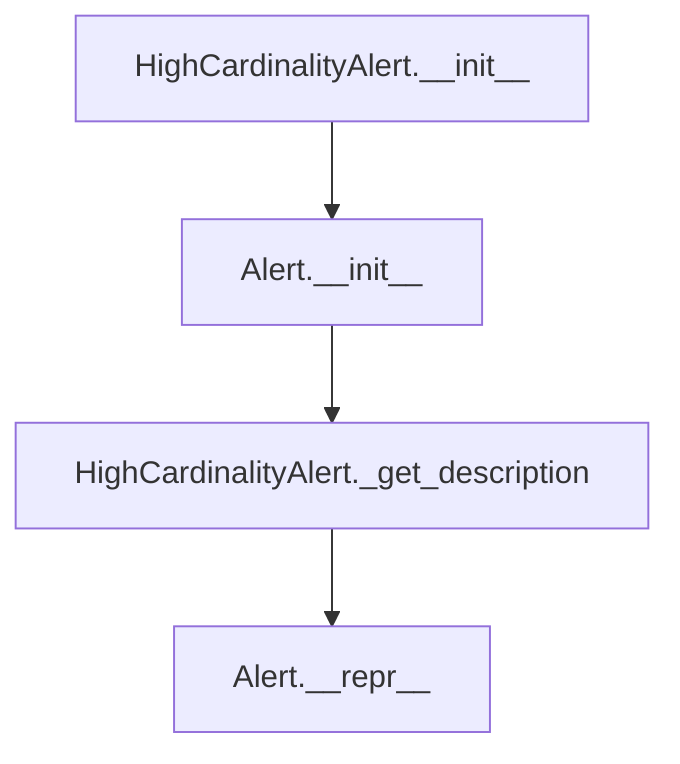

## Raises:
- No explicit exceptions raised in __init__ method

## Example:
```python
# Create a high cardinality alert for a column
alert = HighCardinalityAlert(
    values={'n_distinct': 1000, 'p_distinct': 0.85},
    column_name='user_id'
)

# Get formatted description
description = alert._get_description()
# Returns: "[user_id] has 1000 (85.0%) distinct values"

# Create an alert without specific values
empty_alert = HighCardinalityAlert(column_name='product_code')
description = empty_alert._get_description()
# Returns: "[product_code] has a high cardinality"
```

### `src.ydata_profiling.model.alerts.HighCardinalityAlert.__init__` · *method*

## Summary:
Initializes a HighCardinalityAlert instance with specific alert type and metadata for high cardinality detection.

## Description:
Constructs a HighCardinalityAlert object that represents a data quality issue where a column contains an unexpectedly large number of distinct values. This constructor sets up the alert with the HIGH_CARDINALITY alert type and configures the required fields for cardinality analysis.

## Args:
    values (Optional[Dict], default=None): Dictionary containing cardinality statistics such as 'n_distinct' and 'p_distinct'
    column_name (Optional[str], default=None): Name of the column that triggered this alert
    is_empty (bool, default=False): Flag indicating if the column is empty

## Returns:
    None: This method initializes the object's state but does not return a value

## Raises:
    No explicit exceptions are raised by this method

## State Changes:
    Attributes READ: None
    Attributes WRITTEN: 
    - self.fields: Set containing {"n_distinct"} 
    - self.alert_type: Set to the AlertType.HIGH_CARDINALITY enum member
    - self.values: Set to the provided values parameter or empty dict
    - self.column_name: Set to the provided column_name parameter
    - self._is_empty: Set to the provided is_empty parameter

## Constraints:
    Preconditions:
    - The parent Alert class constructor must accept the provided parameters
    - AlertType.HIGH_CARDINALITY must be a valid enum member
    - The fields parameter must be a set containing at least "n_distinct" for proper cardinality analysis
    
    Postconditions:
    - The alert instance will have alert_type set to the AlertType.HIGH_CARDINALITY enum member
    - The fields attribute will contain exactly {"n_distinct"}
    - All provided parameters will be stored in their respective instance attributes

## Side Effects:
    None: This method performs no I/O operations or external service calls

### `src.ydata_profiling.model.alerts.HighCardinalityAlert._get_description` · *method*

## Summary:
Returns a human-readable description of a high cardinality alert, including distinct value counts when available.

## Description:
Generates a formatted string description for high cardinality alerts. This method is called during the alert formatting process to create user-friendly messages that indicate whether a column has high cardinality or detailed statistics about distinct values.

The method is part of the alert formatting pipeline and is invoked when displaying or serializing alert information to users. It provides contextual information about data characteristics that may impact analysis or modeling decisions.

## Args:
    None explicitly required (uses self-state)

## Returns:
    str: A formatted description string with one of two formats:
        - When self.values is not None: "[{column_name}] has {n_distinct} ({p_distinct}%) distinct values"
        - When self.values is None: "[{column_name}] has a high cardinality"

## Raises:
    None explicitly raised

## State Changes:
    Attributes READ: 
        - self.values: Dictionary containing cardinality statistics (n_distinct, p_distinct)
        - self.column_name: String identifier for the affected column

## Constraints:
    Preconditions:
        - self.column_name must be a valid string or None
        - When self.values is not None, it must contain keys 'n_distinct' and 'p_distinct'
        - self.values can be None, which indicates basic high cardinality detection without detailed stats
        
    Postconditions:
        - Always returns a string with proper formatting
        - The returned string follows a consistent pattern for alert display

## Side Effects:
    None

## `src.ydata_profiling.model.alerts.HighCorrelationAlert` · *class*

## Summary:
Represents an alert for detecting high correlation between columns in a dataset.

## Description:
The HighCorrelationAlert class is used to represent alerts related to high correlation detected between columns during data profiling. It is one of several alert types that can be generated during the profiling process to indicate data quality issues or observations.

## State:
- values: Optional[Dict], dictionary containing correlation metadata with keys 'fields' (list of correlated column names) and 'corr' (correlation type/string)
- column_name: Optional[str], name of the column that has high correlation with others
- is_empty: bool, flag indicating if this is an empty/placeholder alert instance

## Lifecycle:
- Creation: Instantiate with alert_type=AlertType.HIGH_CORRELATION, values dictionary containing correlation data, and optionally column_name
- Usage: Call _get_description() to retrieve formatted alert message, or use inherited methods like fmt() for display formatting
- Destruction: No special cleanup required, relies on Python's garbage collection

## Method Map:
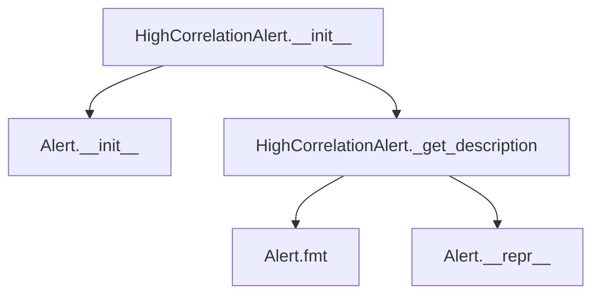

## Raises:
- No explicit exceptions raised in __init__ method
- Exception handling depends on parent Alert class implementation

## Example:
```python
# Create a high correlation alert
alert = HighCorrelationAlert(
    values={
        "fields": ["age", "years_experience"],
        "corr": "positive"
    },
    column_name="salary"
)

# Get formatted description
description = alert._get_description()
# Returns: "[salary] is highly positive correlated with [age] and 1 other fields"

# Or use the inherited formatting
formatted_alert = alert.fmt()
```

### `src.ydata_profiling.model.alerts.HighCorrelationAlert.__init__` · *method*

## Summary:
Initializes a high correlation alert instance with specified values and metadata.

## Description:
Constructs a HighCorrelationAlert object that represents a detected high correlation between variables in a dataset. This method serves as a specialized constructor that sets the alert type to HIGH_CORRELATION while preserving the standard alert initialization pattern.

## Args:
    values (Optional[Dict], default=None): Dictionary containing correlation details including 'corr' (correlation value) and 'fields' (related field names).
    column_name (Optional[str], default=None): Name of the column triggering the alert.
    is_empty (bool, default=False): Flag indicating if the alert relates to an empty dataset or column.

## Returns:
    None: This method initializes the object's state but does not return a value.

## Raises:
    None: This method does not explicitly raise exceptions.

## State Changes:
    Attributes READ: None
    Attributes WRITTEN: 
    - self.alert_type: Set to AlertType.HIGH_CORRELATION
    - self.values: Set to the provided values parameter
    - self.column_name: Set to the provided column_name parameter
    - self._is_empty: Set to the provided is_empty parameter
    - self.fields: Initialized via parent class (defaults to empty set)

## Constraints:
    Preconditions: 
    - The alert_type parameter must be a valid AlertType enum value
    - Values dictionary should contain appropriate keys ('corr', 'fields') when used later
    - Column name should be a valid string identifier when used later
    
    Postconditions:
    - The object is properly initialized with alert_type=AlertType.HIGH_CORRELATION
    - All provided parameters are stored in the object's attributes
    - The alert is ready for description generation via _get_description() method

## Side Effects:
    None: This method performs no I/O operations or external service calls.

### `src.ydata_profiling.model.alerts.HighCorrelationAlert._get_description` · *method*

## Summary:
Generates a human-readable description of a high correlation alert, detailing the correlation relationship between columns.

## Description:
Creates a descriptive string that explains the correlation issue detected by the high correlation alert. This method formats the correlation information into a user-friendly message that indicates which column is highly correlated with others, making it easier for users to understand data quality issues.

The method is called during the formatting of alerts for display purposes, particularly when presenting correlation-related findings to users. It's separated from inline logic to provide a clean interface for generating alert descriptions while maintaining consistency with the alert system's design patterns.

## Args:
    None

## Returns:
    str: A formatted description string describing the correlation alert. When correlation data is available, it shows the column name, correlation type, and related fields. When no correlation data is available, it provides a general description of high correlation issues.

## Raises:
    None

## State Changes:
    Attributes READ: 
    - self.column_name: String representing the name of the column with high correlation
    - self.values: Dictionary containing correlation metadata including 'corr' (correlation type) and 'fields' (related column names)

## Constraints:
    Preconditions:
    - The method assumes that self.column_name is properly initialized
    - The method assumes that self.values follows the expected structure when not None
    
    Postconditions:
    - Returns a properly formatted string describing the correlation alert
    - The returned string is suitable for display in user interfaces

## Side Effects:
    None

## `src.ydata_profiling.model.alerts.ImbalanceAlert` · *class*

## Summary:
Represents an alert indicating that a column in the dataset has a highly imbalanced distribution of values.

## Description:
The ImbalanceAlert class is used to signal when a dataset column exhibits significant imbalance in its value distribution, which could indicate data quality issues or skewed distributions that may affect analysis. This alert is typically generated during data profiling when statistical analysis detects that certain values occur much more frequently than others, potentially skewing results or indicating data collection biases.

This class extends the base Alert class and specializes it for imbalance detection scenarios, providing a consistent interface for reporting and formatting imbalance-related issues.

## State:
- values: Dict[str, Any], optional dictionary containing imbalance-specific metrics or statistics (e.g., imbalance ratio, count of most frequent value)
- column_name: str, optional name of the column that exhibits imbalance
- _is_empty: bool, internal flag indicating if the alert is empty or placeholder (default: False)

## Lifecycle:
- Creation: Instantiate with optional values dict, column_name, and is_empty flag
- Usage: Call _get_description() to retrieve formatted alert message, or use inherited methods like fmt() for display formatting
- Destruction: No special cleanup required, relies on Python's garbage collection

## Method Map:
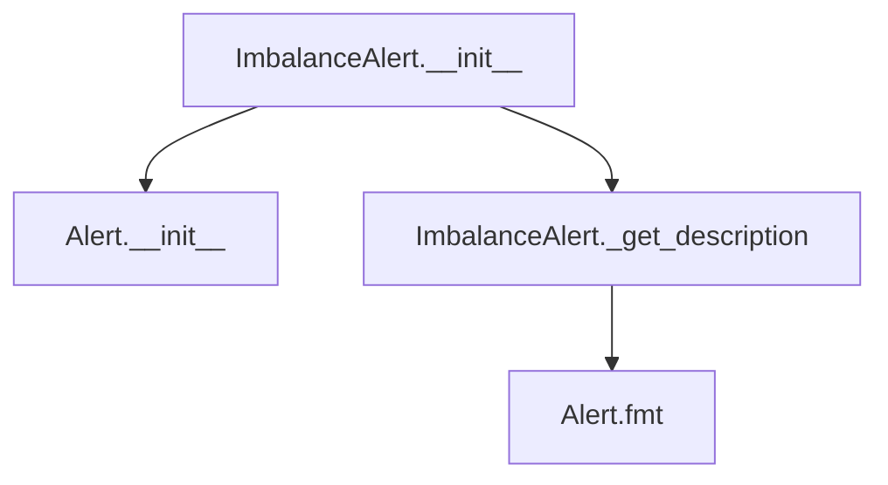

## Raises:
- No explicit exceptions raised in __init__ method

## Example:
```python
# Create an imbalance alert for a column with significant skew
alert = ImbalanceAlert(
    values={"imbalance": "85% of values are 'A'"},
    column_name="category_column"
)

# Get formatted description
description = alert._get_description()  # "[category_column] is highly imbalanced (85% of values are 'A')"

# Format for display
formatted_alert = alert.fmt()  # Returns formatted string for UI display
```

### `src.ydata_profiling.model.alerts.ImbalanceAlert.__init__` · *method*

## Summary:
Initializes an ImbalanceAlert instance with specific alert type and field configuration for detecting data imbalance issues.

## Description:
The ImbalanceAlert constructor creates an alert instance specifically designed to detect and report data imbalance conditions in dataset columns. This method sets up the alert with the IMBALANCE alert type and configures the fields attribute to track imbalance-related information. It leverages the parent Alert class constructor to establish the foundational alert properties while specializing for imbalance detection scenarios.

This method is part of the data quality profiling system and is typically invoked during the analysis phase when the profiling engine identifies potential imbalance issues in categorical or discrete data distributions.

## Args:
    values (Optional[Dict], default=None): Dictionary containing detailed information about the imbalance, such as imbalance statistics or ratios
    column_name (Optional[str], default=None): Name of the column where the imbalance was detected
    is_empty (bool, default=False): Flag indicating whether the alert relates to an empty dataset or column

## Returns:
    None: This method initializes the object state but does not return a value

## Raises:
    No explicit exceptions are raised by this method directly, though underlying parent class construction may raise exceptions for invalid parameters

## State Changes:
    Attributes READ: None
    Attributes WRITTEN: 
    - self.alert_type: Set to AlertType.IMBALANCE
    - self.fields: Set to {"imbalance"}
    - self.values: Set to the provided values parameter or empty dict
    - self.column_name: Set to the provided column_name parameter
    - self._is_empty: Set to the provided is_empty parameter

## Constraints:
    Preconditions:
    - The AlertType.IMBALANCE enum value must be valid and available
    - The fields parameter is hardcoded to {"imbalance"} and cannot be overridden
    - All other parameters accept None/default values gracefully
    
    Postconditions:
    - The alert instance will have alert_type set to AlertType.IMBALANCE
    - The fields attribute will contain exactly the set {"imbalance"}
    - All provided parameters will be stored as instance attributes

## Side Effects:
    None: This method performs no I/O operations, external service calls, or mutations to objects outside the instance being constructed

### `src.ydata_profiling.model.alerts.ImbalanceAlert._get_description` · *method*

## Summary:
Generates a human-readable description string for a column imbalance alert, including imbalance statistics when available.

## Description:
Constructs a descriptive message indicating that a specific column exhibits high imbalance. This method is part of the alert formatting system and is called during the display or serialization of data quality alerts. The method is specifically designed for ImbalanceAlert instances and provides contextual information about the severity of imbalance in the affected column.

## Args:
    self: The ImbalanceAlert instance containing alert metadata

## Returns:
    str: A formatted description string in the format "[column_name] is highly imbalanced" or "[column_name] is highly imbalanced (imbalance_value)" when imbalance statistics are available

## Raises:
    No explicit exceptions raised by this method

## State Changes:
    Attributes READ: 
    - self.column_name: String identifier of the column with imbalance
    - self.values: Dictionary containing imbalance statistics, or None

## Constraints:
    Preconditions:
    - self.column_name should be a valid string identifier for a column
    - self.values should either be None or a dictionary containing an 'imbalance' key
    
    Postconditions:
    - Returns a properly formatted string describing the imbalance condition
    - The returned string always starts with "[column_name] is highly imbalanced"

## Side Effects:
    None: This method performs no I/O operations, external service calls, or mutations to objects outside self

## `src.ydata_profiling.model.alerts.InfiniteAlert` · *class*

## Summary:
Represents an alert for detecting infinite values in a data column during profiling.

## Description:
The InfiniteAlert class is used to signal when a data column contains infinite values (positive or negative infinity). It extends the base Alert class to provide specific handling and formatting for infinite value detection. This alert type is particularly useful in data quality analysis where infinite values may indicate data entry errors, mathematical operations gone wrong, or special data representations that require attention.

## State:
- values: Optional[Dict[str, Any]], dictionary containing statistical information about infinite values with keys 'n_infinite' (count) and 'p_infinite' (percentage). Can be None when no detailed statistics are available.
- column_name: Optional[str], name of the column that contains infinite values. Can be None when the alert is created without column context.
- _is_empty: bool, inherited from Alert base class, indicates if this is an empty/placeholder alert.

## Lifecycle:
- Creation: Instantiate with optional values dictionary, column_name, and is_empty flag. The constructor automatically sets alert_type to AlertType.INFINITE and configures the required fields set {"p_infinite", "n_infinite"}.
- Usage: Typically used internally by profiling components when infinite values are detected. The alert's description is generated via the _get_description method, which is called by the parent Alert.fmt() method.
- Destruction: Relies on Python's garbage collection for cleanup.

## Method Map:
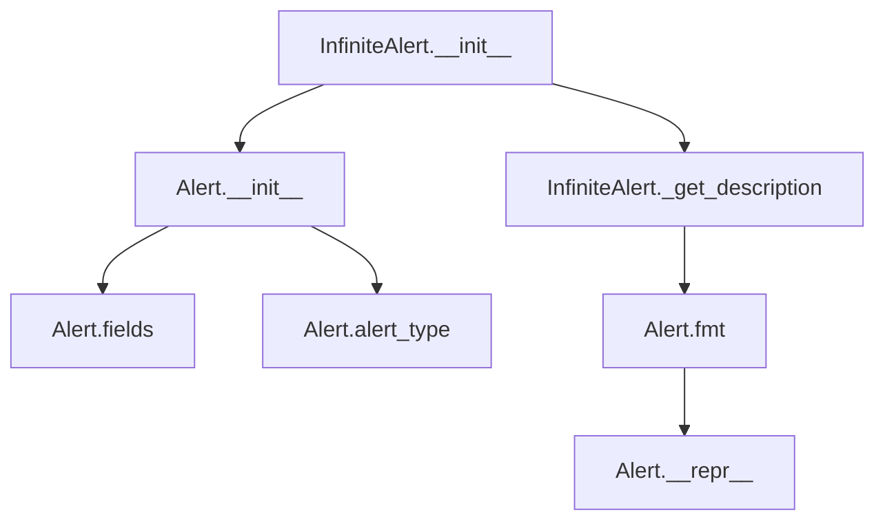

## Raises:
- No explicit exceptions raised in __init__ method
- The constructor delegates to Alert.__init__, which may raise exceptions if invalid parameters are passed to the parent class

## Example:
```python
# Create an InfiniteAlert with detailed statistics
alert_with_stats = InfiniteAlert(
    values={"n_infinite": 5, "p_infinite": 0.02},
    column_name="salary",
    is_empty=False
)

# Create an InfiniteAlert without statistics
alert_without_stats = InfiniteAlert(
    column_name="temperature",
    is_empty=False
)

# The alert description will be formatted appropriately
description = alert_with_stats._get_description()  # "[salary] has 5 (2.0%) infinite values"
description2 = alert_without_stats._get_description()  # "[temperature] has infinite values"
```

### `src.ydata_profiling.model.alerts.InfiniteAlert.__init__` · *method*

## Summary:
Initializes an InfiniteAlert instance to track infinite values in a data column.

## Description:
Creates a new InfiniteAlert object that records information about infinite values (positive or negative infinity) detected in a dataset column. This alert type specifically monitors both the count and percentage of infinite values present in the data.

The method is called during the data profiling process when infinite values are detected in a column, allowing the system to generate appropriate warnings and reports about data quality issues.

## Args:
    values (Optional[Dict]): Dictionary containing statistics about infinite values, including 'n_infinite' (count) and 'p_infinite' (percentage). Defaults to None.
    column_name (Optional[str]): Name of the column where infinite values were detected. Defaults to None.
    is_empty (bool): Flag indicating if the column is empty. Defaults to False.

## Returns:
    None: This method initializes the object's state but does not return a value.

## Raises:
    No explicit exceptions are raised by this method. Exceptions from the parent Alert.__init__ method may propagate if invalid arguments are passed.

## State Changes:
    Attributes READ: None
    Attributes WRITTEN: 
    - self.fields: Set containing {"p_infinite", "n_infinite"}
    - self.alert_type: Set to AlertType.INFINITE
    - self.values: Set to the provided values parameter or empty dict
    - self.column_name: Set to the provided column_name parameter
    - self._is_empty: Set to the provided is_empty parameter

## Constraints:
    Preconditions:
    - The parent Alert class constructor must accept the provided parameters
    - The fields set must contain the keys "p_infinite" and "n_infinite" for proper alert processing
    
    Postconditions:
    - The alert object will have its alert_type attribute set to AlertType.INFINITE
    - The fields attribute will contain exactly {"p_infinite", "n_infinite"}
    - All provided parameters will be stored in the corresponding instance attributes

## Side Effects:
    None: This method performs no I/O operations or external service calls. It only initializes object state.

### `src.ydata_profiling.model.alerts.InfiniteAlert._get_description` · *method*

## Summary:
Generates a human-readable description of infinite values detected in a data column.

## Description:
Creates a formatted string describing the presence of infinite values in a column, providing either detailed statistics or a general notification depending on available data. This method is part of the InfiniteAlert class and is used to format alert messages during data profiling.

## Args:
    None

## Returns:
    str: A formatted description string that either:
        - Provides detailed statistics: "[column_name] has n_infinite (p_infinite%) infinite values" 
        - Provides general notification: "[column_name] has infinite values"

## Raises:
    None explicitly raised

## State Changes:
    Attributes READ: 
        - self.values: Dictionary containing statistical information about infinite values
        - self.column_name: String identifier for the affected column
    Attributes WRITTEN: None

## Constraints:
    Preconditions:
        - self.column_name should be a valid string identifier for a column
        - self.values should either be None or a dictionary containing 'n_infinite' and 'p_infinite' keys
        - When self.values is not None, both 'n_infinite' and 'p_infinite' keys must exist in the dictionary
    
    Postconditions:
        - Always returns a string with proper formatting
        - The returned string follows a consistent pattern for alert descriptions

## Side Effects:
    None

## Known Callers:
    This method is called internally by the Alert.fmt() method during the formatting of alerts for display in profiling reports. It's part of the standard alert formatting pipeline where alerts are converted to user-friendly descriptions.

## Why This Logic Is Its Own Method:
This logic is separated into its own method to provide a clean interface for generating alert descriptions while maintaining consistency with other alert types in the system. It allows the Alert base class to provide a common formatting mechanism (via fmt()) that delegates the specific description generation to individual alert subclasses, following the template method pattern.

## `src.ydata_profiling.model.alerts.MissingAlert` · *class*

## Summary:
Represents an alert indicating missing values in a data column during profiling.

## Description:
The MissingAlert class is a specialized alert type that signals when data columns contain missing values during the profiling process. It inherits from the base Alert class and implements specific behavior for missing value detection and reporting. This alert type is typically created by profiling components when they detect that a column contains null or empty values.

## State:
- values: Dict[str, Any], optional dictionary containing missing value statistics with keys "n_missing" (count) and "p_missing" (percentage)
- column_name: str, optional name of the column that contains missing values
- _is_empty: bool, internal flag indicating if the alert is empty or placeholder

## Lifecycle:
- Creation: Instantiate with optional values dict, column_name, and is_empty flag
- Usage: Access properties like alert_type_name and anchor_id, call fmt() for formatted display
- Destruction: No special cleanup required, relies on Python's garbage collection

## Method Map:
```mermaid
graph TD
    A[MissingAlert.__init__] --> B[Alert.__init__]
    B --> C[Alert.fields = {"p_missing", "n_missing"}]
    C --> D[MissingAlert._get_description]
    D --> E[Alert.fmt]
    E --> F[Alert.__repr__]
```

## Raises:
- No explicit exceptions raised in __init__ method

## Example:
```python
# Create a missing alert with detailed statistics
alert = MissingAlert(
    values={"n_missing": 15, "p_missing": 0.15},
    column_name="age"
)

# Format the alert for display
formatted = alert.fmt()  # Returns formatted string with tooltip for missing values

# Get alert identifier
identifier = alert.anchor_id  # Returns hash-based identifier

# Get raw description
description = alert._get_description()  # "[age] 15 (15.0%) missing values"
```

### `src.ydata_profiling.model.alerts.MissingAlert.__init__` · *method*

## Summary:
Initializes a MissingAlert object with specific alert type and field configuration for missing value detection.

## Description:
This constructor creates a MissingAlert instance by calling the parent Alert class constructor with predefined alert type and field configuration. It sets up the alert to track missing value statistics including both count and percentage of missing values.

## Args:
    values (Optional[Dict], optional): Dictionary containing missing value statistics such as 'n_missing' and 'p_missing'. Defaults to None.
    column_name (Optional[str], optional): Name of the column being analyzed for missing values. Defaults to None.
    is_empty (bool, optional): Flag indicating if the alert represents an empty dataset. Defaults to False.

## Returns:
    None: This method initializes the object's state but does not return a value.

## Raises:
    None: This method does not explicitly raise exceptions.

## State Changes:
    Attributes READ: None
    Attributes WRITTEN: 
    - self.fields: Set containing {"p_missing", "n_missing"} 
    - self.alert_type: Set to AlertType.MISSING
    - self.values: Set to the provided values parameter or empty dict
    - self.column_name: Set to the provided column_name parameter
    - self._is_empty: Set to the provided is_empty parameter

## Constraints:
    Preconditions: None
    Postconditions: The object is initialized with alert_type=AlertType.MISSING and fields={"p_missing", "n_missing"}

## Side Effects:
    None: This method performs no I/O operations or external service calls.

### `src.ydata_profiling.model.alerts.MissingAlert._get_description` · *method*

## Summary:
Generates a human-readable description string for missing value alerts, providing detailed statistics when available or a basic message when not.

## Description:
Creates a formatted string describing missing value conditions in a dataset column. This method is called during the alert formatting process to provide meaningful descriptions to users about missing data patterns. When detailed statistics are available (self.values is not None), it includes both absolute count and percentage of missing values. When only basic information is available, it provides a simpler description.

## Args:
    None explicitly taken (uses self)

## Returns:
    str: Formatted description string in one of two formats:
        - When self.values is not None: "[{column_name}] {n_missing} ({p_missing}) missing values"
        - When self.values is None: "[{column_name}] has missing values"

## Raises:
    None explicitly raised

## State Changes:
    Attributes READ: self.values, self.column_name

## Constraints:
    Preconditions:
        - self.column_name should be a valid string or None
        - When self.values is not None, it should contain keys 'n_missing' and 'p_missing'
        - self.values should be either None or a dictionary with the required keys
    
    Postconditions:
        - Always returns a string starting with "[{column_name}] "
        - When values are present, returns a string with both count and percentage
        - When values are absent, returns a simple descriptive message

## Side Effects:
    None

## `src.ydata_profiling.model.alerts.NonStationaryAlert` · *class*

## Summary:
Represents an alert indicating that a data column exhibits non-stationary behavior, meaning its statistical properties change over time or across segments.

## Description:
The NonStationaryAlert class is used to signal when a data column fails stationarity tests, which is particularly important in time series analysis where stationary data is often required for reliable modeling. This alert is generated during data profiling when statistical properties such as mean, variance, or autocorrelation structure vary significantly across different portions of the data.

This class extends the base Alert functionality by providing a specific description for non-stationary data patterns and is typically created by profiling components that analyze temporal or sequential data characteristics.

## State:
- Inherits all attributes from Alert base class:
  - alert_type: AlertType.NON_STATIONARY (constant)
  - values: Optional[Dict], additional metadata about the non-stationary pattern
  - column_name: Optional[str], name of the column exhibiting non-stationarity
  - _is_empty: bool, indicates if this is a placeholder alert

## Lifecycle:
- Creation: Instantiate with optional values and column_name parameters
- Usage: Typically accessed through Alert.fmt() method for display formatting
- Destruction: Managed by Python's garbage collection

## Method Map:
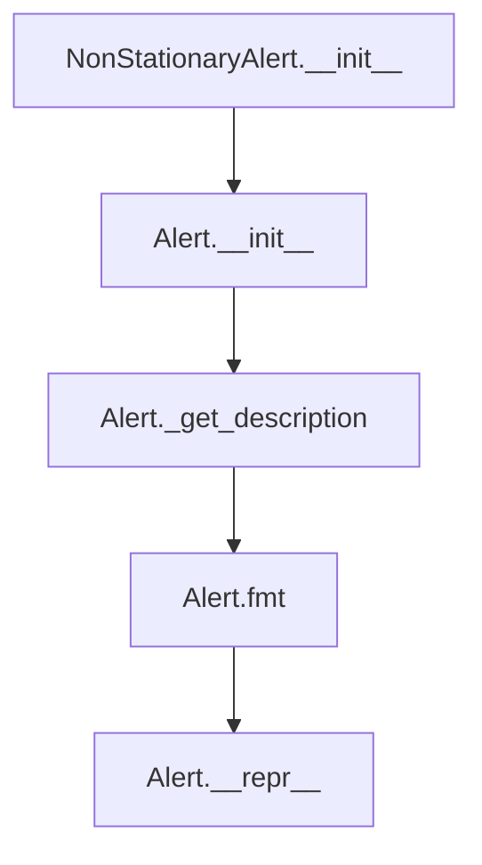

## Raises:
- No explicit exceptions raised during initialization
- Inherits all exception handling from Alert parent class

## Example:
```python
# Create a non-stationary alert for a specific column
alert = NonStationaryAlert(
    values={"test_statistic": 2.34, "p_value": 0.01},
    column_name="sales_revenue"
)

# Get formatted description for display
description = alert.fmt()  # Returns "[sales_revenue] is non stationary"

# Access alert properties
alert_type = alert.alert_type  # Returns AlertType.NON_STATIONARY
column = alert.column_name     # Returns "sales_revenue"
```

### `src.ydata_profiling.model.alerts.NonStationaryAlert.__init__` · *method*

## Summary:
Initializes a NonStationaryAlert instance with specific alert type and metadata.

## Description:
Constructs a NonStationaryAlert object that indicates a column exhibits non-stationary behavior. This method serves as a specialized constructor that sets up the alert with the NON_STATIONARY alert type while preserving all standard alert metadata like column name, values, and empty status.

## Args:
    values (Optional[Dict], default=None): Dictionary containing additional values or context about the non-stationary behavior
    column_name (Optional[str], default=None): Name of the column that is non-stationary
    is_empty (bool, default=False): Flag indicating whether the column is empty

## Returns:
    None: This method initializes the object's state but does not return a value

## Raises:
    None: This method does not explicitly raise exceptions, though parent class initialization may raise exceptions

## State Changes:
    Attributes READ: None
    Attributes WRITTEN: 
    - self.alert_type: Set to AlertType.NON_STATIONARY
    - self.values: Set to the provided values parameter or empty dict
    - self.column_name: Set to the provided column_name parameter
    - self._is_empty: Set to the provided is_empty parameter
    - self.fields: Set to the provided fields parameter or empty set (inherited from parent)

## Constraints:
    Preconditions: 
    - The alert_type parameter must be a valid AlertType enum member
    - All parameters should be compatible with the parent Alert class constructor
    
    Postconditions:
    - The created object will have alert_type set to AlertType.NON_STATIONARY
    - The object will maintain all provided metadata in its attributes

## Side Effects:
    None: This method performs no I/O operations or external service calls

### `src.ydata_profiling.model.alerts.NonStationaryAlert._get_description` · *method*

## Summary:
Returns a formatted string describing a non-stationary column alert.

## Description:
Generates a human-readable description indicating that a specific column exhibits non-stationary behavior. This method is part of the alert formatting system used to communicate data quality issues detected during profiling. The returned string follows a consistent format that helps users quickly identify which column has the non-stationarity issue.

This method is called during the formatting process of alerts and is specifically used for NonStationaryAlert instances. It leverages the inherited `column_name` attribute from the Alert base class to provide contextual information about which column triggered the alert.

## Args:
    None

## Returns:
    str: A formatted string in the pattern "[{column_name}] is non stationary" where column_name is the name of the column that is non-stationary.

## Raises:
    None

## State Changes:
    Attributes READ: self.column_name
    Attributes WRITTEN: None

## Constraints:
    Preconditions:
    - The `self.column_name` attribute must be set during object initialization
    - The `self.column_name` should be a valid string (though no explicit validation occurs)
    
    Postconditions:
    - The returned string will always follow the format "[{column_name}] is non stationary"
    - The method is deterministic and will always return the same string for the same column_name

## Side Effects:
    None

## `src.ydata_profiling.model.alerts.SeasonalAlert` · *class*

## Summary:
Represents an alert indicating that a column exhibits seasonal patterns in its data distribution.

## Description:
The SeasonalAlert class is used to signal when a data column demonstrates seasonal characteristics, suggesting that the data may follow cyclical patterns over time or across categories. This alert is typically generated during data profiling when seasonal trends are detected in the dataset. The class extends the base Alert functionality to provide specific handling for seasonal data patterns.

## State:
- values: Dict[str, Any], optional dictionary containing additional metadata about the seasonal pattern detection
- column_name: str, optional name of the column that exhibits seasonal behavior
- is_empty: bool, internal flag indicating if this is an empty/placeholder alert instance

## Lifecycle:
- Creation: Instantiate with optional values, column_name, and is_empty parameters
- Usage: Typically created by profiling components when seasonal patterns are detected; accessed via alert_type_name and anchor_id properties inherited from Alert
- Destruction: Relies on Python's garbage collection

## Method Map:
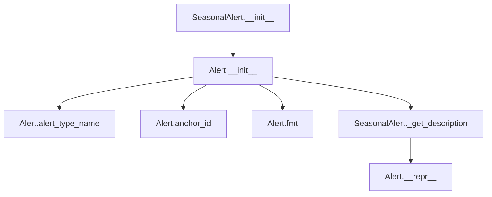

## Raises:
- No explicit exceptions raised in __init__ method

## Example:
```python
# Create a seasonal alert for a column named "sales"
alert = SeasonalAlert(
    values={"seasonality_score": 0.85},
    column_name="sales",
    is_empty=False
)

# Get the formatted description
description = alert._get_description()  # Returns "[sales] is seasonal"

# Access alert properties
alert_type = alert.alert_type_name  # Returns "SEASONAL"
identifier = alert.anchor_id  # Returns hash-based identifier
```

### `src.ydata_profiling.model.alerts.SeasonalAlert.__init__` · *method*

## Summary:
Initializes a SeasonalAlert instance with the SEASONAL alert type and provided configuration parameters.

## Description:
Constructs a SeasonalAlert object that represents a data quality issue indicating that a column exhibits seasonal patterns. This method sets up the alert with the SEASONAL alert type while preserving all other configuration parameters passed through to the parent Alert class constructor.

The SeasonalAlert is used during data profiling to identify columns that display seasonal variations or periodic patterns in their data distribution. This alert type is particularly useful for time series analysis where detecting seasonal trends is important for data quality assessment.

## Args:
    values (Optional[Dict], optional): Additional metadata about the seasonal pattern detection. Defaults to None.
    column_name (Optional[str], optional): Name of the column that triggered this alert. Defaults to None.
    is_empty (bool, optional): Flag indicating if the column is empty. Defaults to False.

## Returns:
    None: This method initializes the object's state but does not return a value.

## Raises:
    No explicit exceptions are raised by this method. Any validation errors would originate from the parent Alert.__init__ method.

## State Changes:
    Attributes READ: None
    Attributes WRITTEN: 
    - self.alert_type: Set to AlertType.SEASONAL
    - self.values: Set to the provided values parameter or empty dict
    - self.column_name: Set to the provided column_name parameter
    - self._is_empty: Set to the provided is_empty parameter
    - self.fields: Inherited from parent, initialized as empty set or provided set

## Constraints:
    Preconditions:
    - The alert_type parameter is implicitly set to AlertType.SEASONAL by this constructor
    - All other parameters are passed through to the parent constructor without modification
    - The parent Alert class handles validation of the provided parameters

    Postconditions:
    - The object is properly initialized as a SeasonalAlert instance
    - The alert_type attribute is set to AlertType.SEASONAL
    - All provided parameters are stored in their respective instance attributes

## Side Effects:
    None: This method performs no I/O operations, external service calls, or mutations to objects outside self.

### `src.ydata_profiling.model.alerts.SeasonalAlert._get_description` · *method*

## Summary:
Returns a formatted string describing that a column exhibits seasonal patterns.

## Description:
Generates a human-readable description indicating that a specific column displays seasonal behavior. This method is part of the SeasonalAlert class and is used to provide a clear, user-friendly representation of seasonal pattern detection during data profiling. The method is called by the `__repr__` method to create a string representation of the alert instance.

This method is specifically designed for the SeasonalAlert type, which identifies columns that exhibit periodic or recurring patterns over time. The description format makes it easy for users to quickly identify which column has been flagged for seasonal behavior.

## Args:
    None: This method takes no arguments beyond the implicit `self` parameter.

## Returns:
    str: A formatted string in the pattern "[COLUMN_NAME] is seasonal", where COLUMN_NAME is the name of the column that exhibits seasonal patterns.

## Raises:
    None: This method does not explicitly raise exceptions.

## State Changes:
    Attributes READ: 
    - self.column_name: Retrieves the name of the column associated with this seasonal alert
    Attributes WRITTEN: None

## Constraints:
    Preconditions:
    - The SeasonalAlert instance must be properly initialized with a valid `column_name` attribute
    - The `column_name` attribute should be either a string or None
    
    Postconditions:
    - The returned string follows the format "[COLUMN_NAME] is seasonal"
    - The method will not modify any instance attributes
    - The returned string will be properly formatted regardless of whether column_name is None

## Side Effects:
    None: This method performs no I/O operations or external service calls. It only accesses existing instance attributes and returns a formatted string.

## `src.ydata_profiling.model.alerts.SkewedAlert` · *class*

## Summary:
Represents an alert indicating that a column exhibits high skewness in its data distribution.

## Description:
The SkewedAlert class is a specialized alert type used to signal when a data column demonstrates significant skewness in its distribution. This alert is typically generated during data profiling when statistical analysis detects that the data is not normally distributed. The alert provides information about the degree of skewness and the affected column name to help users identify potentially problematic data distributions that may affect analysis or modeling.

## State:
- alert_type: AlertType.SKEWED, identifies this as a skewness alert
- values: Dict[str, Any], optional dictionary containing skewness metric (key: 'skewness')
- column_name: str, optional name of the column that is skewed
- fields: Set[str], contains "skewness" indicating the field this alert relates to
- _is_empty: bool, internal flag indicating if the alert is empty or placeholder

## Lifecycle:
- Creation: Instantiate with optional values dict containing skewness metric, column_name, and is_empty flag
- Usage: Call fmt() method to get formatted display string, access alert_type_name property for type identification
- Destruction: No special cleanup required, relies on Python's garbage collection

## Method Map:
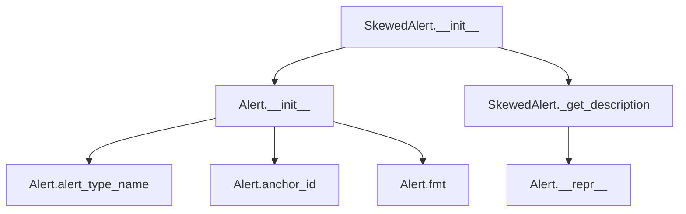

## Raises:
- No explicit exceptions raised in __init__ method

## Example:
```python
# Create a skewed alert for a column with high skewness
skewed_alert = SkewedAlert(
    values={"skewness": 2.5},
    column_name="income",
    is_empty=False
)

# Get formatted description
description = skewed_alert.fmt()  # Returns "[income] is highly skewed(γ1 = 2.5)"

# Create an empty skewed alert
empty_alert = SkewedAlert(is_empty=True)
```

### `src.ydata_profiling.model.alerts.SkewedAlert.__init__` · *method*

## Summary:
Initializes a skewed data alert that identifies columns with significant skewness in their distribution.

## Description:
Creates a specialized alert instance for detecting skewed data distributions. This method serves as a constructor that configures the alert with the appropriate type and metadata for skewness analysis, setting up the alert to track skewness-related issues in data profiling.

## Args:
    values (Optional[Dict]): Dictionary containing skewness calculation results, typically including the skewness value under the 'skewness' key.
    column_name (Optional[str]): Name of the column being analyzed for skewness.
    is_empty (bool): Flag indicating whether the column contains empty or null data, defaults to False.

## Returns:
    None: This method initializes the object state and does not return a value.

## Raises:
    None: This method does not explicitly raise exceptions.

## State Changes:
    Attributes READ: None
    Attributes WRITTEN: 
    - self.fields: Set containing {"skewness"}
    - self.alert_type: Set to AlertType.SKEWED
    - self.values: Set to the provided values parameter or empty dict
    - self.column_name: Set to the provided column_name parameter
    - self._is_empty: Set to the provided is_empty parameter

## Constraints:
    Preconditions: 
    - The alert_type parameter must be a valid AlertType enum value (specifically AlertType.SKEWED)
    - Values should contain skewness data if provided
    - Column name should be a valid string identifier if provided
    
    Postconditions:
    - The alert instance will have its alert_type set to SKEWED
    - The fields attribute will contain exactly {"skewness"}
    - All provided parameters will be stored in their respective instance attributes

## Side Effects:
    None: This method performs no I/O operations or external service calls. It only initializes object state.

### `src.ydata_profiling.model.alerts.SkewedAlert._get_description` · *method*

## Summary:
Generates a human-readable description of a skewed data distribution alert.

## Description:
Returns a formatted string describing a highly skewed column in the dataset. This method is used by the data profiling system to create user-friendly messages when skewness is detected in numerical data distributions. The description includes the column name and optionally the skewness coefficient when available.

## Args:
    None

## Returns:
    str: A formatted description string in the format "[column_name] is highly skewed" or "[column_name] is highly skewed(γ1 = value)" when skewness data is available.

## Raises:
    None

## State Changes:
    Attributes READ: self.column_name, self.values

## Constraints:
    Preconditions: 
    - self.column_name should be a valid string or None
    - self.values should be either None or a dictionary containing a 'skewness' key
    
    Postconditions:
    - Returns a properly formatted string describing the skewness alert
    - The returned string always starts with "[column_name] is highly skewed"

## Side Effects:
    None

## `src.ydata_profiling.model.alerts.TypeDateAlert` · *class*

## Summary:
Represents a specialized alert for datetime type mismatches in data profiling.

## Description:
The TypeDateAlert class is a specialized subclass of Alert designed to indicate when a column contains datetime values but is incorrectly classified as categorical during data profiling. This alert type is part of the standardized alert system that helps identify data quality issues and anomalies during the profiling process.

This alert is generated when profiling components detect that a column's content consists solely of datetime values, but the column's data type is categorized as categorical rather than datetime. The alert provides a mechanism to communicate this inconsistency to users.

## State:
- alert_type: AlertType, set to AlertType.TYPE_DATE to identify this as a datetime type mismatch alert
- values: Dict[str, Any], optional dictionary containing additional metadata about the alert (defaults to None)
- column_name: str, optional name of the column triggering this alert (defaults to None)
- _is_empty: bool, internal flag indicating if the alert is empty or placeholder (defaults to False)

## Lifecycle:
- Creation: Instantiate with optional values, column_name, and is_empty parameters, inheriting from Alert base class
- Usage: The alert can be formatted using inherited methods like fmt() or accessed via properties like anchor_id
- Destruction: No special cleanup required, relies on Python's garbage collection

## Method Map:
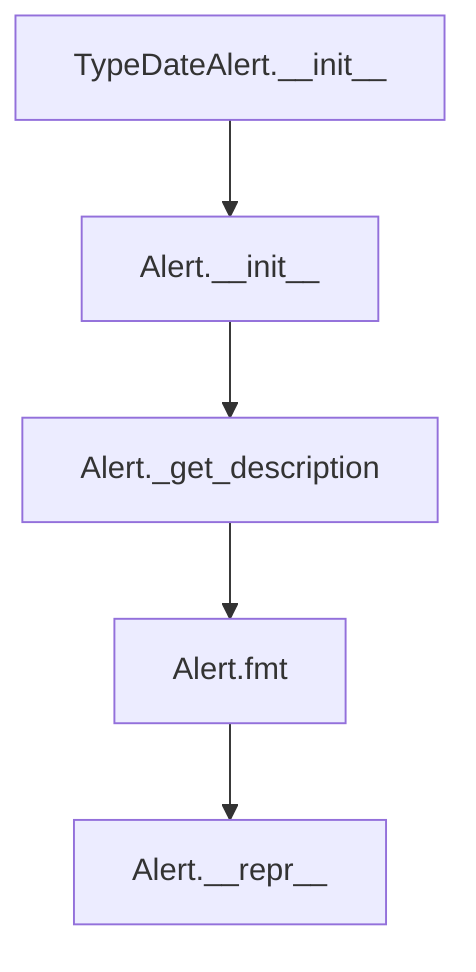

## Raises:
- No explicit exceptions raised during initialization
- Inherits exception handling from the Alert base class

## Example:
```python
# Create a TypeDateAlert for a column named "date_column"
alert = TypeDateAlert(
    values={"sample_values": ["2023-01-01", "2023-01-02"]},
    column_name="date_column"
)

# Get the formatted description
description = alert._get_description()  
# Returns: "[date_column] only contains datetime values, but is categorical. Consider applying `pd.to_datetime()`"

# Format the alert for display
formatted_alert = alert.fmt()  # Uses inherited formatting
```

### `src.ydata_profiling.model.alerts.TypeDateAlert.__init__` · *method*

## Summary:
Initializes a TypeDateAlert instance to flag columns that contain only datetime values but are categorized as categorical.

## Description:
Creates a specialized alert instance for detecting when a column contains only datetime values but is incorrectly classified as categorical type. This alert helps identify data type inconsistencies that may affect analysis or processing workflows.

The method delegates initialization to the parent Alert class with a predefined alert type of TYPE_DATE, while preserving the ability to pass through additional configuration parameters for the alert's metadata.

## Args:
    values (Optional[Dict], optional): Additional contextual data about the alert. Defaults to None.
    column_name (Optional[str], optional): Name of the column triggering the alert. Defaults to None.
    is_empty (bool, optional): Flag indicating if the column is empty. Defaults to False.

## Returns:
    None: This method initializes the object's state and does not return a value.

## Raises:
    No exceptions are explicitly raised by this method.

## State Changes:
    Attributes READ: None
    Attributes WRITTEN: 
    - self.alert_type: Set to AlertType.TYPE_DATE
    - self.values: Set to the provided values parameter or empty dict
    - self.column_name: Set to the provided column_name parameter
    - self._is_empty: Set to the provided is_empty parameter
    - self.fields: Set to the provided fields parameter or empty set (inherited from parent)

## Constraints:
    Preconditions:
    - The alert_type parameter must be a valid AlertType enum member
    - Values parameter should be a dictionary or None
    - Column_name parameter should be a string or None
    
    Postconditions:
    - The instance will have alert_type set to AlertType.TYPE_DATE
    - All provided parameters will be stored as instance attributes
    - The alert will be properly initialized for display and processing

## Side Effects:
    None: This method performs no I/O operations or external service calls.

### `src.ydata_profiling.model.alerts.TypeDateAlert._get_description` · *method*

## Summary:
Returns a formatted description indicating that a column contains only datetime values but is categorized as categorical.

## Description:
Generates a human-readable description string that identifies when a column contains only datetime values but has been classified as categorical type. This method is part of the alert system and is specifically implemented by TypeDateAlert to provide a descriptive message about columns with mixed data type classifications. The method is called by the parent class's `__repr__` method to provide a string representation of the alert instance during debugging and logging operations.

This logic is separated into its own method to maintain consistency with the alert system's design pattern where each alert type provides its own description format, allowing for clear and specific messaging about different data quality issues.

## Args:
    None: This method takes no arguments beyond the implicit `self` parameter.

## Returns:
    str: A formatted string in the pattern "[column_name] only contains datetime values, but is categorical. Consider applying `pd.to_datetime()`" where column_name is the name of the column being analyzed.

## Raises:
    None: This method does not explicitly raise exceptions.

## State Changes:
    Attributes READ: 
    - self.column_name: Reads the column name to include in the description
    Attributes WRITTEN: None

## Constraints:
    Preconditions:
    - The TypeDateAlert instance must be properly initialized with a valid `column_name` attribute
    - The `column_name` attribute should be a string or None
    
    Postconditions:
    - The returned string follows the format "[column_name] only contains datetime values, but is categorical. Consider applying `pd.to_datetime()`"
    - The method will not modify any instance attributes

## Side Effects:
    None: This method performs no I/O operations or external service calls. It only accesses existing instance attributes and returns a formatted string.

## `src.ydata_profiling.model.alerts.UniformAlert` · *class*

## Summary:
Represents an alert indicating that a column exhibits a uniform distribution pattern.

## Description:
The UniformAlert class is used to signal when a data profiling analysis detects that a column contains values that are uniformly distributed. This alert is typically generated during statistical analysis when the distribution of values in a column appears to be evenly spread across all possible values rather than following a normal or skewed distribution. The alert helps data analysts identify columns with uniform distributions that may require special handling or further investigation.

This class inherits from Alert and specializes the alert type to UNIFORM while overriding the `_get_description` method to provide a domain-specific message about uniform distribution.

## State:
- values: Dict[str, Any], optional dictionary containing additional metadata about the uniform distribution (default: None)
- column_name: str, optional name of the column that exhibits uniform distribution (default: None)
- _is_empty: bool, internal flag indicating if the alert is empty or placeholder (default: False)

## Lifecycle:
- Creation: Instantiate with optional values, column_name, and is_empty parameters
- Usage: The alert can be formatted for display using inherited methods from Alert class
- Destruction: Relies on Python's garbage collection

## Method Map:
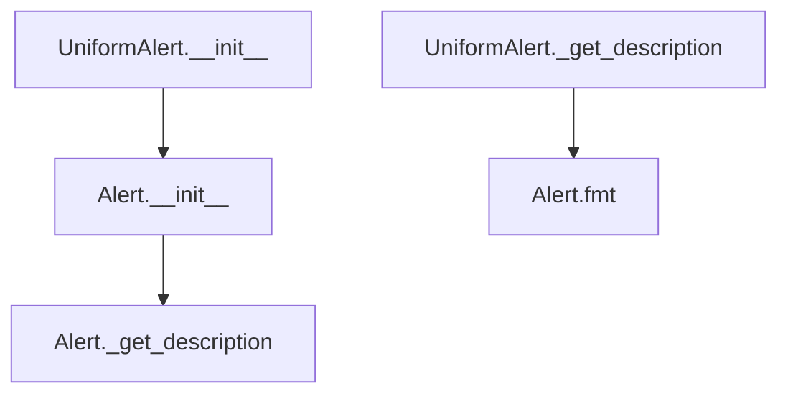

## Raises:
- No explicit exceptions raised in __init__ method

## Example:
```python
# Create a uniform distribution alert for a column named "age"
alert = UniformAlert(
    values={"min": 18, "max": 65, "count": 48},
    column_name="age"
)

# Get the formatted description (overrides parent method)
description = alert._get_description()  # Returns "[age] is uniformly distributed"

# Format for display using inherited method
formatted_alert = alert.fmt()  # Uses inherited formatting with custom description
```

### `src.ydata_profiling.model.alerts.UniformAlert.__init__` · *method*

## Summary:
Initializes a UniformAlert instance with uniform distribution alert properties.

## Description:
Constructs a UniformAlert object that indicates a column has a uniform distribution. This method serves as a specialized constructor that sets up the alert with the UNIFORM alert type and passes through the provided parameters to the parent Alert class initialization.

## Args:
    values (Optional[Dict], optional): Dictionary containing alert-specific values. Defaults to None.
    column_name (Optional[str], optional): Name of the column triggering the alert. Defaults to None.
    is_empty (bool, optional): Flag indicating if the column is empty. Defaults to False.

## Returns:
    None: This method initializes the object state but does not return a value.

## Raises:
    None: This method does not explicitly raise exceptions.

## State Changes:
    Attributes READ: None
    Attributes WRITTEN: 
    - self.alert_type: Set to AlertType.UNIFORM
    - self.values: Set to the provided values parameter
    - self.column_name: Set to the provided column_name parameter
    - self._is_empty: Set to the provided is_empty parameter
    - self.fields: Set via parent class initialization

## Constraints:
    Preconditions: None
    Postconditions: The UniformAlert instance is properly initialized with the UNIFORM alert type and provided parameters.

## Side Effects:
    None: This method performs no I/O operations or external service calls.

### `src.ydata_profiling.model.alerts.UniformAlert._get_description` · *method*

## Summary:
Returns a formatted string describing that a column exhibits uniform distribution.

## Description:
This method generates a human-readable description indicating that the column associated with this alert has a uniform distribution. It is called by the alert formatting system to provide meaningful context about the detected data pattern. The method is part of the UniformAlert class which is instantiated when data profiling detects uniform distribution in a column.

## Args:
    None

## Returns:
    str: A formatted string in the format "[{column_name}] is uniformly distributed" where column_name is the name of the column being analyzed.

## Raises:
    None

## State Changes:
    Attributes READ: self.column_name
    Attributes WRITTEN: None

## Constraints:
    Preconditions: 
    - The alert must be associated with a column (self.column_name should not be None)
    - The UniformAlert instance must be properly initialized
    
    Postconditions:
    - Returns a consistent string format for uniform distribution alerts
    - The returned string contains the column name in brackets followed by the distribution description

## Side Effects:
    None

## `src.ydata_profiling.model.alerts.UniqueAlert` · *class*

## Summary:
Represents an alert indicating that a column contains unique values, meaning all values in the column are distinct.

## Description:
The UniqueAlert class is used to signal when a dataset column contains exclusively unique values (no duplicates). This alert is generated during data profiling when the system detects that all entries in a column are distinct. The alert provides metadata about the uniqueness characteristics of the column including counts and percentages of distinct values.

This class extends the base Alert class and specializes it for the specific case of unique value detection. It's typically created by profiling components when analyzing column uniqueness properties.

## State:
- values: Optional[Dict], dictionary containing additional metadata about the column's uniqueness characteristics
- column_name: Optional[str], name of the column that has unique values, can be None
- fields: Set[str], fixed set of field names {"n_distinct", "p_distinct", "n_unique", "p_unique"} that describe the uniqueness statistics
- _is_empty: bool, internal flag indicating if the alert is empty or placeholder

## Lifecycle:
- Creation: Instantiate with optional values dict, column_name string, and is_empty boolean flag
- Usage: Call _get_description() to retrieve formatted alert message, or use inherited methods like fmt() for display formatting
- Destruction: Managed by Python's garbage collection

## Method Map:
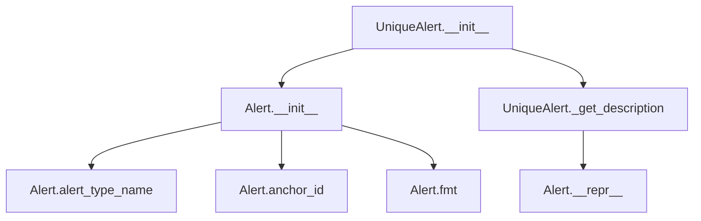

## Raises:
- No explicit exceptions raised during initialization
- Inherits all exception handling from the Alert parent class

## Example:
```python
# Create a unique alert for a column named "user_id"
alert = UniqueAlert(
    values={"n_distinct": 1000, "p_distinct": 1.0, "n_unique": 1000, "p_unique": 1.0},
    column_name="user_id"
)

# Get the formatted description
description = alert._get_description()  # Returns "[user_id] has unique values"

# Format for display
formatted = alert.fmt()  # Returns formatted string with tooltip
```

### `src.ydata_profiling.model.alerts.UniqueAlert._get_description` · *method*

## Summary:
Returns a formatted string describing that a column contains unique values.

## Description:
This method generates a human-readable description indicating that a specific column in the dataset contains unique values. It is used internally by the alert system to provide meaningful descriptions for unique value alerts during data profiling.

The method is typically called by the `__repr__` method of the Alert class to provide a textual representation of the alert, and can also be used directly when displaying or logging alert information.

## Args:
    None: This method takes no arguments beyond the implicit `self` parameter.

## Returns:
    str: A formatted string in the format "[column_name] has unique values" where column_name is the name of the column this alert relates to.

## Raises:
    None: This method does not explicitly raise exceptions.

## State Changes:
    Attributes READ: 
    - self.column_name: Used to identify which column this alert relates to
    Attributes WRITTEN: None

## Constraints:
    Preconditions:
    - The Alert instance must be properly initialized with a valid column_name attribute
    - The column_name attribute should not be None or empty
    
    Postconditions:
    - The returned string will follow the format "[column_name] has unique values"
    - The method will not modify any instance attributes

## Side Effects:
    None: This method performs no I/O operations or external service calls. It only accesses the existing instance attribute `column_name` and returns a formatted string.

## `src.ydata_profiling.model.alerts.UnsupportedAlert` · *class*

## Summary:
Represents an alert for data quality issues related to unsupported data types in profiling.

## Description:
The UnsupportedAlert class is a specialized alert type that signals when a column contains data of a type that cannot be processed by the profiling system. This alert is part of the standardized alert system used throughout the profiling framework to communicate data quality issues to users.

This class extends the base Alert functionality to specifically handle cases where data types are not supported by standard profiling operations, such as complex objects, custom classes, or data structures that don't map to standard numerical or categorical representations.

## State:
- alert_type: AlertType.UNSUPPORTED, identifies this alert as relating to unsupported data types
- values: Dict[str, Any], optional dictionary containing additional metadata about the unsupported data
- column_name: str, optional name of the column containing unsupported data types
- _is_empty: bool, internal flag indicating if the alert is empty or placeholder

## Lifecycle:
- Creation: Instantiate with optional values, column_name, and is_empty parameters
- Usage: Access alert_type_name property to get the alert type name, or call fmt() method to format for display
- Destruction: No special cleanup required, relies on Python's garbage collection

## Method Map:
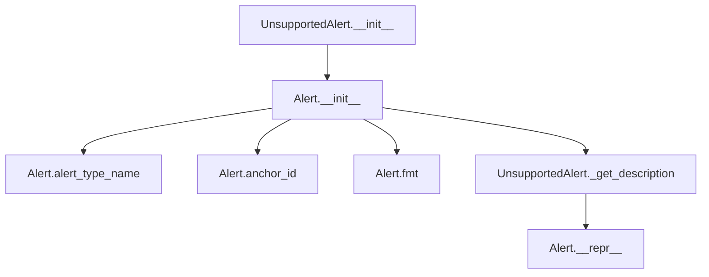

## Raises:
- No explicit exceptions raised during initialization

## Example:
```python
# Create an unsupported alert for a column
alert = UnsupportedAlert(
    values={"data_type": "custom_object", "sample": "<CustomObject>"}, 
    column_name="user_data"
)

# Format the alert for display
formatted = alert.fmt()  # Returns formatted string with tooltip

# Get alert identifier
identifier = alert.anchor_id  # Returns hash-based identifier
```

### `src.ydata_profiling.model.alerts.UnsupportedAlert.__init__` · *method*

## Summary:
Initializes an UnsupportedAlert instance by setting the alert type to UNSUPPORTED and passing through provided parameters to the parent constructor.

## Description:
This constructor initializes an UnsupportedAlert object, which is used to represent alerts indicating unsupported data types or operations during data profiling. The method delegates initialization to the parent Alert class with the alert_type parameter fixed to AlertType.UNSUPPORTED.

## Args:
    values (Optional[Dict], optional): Dictionary containing alert-specific data. Defaults to None.
    column_name (Optional[str], optional): Name of the column associated with the alert. Defaults to None.
    is_empty (bool, optional): Flag indicating if the alert relates to empty data. Defaults to False.

## Returns:
    None: This method initializes the object state but does not return a value.

## Raises:
    Exception: May raise exceptions from the parent Alert class constructor if invalid parameters are provided.

## State Changes:
    Attributes WRITTEN: Initializes attributes inherited from the parent Alert class including alert_type, values, column_name, and is_empty.

## Constraints:
    Preconditions: The parent Alert class must be properly initialized with the provided parameters.
    Postconditions: An UnsupportedAlert instance is created with alert_type set to AlertType.UNSUPPORTED.

## Side Effects:
    None: This method performs no I/O operations or external service calls.

### `src.ydata_profiling.model.alerts.UnsupportedAlert._get_description` · *method*

## Summary:
Returns a formatted description string indicating that a column contains an unsupported data type requiring cleaning or further analysis.

## Description:
This method generates a human-readable description for an UnsupportedAlert, specifying which column has an unsupported data type. It is called during the formatting and display of alerts to provide contextual information about data quality issues.

The method is part of the alert formatting pipeline and is invoked when displaying information about unsupported data types in profiling reports. It follows the standard pattern established by other alert classes where `_get_description` provides the textual representation of the alert's content.

## Args:
    None

## Returns:
    str: A formatted string in the format "[{column_name}] is an unsupported type, check if it needs cleaning or further analysis" where column_name is the name of the problematic column.

## Raises:
    None

## State Changes:
    Attributes READ: self.column_name
    Attributes WRITTEN: None

## Constraints:
    Preconditions: 
    - The method assumes self.column_name is properly initialized (either as a string or None)
    - The method should only be called on instances of UnsupportedAlert or its subclasses
    
    Postconditions:
    - The returned string always follows the same format pattern
    - The method is idempotent and does not modify object state

## Side Effects:
    None

## `src.ydata_profiling.model.alerts.ZerosAlert` · *class*

## Summary:
Represents an alert indicating that a column contains zero values, either a specific count or predominantly zeros.

## Description:
The ZerosAlert class is used to report data quality observations during profiling when columns contain zero values. It is a specialized alert type that inherits from the base Alert class and is designed to communicate information about zero-value occurrences in data columns.

## State:
- values: Optional[Dict], dictionary containing zero-related statistics with keys 'n_zeros' (number of zeros) and 'p_zeros' (percentage of zeros)
- column_name: Optional[str], name of the column this alert relates to
- is_empty: bool, flag indicating if this is an empty/placeholder alert instance

## Lifecycle:
- Creation: Instantiate with optional values dict, column_name, and is_empty flag
- Usage: Call fmt() method to get formatted display string
- Destruction: No special cleanup required, relies on Python's garbage collection

## Method Map:
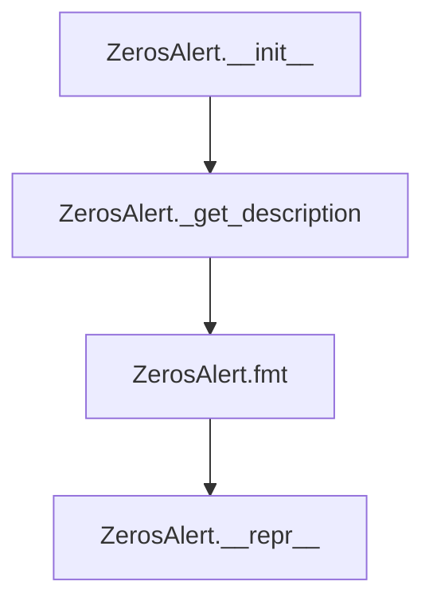

## Raises:
- No explicit exceptions raised in __init__ method

## Example:
```python
# Create a ZerosAlert for a column with specific zero counts
alert1 = ZerosAlert(
    values={'n_zeros': 50, 'p_zeros': 0.25},
    column_name='age'
)

# Create a ZerosAlert for a column with predominantly zeros
alert2 = ZerosAlert(
    column_name='discount_code',
    is_empty=True
)

# Format the alert for display
formatted1 = alert1.fmt()  # "[age] has 50 (25.0%) zeros"
formatted2 = alert2.fmt()  # "[discount_code] has predominantly zeros"
```

### `src.ydata_profiling.model.alerts.ZerosAlert.__init__` · *method*

## Summary:
Initializes a ZerosAlert instance to detect columns with significant zero values in dataset profiling.

## Description:
Creates a specialized alert instance for identifying columns containing a substantial number of zero values. This constructor configures the alert with the ZEROS alert type and establishes the expected data fields for zero count and percentage calculations.

The method is designed as a dedicated constructor to ensure proper initialization of zero-value detection alerts within the data profiling system. It leverages the parent Alert class's functionality while specializing it for zero-related data quality issues.

## Args:
    values (Optional[Dict]): Dictionary containing zero count and percentage data with keys 'n_zeros' and 'p_zeros'. Defaults to None.
    column_name (Optional[str]): Name of the column being analyzed for zero values. Defaults to None.
    is_empty (bool): Flag indicating if the column is empty. Defaults to False.

## Returns:
    None: This method initializes the object state and does not return a value.

## Raises:
    No explicit exceptions are raised by this method. Exceptions may occur in the parent Alert.__init__ method if invalid parameters are passed.

## State Changes:
    Attributes READ: None
    Attributes WRITTEN: 
    - self.fields: Set containing {"n_zeros", "p_zeros"}
    - self.alert_type: Set to AlertType.ZEROS
    - self.values: Set to the provided values parameter or empty dict
    - self.column_name: Set to the provided column_name parameter
    - self._is_empty: Set to the provided is_empty parameter

## Constraints:
    Preconditions:
    - The parent Alert class must be properly initialized with valid parameters
    - Values dictionary, if provided, should contain 'n_zeros' and 'p_zeros' keys for proper alert description formatting
    
    Postconditions:
    - The alert instance will have alert_type set to AlertType.ZEROS
    - The fields attribute will contain exactly {"n_zeros", "p_zeros"}
    - All provided parameters will be stored as instance attributes

## Side Effects:
    None: This method performs no I/O operations, external service calls, or mutations to objects outside the instance being constructed.

### `src.ydata_profiling.model.alerts.ZerosAlert._get_description` · *method*

## Summary:
Generates a human-readable description of zero value counts in a data column, providing either detailed statistics or a general observation.

## Description:
This method creates a descriptive string that communicates information about zero values found in a data column. It's used by the profiling system to provide meaningful alerts about data quality issues related to zero values. The method is called during the formatting of alerts to display user-friendly information about detected zero patterns.

The method is part of the ZerosAlert class, which is responsible for detecting and reporting columns with significant zero value counts. It's invoked when formatting alerts for display in reports or console output.

## Args:
    None explicitly taken (uses self)

## Returns:
    str: A formatted description string describing the zero value pattern in the column. 
         - When detailed statistics are available: "[column_name] has n_zeros (p_zeros%) zeros"
         - When only general observation is available: "[column_name] has predominantly zeros"

## Raises:
    None explicitly raised

## State Changes:
    Attributes READ: 
        - self.values: Dictionary containing zero count statistics (n_zeros, p_zeros) or None
        - self.column_name: String identifier for the affected column

    Attributes WRITTEN: 
        - None (method is read-only)

## Constraints:
    Preconditions:
        - self.column_name must be a valid string or None
        - When self.values is not None, it must contain keys 'n_zeros' and 'p_zeros'
        - The value of self.values['p_zeros'] should be a float between 0 and 1

    Postconditions:
        - Always returns a string with proper formatting
        - When values exist, the returned string contains both absolute count and percentage
        - When values don't exist, the returned string indicates a general observation

## Side Effects:
    None (pure function with no external dependencies or I/O operations)

## `src.ydata_profiling.model.alerts.RejectedAlert` · *class*

## Summary:
Represents an alert indicating that a column was rejected during data profiling.

## Description:
The RejectedAlert class is used to indicate when a data column has been rejected during the profiling process. This typically occurs when a column fails quality checks or validation criteria. The alert provides contextual information about which column was rejected and can be used by profiling systems to flag problematic data.

This class inherits from the Alert base class and sets the alert_type to AlertType.REJECTED during initialization. It overrides the `_get_description` method to provide a specific description format for rejected alerts.

## State:
- column_name: str, optional name of the column that was rejected
- values: Dict[str, Any], optional dictionary containing additional metadata about the rejection
- is_empty: bool, internal flag indicating if the alert is empty or placeholder (defaults to False)

## Lifecycle:
- Creation: Instantiate with optional column_name, values, and is_empty parameters
- Usage: Typically used by profiling components when data validation fails
- Destruction: Managed by Python's garbage collection

## Method Map:
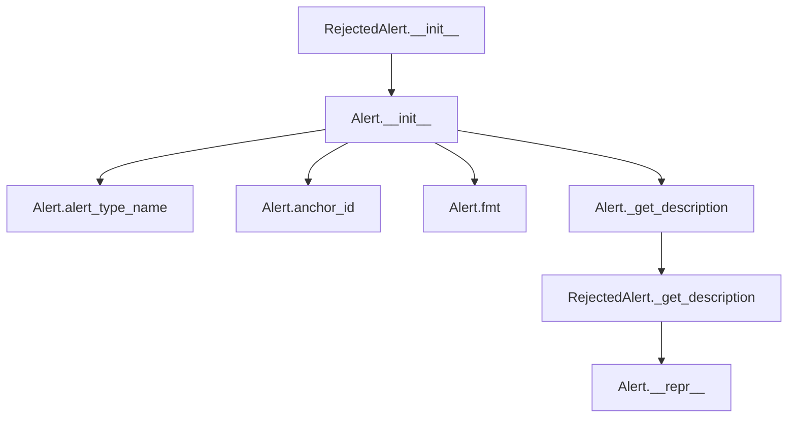

## Raises:
- No explicit exceptions raised during instantiation
- Inherits exception handling from the parent Alert class

## Example:
```python
# Create a rejected alert for a column with high missing values
rejected_alert = RejectedAlert(
    column_name="customer_id",
    values={"reason": "too_many_missing_values", "missing_count": 150}
)

# Get the formatted description
description = rejected_alert._get_description()  # Returns "[customer_id] was rejected"

# Access alert properties
alert_type = rejected_alert.alert_type  # Returns AlertType.REJECTED
anchor_id = rejected_alert.anchor_id  # Returns hash-based identifier
```

### `src.ydata_profiling.model.alerts.RejectedAlert.__init__` · *method*

## Summary:
Initializes a RejectedAlert instance with specified values, column name, and empty status.

## Description:
Creates a new RejectedAlert object that inherits from the Alert base class. This constructor sets up the alert with the REJECTED type and initializes the underlying alert properties with the provided parameters. The method serves as a specialized constructor for alerts indicating that a column was rejected during data profiling.

## Args:
    values (Optional[Dict]): Dictionary containing alert-specific data values. Defaults to None.
    column_name (Optional[str]): Name of the column associated with this alert. Defaults to None.
    is_empty (bool): Flag indicating whether the column is empty. Defaults to False.

## Returns:
    None: This method initializes the object instance and does not return a value.

## Raises:
    None: This method does not explicitly raise exceptions.

## State Changes:
    Attributes READ: None
    Attributes WRITTEN: 
    - self.alert_type: Set to AlertType.REJECTED
    - self.values: Set to the provided values parameter or empty dict
    - self.column_name: Set to the provided column_name parameter
    - self._is_empty: Set to the provided is_empty parameter
    - self.fields: Set to the provided fields parameter or empty set

## Constraints:
    Preconditions: None
    Postconditions: The RejectedAlert instance is properly initialized with the specified parameters and alert type set to REJECTED.

## Side Effects:
    None: This method performs no I/O operations or external service calls.

### `src.ydata_profiling.model.alerts.RejectedAlert._get_description` · *method*

## Summary:
Returns a formatted string describing a rejected column in the data profiling process.

## Description:
Generates a human-readable description indicating that a specific column was rejected during data profiling. This method is part of the RejectedAlert class, which represents alerts generated when columns fail validation or are deemed unsuitable for further analysis.

The method is called internally by the alert formatting system to provide descriptive text for rejected columns. It's designed to be overridden by subclasses to provide more specific descriptions, but for RejectedAlert, it simply indicates the column name and rejection status.

## Args:
    None

## Returns:
    str: A formatted string in the pattern "[column_name] was rejected" where column_name is the name of the rejected column.

## Raises:
    None

## State Changes:
    Attributes READ: self.column_name
    Attributes WRITTEN: None

## Constraints:
    Preconditions: The RejectedAlert instance must have a valid column_name attribute set during initialization
    Postconditions: The returned string always follows the format "[column_name] was rejected"

## Side Effects:
    None

## `src.ydata_profiling.model.alerts.check_table_alerts` · *function*

## Summary:
Checks a table dictionary for conditions that warrant alert generation and returns applicable alerts.

## Description:
Analyzes a table dictionary for duplicate row and empty dataset conditions, generating appropriate alerts when these conditions are met. This function serves as a centralized point for table-level alert checking, separating the alert generation logic from the main profiling pipeline.

The function specifically checks for:
1. Duplicate rows using the alert_value threshold check
2. Empty datasets by verifying if the total row count is zero

This extraction into a dedicated function allows for clean separation of concerns, making the alerting logic reusable and testable while keeping the main profiling pipeline focused on data analysis.

## Args:
    table (dict): Dictionary containing table metadata including 'n_duplicates' and 'n' keys. Expected keys include:
        - 'n_duplicates' (float): Number of duplicate rows in the dataset
        - 'n' (int): Total number of rows in the dataset

## Returns:
    List[Alert]: A list of Alert objects representing detected issues. May be empty if no conditions are met. Possible alert types:
        - DuplicatesAlert: Generated when duplicate rows are detected above the alert threshold
        - EmptyAlert: Generated when the dataset contains zero rows

## Raises:
    None explicitly raised by this function.

## Constraints:
    Preconditions:
    - The input table dictionary must contain the required keys ('n_duplicates' and 'n')
    - The 'n_duplicates' value should be numeric or NaN
    - The 'n' value should be an integer representing row count
    
    Postconditions:
    - Always returns a list of Alert objects (never None)
    - The returned list may be empty if no alerts are triggered

## Side Effects:
    None.

## Control Flow:
```mermaid
flowchart TD
    A[Start check_table_alerts] --> B{table.get("n_duplicates") passes alert_value?}
    B -- Yes --> C[Create DuplicatesAlert]
    B -- No --> D[Skip DuplicatesAlert]
    D --> E{table["n"] == 0?}
    E -- Yes --> F[Create EmptyAlert]
    E -- No --> G[Skip EmptyAlert]
    C --> H[Add to alerts list]
    F --> H
    H --> I[Return alerts list]
```

## Examples:
```python
# Example 1: Table with duplicates above threshold
table_with_duplicates = {
    "n_duplicates": 150.0,
    "n": 1000
}
alerts = check_table_alerts(table_with_duplicates)
# Returns list containing DuplicatesAlert

# Example 2: Empty table
empty_table = {
    "n_duplicates": 0.0,
    "n": 0
}
alerts = check_table_alerts(empty_table)
# Returns list containing EmptyAlert

# Example 3: Normal table with no alerts
normal_table = {
    "n_duplicates": 0.0,
    "n": 100
}
alerts = check_table_alerts(normal_table)
# Returns empty list
```

## `src.ydata_profiling.model.alerts.numeric_alerts` · *function*

## Summary:
Generates a list of numeric data quality alerts based on statistical properties of numerical data columns.

## Description:
Processes a data summary dictionary and configuration settings to detect and create alerts for various numeric data quality issues including skewness, infinite values, zero values, and uniform distributions. This function serves as a centralized point for numeric alert generation during data profiling, extracting specific statistical indicators from the summary and applying configured thresholds to determine which alerts should be triggered.

## Args:
    config (Settings): Configuration object containing threshold values for alert triggering (skewness_threshold, chi_squared_threshold)
    summary (dict): Dictionary containing statistical summary of numeric data including keys: "skewness", "p_infinite", "p_zeros", and optionally "chi_squared"

## Returns:
    List[Alert]: A list of Alert instances representing detected data quality issues. May be empty if no alerts meet triggering criteria.

## Raises:
    None explicitly raised by this function

## Constraints:
    Preconditions:
    - The summary dictionary must contain required keys: "skewness", "p_infinite", "p_zeros"
    - The config object must have vars.num attributes with skewness_threshold and chi_squared_threshold properties
    - The summary["chi_squared"] key is optional and may not exist in all summaries
    
    Postconditions:
    - Returns a list of Alert instances (could be empty)
    - Does not modify the input parameters

## Side Effects:
    None

## Control Flow:
```mermaid
flowchart TD
    A[Start numeric_alerts] --> B{skewness_alert check?}
    B -- Yes --> C[Create SkewedAlert]
    B -- No --> D[Skip SkewedAlert]
    C --> E[Add to alerts list]
    D --> E
    E --> F{alert_value(p_infinite)?}
    F -- Yes --> G[Create InfiniteAlert]
    F -- No --> H[Skip InfiniteAlert]
    G --> I[Add to alerts list]
    H --> I
    I --> J{alert_value(p_zeros)?}
    J -- Yes --> K[Create ZerosAlert]
    J -- No --> L[Skip ZerosAlert]
    K --> M[Add to alerts list]
    L --> M
    M --> N{"chi_squared" in summary?}
    N -- Yes --> O{chi_squared pvalue > threshold?}
    O -- Yes --> P[Create UniformAlert]
    O -- No --> Q[Skip UniformAlert]
    P --> R[Add to alerts list]
    Q --> R
    R --> S[Return alerts list]
```

## Examples:
    # Basic usage with all alert types
    config = Settings()
    summary = {
        "skewness": 3.2,
        "p_infinite": 0.05,
        "p_zeros": 0.15,
        "chi_squared": {"pvalue": 0.03}
    }
    alerts = numeric_alerts(config, summary)
    # Returns list with SkewedAlert, InfiniteAlert, ZerosAlert, and UniformAlert
    
    # Usage with minimal data (no chi_squared)
    summary_minimal = {
        "skewness": 0.5,
        "p_infinite": 0.001,
        "p_zeros": 0.002
    }
    alerts = numeric_alerts(config, summary_minimal)
    # Returns list with InfiniteAlert and ZerosAlert (skewness below threshold)

## `src.ydata_profiling.model.alerts.timeseries_alerts` · *function*

## Summary:
Generates a list of alerts specifically for time series data by combining numeric data quality alerts with stationarity and seasonality indicators.

## Description:
This function creates a comprehensive set of alerts for time series analysis by first generating standard numeric data quality alerts using the `numeric_alerts` function, then appending specialized alerts based on time series properties. It evaluates whether the data is stationary or seasonal and adds appropriate alerts to the result list. This function serves as the central point for time series-specific alert generation during data profiling.

The function is typically called during the time series profiling phase when statistical properties of temporal data need to be analyzed for potential issues or patterns that could affect modeling decisions.

## Args:
    config (Settings): Configuration object containing threshold values for alert triggering, particularly for numeric data quality checks
    summary (dict): Dictionary containing statistical summary of the data including keys:
        - "stationary" (bool): Indicates if the time series is stationary
        - "seasonal" (bool): Indicates if the time series exhibits seasonal patterns
        - Other keys required by numeric_alerts function (skewness, p_infinite, p_zeros, etc.)

## Returns:
    List[Alert]: A list of Alert instances representing detected data quality issues and time series characteristics. The list may include:
        - Alerts from numeric_alerts() function (SkewedAlert, InfiniteAlert, ZerosAlert, UniformAlert)
        - NonStationaryAlert (when summary["stationary"] is False)
        - SeasonalAlert (when summary["seasonal"] is True)
        - Empty list if no alerts meet triggering criteria

## Raises:
    None explicitly raised by this function

## Constraints:
    Preconditions:
    - The summary dictionary must contain "stationary" and "seasonal" boolean keys
    - The summary dictionary must contain all required keys for numeric_alerts function
    - The config object must be properly initialized with required threshold values
    
    Postconditions:
    - Returns a list of Alert instances (could be empty)
    - Does not modify the input parameters

## Side Effects:
    None

## Control Flow:
```mermaid
flowchart TD
    A[Start timeseries_alerts] --> B[Call numeric_alerts(config, summary)]
    B --> C[Initialize alerts list with numeric alerts]
    C --> D{summary["stationary"] is False?}
    D -- Yes --> E[Append NonStationaryAlert]
    D -- No --> F[Skip NonStationaryAlert]
    E --> G[Continue]
    F --> G
    G --> H{summary["seasonal"] is True?}
    H -- Yes --> I[Append SeasonalAlert]
    H -- No --> J[Skip SeasonalAlert]
    I --> K[Continue]
    J --> K
    K --> L[Return alerts list]
```

## Examples:
    # Basic usage with stationary and seasonal data
    config = Settings()
    summary = {
        "stationary": False,
        "seasonal": True,
        "skewness": 2.5,
        "p_infinite": 0.01,
        "p_zeros": 0.0
    }
    alerts = timeseries_alerts(config, summary)
    # Returns list with NonStationaryAlert, SeasonalAlert, and SkewedAlert
    
    # Usage with stationary, non-seasonal data
    summary = {
        "stationary": True,
        "seasonal": False,
        "skewness": 0.5,
        "p_infinite": 0.0,
        "p_zeros": 0.0
    }
    alerts = timeseries_alerts(config, summary)
    # Returns list with only SkewedAlert (if skewness exceeds threshold)
    
    # Usage with no alerts
    summary = {
        "stationary": True,
        "seasonal": False,
        "skewness": 0.1,
        "p_infinite": 0.0,
        "p_zeros": 0.0
    }
    alerts = timeseries_alerts(config, summary)
    # Returns empty list (no alerts meet triggering criteria)

## `src.ydata_profiling.model.alerts.categorical_alerts` · *function*

## Summary
Generates a list of categorical data quality alerts based on statistical analysis results and configuration thresholds.

## Description
The `categorical_alerts` function evaluates categorical data summary statistics against configured thresholds to identify potential data quality issues. It creates appropriate Alert objects when specific conditions are met, such as high cardinality, uniform distribution, date type mismatches, constant string lengths, or class imbalance. This function serves as a centralized alert generation mechanism for categorical variables during data profiling.

The function is extracted into its own component to separate the alert generation logic from the data analysis logic, allowing for cleaner code organization and easier testing of alert conditions independently from the analysis process.

## Args
- config: Settings - Configuration object containing categorical analysis thresholds and parameters
- summary: dict - Dictionary containing categorical variable analysis results and statistics

## Returns
- List[Alert] - A list of Alert objects representing detected data quality issues. Returns an empty list if no alerts are triggered.

## Raises
- No explicit exceptions raised by this function
- Exceptions may be raised by underlying Alert constructors if invalid parameters are passed

## Constraints
- Preconditions:
  - The `config` parameter must be a valid Settings object with properly initialized categorical configuration
  - The `summary` parameter must be a dictionary that may contain keys like "n_distinct", "chi_squared", "date_warning", "composition", and "imbalance"
- Postconditions:
  - The returned list will contain only Alert objects or be empty
  - No modifications are made to the input parameters

## Side Effects
- Creates new Alert objects but does not modify external state
- No I/O operations or external service calls

## Control Flow
```mermaid
flowchart TD
    A[Start categorical_alerts] --> B{summary.get("n_distinct") > config.vars.cat.cardinality_threshold?}
    B -->|Yes| C[Create HighCardinalityAlert]
    B -->|No| D[Skip HighCardinalityAlert]
    D --> E{chi_squared in summary AND summary["chi_squared"]["pvalue"] > config.vars.cat.chi_squared_threshold?}
    E -->|Yes| F[Create UniformAlert]
    E -->|No| G[Skip UniformAlert]
    G --> H{summary.get("date_warning")?}
    H -->|Yes| I[Create TypeDateAlert]
    H -->|No| J[Skip TypeDateAlert]
    J --> K{"composition" in summary AND summary["min_length"] == summary["max_length"]?}
    K -->|Yes| L[Create ConstantLengthAlert]
    K -->|No| M[Skip ConstantLengthAlert]
    M --> N{"imbalance" in summary AND summary["imbalance"] > config.vars.cat.imbalance_threshold?}
    N -->|Yes| O[Create ImbalanceAlert]
    N -->|No| P[Skip ImbalanceAlert]
    C --> Q[Add to alerts list]
    F --> Q
    I --> Q
    L --> Q
    O --> Q
    Q --> R[Return alerts list]
```

## Examples
```python
# Basic usage with minimal summary
from ydata_profiling.config import Settings
config = Settings()
summary = {
    "n_distinct": 100,
    "chi_squared": {"pvalue": 0.9995},
    "date_warning": True,
    "composition": {"min_length": 5, "max_length": 5},
    "imbalance": 0.8
}

alerts = categorical_alerts(config, summary)
# Returns list with HighCardinalityAlert, UniformAlert, TypeDateAlert, 
# ConstantLengthAlert, and ImbalanceAlert

# Empty result when no conditions are met
empty_summary = {}
alerts = categorical_alerts(config, empty_summary)
# Returns empty list []
```

## `src.ydata_profiling.model.alerts.boolean_alerts` · *function*

## Summary
Checks for class imbalance in boolean variables and generates an appropriate alert when the imbalance exceeds the configured threshold.

## Description
The boolean_alerts function analyzes the summary statistics of boolean variables to detect potential class imbalance issues. When the imbalance ratio in a boolean column exceeds the configured threshold (config.vars.bool.imbalance_threshold), it generates an ImbalanceAlert to notify users of potentially problematic data distributions.

This function is part of the alert generation system that identifies data quality issues during profiling. It specifically targets boolean variables where one value (True or False) significantly dominates the other, which could indicate data collection bias or issues with the underlying data source.

## Args
- config (Settings): Configuration object containing profiling settings, including the imbalance threshold for boolean variables
- summary (dict): Dictionary containing summary statistics for boolean variables, including an "imbalance" key

## Returns
- List[Alert]: A list containing zero or one ImbalanceAlert object when the imbalance exceeds the threshold, otherwise an empty list

## Raises
- No explicit exceptions raised by this function

## Constraints
- Preconditions:
  - The summary dictionary must contain an "imbalance" key with a numeric value
  - The config parameter must be a valid Settings object with properly initialized boolean configuration
- Postconditions:
  - The returned list will contain at most one alert
  - The alert, if present, will be an ImbalanceAlert instance

## Side Effects
- None

## Control Flow
```mermaid
flowchart TD
    A[Start boolean_alerts] --> B{Is "imbalance" in summary?}
    B -- No --> C[Return empty alerts list]
    B -- Yes --> D[Compare summary["imbalance"] > config.vars.bool.imbalance_threshold]
    D -- False --> C
    D -- True --> E[Create ImbalanceAlert()]
    E --> F[Append to alerts list]
    F --> G[Return alerts list]
```

## Examples
```python
# Example usage with a summary showing high imbalance
config = Settings()
summary = {"imbalance": 0.85}  # 85% imbalance
alerts = boolean_alerts(config, summary)
# Returns [ImbalanceAlert()] because 0.85 > 0.5 (default threshold)

# Example usage with a summary showing acceptable imbalance
config = Settings()
summary = {"imbalance": 0.3}  # 30% imbalance
alerts = boolean_alerts(config, summary)
# Returns [] because 0.3 <= 0.5 (default threshold)
```

## `src.ydata_profiling.model.alerts.generic_alerts` · *function*

## Summary
Generates missing value alerts based on the percentage of missing data in a dataset summary.

## Description
Creates and returns a list of Alert objects when the percentage of missing values in a dataset exceeds the configured threshold. This function evaluates the "p_missing" field from the summary dictionary and applies the alert_value function to determine if a missing value alert should be triggered. The function is part of the data profiling system's alert generation pipeline and helps identify datasets with significant missing data that may impact analysis quality.

## Args
    summary (dict): A dictionary containing dataset summary statistics, including the "p_missing" key that represents the percentage of missing values.

## Returns
    List[Alert]: A list containing MissingAlert objects when missing values exceed the threshold, or an empty list if no alerts are triggered.

## Raises
    None explicitly raised by this function.

## Constraints
    Preconditions:
    - The summary dictionary must contain a "p_missing" key with a numeric value
    - The value associated with "p_missing" should be a float or numeric type compatible with pandas' isna function
    
    Postconditions:
    - Always returns a list of Alert objects (empty or populated)
    - The returned list contains only MissingAlert instances when alerts are generated

## Side Effects
    None.

## Control Flow
```mermaid
flowchart TD
    A[Start generic_alerts] --> B{summary["p_missing"] exists?}
    B -- No --> C[Return empty list]
    B -- Yes --> D[Call alert_value(summary["p_missing"])]
    D --> E{alert_value returns True?}
    E -- No --> F[Return empty list]
    E -- Yes --> G[Create MissingAlert()]
    G --> H[Return list with MissingAlert]
```

## Examples
```python
# Example 1: No missing values - returns empty list
summary = {"p_missing": 0.0}
alerts = generic_alerts(summary)
# Result: []

# Example 2: Missing values exceeding threshold - returns alert
summary = {"p_missing": 0.05}  # 5% missing values
alerts = generic_alerts(summary)
# Result: [MissingAlert(...)]

# Example 3: Missing values below threshold - returns empty list
summary = {"p_missing": 0.005}  # 0.5% missing values
alerts = generic_alerts(summary)
# Result: []
```

## `src.ydata_profiling.model.alerts.supported_alerts` · *function*

## Summary:
Determines and returns appropriate alerts for a column based on distinct value counts in the summary statistics.

## Description:
Analyzes the summary statistics of a data column to identify potential data quality issues and generates corresponding alert objects. This function evaluates two specific conditions: when all values in a column are unique (n_distinct equals n) and when all values are identical (n_distinct equals 1). The function is part of the data profiling system's alert generation mechanism and helps identify columns with special characteristics that may require attention.

## Args:
    summary (dict): Dictionary containing column summary statistics with keys "n" (total count) and "n_distinct" (distinct value count)

## Returns:
    List[Alert]: Empty list if no conditions are met, or a list containing one or more Alert objects (UniqueAlert and/or ConstantAlert) based on the evaluation results

## Raises:
    No explicit exceptions raised by this function

## Constraints:
    Preconditions:
    - The summary dictionary must contain both "n" and "n_distinct" keys
    - Values for "n" and "n_distinct" should be numeric types
    
    Postconditions:
    - Returns a list of Alert objects (can be empty)
    - The returned list will contain at most one Alert object since the two conditions are mutually exclusive in normal data scenarios

## Side Effects:
    None

## Control Flow:
```mermaid
flowchart TD
    A[Start supported_alerts] --> B{summary.get("n_distinct") == summary["n"]}
    B -- True --> C[alerts.append(UniqueAlert())]
    B -- False --> D[Continue]
    D --> E{summary.get("n_distinct") == 1}
    E -- True --> F[alerts.append(ConstantAlert(summary))]
    E -- False --> G[Return alerts]
    C --> G
    F --> G
```

## Examples:
```python
# Example 1: Column with all unique values
summary1 = {"n": 100, "n_distinct": 100}
alerts1 = supported_alerts(summary1)
# Returns [UniqueAlert()]

# Example 2: Column with constant values
summary2 = {"n": 50, "n_distinct": 1}
alerts2 = supported_alerts(summary2)
# Returns [ConstantAlert(summary2)]

# Example 3: Column with mixed values
summary3 = {"n": 100, "n_distinct": 50}
alerts3 = supported_alerts(summary3)
# Returns []
```

## `src.ydata_profiling.model.alerts.unsupported_alerts` · *function*

## Summary:
Creates and returns a list containing two predefined alert objects: UnsupportedAlert and RejectedAlert.

## Description:
This function serves as a factory method that instantiates and returns a fixed list of two alert objects: UnsupportedAlert and RejectedAlert. These alerts are part of the data profiling system's standardized alert framework and are used to communicate data quality issues related to unsupported data types and rejected columns respectively.

The function is typically called during the data profiling process when initializing or retrieving alerts that are relevant to data type compatibility and column validation issues. It provides a consistent way to obtain these specific alert instances regardless of the underlying data being profiled.

## Args:
    summary (Dict[str, Any]): A dictionary containing profiling summary information. While this parameter is accepted, it is not currently used in the implementation of this function.

## Returns:
    List[Alert]: A list containing exactly two Alert objects:
        - UnsupportedAlert(): Represents an alert for data quality issues related to unsupported data types in profiling
        - RejectedAlert(): Represents an alert indicating that a column was rejected during data profiling

## Raises:
    No explicit exceptions are raised by this function.

## Constraints:
    Preconditions:
        - The function accepts any dictionary as input for the summary parameter
        - No validation is performed on the input parameter
    
    Postconditions:
        - Always returns a list with exactly two Alert objects in the specified order
        - The returned list contains instances of UnsupportedAlert and RejectedAlert classes

## Side Effects:
    None - This function performs no I/O operations or external state mutations.

## Control Flow:
```mermaid
flowchart TD
    A[unsupported_alerts] --> B[Instantiate UnsupportedAlert()]
    B --> C[Instantiate RejectedAlert()]
    C --> D[Return list of alerts]
```

## Examples:
```python
# Basic usage
summary = {"column_stats": {}}
alerts = unsupported_alerts(summary)

# The returned list contains exactly two alert objects
assert len(alerts) == 2
assert isinstance(alerts[0], UnsupportedAlert)
assert isinstance(alerts[1], RejectedAlert)
```

## `src.ydata_profiling.model.alerts.check_variable_alerts` · *function*

## Summary:
Generates a comprehensive list of alerts for a data variable based on its type and statistical properties.

## Description:
Processes a variable's descriptive statistics to identify and create appropriate data quality alerts. This function serves as the central orchestrator for alert generation, delegating to specialized alert functions based on the variable's data type. It handles both generic alerts that apply to all variables and type-specific alerts for unsupported, categorical, numeric, time series, and boolean variables.

The function is called during the data profiling process when analyzing individual columns to detect potential data quality issues. It separates concerns by having dedicated functions for different alert categories, making the alert generation system modular and maintainable.

## Args:
    config (Settings): Configuration object containing threshold values and settings for alert generation
    col (str): Name of the column being analyzed
    description (dict): Dictionary containing statistical summary and properties of the variable

## Returns:
    List[Alert]: A list of Alert objects representing detected data quality issues. May be empty if no alerts meet triggering criteria.

## Raises:
    None explicitly raised by this function

## Constraints:
    Preconditions:
    - The config parameter must be a valid Settings object
    - The description dictionary must contain a "type" key indicating the variable type
    - The description dictionary must contain sufficient statistical information for the respective alert functions
    
    Postconditions:
    - Returns a list of Alert instances (could be empty)
    - All returned alerts will have their column_name and values properties set appropriately

## Side Effects:
    None

## Control Flow:
```mermaid
flowchart TD
    A[Start check_variable_alerts] --> B{description["type"] == "Unsupported"?}
    B -- Yes --> C[Call generic_alerts(description)]
    C --> D[Call unsupported_alerts(description)]
    D --> E[Set alert.column_name = col]
    E --> F[Set alert.values = description]
    F --> G[Return alerts]
    B -- No --> H[Call generic_alerts(description)]
    H --> I[Call supported_alerts(description)]
    I --> J{description["type"] == "Categorical"?}
    J -- Yes --> K[Call categorical_alerts(config, description)]
    J -- No --> L[Skip categorical_alerts]
    L --> M{description["type"] == "Numeric"?}
    M -- Yes --> N[Call numeric_alerts(config, description)]
    M -- No --> O[Skip numeric_alerts]
    O --> P{description["type"] == "TimeSeries"?}
    P -- Yes --> Q[Call timeseries_alerts(config, description)]
    P -- No --> R[Skip timeseries_alerts]
    R --> S{description["type"] == "Boolean"?}
    S -- Yes --> T[Call boolean_alerts(config, description)]
    S -- No --> U[Skip boolean_alerts]
    K --> V[Combine alerts]
    N --> V
    Q --> V
    T --> V
    V --> W[Set alert.column_name = col]
    W --> X[Set alert.values = description]
    X --> Y[Return alerts]
```

## Examples:
    # Basic usage with categorical data
    config = Settings()
    description = {
        "type": "Categorical",
        "n_distinct": 100,
        "chi_squared": {"pvalue": 0.9995}
    }
    alerts = check_variable_alerts(config, "category_col", description)
    # Returns list with categorical-specific alerts like HighCardinalityAlert and UniformAlert
    
    # Usage with numeric data
    config = Settings()
    description = {
        "type": "Numeric",
        "skewness": 3.2,
        "p_infinite": 0.05
    }
    alerts = check_variable_alerts(config, "numeric_col", description)
    # Returns list with numeric-specific alerts like SkewedAlert and InfiniteAlert
    
    # Usage with unsupported data type
    config = Settings()
    description = {
        "type": "Unsupported"
    }
    alerts = check_variable_alerts(config, "unsupported_col", description)
    # Returns list with UnsupportedAlert and RejectedAlert

## `src.ydata_profiling.model.alerts.check_correlation_alerts` · *function*

## Summary
Checks correlation matrices for high correlations and generates alerts when thresholds are exceeded.

## Description
Processes correlation matrices from different correlation methods to identify high correlations between columns and creates alerts for those that exceed configured thresholds. This function is part of the data profiling alert system and specifically handles correlation-related quality issues.

The function filters correlation configurations based on whether high correlation warnings are enabled, computes correlations exceeding the threshold using the `perform_check_correlation` utility, and consolidates results into a unified mapping before creating alerts.

Known callers within the codebase:
- Called during the profiling process when correlation analysis is performed
- Typically triggered during the data quality assessment phase of report generation
- Invoked when correlation matrices are available for analysis

This logic is extracted into its own function rather than being inlined because it encapsulates the specific business logic for correlation alert generation, allowing for cleaner separation of concerns.

## Args
- config: Settings - Configuration object containing correlation settings for different correlation methods
- correlations: dict - Dictionary mapping correlation method names to their respective correlation matrices (pandas DataFrames)

## Returns
- List[Alert] - A list of Alert objects representing high correlation issues found in the data. Returns an empty list if no high correlations are detected or if no correlation methods are configured to warn about high correlations.

## Raises
- No explicit exceptions raised by this function itself
- Exceptions may propagate from underlying functions like `perform_check_correlation` or configuration access

## Constraints
- Preconditions:
  - The config parameter must contain valid correlation configurations with warn_high_correlations and threshold attributes
  - The correlations parameter must be a dictionary with correlation method names as keys and pandas DataFrame correlation matrices as values
  - Each correlation matrix should have consistent column names matching the dataset columns

- Postconditions:
  - Returns a list of Alert objects (potentially empty)
  - Does not modify the input parameters

## Side Effects
- No direct I/O operations
- No external state mutations
- No external service calls
- Creates new Alert objects but doesn't modify existing ones

## Control Flow
```mermaid
flowchart TD
    A[Start check_correlation_alerts] --> B{config.correlations[corr].warn_high_correlations?}
    B -- Yes --> C[Get threshold from config]
    C --> D[Call perform_check_correlation]
    D --> E{correlated_mapping not empty?}
    E -- Yes --> F[Consolidate correlations]
    F --> G{correlations_consolidated not empty?}
    G -- Yes --> H[Create HighCorrelationAlerts]
    H --> I[Return alerts]
    G -- No --> I
    E -- No --> I
    B -- No --> I
    I --> J[End]
```

## Examples
```python
# Basic usage with correlation data
from ydata_profiling.config import Settings
from ydata_profiling.model.alerts import check_correlation_alerts

# Assuming we have correlation matrices and settings
alerts = check_correlation_alerts(settings, {
    "pearson": correlation_df,
    "spearman": spearman_df
})

# Process alerts
for alert in alerts:
    print(alert.fmt())
```

## `src.ydata_profiling.model.alerts.get_alerts` · *function*

## Summary:
Aggregates and sorts alerts from table-level, variable-level, and correlation-level analyses into a unified list.

## Description:
Collects alerts from three distinct sources to provide a comprehensive view of data quality issues detected during profiling. This function orchestrates the alert generation process by calling specialized alert-checking functions for different aspects of data quality and then sorting the resulting alerts by type for consistent presentation.

The function is called during the data profiling pipeline when all analytical components have completed their processing and generated their respective alerts. It serves as the central aggregation point that combines all alert types into a single, sorted collection ready for display or further processing.

This logic is extracted into its own function rather than being inlined because it provides a clear separation between the orchestration of alert collection and the specific alert-checking implementations, making the code more modular and easier to test.

## Args:
    config (Settings): Configuration object containing threshold values and settings for alert generation
    table_stats (dict): Dictionary containing table-level metadata including row counts and duplicate information
    series_description (dict): Dictionary mapping column names to their descriptive statistics and properties
    correlations (dict): Dictionary mapping correlation method names to their respective correlation matrices (pandas DataFrames)

## Returns:
    List[Alert]: A sorted list of Alert objects representing all detected data quality issues. The list is sorted alphabetically by alert type name. Returns an empty list if no alerts are generated by any of the constituent functions.

## Raises:
    None explicitly raised by this function

## Constraints:
    Preconditions:
    - The config parameter must be a valid Settings object with proper configuration for alert generation
    - The table_stats dictionary must contain required keys ('n_duplicates' and 'n') for table-level alert checking
    - The series_description dictionary must contain column names as keys with valid descriptive dictionaries as values
    - The correlations dictionary must contain correlation method names as keys and pandas DataFrame correlation matrices as values
    
    Postconditions:
    - Returns a list of Alert objects (never None)
    - The returned list is sorted by alert type name
    - All alerts in the returned list have their column_name and values properties properly set

## Side Effects:
    None

## Control Flow:
```mermaid
flowchart TD
    A[Start get_alerts] --> B[Call check_table_alerts]
    B --> C[Initialize alerts list with table alerts]
    C --> D{series_description not empty?}
    D -- Yes --> E[Iterate through series_description]
    E --> F[Call check_variable_alerts for each column]
    F --> G[Append variable alerts to alerts list]
    G --> H[Call check_correlation_alerts]
    H --> I[Append correlation alerts to alerts list]
    I --> J[Sort alerts by alert_type]
    J --> K[Return sorted alerts list]
    D -- No --> J
```

## Examples:
```python
# Basic usage in a profiling context
from ydata_profiling.config import Settings
from ydata_profiling.model.alerts import get_alerts

# Assuming we have all required data structures
config = Settings()
table_stats = {"n_duplicates": 0.0, "n": 1000}
series_description = {
    "col1": {"type": "Numeric", "mean": 5.0},
    "col2": {"type": "Categorical", "n_distinct": 50}
}
correlations = {"pearson": correlation_df}

alerts = get_alerts(config, table_stats, series_description, correlations)
# Returns sorted list of all alerts from table, variable, and correlation checks

# Processing the alerts
for alert in alerts:
    print(f"Alert: {alert.alert_type_name}")
    print(f"Details: {alert.fmt()}")
```

## `src.ydata_profiling.model.alerts.alert_value` · *function*

## Summary:
Evaluates whether a numeric value meets alert criteria by checking for non-null status and threshold exceedance.

## Description:
This utility function determines if a numeric value should trigger an alert in the data profiling system. It implements a simple but important validation rule: the value must be both non-null/missing and greater than 0.01. This function encapsulates the alerting logic to ensure consistent application of this threshold-based condition across different parts of the profiling system.

## Args:
    value (float): The numeric value to evaluate for alert conditions.

## Returns:
    bool: True if the value is not null/NaN and greater than 0.01, False otherwise.

## Raises:
    None explicitly raised.

## Constraints:
    Preconditions:
    - Input value should be a numeric type compatible with pandas' isna function
    - The function assumes standard numeric comparison behavior
    
    Postconditions:
    - Always returns a boolean value (True or False)
    - The result is independent of the absolute magnitude of the input beyond the 0.01 threshold

## Side Effects:
    None.

## Control Flow:
```mermaid
flowchart TD
    A[Start alert_value] --> B{Is value NaN?}
    B -- Yes --> C[Return False]
    B -- No --> D{Is value > 0.01?}
    D -- Yes --> E[Return True]
    D -- No --> F[Return False]
```

## Examples:
    >>> alert_value(0.02)
    True
    >>> alert_value(0.005)
    False
    >>> alert_value(float('nan'))
    False
    >>> alert_value(0.01)
    False
```

## `src.ydata_profiling.model.alerts.skewness_alert` · *function*

## Summary:
Determines if a skewness value exceeds a specified threshold, indicating significant data skew.

## Description:
Checks whether a given skewness measurement indicates statistically significant skew by comparing it against a threshold. This function is used to identify when data distribution deviates substantially from normality.

## Args:
    v (float): The skewness value to evaluate. Can be positive (right-skewed), negative (left-skewed), or zero (symmetric).
    threshold (int): The absolute threshold value for determining significant skewness. Values exceeding this threshold in either direction trigger an alert.

## Returns:
    bool: True if the skewness value is not NaN and exceeds the threshold in absolute magnitude (either v < -threshold or v > threshold), False otherwise.

## Raises:
    None explicitly raised.

## Constraints:
    Preconditions:
    - The value `v` should represent a valid skewness statistic
    - The `threshold` should be a positive integer representing the acceptable range for normal skewness
    
    Postconditions:
    - Returns a boolean value indicating whether skewness exceeds acceptable limits
    - Handles missing/invalid data gracefully through NaN checking

## Side Effects:
    None.

## Control Flow:
```mermaid
flowchart TD
    A[skewness_alert(v, threshold)] --> B{Is v NaN?}
    B -- Yes --> C[Return False]
    B -- No --> D{Is v < -threshold OR v > threshold?}
    D -- Yes --> E[Return True]
    D -- No --> F[Return False]
```

## Examples:
    # Normal distribution (low skewness)
    skewness_alert(0.1, 2)  # Returns False
    
    # Right-skewed data (exceeds threshold)
    skewness_alert(3.5, 2)  # Returns True
    
    # Left-skewed data (exceeds threshold)
    skewness_alert(-2.8, 2)  # Returns True
    
    # Missing data
    skewness_alert(float('nan'), 2)  # Returns False
```

## `src.ydata_profiling.model.alerts.type_date_alert` · *function*

## Summary:
Checks whether all elements in a pandas Series can be parsed as dates using the dateutil parser.

## Description:
This function evaluates whether every element in the provided pandas Series can be successfully parsed as a date/time value. It uses the dateutil.parser.parse function to attempt parsing of each element. The function serves as an alert mechanism to identify Series that contain date-like data that conforms to standard date formats.

The function is likely used in data profiling workflows to detect columns that contain temporal data, enabling appropriate analysis and visualization strategies for datetime fields.

## Args:
    series (pd.Series): A pandas Series containing potentially date-like string values to be validated

## Returns:
    bool: True if all elements in the series can be parsed as dates, False otherwise

## Raises:
    None explicitly raised - though ParserError from dateutil.parser may occur internally

## Constraints:
    Preconditions:
    - Input must be a valid pandas Series object
    - Series elements should be convertible to strings for parsing
    
    Postconditions:
    - Function returns a boolean value indicating date-parsability of all elements
    - No modifications are made to the input series

## Side Effects:
    None - This function is stateless and does not modify any external state

## Control Flow:
```mermaid
flowchart TD
    A[Start type_date_alert] --> B{Apply parse to series}
    B --> C{ParserError raised?}
    C -->|Yes| D[Return False]
    C -->|No| E[Return True]
```

## Examples:
```python
import pandas as pd
from dateutil.parser import parse

# Valid date series
date_series = pd.Series(['2023-01-01', '2023-02-01', '2023-03-01'])
result = type_date_alert(date_series)  # Returns True

# Invalid date series  
invalid_series = pd.Series(['2023-01-01', 'not_a_date', '2023-03-01'])
result = type_date_alert(invalid_series)  # Returns False
```

