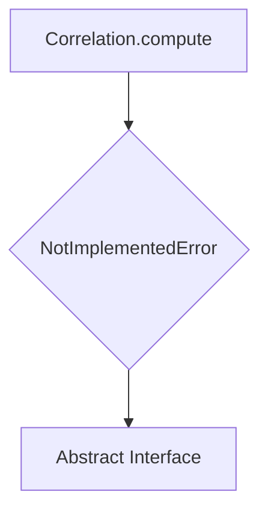
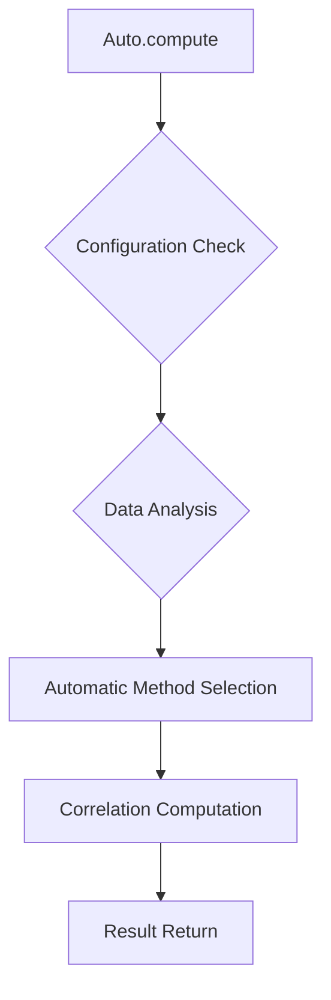
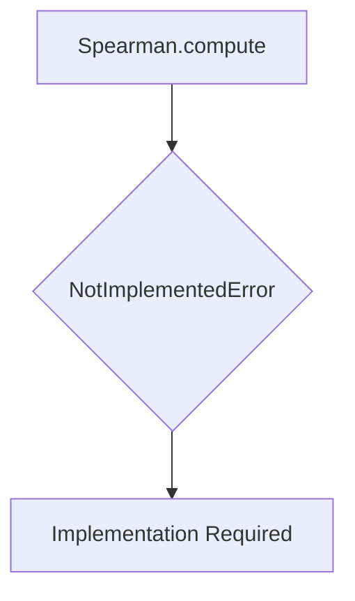
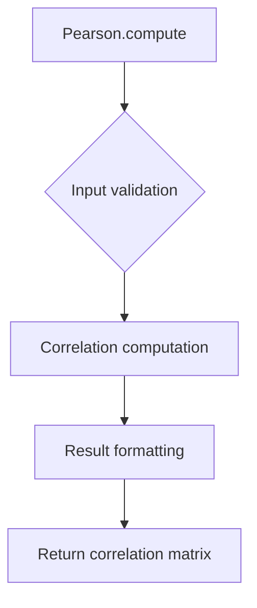
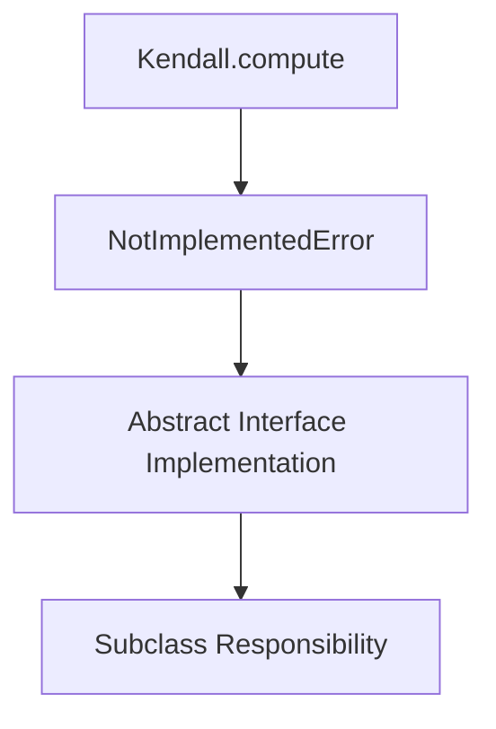
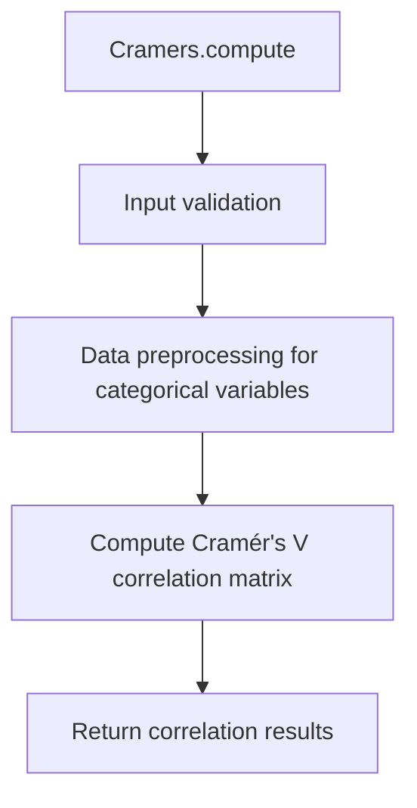
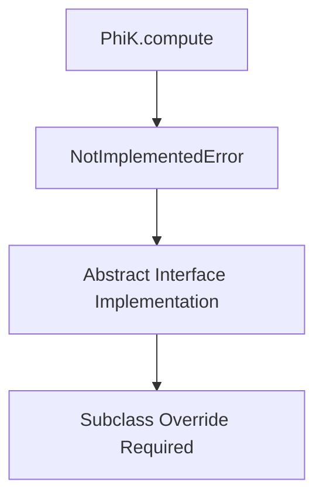
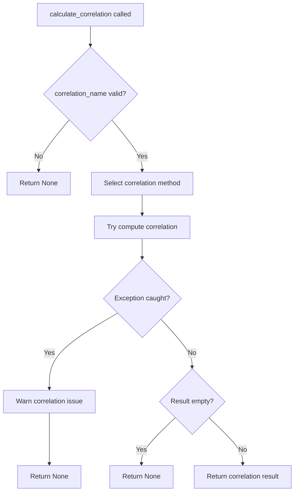
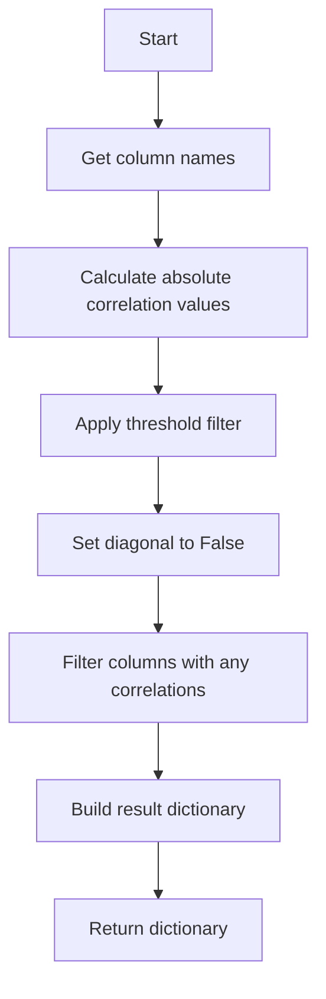

# `correlations.py`

## `src.ydata_profiling.model.correlations.Correlation` · *class*

## Summary:
Abstract base class for computing correlation matrices between variables in a dataset.

## Description:
The Correlation class serves as an abstract interface for implementing various correlation analysis algorithms in data profiling. It defines the standard method signature for computing correlation matrices but leaves the actual implementation to subclasses. This design enables a polymorphic approach where different correlation types (Pearson, Spearman, Kendall, etc.) can be implemented with consistent interfaces.

The class is part of a data profiling framework that analyzes relationships between variables in datasets. Correlation analysis helps identify linear or monotonic relationships between numerical variables, which is valuable for feature selection, detecting multicollinearity, and understanding data structure.

## State:
- This is a static method class with no instance state
- All parameters are passed in via the compute method
- No internal attributes or state maintained

## Lifecycle:
Creation: The class itself is not instantiated; it's used as a static method interface
Usage: Call Correlation.compute() with appropriate parameters to perform correlation analysis
Destruction: No special cleanup required as it's a static method class

## Method Map:


## Args:
    config (Settings): Configuration settings controlling correlation analysis behavior, including flags for calculation, thresholds, and binning parameters
    df (Sized): Input dataset that implements the Sized protocol, typically a pandas DataFrame or similar structure containing variables to correlate
    summary (dict): Pre-computed summary statistics about the dataset, containing metadata that may influence correlation computation such as variable types, missing values, and distributions

## Returns:
    Optional[Sized]: Correlation matrix or related structure representing variable relationships, or None if correlation computation is disabled or not applicable. The return type implements the Sized protocol, allowing for flexible correlation result representations such as pandas DataFrames, numpy arrays, or other structured data formats.

## Raises:
    NotImplementedError: Raised by the base implementation to indicate that subclasses must implement this method

## Example:
```python
# This would typically be called by the profiling system
# Actual implementation would be in subclasses like PearsonCorrelation
try:
    correlation_matrix = Correlation.compute(config, dataframe, summary)
except NotImplementedError:
    print("Must use a concrete correlation implementation")

# Typical usage pattern in a data profiling context:
# config = Settings()  # With correlation settings
# df = pd.DataFrame(...)  # Dataset to analyze
# summary = {}  # Pre-computed statistics
# result = Correlation.compute(config, df, summary)
```

### `src.ydata_profiling.model.correlations.Correlation.compute` · *method*

## Summary:
Computes correlation matrix for a given dataset using specified configuration settings.

## Description:
The compute method is a static method that performs correlation analysis on a dataset according to the provided configuration. This method serves as an abstract interface for computing correlation matrices and is intended to be overridden by specific correlation implementation classes (such as Pearson, Spearman, etc.).

In the base Correlation class, this method raises NotImplementedError as it represents the general interface for correlation computation rather than a concrete implementation. The method takes a dataset, configuration settings, and summary statistics to produce a correlation matrix or similar structure representing variable relationships.

This method is part of a polymorphic correlation analysis framework where different correlation types (Pearson, Spearman, Kendall, etc.) implement their own versions of this compute method to perform specific correlation calculations.

## Args:
    config (Settings): Configuration settings controlling correlation analysis behavior, including flags for calculation, thresholds, and binning parameters
    df (Sized): Input dataset that implements the Sized protocol, typically a pandas DataFrame or similar structure
    summary (dict): Pre-computed summary statistics about the dataset, containing metadata that may influence correlation computation

## Returns:
    Optional[Sized]: Correlation matrix or related structure representing variable relationships, or None if correlation computation is disabled or not applicable. The return type implements the Sized protocol, allowing for flexible correlation result representations such as pandas DataFrames, numpy arrays, or other structured data formats.

## Raises:
    NotImplementedError: This method is not implemented in the base Correlation class and must be overridden by specific correlation algorithm implementations

## State Changes:
    Attributes READ: None - This is a static method that doesn't access instance state
    Attributes WRITTEN: None - This is a static method that doesn't modify instance state

## Constraints:
    Preconditions: 
    - config must be a valid Settings object with proper correlation configuration
    - df must implement the Sized protocol and contain valid data for correlation analysis
    - summary must be a dictionary containing relevant dataset statistics
    
    Postconditions:
    - Method never returns successfully due to NotImplementedError in base class
    - Input parameters are not modified

## Side Effects:
    None - This method has no side effects as it raises an exception before executing any logic

## `src.ydata_profiling.model.correlations.Auto` · *class*

## Summary:
Auto is a correlation analysis class that implements automatic correlation selection functionality.

## Description:
The Auto class is a concrete implementation of the Correlation base class designed to automatically select appropriate correlation methods for analyzing relationships between variables in a dataset. It inherits from Correlation and implements the static compute method that would perform automatic correlation analysis.

As indicated by its name and position in the correlation analysis framework, this class is intended to serve as an "auto" correlation option that intelligently chooses between different correlation algorithms (such as Pearson, Spearman, or Kendall) based on data characteristics and configuration parameters. It's part of the ydata-profiling framework's correlation analysis system.

## State:
- This is a static method class with no instance state
- All parameters are passed in via the compute method
- No internal attributes or state maintained

## Lifecycle:
Creation: The class itself is not instantiated; it's used as a static method interface
Usage: Call Auto.compute() with appropriate parameters to perform automatic correlation analysis
Destruction: No special cleanup required as it's a static method class

## Method Map:


## Args:
    config (Settings): Configuration settings controlling correlation analysis behavior, including flags for calculation, thresholds, and binning parameters. This parameter provides the context for how correlation analysis should be performed.
    df (Sized): Input dataset that implements the Sized protocol, typically a pandas DataFrame or similar structure containing variables to correlate. The data structure determines which correlation methods are appropriate.
    summary (dict): Pre-computed summary statistics about the dataset, containing metadata that influences correlation computation such as variable types, missing values, and distributions.

## Returns:
    Optional[Sized]: Correlation matrix or related structure representing variable relationships, or None if correlation computation is disabled or not applicable. The return type implements the Sized protocol, allowing for flexible correlation result representations.

## Raises:
    NotImplementedError: Raised by the base implementation to indicate that this method must be overridden by a concrete implementation. This is the expected behavior for this class as shown in the source code.

## Example:
```python
from src.ydata_profiling.config import Settings
from src.ydata_profiling.model.correlations import Auto
import pandas as pd

# Create a sample dataset
df = pd.DataFrame({
    'A': [1, 2, 3, 4, 5],
    'B': [2, 4, 6, 8, 10],
    'C': [1, 3, 5, 7, 9]
})

# Create settings with correlation configuration
config = Settings()

# Note: The actual implementation would be in a subclass or concrete implementation
# This demonstrates the expected interface
try:
    # result = Auto.compute(config, df, {})
    pass
except NotImplementedError:
    print("Auto correlation compute method not yet implemented")
```

### `src.ydata_profiling.model.correlations.Auto.compute` · *method*

## Summary:
Placeholder method for automatic correlation computation that raises NotImplementedError.

## Description:
The Auto.compute method is a static method that serves as an abstract interface for computing correlation matrices using automatic method selection. This method is part of the correlation analysis framework in ydata-profiling and is intended to automatically determine the most appropriate correlation calculation method based on data characteristics.

Currently, this method raises NotImplementedError and must be overridden by implementing subclasses. It follows the same signature pattern as other correlation computation methods in the system.

## Args:
    config (Settings): Configuration settings controlling correlation analysis behavior
    df (Sized): Input dataset that implements the Sized protocol
    summary (dict): Pre-computed summary statistics about the dataset

## Returns:
    Optional[Sized]: Placeholder return type - this method raises NotImplementedError and never returns a value

## Raises:
    NotImplementedError: This method is not implemented and must be overridden by subclasses

## State Changes:
    Attributes READ: None - This is a static method that doesn't access instance state
    Attributes WRITTEN: None - This is a static method that doesn't modify instance state

## Constraints:
    Preconditions: 
    - config must be a valid Settings object
    - df must implement the Sized protocol
    - summary must be a dictionary
    
    Postconditions:
    - Method never returns successfully due to NotImplementedError
    - Input parameters are not modified

## Side Effects:
    None - This method has no side effects as it raises an exception before executing any logic

## `src.ydata_profiling.model.correlations.Spearman` · *class*

## Summary
Placeholder implementation for Spearman rank correlation computation.

## Description
The Spearman class is intended to implement the Spearman rank correlation algorithm, which measures monotonic relationships between variables by ranking the data and computing Pearson correlation on the ranks. This class extends the abstract Correlation base class and is designed to provide a concrete implementation for Spearman correlation calculations.

As a placeholder implementation, this class currently raises NotImplementedError in its compute method, indicating that the actual implementation needs to be completed. This design follows the pattern of abstract base classes that define interfaces for different correlation methods (Pearson, Spearman, Kendall, etc.).

## State
- This is a static method class with no instance state
- The compute method is decorated with @staticmethod and @multimethod
- No internal attributes or state maintained

## Lifecycle
Creation: The class itself is not instantiated; it's used as a static method interface
Usage: Call Spearman.compute() with appropriate parameters (though this will raise NotImplementedError)
Destruction: No special cleanup required as it's a static method class

## Method Map


## Args
    config (Settings): Configuration settings controlling correlation analysis behavior
    df (Sized): Input dataset containing variables to correlate
    summary (dict): Pre-computed summary statistics about the dataset

## Returns
    Optional[Sized]: Expected return type for correlation computations (correlation matrix or related structure)

## Raises
    NotImplementedError: Raised by the current implementation to indicate that the method needs to be overridden by subclasses

## Example
```python
# This would typically be called by the profiling system
# Currently raises NotImplementedError
try:
    correlation_matrix = Spearman.compute(config, dataframe, summary)
except NotImplementedError:
    print("Spearman correlation implementation not yet available")
```

### `src.ydata_profiling.model.correlations.Spearman.compute` · *method*

## Summary:
Abstract method that raises NotImplementedError to enforce implementation in concrete Spearman correlation classes.

## Description:
This method serves as an abstract interface for Spearman correlation computation within the data profiling framework. As a static method decorated with @multimethod, it defines the expected signature for correlation computation but raises NotImplementedError to indicate that concrete implementations must be provided by subclasses.

The method is part of the Spearman class hierarchy that implements rank-based correlation analysis. It follows the same interface pattern as other correlation methods in the system (Pearson, Kendall, etc.) to enable polymorphic correlation analysis.

## Args:
    config (Settings): Configuration settings controlling correlation analysis behavior, including flags for calculation, thresholds, and binning parameters. Used to determine if correlation computation should be performed and what parameters to apply.
    df (Sized): Input dataset containing variables to correlate, typically a pandas DataFrame or similar structure implementing the Sized protocol. Should contain numerical or ordinal variables suitable for rank-based correlation analysis.
    summary (dict): Pre-computed summary statistics about the dataset, containing metadata that may influence correlation computation such as variable types, missing values, and distributions.

## Returns:
    Optional[Sized]: Expected return type for correlation matrices, but NotImplementedError is raised instead to enforce implementation in subclasses.

## Raises:
    NotImplementedError: Always raised by this base implementation to indicate that subclasses must implement the actual Spearman correlation computation logic.

## State Changes:
    Attributes READ: None - This is a static method that doesn't modify instance state
    Attributes WRITTEN: None - This is a static method that doesn't modify instance state

## Constraints:
    Preconditions: 
    - config parameter must be a valid Settings object with correlation configuration
    - df parameter must implement the Sized protocol and contain suitable variables for correlation analysis
    - summary parameter should be a dictionary with relevant dataset metadata
    
    Postconditions:
    - This method always raises NotImplementedError
    - Concrete implementations should return a properly formatted correlation matrix

## Side Effects:
    None - This method raises an exception rather than performing any operations

## `src.ydata_profiling.model.correlations.Pearson` · *class*

## Summary:
Pearson correlation coefficient calculator that computes linear correlation matrices between variables in a dataset.

## Description:
The Pearson class implements the computation of Pearson correlation coefficients, which measure the linear relationship between pairs of variables in a dataset. As a concrete subclass of Correlation, it provides the specific algorithm for calculating Pearson correlation matrices while maintaining the standardized interface defined by the parent class.

This class is part of a polymorphic correlation framework that allows different correlation methods (Pearson, Spearman, Kendall, etc.) to be used interchangeably through the same interface. The Pearson class is intended to be a concrete implementation that computes linear correlations, though the current implementation raises NotImplementedError to indicate that a proper implementation needs to be provided by subclasses or through the framework.

## State:
- This is a static method class with no instance state
- All parameters are passed in via the compute method
- No internal attributes or state maintained

## Lifecycle:
Creation: The class itself is not instantiated; it's used as a static method interface
Usage: Call Pearson.compute() with appropriate parameters to perform Pearson correlation analysis
Destruction: No special cleanup required as it's a static method class

## Method Map:


## Args:
    config (Settings): Configuration settings controlling correlation analysis behavior, including flags for calculation, thresholds, and binning parameters. Specifically uses the correlations["pearson"] setting from the configuration.
    df (Sized): Input dataset that implements the Sized protocol, typically a pandas DataFrame or similar structure containing variables to correlate. The dataset should contain numerical variables suitable for Pearson correlation analysis.
    summary (dict): Pre-computed summary statistics about the dataset, containing metadata that may influence correlation computation such as variable types, missing values, and distributions.

## Returns:
    Optional[Sized]: Pearson correlation matrix representing linear relationships between variable pairs, or None if correlation computation is disabled or not applicable. The return type implements the Sized protocol, allowing for flexible correlation result representations such as pandas DataFrames, numpy arrays, or other structured data formats.

## Raises:
    NotImplementedError: Raised by the base implementation to indicate that this class is intended to be overridden by a concrete implementation. Actual Pearson correlation computation should be implemented in a subclass or through the framework.

## Example:
```python
# This would typically be called by the profiling system
# Pearson correlation computation would be implemented in a concrete subclass
try:
    correlation_matrix = Pearson.compute(config, dataframe, summary)
except NotImplementedError:
    print("Pearson correlation implementation not yet available")

# Typical usage pattern in a data profiling context:
# config = Settings()  # With correlation settings
# df = pd.DataFrame(...)  # Dataset to analyze  
# summary = {}  # Pre-computed statistics
# result = Pearson.compute(config, df, summary)
```

### `src.ydata_profiling.model.correlations.Pearson.compute` · *method*

## Summary:
Static method that computes Pearson correlation coefficients between numerical variables in a dataset according to configuration settings.

## Description:
The Pearson.compute method serves as the concrete implementation of the correlation computation interface for Pearson correlation analysis. As a static method decorated with @multimethod within the Pearson class, it takes configuration settings, a dataset, and summary statistics to compute linear relationships between variables.

This method is part of the data profiling framework's correlation analysis system, where different correlation types (Pearson, Spearman, Kendall) are implemented as separate classes inheriting from the abstract Correlation base class. The method signature matches the abstract interface defined in the parent class.

The @multimethod decorator suggests this method may support multiple dispatch based on argument types, enabling different implementations for different input types while maintaining a consistent interface.

The method is intended to be overridden by the actual implementation that computes Pearson correlation coefficients, returning either a correlation matrix or None based on configuration settings.

## Args:
    config (Settings): Configuration settings controlling correlation analysis behavior, including flags for calculation, thresholds, and binning parameters
    df (Sized): Input dataset that implements the Sized protocol, typically a pandas DataFrame containing variables to correlate
    summary (dict): Pre-computed summary statistics about the dataset, containing metadata that may influence correlation computation such as variable types, missing values, and distributions

## Returns:
    Optional[Sized]: Correlation matrix representing linear relationships between variables, or None if correlation computation is disabled or not applicable. The return type implements the Sized protocol, allowing for flexible correlation result representations such as pandas DataFrames, numpy arrays, or other structured data formats.

## Raises:
    NotImplementedError: Indicates that this method must be implemented by subclasses with actual correlation computation logic

## State Changes:
    Attributes READ: None - This is a static method that operates purely on input parameters
    Attributes WRITTEN: None - This is a static method that operates purely on input parameters

## Constraints:
    Preconditions: 
    - config must be a valid Settings object with correlation configuration
    - df must implement the Sized protocol and contain numerical variables suitable for Pearson correlation
    - summary must be a dictionary containing pre-computed dataset statistics
    
    Postconditions:
    - Must be implemented by subclasses to return actual correlation results
    - If implemented, returns a correlation matrix of appropriate size or None

## Side Effects:
    None - This method performs no I/O operations or external service calls

## `src.ydata_profiling.model.correlations.Kendall` · *class*

## Summary:
Implementation of Kendall's rank correlation coefficient computation for data profiling applications.

## Description:
The Kendall class implements Kendall's rank correlation coefficient, a non-parametric measure of ordinal association between two variables. This class extends the abstract Correlation base class and provides the specific implementation for computing Kendall's tau correlation matrix between variables in a dataset. It is part of a data profiling framework that analyzes relationships between variables using various correlation methods.

The class is designed to be used as part of a polymorphic correlation analysis system where different correlation types (Pearson, Spearman, Kendall) can be selected and applied consistently through the same interface. It is typically invoked by the profiling system when Kendall correlation analysis is configured.

## State:
- This is a static method class with no instance state
- All parameters are passed in via the compute method
- No internal attributes or state maintained

## Lifecycle:
Creation: The class itself is not instantiated; it's used as a static method interface
Usage: Call Kendall.compute() with appropriate parameters to perform Kendall correlation analysis
Destruction: No special cleanup required as it's a static method class

## Method Map:


## Args:
    config (Settings): Configuration settings controlling correlation analysis behavior, including flags for calculation, thresholds, and binning parameters. This parameter determines how the correlation computation should be performed based on user-defined settings.
    df (Sized): Input dataset that implements the Sized protocol, typically a pandas DataFrame or similar structure containing variables to correlate. The dataset must support size operations and element access.
    summary (dict): Pre-computed summary statistics about the dataset, containing metadata that may influence correlation computation such as variable types, missing values, and distributions.

## Returns:
    Optional[Sized]: Correlation matrix or related structure representing variable relationships using Kendall's tau coefficient, or None if correlation computation is disabled or not applicable. The return type implements the Sized protocol, allowing for flexible correlation result representations such as pandas DataFrames, numpy arrays, or other structured data formats.

## Raises:
    NotImplementedError: Raised by the base implementation to indicate that subclasses must implement this method

## Example:
```python
# This class would typically be called by the profiling system
# when Kendall correlation analysis is configured
from src.ydata_profiling.config import Settings
import pandas as pd

# Create a sample dataset
df = pd.DataFrame({
    'A': [1, 2, 3, 4, 5],
    'B': [2, 4, 1, 5, 3],
    'C': [1, 3, 2, 4, 5]
})

# Create settings with Kendall correlation enabled
settings = Settings()
settings.correlations["kendall"] = settings.correlations["auto"]  # Enable Kendall

# This would be called internally by the profiling system
# kendall_result = Kendall.compute(settings, df, {})
```

### `src.ydata_profiling.model.correlations.Kendall.compute` · *method*

## Summary:
Computes Kendall's rank correlation coefficient matrix for variables in a dataset.

## Description:
The compute method implements Kendall's rank correlation coefficient calculation for assessing ordinal associations between pairs of variables in a dataset. This static method is part of the correlation analysis framework and serves as a placeholder that must be overridden by concrete implementations to perform actual correlation computations.

Kendall's tau is particularly useful for detecting monotonic relationships in ranked data and is robust to outliers. It measures the degree of correspondence between two rankings and is especially suitable for small sample sizes or when dealing with tied ranks.

This method is called during the data profiling process when correlation analysis is enabled and the Kendall correlation type is selected. The method signature follows the standard pattern established by the Correlation base class to ensure consistency across different correlation implementations.

## Args:
    config (Settings): Configuration settings controlling correlation analysis behavior, including flags for calculation, thresholds, and binning parameters
    df (Sized): Input dataset that implements the Sized protocol, typically a pandas DataFrame or similar structure containing variables to correlate
    summary (dict): Pre-computed summary statistics about the dataset, containing metadata that may influence correlation computation such as variable types, missing values, and distributions

## Returns:
    Optional[Sized]: Correlation matrix or related structure representing variable relationships using Kendall's tau coefficient, or None if correlation computation is disabled or not applicable. The return type implements the Sized protocol, allowing for flexible correlation result representations such as pandas DataFrames, numpy arrays, or other structured data formats.

## Raises:
    NotImplementedError: Raised by this base implementation to indicate that subclasses must provide concrete implementations

## State Changes:
    Attributes READ: None - This is a static method that doesn't access instance state
    Attributes WRITTEN: None - This is a static method that doesn't modify instance state

## Constraints:
    Preconditions: 
    - config must be a valid Settings object with proper correlation configuration
    - df must implement the Sized protocol and contain valid data for correlation analysis
    - summary must be a dictionary containing relevant dataset statistics
    
    Postconditions:
    - Method never returns successfully due to NotImplementedError in base class
    - Input parameters are not modified

## Side Effects:
    None - This method has no side effects as it raises an exception before executing any logic

## `src.ydata_profiling.model.correlations.Cramers` · *class*

## Summary:
Implements Cramér's V correlation coefficient computation for categorical variables in data profiling.

## Description:
The Cramers class provides an implementation of Cramér's V correlation coefficient, a measure of association between two nominal (categorical) variables. This correlation measure is particularly useful in data profiling for identifying relationships between categorical variables, where traditional Pearson correlation would not be appropriate.

The class inherits from the abstract Correlation base class and is intended to implement the static compute method to calculate Cramér's V correlation matrix. Cramér's V ranges from 0 to 1, where 0 indicates no association between variables and 1 indicates a perfect association.

This class is part of a polymorphic correlation system that allows different correlation methods (Pearson, Spearman, Kendall, Cramér's V, etc.) to be used interchangeably through the same interface. It's typically invoked by the data profiling framework when analyzing categorical variables and computing correlation matrices for reporting purposes.

## State:
- This is a static method class with no instance state
- All parameters are passed in via the compute method
- No internal attributes or state maintained

## Lifecycle:
Creation: The class itself is not instantiated; it's used as a static method interface
Usage: Call Cramers.compute() with appropriate parameters to perform Cramér's V correlation analysis
Destruction: No special cleanup required as it's a static method class

## Method Map:


## Args:
    config (Settings): Configuration settings controlling correlation analysis behavior, including flags for calculation, thresholds, and binning parameters. Specifically uses the correlations["cramers"] configuration from the Settings object.
    df (Sized): Input dataset that implements the Sized protocol, typically a pandas DataFrame or similar structure containing variables to correlate. Should contain categorical variables for meaningful Cramér's V computation.
    summary (dict): Pre-computed summary statistics about the dataset, containing metadata that may influence correlation computation such as variable types, missing values, and distributions.

## Returns:
    Optional[Sized]: Cramér's V correlation matrix representing associations between categorical variables, or None if correlation computation is disabled or not applicable. The return type implements the Sized protocol, allowing for flexible correlation result representations such as pandas DataFrames or numpy arrays.

## Raises:
    NotImplementedError: Raised by the base implementation to indicate that subclasses must implement this method (though this is overridden in the actual implementation)

## Example:
```python
from src.ydata_profiling.config import Settings
from src.ydata_profiling.model.correlations import Cramers
import pandas as pd

# Create a sample dataset with categorical variables
df = pd.DataFrame({
    'category_a': ['A', 'B', 'A', 'C', 'B'],
    'category_b': ['X', 'Y', 'X', 'Z', 'Y'],
    'category_c': ['P', 'Q', 'P', 'R', 'Q']
})

# Create settings with correlation configuration
settings = Settings()
# Configure Cramér's V correlation specifically
cramers_config = settings.correlations["cramers"]

# Compute Cramér's V correlation matrix
try:
    correlation_matrix = Cramers.compute(cramers_config, df, {})
    print(correlation_matrix)
except Exception as e:
    print(f"Error computing correlation: {e}")
```

### `src.ydata_profiling.model.correlations.Cramers.compute` · *method*

## Summary:
Computes the Cramers V correlation matrix for categorical variables in a dataset.

## Description:
The Cramers.compute method is an abstract interface for calculating Cramers V correlation coefficients between categorical variables. Cramers V is a measure of association between two nominal (categorical) variables, normalized to lie between 0 and 1, where 0 indicates no association and 1 indicates perfect association.

This method is part of the correlation analysis subsystem in the data profiling framework. It serves as a standardized interface that concrete correlation implementations (like Cramers) must override to provide specific correlation calculation logic.

## Args:
    config (Settings): Configuration settings controlling correlation analysis behavior, including flags for calculation, thresholds, and binning parameters
    df (Sized): Input dataset that implements the Sized protocol, typically a pandas DataFrame or similar structure containing variables to correlate
    summary (dict): Pre-computed summary statistics about the dataset, containing metadata that may influence correlation computation such as variable types, missing values, and distributions

## Returns:
    Optional[Sized]: Correlation matrix or related structure representing variable relationships between categorical variables, or None if correlation computation is disabled or not applicable. The return type implements the Sized protocol, allowing for flexible correlation result representations such as pandas DataFrames, numpy arrays, or other structured data formats.

## Raises:
    NotImplementedError: Raised because this is an abstract method that must be implemented by subclasses to provide concrete Cramers V correlation calculation logic

## State Changes:
    Attributes READ: None - This is a static method that doesn't modify instance state
    Attributes WRITTEN: None - This is a static method that doesn't modify instance state

## Constraints:
    Preconditions: 
    - config must be a valid Settings object with correlation configuration
    - df must implement the Sized protocol (typically a pandas DataFrame)
    - summary must be a dictionary containing pre-computed dataset statistics
    - The method should only be called when dealing with categorical variables
    
    Postconditions:
    - If correlation computation is disabled in config, returns None
    - If computation is enabled, returns a correlation matrix of appropriate size
    - The returned matrix represents associations between categorical variables

## Side Effects:
    None - This is a pure computational method that doesn't perform I/O operations or mutate external state

## `src.ydata_profiling.model.correlations.PhiK` · *class*

## Summary:
Static method class implementing phi-k correlation computation for variable association analysis.

## Description:
The PhiK class represents a specific implementation of correlation analysis within the ydata-profiling library's framework. It extends the abstract Correlation base class and provides a concrete implementation for computing correlation matrices between variables in a dataset. This class is designed to be used as part of the correlation analysis pipeline, though its exact implementation details are deferred to subclasses.

The class follows the pattern of other correlation implementations in the system, providing a standardized interface for correlation computation while leaving the specific algorithmic details to be implemented by subclasses.

## State:
- This is a static method class with no instance state
- All parameters are passed in via the compute method
- No internal attributes or state maintained

## Lifecycle:
Creation: The class itself is not instantiated; it's used as a static method interface
Usage: Called by the correlation analysis system when computing phi-k correlations
Destruction: No special cleanup required as it's a static method class

## Method Map:


## Args:
    config (Settings): Configuration settings controlling correlation analysis behavior, including flags for calculation, thresholds, and binning parameters
    df (Sized): Input dataset that implements the Sized protocol, typically a pandas DataFrame or similar structure containing variables to correlate
    summary (dict): Pre-computed summary statistics about the dataset, containing metadata that may influence correlation computation such as variable types, missing values, and distributions

## Returns:
    Optional[Sized]: Correlation matrix or related structure representing variable relationships, or None if correlation computation is disabled or not applicable. The return type implements the Sized protocol, allowing for flexible correlation result representations such as pandas DataFrames, numpy arrays, or other structured data formats.

## Raises:
    NotImplementedError: Raised by the base implementation to indicate that subclasses must implement this method

## Example:
```python
# This class is typically used internally by the profiling system
# The actual implementation would be in a subclass or through the correlation framework

# Typical usage pattern in a data profiling context:
# config = Settings()  # With correlation settings
# df = pd.DataFrame(...)  # Dataset to analyze  
# summary = {}  # Pre-computed statistics
# result = PhiK.compute(config, df, summary)  # Would raise NotImplementedError
```

### `src.ydata_profiling.model.correlations.PhiK.compute` · *method*

## Summary:
Computes the Phi-K correlation coefficient matrix for categorical variables in a dataset.

## Description:
The PhiK.compute method calculates the Phi-K correlation coefficient, which measures the association between categorical variables. This implementation is part of the correlation analysis framework in ydata-profiling, designed to handle categorical data specifically. The method is intended to be overridden by concrete implementations that provide the actual Phi-K correlation computation logic.

This method is called during the data profiling pipeline when correlation analysis is enabled and the Phi-K correlation type is selected. It serves as an abstract interface that ensures consistent parameter handling and return value expectations across different correlation implementations.

## Args:
    config (Settings): Configuration settings controlling correlation analysis behavior, including flags for calculation, thresholds, and binning parameters
    df (Sized): Input dataset that implements the Sized protocol, typically a pandas DataFrame or similar structure containing variables to correlate
    summary (dict): Pre-computed summary statistics about the dataset, containing metadata that may influence correlation computation such as variable types, missing values, and distributions

## Returns:
    Optional[Sized]: Correlation matrix or related structure representing variable relationships between categorical variables, or None if correlation computation is disabled or not applicable. The return type implements the Sized protocol, allowing for flexible correlation result representations such as pandas DataFrames, numpy arrays, or other structured data formats.

## Raises:
    NotImplementedError: Raised by the base implementation to indicate that subclasses must implement this method

## State Changes:
    Attributes READ: None - This is a static method that doesn't modify instance state
    Attributes WRITTEN: None - This is a static method that doesn't modify instance state

## Constraints:
    Preconditions: 
    - config must be a valid Settings object with proper correlation configuration
    - df must implement the Sized protocol and contain categorical or mixed-type variables suitable for Phi-K correlation
    - summary must be a dictionary containing pre-computed dataset statistics
    
    Postconditions:
    - If correlation computation is disabled in config, returns None
    - If computation is enabled, returns a correlation matrix of appropriate size and type

## Side Effects:
    None - This method performs no I/O operations or external service calls

## `src.ydata_profiling.model.correlations.warn_correlation` · *function*

## Summary:
Issues a warning message related to correlation analysis operations.

## Description:
This function issues a warning through Python's warnings module when correlation calculations encounter issues or limitations. It is designed to provide informative feedback about correlation analysis problems to users of the profiling system.

## Args:
    correlation_name (str): The name of the correlation method or metric being processed
    error (str): The error message or limitation description related to correlation calculation

## Returns:
    None: This function does not return any value

## Raises:
    None: This function does not raise exceptions directly

## Constraints:
    Preconditions:
    - Both parameters must be valid string values
    - correlation_name should represent a correlation method or metric identifier
    - error should contain meaningful information about the correlation issue

    Postconditions:
    - A warning is issued through Python's warnings module
    - Function execution completes successfully

## Side Effects:
    - Issues a warning message to Python's warnings system
    - May result in console output depending on warning filter settings

## Control Flow:
```mermaid
flowchart TD
    A[warn_correlation called] --> B[Process parameters]
    B --> C[Issue warnings.warn()]
    C --> D[Function completes]
```

## Examples:
```python
# Example usage for correlation calculation failure
warn_correlation("pearson", "Insufficient data for correlation calculation")

# Example usage for correlation method limitation
warn_correlation("spearman", "Method not suitable for categorical data")
```

## `src.ydata_profiling.model.correlations.calculate_correlation` · *function*

## Summary:
Computes correlation matrices for a dataset using specified correlation methods while handling errors gracefully.

## Description:
The `calculate_correlation` function serves as a dispatcher that selects and executes different correlation calculation methods based on the provided correlation name. It provides a unified interface for computing various types of correlation matrices (Pearson, Spearman, Kendall, Cramér's V, etc.) while implementing robust error handling and validation.

This function is typically called by the data profiling system when correlation analysis is requested for a dataset. It acts as a bridge between the configuration-driven correlation selection and the actual implementation of specific correlation algorithms.

## Args:
    config (Settings): Configuration settings controlling correlation analysis behavior, including flags for calculation, thresholds, and binning parameters. This parameter determines how the correlation computation should be performed based on user-defined settings.
    df (Sized): Input dataset that implements the Sized protocol, typically a pandas DataFrame or similar structure containing variables to correlate. The dataset must support size operations and element access.
    correlation_name (str): Name of the correlation method to use, must be one of "auto", "pearson", "spearman", "kendall", "cramers", or "phi_k". This determines which specific correlation algorithm will be executed.
    summary (dict): Pre-computed summary statistics about the dataset, containing metadata that may influence correlation computation such as variable types, missing values, and distributions.

## Returns:
    Optional[Sized]: Correlation matrix or related structure representing variable relationships, or None if correlation computation fails, is disabled, or produces empty results. The return type implements the Sized protocol, allowing for flexible correlation result representations such as pandas DataFrames, numpy arrays, or other structured data formats.

## Raises:
    None: This function does not raise exceptions directly, though it catches and handles several exception types internally.

## Constraints:
    Preconditions:
    - The `correlation_name` parameter must be one of the supported correlation method names
    - The `config` parameter must be a valid Settings object
    - The `df` parameter must implement the Sized protocol
    - The `summary` parameter must be a dictionary

    Postconditions:
    - If correlation computation succeeds and produces valid results, a correlation matrix is returned
    - If correlation computation fails or produces empty results, None is returned
    - No modifications are made to the input parameters

## Side Effects:
    - Issues warning messages through Python's warnings module when correlation calculations encounter issues
    - May produce console output when warnings are triggered
    - No modifications to input parameters or external state

## Control Flow:


## Examples:
```python
from src.ydata_profiling.config import Settings
from src.ydata_profiling.model.correlations import calculate_correlation
import pandas as pd

# Create a sample dataset
df = pd.DataFrame({
    'A': [1, 2, 3, 4, 5],
    'B': [2, 4, 6, 8, 10],
    'C': [1, 3, 5, 7, 9]
})

# Create settings
config = Settings()

# Calculate Pearson correlation
result = calculate_correlation(config, df, "pearson", {})

# Calculate Spearman correlation
result = calculate_correlation(config, df, "spearman", {})

# Handle potential failures gracefully
try:
    result = calculate_correlation(config, df, "invalid_method", {})
    if result is None:
        print("Correlation calculation failed or was disabled")
except Exception:
    print("Unexpected error occurred")
```

## `src.ydata_profiling.model.correlations.perform_check_correlation` · *function*

## Summary:
Identifies columns in a correlation matrix that exceed a specified correlation threshold.

## Description:
Processes a correlation matrix to find all column pairs where the absolute correlation value meets or exceeds the provided threshold. Returns a mapping of each column to a list of other columns that exceed the correlation threshold. Self-correlations (diagonal elements) are excluded from consideration.

## Args:
    correlation_matrix (pd.DataFrame): A square correlation matrix where rows and columns represent variables, and values represent correlation coefficients between -1 and 1.
    threshold (float): Minimum absolute correlation value required for a column pair to be considered correlated. Must be between 0 and 1 inclusive.

## Returns:
    Dict[str, List[str]]: A dictionary mapping each column name to a list of column names that have absolute correlation values greater than or equal to the threshold. Empty lists indicate columns with no correlations exceeding the threshold.

## Raises:
    None explicitly raised by this function.

## Constraints:
    Preconditions:
    - correlation_matrix must be a square DataFrame (same number of rows and columns)
    - correlation_matrix values must be numeric (correlation coefficients)
    - threshold must be a numeric value between 0 and 1 inclusive
    
    Postconditions:
    - Returned dictionary keys are column names from the input correlation_matrix
    - All values in returned dictionary are lists of column names from the input correlation_matrix
    - No column appears in its own list (self-correlations are excluded)

## Side Effects:
    None.

## Control Flow:


## Examples:
```python
# Example usage
import pandas as pd
import numpy as np

# Create sample correlation matrix
corr_matrix = pd.DataFrame({
    'A': [1.0, 0.8, 0.2],
    'B': [0.8, 1.0, 0.1],
    'C': [0.2, 0.1, 1.0]
})

# Find columns with correlation >= 0.7
result = perform_check_correlation(corr_matrix, 0.7)
# Returns: {'A': ['B'], 'B': ['A'], 'C': []}
```

## `src.ydata_profiling.model.correlations.get_active_correlations` · *function*

## Summary
Returns a list of correlation analysis methods that are enabled for calculation based on configuration settings.

## Description
Filters and returns the names of correlation methods that have their `calculate` flag set to True in the configuration. This function serves as a utility to determine which correlation analyses should be performed during data profiling, based on user-defined configuration settings.

The function iterates through all available correlation methods defined in the configuration and selects those where the corresponding `Correlation.calculate` attribute is True. This allows the profiling system to selectively compute only the correlation analyses that the user has explicitly requested.

## Args
    config (Settings): Configuration object containing correlation settings. Must have a `correlations` attribute that is a dictionary mapping correlation method names to `Correlation` objects with a `calculate` boolean attribute.

## Returns
    List[str]: A list of correlation method names (strings) where the corresponding `Correlation.calculate` attribute is True. Returns an empty list if no correlations are enabled or if the config has no correlation entries. The order of names matches the iteration order of `config.correlations.keys()`.

## Raises
    AttributeError: If `config.correlations` does not have a `keys()` method or if any value in `config.correlations` does not have a `calculate` attribute.
    TypeError: If `config.correlations` is not a dictionary-like object or if `config.correlations.keys()` does not yield strings.

## Constraints
    Preconditions:
    - The `config` parameter must be a valid `Settings` object
    - The `config.correlations` must be a dictionary-like object with string keys
    - Each value in `config.correlations` must be a `Correlation` object with a `calculate` attribute
    
    Postconditions:
    - The returned list contains only correlation method names where `config.correlations[name].calculate` is True
    - The returned list is ordered according to the iteration order of `config.correlations.keys()`

## Side Effects
    None

## Control Flow
```mermaid
flowchart TD
    A[Start get_active_correlations] --> B[Iterate config.correlations.keys()]
    B --> C{config.correlations[key].calculate == True?}
    C -->|Yes| D[Add key to correlation_names]
    C -->|No| E[Skip key]
    D --> F[Continue iteration]
    E --> F
    F --> G[Return correlation_names list]
```

## Examples
```python
# Basic usage with default configuration
from ydata_profiling.config import Settings
config = Settings()
active_correlations = get_active_correlations(config)
# Returns list of correlation method names where calculate=True

# Example showing typical correlation configuration structure
# config.correlations contains keys like:
# "pearson": Correlation(calculate=True, threshold=0.5, ...)
# "spearman": Correlation(calculate=False, threshold=0.3, ...)
# Result would be ["pearson"] if only pearson has calculate=True

# Usage in a profiling context
# This function would typically be called during the profiling pipeline
# to determine which correlation analyses to run
```

