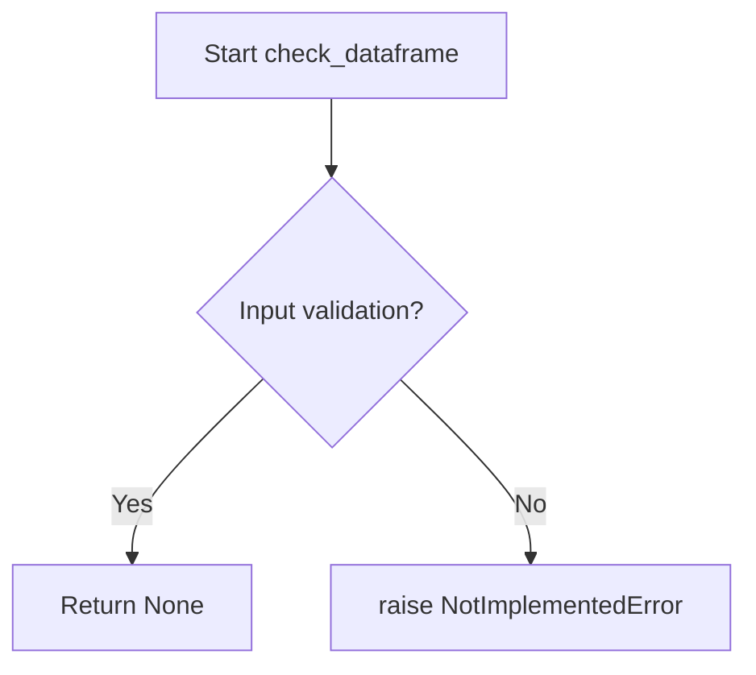
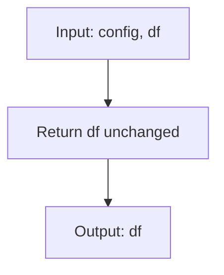

# `dataframe.py`

## `src.ydata_profiling.model.dataframe.check_dataframe` · *function*

## Summary:
Placeholder function for validating dataframe inputs in data profiling operations.

## Description:
This function is intended to validate that input data conforms to the expected dataframe format for data profiling operations. It serves as a placeholder that currently raises NotImplementedError and requires implementation.

The function is designed to be called early in the data profiling pipeline to validate dataframe inputs before proceeding with statistical analysis and reporting.

## Args:
    df (Any): A dataframe-like object to validate. This could be pandas DataFrame, Polars DataFrame, or other compatible dataframe implementations.

## Returns:
    None: This function does not return any value. Validation failures result in raised exceptions.

## Raises:
    NotImplementedError: Raised when the function has not been implemented yet.

## Constraints:
    Preconditions:
    - Input must be a valid dataframe-like object (to be validated in implementation)
    - Must not be None (to be validated in implementation)
    - Should have compatible structure for profiling operations (to be validated in implementation)
    
    Postconditions:
    - Function completes successfully only if dataframe passes all validation checks (to be implemented)
    - No modifications are made to the input dataframe

## Side Effects:
    None: This function performs no I/O operations or external state mutations.

## Control Flow:


## Examples:
```python
# This will raise NotImplementedError
import pandas as pd
df = pd.DataFrame({'a': [1, 2, 3], 'b': [4, 5, 6]})
check_dataframe(df)  # NotImplementedError raised

# Expected usage after implementation:
# check_dataframe(df)  # No exception raised if valid
```

## `src.ydata_profiling.model.dataframe.preprocess` · *function*

## Summary:
Returns the input dataframe unchanged, acting as a placeholder for preprocessing operations.

## Description:
This function serves as a preprocessing hook in the data profiling pipeline. It currently implements a simple passthrough operation that returns the input dataframe unchanged. The function signature follows the expected pattern for preprocessing functions in the profiling framework, accepting a configuration object and a dataframe, but does not perform any actual preprocessing operations at this time.

## Args:
    config (Settings): Configuration settings object for preprocessing control (currently unused in this implementation).
    df (Any): Input dataframe to be processed, typically containing data to be profiled.

## Returns:
    Any: The input dataframe unchanged, preserving all original data and structure.

## Raises:
    None: This implementation does not raise any exceptions.

## Constraints:
    Preconditions: 
    - config must be a valid Settings object
    - df must be a valid dataframe-like object
    
    Postconditions:
    - The returned dataframe is identical to the input dataframe
    - No modifications are made to the input data

## Side Effects:
    None: The function performs no I/O operations or external state mutations.

## Control Flow:


## Examples:
```python
# Basic usage - returns the same dataframe
config = Settings()
df = pd.DataFrame({'A': [1, 2, 3], 'B': [4, 5, 6]})
result_df = preprocess(config, df)
# result_df is identical to df
```

