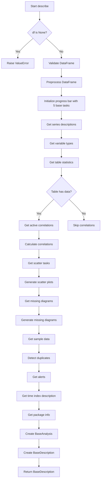

# `describe.py`

## `src.ydata_profiling.model.describe.describe` · *function*

## Summary
Performs comprehensive data profiling and analysis on a pandas DataFrame, returning a structured description containing statistical summaries, visualizations, and quality alerts.

## Description
The `describe` function orchestrates the complete data profiling pipeline for a pandas DataFrame. It performs a wide range of analyses including variable type detection, statistical summaries, correlation computations, missing value patterns, scatter plots, duplicate detection, and data quality alerts. The function is designed to be the central entry point for generating comprehensive data profiles and returns a `BaseDescription` object containing all analysis results.

This function is extracted into its own component rather than being inlined because it provides a clear separation between the orchestration of the profiling pipeline and the individual analysis components. It manages the execution flow, coordinates multiple analysis modules, handles progress tracking, and aggregates results into a unified description structure.

## Args
- config (Settings): Configuration object containing all settings for the profiling process including analysis options, visualization preferences, and quality thresholds
- df (pd.DataFrame): Input pandas DataFrame to be analyzed and profiled  
- summarizer (BaseSummarizer): Object responsible for generating summary statistics for different variable types
- typeset (VisionsTypeset): Set of data types recognized by the Visions library for type inference and validation
- sample (Optional[dict]): Optional custom sample data to use instead of generating a random sample. When provided, it should contain keys 'data', 'name', and 'caption'

## Returns
- BaseDescription: A structured object containing all profiling results with the following components:
  - analysis (BaseAnalysis): Metadata about the analysis including title, start/end timestamps
  - time_index_analysis (Optional[TimeIndexAnalysis]): Time series index analysis if enabled and applicable
  - table (dict): Table-level statistics including row count, column count, missing values, duplicates
  - variables (dict): Per-variable descriptions including type, statistics, and distribution information
  - scatter (dict): Scatter plot matrices for continuous variable pairs
  - correlations (dict): Correlation matrices for enabled correlation methods (pearson, spearman, etc.)
  - missing (dict): Missing value diagram results for enabled missing value visualization types
  - alerts (list): List of Alert objects identifying data quality issues
  - package (dict): Package version and configuration information for reproducibility
  - sample (list): Sample data points from the dataset
  - duplicates (Optional[pd.DataFrame]): Duplicate records identified in the dataset

## Raises
- ValueError: Raised when the input DataFrame is None, indicating a lazy ProfileReport without data

## Constraints
- Preconditions:
  - The input DataFrame must not be None
  - The config parameter must be a valid Settings object
  - The summarizer must be a valid BaseSummarizer instance
  - The typeset must be a valid VisionsTypeset instance
  - The DataFrame must pass initial validation checks via check_dataframe()

- Postconditions:
  - Returns a complete BaseDescription object with all analysis components populated
  - All progress bar operations complete successfully
  - The returned description object contains all expected analysis results

## Side Effects
- Creates a progress bar display if enabled in configuration (via tqdm)
- Performs I/O operations for displaying progress information
- May generate and update external state through the various analysis components
- Calls external functions that may perform their own side effects (file I/O, network calls, etc.)

## Control Flow


## Examples
```python
import pandas as pd
from ydata_profiling.config import Settings
from ydata_profiling.model.summarizer import BaseSummarizer
from visions import VisionsTypeset
from src.ydata_profiling.model.describe import describe

# Basic usage with default settings
df = pd.DataFrame({
    'name': ['Alice', 'Bob', 'Charlie'],
    'age': [25, 30, 35],
    'salary': [50000, 60000, 70000]
})

config = Settings()
summarizer = BaseSummarizer()
typeset = VisionsTypeset()

# Perform data description
description = describe(config, df, summarizer, typeset)

# Access results
print(f"Number of rows: {description.table['n']}")
print(f"Variable types: {list(description.variables.keys())}")

# Access specific variable statistics
for var_name, var_desc in description.variables.items():
    print(f"{var_name}: {var_desc['type']}")

# Access correlation results
if description.correlations:
    for corr_name, corr_matrix in description.correlations.items():
        print(f"{corr_name} correlation computed")

# Access alerts
if description.alerts:
    for alert in description.alerts:
        print(f"Alert: {alert.alert_type_name}")

# Custom sample usage
custom_sample = {
    'data': df.head(2),
    'name': 'Top 2 records',
    'caption': 'First two rows of the dataset'
}
description_with_sample = describe(config, df, summarizer, typeset, sample=custom_sample)
```

