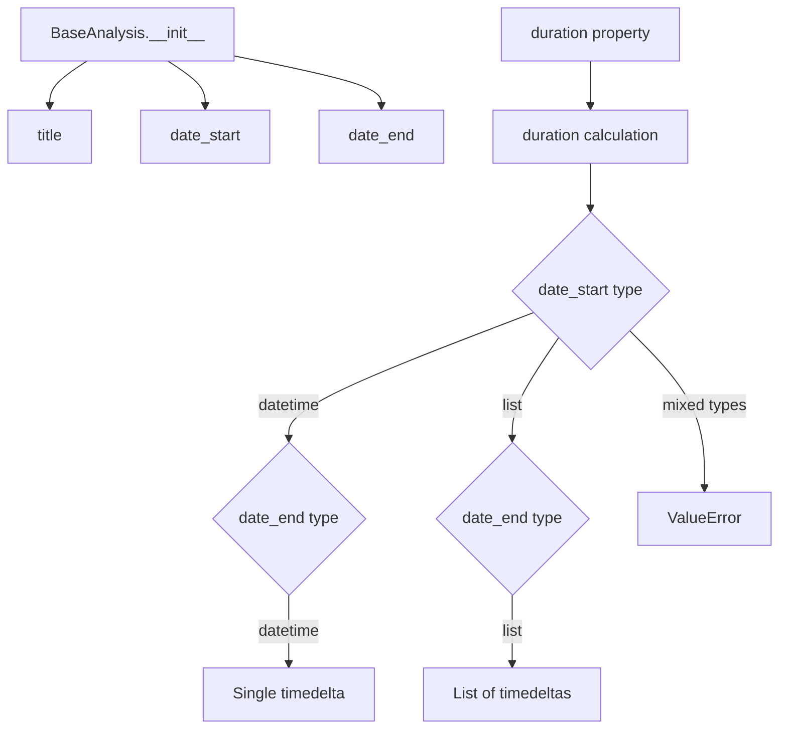
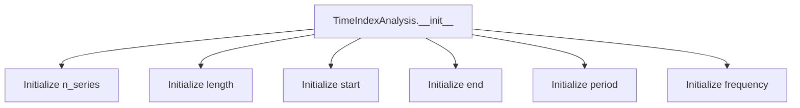
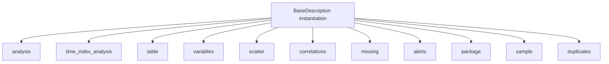

# `description.py`

## `src.ydata_profiling.model.description.BaseAnalysis` · *class*

## Summary:
Base class for representing an analysis with a title and temporal scope.

## Description:
The BaseAnalysis class serves as a foundational abstraction for analysis objects that require a title and temporal boundaries. It encapsulates the basic metadata needed to describe an analysis period, supporting both single datetime ranges and multiple datetime ranges through list-based date specifications.

This class establishes a common interface for analysis objects that need to track their temporal scope and calculate durations. It's designed to be inherited by more specific analysis implementations that add domain-specific functionality while maintaining the core temporal characteristics.

## State:
- title: str - The descriptive name or identifier for the analysis
- date_start: Union[datetime, List[datetime]] - The starting datetime(s) of the analysis period
- date_end: Union[datetime, List[datetime]] - The ending datetime(s) of the analysis period

The class maintains these attributes as-is without modification, with validation handled through the duration property's logic.

## Lifecycle:
- Creation: Instantiate with title, date_start, and date_end parameters
- Usage: Access title, date_start, date_end attributes directly; use duration property to calculate time spans
- Destruction: No special cleanup required; standard Python garbage collection applies

## Method Map:


## Raises:
- ValueError: When date_start and date_end have mismatched types (one is datetime, other is list)

## Example:
```python
from datetime import datetime
from src.ydata_profiling.model.description import BaseAnalysis

# Single datetime range
analysis = BaseAnalysis("Monthly Report", datetime(2023, 1, 1), datetime(2023, 1, 31))
print(analysis.title)  # "Monthly Report"
print(analysis.duration)  # timedelta(days=30)

# Multiple datetime ranges
start_dates = [datetime(2023, 1, 1), datetime(2023, 2, 1)]
end_dates = [datetime(2023, 1, 15), datetime(2023, 2, 15)]
multi_analysis = BaseAnalysis("Quarterly Analysis", start_dates, end_dates)
print(multi_analysis.duration)  # [timedelta(days=14), timedelta(days=14)]
```

### `src.ydata_profiling.model.description.BaseAnalysis.__init__` · *method*

## Summary:
Initializes a BaseAnalysis object with a title and date range.

## Description:
Constructs a BaseAnalysis instance by setting the title and date range attributes. This method serves as the primary constructor for the BaseAnalysis class, establishing the fundamental properties needed for analysis objects.

## Args:
    title (str): The title or name of the analysis.
    date_start (datetime): The starting date/time of the analysis period.
    date_end (datetime): The ending date/time of the analysis period.

## Returns:
    None: This method does not return a value.

## Raises:
    None: This method does not explicitly raise exceptions.

## State Changes:
    Attributes READ: None
    Attributes WRITTEN: self.title, self.date_start, self.date_end

## Constraints:
    Preconditions: All arguments must be provided and of the correct type (title as str, date_start and date_end as datetime).
    Postconditions: The instance will have its title, date_start, and date_end attributes set to the provided values.

## Side Effects:
    None: This method performs no I/O operations or external service calls.

### `src.ydata_profiling.model.description.BaseAnalysis.duration` · *method*

## Summary:
Calculates the time duration between start and end date/time points, returning either a single timedelta or a list of timedeltas.

## Description:
Computes the difference between the `date_start` and `date_end` attributes of a BaseAnalysis instance. This method serves as a utility for determining time intervals in profiling analysis workflows.

## Args:
    None

## Returns:
    Union[timedelta, List[timedelta]]: A single timedelta when both date_start and date_end are datetime objects, or a list of timedeltas when both are lists of datetime objects.

## Raises:
    ValueError: When date_start and date_end are not both datetime objects or both lists of datetime objects.

## State Changes:
    Attributes READ: self.date_start, self.date_end
    Attributes WRITTEN: None

## Constraints:
    Preconditions: Both self.date_start and self.date_end must be either datetime objects or lists of datetime objects of equal length.
    Postconditions: The returned timedelta(s) represent the exact time difference between the start and end points.

## Side Effects:
    None

## `src.ydata_profiling.model.description.TimeIndexAnalysis` · *class*

## Summary:
Represents metadata and statistical properties of time series data for profiling analysis.

## Description:
The TimeIndexAnalysis class serves as a container for storing and organizing metadata extracted from time series data during profiling operations. It captures essential characteristics such as the number of series, data length, temporal boundaries, periodicity, and frequency information that are crucial for time series analysis and reporting.

This class is typically instantiated by profiling components when analyzing time-indexed datasets to store computed statistics about the temporal structure of the data.

## State:
- n_series: Union[int, List[int]] - Number of time series in the dataset or list of counts per series
- length: Union[int, List[int]] - Total length of the time series or list of lengths per series  
- start: Any - Start timestamp or datetime of the time series data
- end: Any - End timestamp or datetime of the time series data
- period: Union[float, List[float]] - Average period/interval between observations or list of periods
- frequency: Union[Optional[str], List[Optional[str]]] - Frequency string identifier or list of identifiers

## Lifecycle:
Creation: Instantiate with required parameters n_series, length, start, end, and period. Optional frequency parameter can be provided.
Usage: The class is primarily used as a data container - attributes are set during initialization and accessed for reporting purposes.
Destruction: No special cleanup required; standard Python garbage collection handles object lifecycle.

## Method Map:


## Raises:
No exceptions are raised by the constructor under normal circumstances. However, invalid parameter types could cause downstream issues when the data is processed.

## Example:
```python
# Create a time index analysis object for a single time series
analysis = TimeIndexAnalysis(
    n_series=1,
    length=100,
    start=datetime(2023, 1, 1),
    end=datetime(2023, 12, 31),
    period=1.0,
    frequency="D"
)

# Access the stored metadata
print(f"Series count: {analysis.n_series}")
print(f"Data length: {analysis.length}")
```

### `src.ydata_profiling.model.description.TimeIndexAnalysis.__init__` · *method*

## Summary:
Initializes a TimeIndexAnalysis object with metadata describing time series data characteristics.

## Description:
The constructor sets up the fundamental temporal metadata for time series profiling analysis, including series count, data length, temporal boundaries, and periodicity information. This method serves as the primary entry point for creating TimeIndexAnalysis instances that store time series characteristics for subsequent analysis and reporting.

## Args:
- n_series (int): Number of time series in the dataset
- length (int): Total length of the time series data
- start (Any): Start timestamp or datetime of the time series data
- end (Any): End timestamp or datetime of the time series data
- period (float): Average period/interval between observations
- frequency (Optional[str]): Frequency string identifier, defaults to None

## Returns:
None: This method initializes instance attributes and does not return a value

## Raises:
No explicit exceptions are raised by this constructor, though invalid parameter types may cause downstream processing errors

## State Changes:
- Attributes READ: No attributes are read from the instance
- Attributes WRITTEN: 
  - self.n_series: Set to the provided n_series parameter
  - self.length: Set to the provided length parameter  
  - self.start: Set to the provided start parameter
  - self.end: Set to the provided end parameter
  - self.period: Set to the provided period parameter
  - self.frequency: Set to the provided frequency parameter

## Constraints:
- Preconditions: All parameters except frequency must be provided with appropriate types
- Postconditions: Instance attributes are initialized with the provided parameter values

## Side Effects:
No I/O operations, external service calls, or mutations to objects outside the instance occur during initialization

## `src.ydata_profiling.model.description.BaseDescription` · *class*

## Summary:
Base class for storing comprehensive data profiling analysis results and metadata.

## Description:
The BaseDescription class serves as a foundational data structure for encapsulating the complete output of data profiling operations. It defines the interface for storing various analytical components including statistical summaries, variable information, correlation matrices, missing data patterns, alerts, and sample data.

This class establishes a standardized structure for profiling results that can be implemented or extended by specific profiling components. It provides a consistent way to organize and access different aspects of data analysis without prescribing the exact implementation details.

## State:
- analysis: BaseAnalysis - Core analysis metadata including title and temporal scope
- time_index_analysis: Optional[TimeIndexAnalysis] - Statistical properties of time series data when applicable
- table: Any - Overall table statistics and metadata
- variables: Dict[str, Any] - Variable-level analysis results keyed by variable names
- scatter: Any - Scatter plot related analysis data
- correlations: Dict[str, Any] - Correlation matrix and related statistics
- missing: Dict[str, Any] - Missing data patterns and statistics
- alerts: Any - Alert and anomaly detection results
- package: Dict[str, Any] - Package version and dependency information
- sample: Any - Sample data points and sampling statistics
- duplicates: Any - Duplicate detection and counting results

## Lifecycle:
- Creation: Intended to be instantiated by profiling components with appropriate attributes populated
- Usage: Attributes are accessed to retrieve different aspects of the profiling analysis
- Destruction: Standard Python garbage collection handles cleanup

## Method Map:


## Raises:
No explicit exceptions are raised by the class itself since it's primarily a data container. The actual instantiation and validation would depend on how subclasses or implementing classes handle the attribute assignment.

## Example:
```python
# BaseDescription is typically used as a base class or data structure
# Implementation would populate the various attributes with analysis results

# Example of how attributes might be populated in a subclass or implementation:
description = BaseDescription()
description.analysis = BaseAnalysis("Dataset Analysis", start_date, end_date)
description.variables = {"column1": var_result1, "column2": var_result2}
description.correlations = {"pearson": corr_matrix}
# ... and so on for other attributes
```

