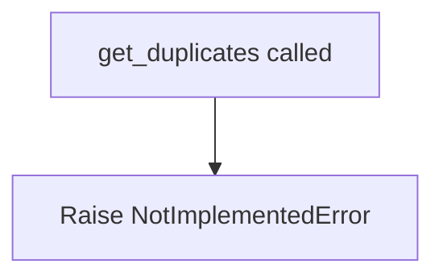

# `duplicates.py`

## `src.ydata_profiling.model.duplicates.get_duplicates` · *function*

## Summary:
Placeholder function for duplicate record detection in datasets.

## Description:
The `get_duplicates` function is a placeholder implementation for duplicate detection functionality. It is defined with a generic type parameter `T` to support various data container types while maintaining type safety in the interface.

This function serves as a planned interface for duplicate detection logic within the data profiling system, separating duplicate analysis from other profiling operations to enable modular design.

## Args:
    config (Settings): Configuration object containing profiling settings that control duplicate detection behavior.
    df (T): Input dataframe or data structure to analyze for duplicates. The generic type `T` allows flexibility in data container types.
    supported_columns (Sequence): Sequence of column names that should be considered when identifying duplicates.

## Returns:
    Tuple[Dict[str, Any], Optional[T]]: A tuple containing:
        - Dictionary with duplicate-related statistics and metadata
        - Optional dataframe containing deduplicated records (or None)

## Raises:
    NotImplementedError: This function is not yet implemented and will raise this exception when invoked.

## Constraints:
    Preconditions:
        - The config parameter must be a valid Settings instance
        - The df parameter must be a valid data structure compatible with the expected operations
        - The supported_columns parameter must be a sequence of valid column identifiers
        
    Postconditions:
        - When implemented, the function will return a consistent tuple structure

## Side Effects:
    None: This function does not perform any I/O operations or modify external state.

## Control Flow:


## Examples:
```python
# This function is not yet implemented
# When implemented, it would be used like:
# config = Settings()
# df = some_dataframe
# supported_columns = ['col1', 'col2']
# stats, dedup_df = get_duplicates(config, df, supported_columns)
```

