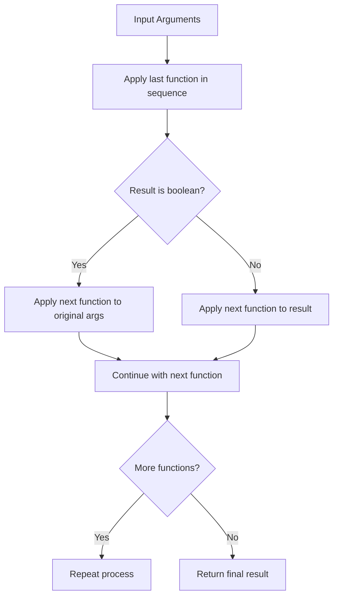
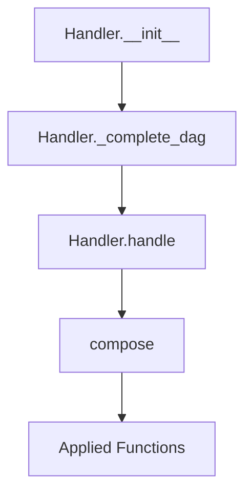
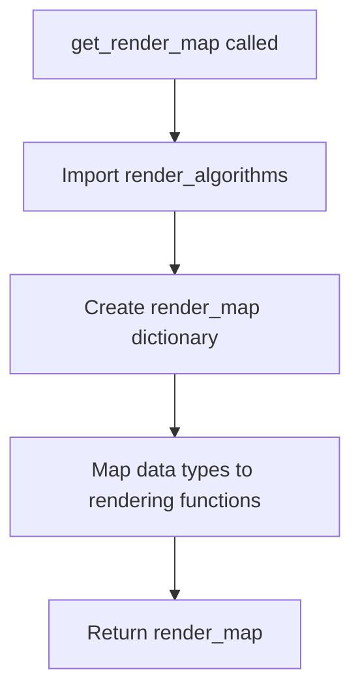

# `handler.py`

## `src.ydata_profiling.model.handler.compose` · *function*

## Summary:
Composes a sequence of functions into a single callable, applying functions in reverse order with conditional argument passing based on intermediate boolean results.

## Description:
Creates a composite function by chaining multiple callable objects together in reverse order. When an intermediate function returns a boolean value, the next function in the composition receives the original arguments rather than the boolean result. This enables conditional execution patterns where boolean outcomes control whether subsequent transformations operate on the original input.

## Args:
    functions (Sequence[Callable]): A sequence of callable objects to compose. Functions are applied from right to left (reverse order).

## Returns:
    Callable: A composed function that applies all input functions sequentially, with special handling for boolean intermediate results.

## Raises:
    None explicitly raised - depends on the behavior of the input functions.

## Constraints:
    Preconditions:
    - All elements in functions must be callable
    - Input functions should be compatible in terms of argument signatures
    
    Postconditions:
    - The returned function will apply all input functions in reverse order
    - Boolean-returning intermediate functions will cause subsequent functions to receive original arguments

## Side Effects:
    None - this is a pure functional operation that doesn't modify external state.

## Control Flow:


## Examples:
```python
# Basic composition example
def add_one(x): return x + 1
def multiply_by_two(x): return x * 2
composed = compose([add_one, multiply_by_two])
result = composed(5)  # multiply_by_two(5) = 10, then add_one(10) = 11

# Boolean handling example - demonstrates the special case
def is_even(x): return x % 2 == 0
def get_sign(x): return "positive" if x > 0 else "negative"
composed = compose([get_sign, is_even])
# When is_even(4) returns True, get_sign gets called with original arg 4
# Result would be "positive"

# Identity preservation example  
def identity(x): return x
def square(x): return x * x
composed = compose([identity, square])
result = composed(3)  # square(3) = 9, then identity(9) = 9

# Multiple function composition
def double(x): return x * 2
def subtract_one(x): return x - 1
def is_positive(x): return x > 0
composed = compose([is_positive, subtract_one, double])
# double(5) = 10, subtract_one(10) = 9, is_positive(9) = True
# So final result is True
```

## `src.ydata_profiling.model.handler.Handler` · *class*

## Summary:
A type handler that manages function mappings for different data types and applies composed operations based on type hierarchies.

## Description:
The Handler class serves as a dispatcher for type-specific operations in data profiling. It maintains a mapping of data type names to sequences of functions and uses type hierarchy information to ensure proper function composition. During initialization, it completes the function mappings by propagating functions through a type dependency graph derived from the provided VisionsTypeset.

## State:
- mapping: Dict[str, List[Callable]] - Maps data type names to lists of callable functions that should be applied to data of that type. This mapping is modified during initialization to include inherited functions from parent types.
- typeset: VisionsTypeset - An object containing type hierarchy information used to construct the dependency graph for function propagation.

## Lifecycle:
- Creation: Instantiate with a mapping dictionary, VisionsTypeset, and optional arguments. The constructor automatically calls `_complete_dag()` to propagate functions through the type hierarchy.
- Usage: Call handle() method with a data type string and arguments to execute composed functions for that type.
- Destruction: No explicit cleanup required; relies on Python's garbage collection.

## Method Map:


## Raises:
- None explicitly raised by __init__ method
- Exceptions may be raised by functions in the mapping when handle() is called

## Example:
```python
# Create a handler with function mappings
mapping = {
    "int": [validate_integer, normalize],
    "float": [validate_float, scale]
}
handler = Handler(mapping, typeset)

# Apply functions to data of specific type
result = handler.handle("int", data_value)
```

### `src.ydata_profiling.model.handler.Handler.__init__` · *method*

## Summary:
Initializes a type handler with function mappings and completes the dependency graph for type inheritance.

## Description:
Configures the handler with type-specific function mappings and type hierarchy information, then propagates functions through the type dependency graph to ensure all inherited type handlers are properly included in the mapping.

## Args:
    mapping (Dict[str, List[Callable]]): Dictionary mapping data type names to lists of callable functions that should be applied to data of that type.
    typeset (VisionsTypeset): Object containing type hierarchy information used to construct the dependency graph for function propagation.
    *args: Additional positional arguments (passed to parent class constructors if applicable).
    **kwargs: Additional keyword arguments (passed to parent class constructors if applicable).

## Returns:
    None

## Raises:
    None explicitly raised by this method.

## State Changes:
    Attributes READ: None
    Attributes WRITTEN: self.mapping, self.typeset

## Constraints:
    Preconditions:
    - mapping must be a dictionary mapping string type names to lists of callable functions
    - typeset must be a valid VisionsTypeset object containing type hierarchy information
    - typeset.base_graph must be a valid NetworkX graph with proper dependencies

    Postconditions:
    - self.mapping is initialized with the provided mapping
    - self.typeset is initialized with the provided typeset
    - The mapping has been completed with inherited functions from parent types through _complete_dag()

## Side Effects:
    Calls self._complete_dag() which processes the type hierarchy to propagate function mappings through the dependency graph.

### `src.ydata_profiling.model.handler.Handler._complete_dag` · *method*

## Summary:
Completes type handler mappings by propagating handlers through a dependency graph in topological order.

## Description:
This method processes the dependency relationships between data types in the typeset's base graph by computing a line graph and performing topological sorting. It then propagates type handlers from parent types to child types in dependency order, effectively completing the mapping of type handlers throughout the type hierarchy.

The method is called during Handler initialization to ensure all type mappings are properly populated based on type dependencies.

## Args:
    None

## Returns:
    None

## Raises:
    None explicitly raised

## State Changes:
    Attributes READ: self.typeset, self.mapping
    Attributes WRITTEN: self.mapping

## Constraints:
    Preconditions:
    - self.typeset.base_graph must be a valid NetworkX graph
    - self.mapping must be a dictionary mapping string type names to lists of callable handlers
    - The base_graph must have a valid topological ordering
    
    Postconditions:
    - All type mappings in self.mapping are updated to include inherited handlers from parent types
    - The mapping propagation follows the dependency structure defined in the typeset

## Side Effects:
    None

### `src.ydata_profiling.model.handler.Handler.handle` · *method*

## Summary:
Applies a sequence of type-specific handlers to input arguments based on data type mapping.

## Description:
Retrieves type-specific handler functions from the internal mapping, composes them into a single callable operation, and executes the composed function with provided arguments. This method serves as the primary interface for processing data according to its inferred type, enabling polymorphic behavior across different data types through configurable handler chains.

The method is typically invoked during data profiling operations when type-specific processing is required for variable analysis. It leverages the Handler's pre-configured mapping of data types to processing functions, allowing for extensible and type-aware data transformation workflows.

## Args:
    dtype (str): The string identifier for the data type to process
    *args: Variable length argument list passed to the composed handler functions
    **kwargs: Arbitrary keyword arguments passed to the composed handler functions

## Returns:
    dict: The result of executing the composed handler functions on the input arguments

## Raises:
    None explicitly raised - behavior depends on the implementation of the composed handler functions

## State Changes:
    Attributes READ: self.mapping
    Attributes WRITTEN: None

## Constraints:
    Preconditions:
    - The Handler instance must be properly initialized with a valid mapping
    - The dtype parameter must correspond to a key in self.mapping (or be a key that returns an empty list)
    - All functions in the mapped sequence must be callable and compatible with the provided arguments
    
    Postconditions:
    - Returns the result of applying all type-specific handlers in sequence
    - If no handlers are found for the given dtype, returns the result of composing an empty sequence (typically the identity operation)

## Side Effects:
    None - this method is stateless and does not modify external state or perform I/O operations

## `src.ydata_profiling.model.handler.get_render_map` · *function*

## Summary
Creates and returns a mapping from data type names to their corresponding rendering functions for report generation.

## Description
This function provides a centralized registry of rendering functions used to generate HTML reports for different data types. It maps string identifiers representing data types to callable functions that know how to render those data types in the final report. The function is designed to be a single source of truth for all data type renderers, making it easier to manage and extend rendering capabilities.

The render map is used throughout the reporting system to dynamically select the appropriate rendering function based on the detected data type of a variable. This allows the system to handle different data types (like Boolean, Numeric, Text, DateTime, etc.) with specialized rendering logic while maintaining a clean separation between data type detection and presentation logic.

## Returns
A dictionary mapping data type strings to their corresponding rendering functions:
- Keys: String identifiers for data types ("Boolean", "Numeric", "Complex", "Text", "DateTime", "Categorical", "URL", "Path", "File", "Image", "Unsupported", "TimeSeries")
- Values: Callable rendering functions from `ydata_profiling.report.structure.variables` module

## Side Effects
- Imports the `ydata_profiling.report.structure.variables` module internally
- Creates a new dictionary object containing function references

## Control Flow


