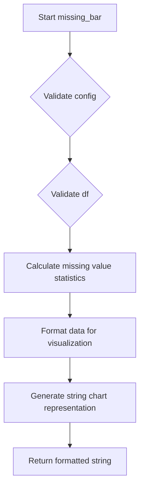
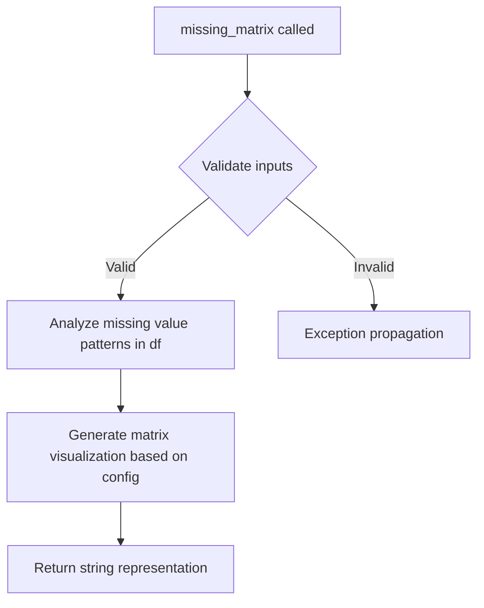
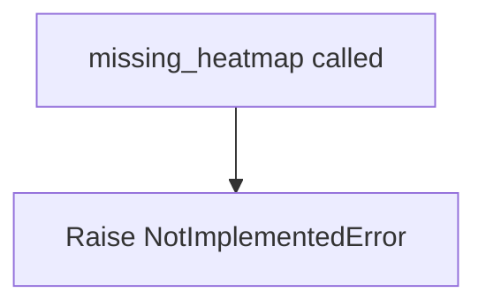
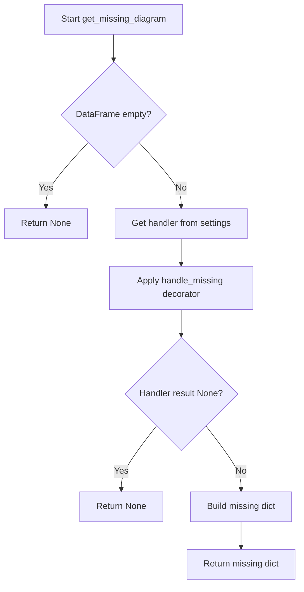

# `missing.py`

## `src.ydata_profiling.model.missing.missing_bar` · *function*

## Summary:
Generates a textual bar chart visualization displaying missing data patterns for DataFrame columns.

## Description:
Creates a string-based bar chart representation that visualizes the distribution of missing values across columns in a DataFrame. This visualization is a key component in data profiling workflows for quickly identifying data quality issues and missing value patterns.

The function serves as a placeholder in the data profiling pipeline for generating missing data visualizations. When implemented, it would calculate missing value statistics for each column and format them into a readable text-based bar chart.

## Args:
    config (Settings): Configuration object containing visualization parameters such as chart dimensions, styling options, and display preferences for the missing data chart.
    df (Any): Input DataFrame or data structure containing the dataset to analyze for missing values.

## Returns:
    str: String representation of a bar chart showing missing value counts or percentages for each column in the DataFrame. The output typically includes column labels and visual bar representations indicating missing value proportions.

## Raises:
    NotImplementedError: This function is currently not implemented and raises this exception when invoked.

## Constraints:
    Preconditions:
    - config must be a valid Settings object with appropriate configuration for visualization
    - df must be a valid DataFrame-like object that supports operations like .isnull() and .sum()

    Postconditions:
    - When implemented, the function will return a properly formatted string representation of a missing data visualization

## Side Effects:
    None: This function does not perform any I/O operations or mutate external state.

## Control Flow:


## Examples:
    Not applicable: Function is not yet implemented.

## `src.ydata_profiling.model.missing.missing_matrix` · *function*

## Summary
Generates a missing data matrix visualization representing patterns of missing values across all variables in a DataFrame.

## Description
Creates a matrix-style visualization that displays the presence or absence of missing values for each variable in the input DataFrame. This visualization is used in data profiling to identify systematic patterns in missing data, such as whether missing values occur together across variables or appear randomly.

The function is part of the missing data analysis module in ydata-profiling and corresponds to the "matrix" visualization option in the `missing_diagrams` configuration setting. It integrates with the broader profiling system to respect user-defined visualization preferences and rendering options.

## Args
- config (Settings): Configuration object containing profiling settings including missing data visualization preferences and rendering options
- df (Any): Input DataFrame containing the data to analyze for missing value patterns

## Returns
- str: String representation of the missing data matrix visualization, typically formatted as HTML or other visualization-ready format that can be embedded in profiling reports

## Raises
- NotImplementedError: Currently raised as the function implementation is incomplete

## Constraints
- Preconditions: 
  - config must be a valid Settings instance with proper initialization
  - df must be a valid DataFrame-like object that supports standard pandas operations
- Postconditions: 
  - When implemented, function will return a string representation of a missing data visualization that follows the configured style and format

## Side Effects
- None directly observable

## Control Flow


## Examples
```python
from src.ydata_profiling.config import Settings
import pandas as pd

# Create sample data with missing values
df = pd.DataFrame({
    'A': [1, 2, None, 4],
    'B': [None, 2, 3, 4],
    'C': [1, None, None, 4]
})

# Configure settings with missing diagram enabled
config = Settings(missing_diagrams={"matrix": True})

# Generate missing matrix visualization (currently raises NotImplementedError)
try:
    result = missing_matrix(config, df)
    print(result)
except NotImplementedError:
    print("Missing matrix visualization not yet implemented")
```

## `src.ydata_profiling.model.missing.missing_heatmap` · *function*

## Summary:
Placeholder function for generating a heatmap visualization of missing data patterns.

## Description:
This function is intended to create a heatmap visualization representing missing data patterns in a DataFrame. It serves as a placeholder for future implementation of missing data visualization capabilities within the profiling framework.

## Args:
    config (Settings): Configuration object containing profiling settings and options
    df (Any): Input DataFrame or data structure containing the dataset to analyze for missing values

## Returns:
    str: String representation of the heatmap visualization (typically HTML or image data)

## Raises:
    NotImplementedError: Always raised as the implementation is incomplete

## Constraints:
    Preconditions:
        - config parameter must be a valid Settings object
        - df parameter must be a valid data structure that can be processed for missing value analysis
    Postconditions:
        - Function raises NotImplementedError indicating incomplete implementation

## Side Effects:
    None: This function doesn't perform any I/O operations or external state mutations

## Control Flow:


## Examples:
    Not applicable: Function is not implemented yet

## `src.ydata_profiling.model.missing.get_missing_active` · *function*

## Summary:
Determines which missing data visualization methods are active based on configuration settings and data characteristics.

## Description:
Filters available missing data visualization methods to return only those that should be displayed given the current configuration and dataset properties. This function evaluates whether each visualization type (bar, matrix, heatmap) should be enabled based on user preferences, minimum requirements for missing data, and data-specific conditions.

The function is used in the data profiling pipeline to dynamically determine which missing value visualizations to generate and display, ensuring that only relevant and meaningful visualizations are presented to users based on their configuration and the actual missing data patterns in their dataset.

## Args:
    config (Settings): Configuration object containing user preferences for missing data visualizations, specifically the `missing_diagrams` setting that controls which diagram types are enabled.
    table_stats (dict): Dictionary containing statistical information about the dataset, including:
        - n_vars_with_missing: Number of variables (columns) that contain missing values
        - n_vars_all_missing: Number of variables (columns) that have all values missing

## Returns:
    dict: Filtered dictionary mapping active missing data visualization names to their configuration settings. Each entry contains:
        - min_missing: Minimum number of variables with missing values required for this visualization
        - name: Display name for the visualization
        - caption: Description of the visualization
        - function: Reference to the visualization function (not called by this function)

## Raises:
    None: This function does not raise any exceptions directly.

## Constraints:
    Preconditions:
    - config must be a valid Settings object with proper initialization
    - table_stats must be a dictionary containing keys 'n_vars_with_missing' and 'n_vars_all_missing'
    - All required keys in table_stats must have numeric values

    Postconditions:
    - The returned dictionary will only contain visualization types that meet both configuration and data requirements
    - The returned dictionary will be empty if no visualization types meet the criteria

## Side Effects:
    None: This function performs no I/O operations or external state mutations.

## Control Flow:
```mermaid
flowchart TD
    A[get_missing_active called] --> B[Initialize missing_map with all visualization types]
    B --> C[Filter missing_map based on config.missing_diagrams[name]]
    C --> D{config.missing_diagrams[name] enabled?}
    D -->|No| E[Exclude visualization]
    D -->|Yes| F[Check n_vars_with_missing >= min_missing]
    F --> G{Sufficient missing vars?}
    G -->|No| H[Exclude visualization]
    G -->|Yes| I{Is heatmap?}
    I -->|Yes| J[Special heatmap condition check]
    J --> K{Enough partial missing vars?}
    K -->|No| L[Exclude heatmap]
    K -->|Yes| M[Include heatmap]
    I -->|No| N[Include visualization]
    L --> O[Return filtered map]
    M --> O
    H --> O
    N --> O
```

## Examples:
    # Example usage in a data profiling context
    config = Settings(missing_diagrams={"bar": True, "matrix": False, "heatmap": True})
    table_stats = {
        "n_vars_with_missing": 5,
        "n_vars_all_missing": 2
    }
    
    active_visualizations = get_missing_active(config, table_stats)
    # Result would include "bar" (enabled in config, 5 >= 0) and "heatmap" (enabled, 5-2=3 >= 2)
    # "matrix" would be excluded because it's disabled in config

## `src.ydata_profiling.model.missing.handle_missing` · *function*

## Summary:
Decorator function that wraps a callable to catch ValueError exceptions and issue warnings about missing data operations.

## Description:
This decorator function provides error handling for data operations that might encounter missing data scenarios. When the wrapped function raises a ValueError, it catches the exception and attempts to issue a warning instead of propagating the error.

The function is designed to be used in data profiling contexts where certain operations might fail due to missing values, but the system should log the issue rather than crash. However, the current implementation contains a bug in the warning message construction.

## Args:
    name (str): A descriptive identifier for the operation that might encounter missing data
    fn (Callable): The function to be wrapped with error handling

## Returns:
    Callable: A new function that wraps the original function with ValueError catching and warning behavior

## Raises:
    ValueError: If the wrapped function raises a ValueError, it will be caught and converted to a warning (the original exception is not re-raised)

## Constraints:
    Preconditions:
    - The `name` parameter must be a valid string describing the operation
    - The `fn` parameter must be a callable that accepts arbitrary positional and keyword arguments
    
    Postconditions:
    - For successful executions, the wrapped function behaves identically to the original
    - For ValueError exceptions, the original exception is suppressed and replaced with a warning
    - The warning message construction contains a bug (incomplete f-string)

## Side Effects:
    - Issues Python warnings via the warnings module when ValueErrors occur
    - No other external state mutations or I/O operations

## Control Flow:
```mermaid
flowchart TD
    A[Call decorated function] --> B{Does function succeed?}
    B -- Yes --> C[Return result]
    B -- No --> D{Is ValueError raised?}
    D -- Yes --> E[Attempt to issue warning (buggy implementation)]
    E --> F[Return None (implicit)]
    D -- No --> G[Raise original exception]
```

## Examples:
```python
@handle_missing("column_statistics_calculation")
def calculate_column_stats(df, column_name):
    # Some operation that might raise ValueError for missing data
    return df[column_name].describe()

# If calculate_column_stats raises ValueError, it will be caught
# and a warning will be issued instead of crashing the application
# Note: The warning message will be malformed due to implementation bug
```

## `src.ydata_profiling.model.missing.get_missing_diagram` · *function*

## Summary
Creates a structured representation of missing data diagrams for inclusion in profiling reports.

## Description
Processes missing data visualization configurations and generates a standardized dictionary structure containing missing data matrix information. This function acts as a bridge between configuration settings and the actual missing data diagram generation, ensuring consistent data structure for reporting purposes.

The function applies error handling to missing data computations using the `handle_missing` decorator, which catches potential ValueError exceptions and issues warnings instead of crashing the application.

## Args
- config (Settings): Configuration object containing profiling settings and parameters
- df (pd.DataFrame): Input DataFrame containing the data to analyze for missing values
- settings (Dict[str, Any]): Dictionary containing configuration settings for the missing data diagram including:
  - "name" (str): Identifier for the missing data diagram type
  - "function" (Callable): Handler function to process missing data
  - "caption" (str): Human-readable description for the diagram

## Returns
- Optional[Dict[str, Any]]: Dictionary containing the structured missing data diagram information with keys "name", "caption", and "matrix", or None if the input DataFrame is empty or processing fails

## Raises
- None explicitly raised, though underlying functions may raise exceptions that are handled by the `handle_missing` decorator

## Constraints
- Preconditions:
  - The input DataFrame `df` must be a valid pandas DataFrame
  - The `settings` dictionary must contain "name", "function", and "caption" keys
  - The `config` parameter must be a valid Settings instance
- Postconditions:
  - If DataFrame length is zero, returns None immediately
  - If processing succeeds, returns a dictionary with the expected structure
  - If the handler function returns None, returns None

## Side Effects
- Uses the warnings module when underlying operations encounter errors (via `handle_missing` decorator)
- No direct I/O operations or external state mutations

## Control Flow


## Examples
```python
# Typical usage in a missing data analysis context
config = Settings()
df = pd.DataFrame({'A': [1, None, 3], 'B': [None, 2, 3]})
settings = {
    "name": "matrix",
    "function": matrix_handler_function,
    "caption": "Missing Data Matrix"
}

result = get_missing_diagram(config, df, settings)
# Returns: {"name": "matrix", "caption": "Missing Data Matrix", "matrix": <processed_data>}
```

