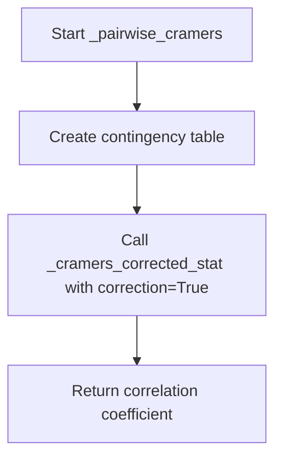
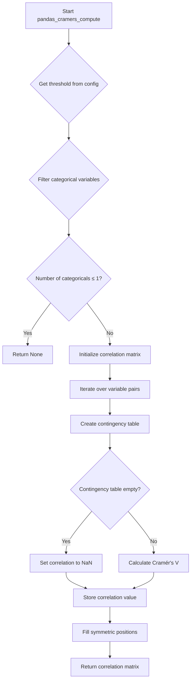
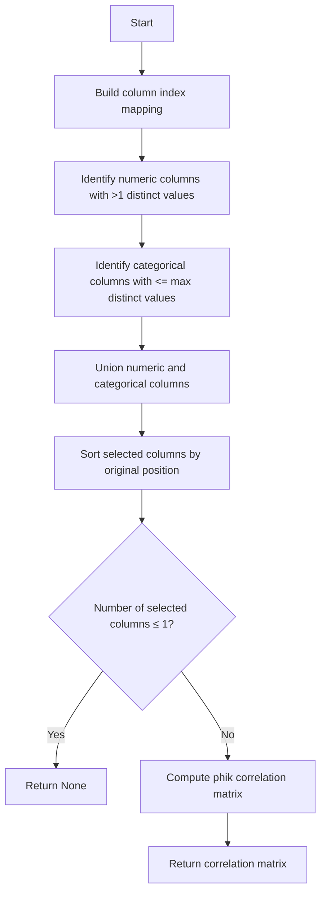
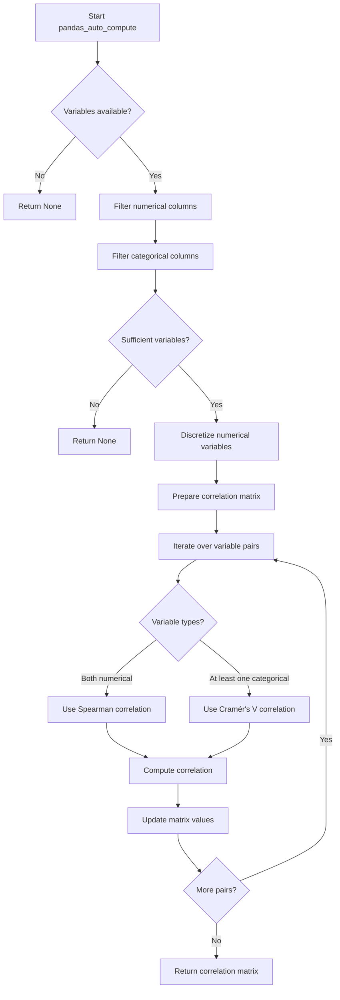

# `correlations_pandas.py`

## `src.ydata_profiling.model.pandas.correlations_pandas.pandas_spearman_compute` · *function*

## Summary
Computes Spearman rank correlation coefficients for numerical columns in a pandas DataFrame.

## Description
This function calculates the Spearman rank correlation matrix for numerical columns in a pandas DataFrame. It serves as a specific implementation of Spearman correlation computation within the ydata-profiling library's pandas-based correlation analysis framework. The function leverages pandas' optimized `corr()` method with the Spearman method parameter.

The function is part of a family of correlation computation functions that provide standardized interfaces for different correlation methods (Pearson, Spearman, Kendall, phi-k) in the profiling system. It follows the same signature pattern as other correlation functions like `pandas_pearson_compute` and `pandas_kendall_compute`.

## Args
    config (Settings): Configuration settings controlling correlation analysis behavior (currently unused in implementation).
    df (pd.DataFrame): Input DataFrame containing numerical data for correlation analysis.
    summary (dict): Summary statistics dictionary (currently unused in implementation).

## Returns
    Optional[pd.DataFrame]: A DataFrame containing Spearman rank correlation coefficients between all pairs of numerical columns. Returns None if the DataFrame contains no numerical columns or if correlation computation fails due to insufficient data.

## Raises
    None explicitly raised in the current implementation.

## Constraints
    Preconditions:
    - Input df must be a valid pandas DataFrame
    - DataFrame should contain numerical data for meaningful correlation computation
    
    Postconditions:
    - Returns a symmetric correlation matrix with values between -1 and 1
    - Diagonal elements are always 1.0
    - Correlation matrix dimensions match the number of numerical columns
    - Returns None when no numerical columns are present or computation fails

## Side Effects
    None

## Control Flow
```mermaid
flowchart TD
    A[Start pandas_spearman_compute] --> B{Input validation}
    B -->|Valid DataFrame with numerical columns| C[Call df.corr(method="spearman")]
    C --> D[Return correlation matrix]
    B -->|Invalid/empty DataFrame or no numerical columns| E[Return None]
```

## Examples
```python
import pandas as pd
from ydata_profiling.config import Settings

# Basic usage
config = Settings()
df = pd.DataFrame({'A': [1, 2, 3], 'B': [4, 5, 6], 'C': [7, 8, 9]})
result = pandas_spearman_compute(config, df, {})
print(result)

# With mixed data types (only numerical columns will be considered)
df_mixed = pd.DataFrame({'A': [1, 2, 3], 'B': ['x', 'y', 'z'], 'C': [7, 8, 9]})
result = pandas_spearman_compute(config, df_mixed, {})
print(result)
```

## `src.ydata_profiling.model.pandas.correlations_pandas.pandas_pearson_compute` · *function*

## Summary:
Computes Pearson correlation coefficients for a given DataFrame using pandas' built-in correlation method.

## Description:
This function calculates the Pearson correlation matrix for numerical columns in a pandas DataFrame. It serves as a specific implementation of the Pearson correlation computation within the ydata-profiling library's pandas-based correlation analysis framework. The function leverages pandas' optimized `corr()` method with the Pearson method parameter.

## Args:
    config (Settings): Configuration settings for the profiling process (currently unused in implementation).
    df (pd.DataFrame): Input DataFrame containing numerical data for correlation analysis.
    summary (dict): Summary statistics dictionary (currently unused in implementation).

## Returns:
    Optional[pd.DataFrame]: A DataFrame containing Pearson correlation coefficients between all pairs of numerical columns. Returns None if the DataFrame contains no numerical columns or if correlation computation fails due to insufficient data.

## Raises:
    None explicitly raised in the current implementation.

## Constraints:
    Preconditions:
    - Input df must be a valid pandas DataFrame
    - DataFrame should contain numerical data for meaningful correlation computation
    
    Postconditions:
    - Returns a symmetric correlation matrix with values between -1 and 1
    - Diagonal elements are always 1.0
    - Correlation matrix dimensions match the number of numerical columns
    - Returns None when no numerical columns are present or computation fails

## Side Effects:
    None

## Control Flow:
```mermaid
flowchart TD
    A[Start pandas_pearson_compute] --> B{Input validation}
    B -->|Valid DataFrame with numerical columns| C[Call df.corr(method="pearson")]
    C --> D[Return correlation matrix]
    B -->|Invalid/empty DataFrame or no numerical columns| E[Return None]
```

## Examples:
```python
import pandas as pd
from ydata_profiling.config import Settings

# Basic usage
config = Settings()
df = pd.DataFrame({'A': [1, 2, 3], 'B': [4, 5, 6], 'C': [7, 8, 9]})
result = pandas_pearson_compute(config, df, {})
print(result)

# With mixed data types (only numerical columns will be considered)
df_mixed = pd.DataFrame({'A': [1, 2, 3], 'B': ['x', 'y', 'z'], 'C': [7, 8, 9]})
result = pandas_pearson_compute(config, df_mixed, {})
print(result)
```

## `src.ydata_profiling.model.pandas.correlations_pandas.pandas_kendall_compute` · *function*

## Summary
Computes Kendall's rank correlation coefficient matrix for numeric variables using pandas' built-in method.

## Description
This function provides a simple wrapper around pandas' `corr(method="kendall")` method to compute Kendall's tau correlation coefficients between pairs of numeric variables. It is part of the ydata-profiling framework's correlation analysis system, specifically designed for non-parametric ordinal association measurement.

Kendall's tau is particularly useful when dealing with small datasets or when the data contains many tied ranks, as it's more robust than Pearson correlation in such cases. This function enables the correlation analysis pipeline to compute Kendall correlations when configured in the Settings object.

The function follows the established pattern of other correlation computation functions in the module (pandas_pearson_compute, pandas_spearman_compute, etc.), maintaining consistency in the correlation analysis framework while providing direct access to pandas' optimized implementation.

## Args
    config (Settings): Configuration settings controlling correlation analysis behavior, including flags for calculation and binning parameters. This parameter provides context for how correlation analysis should be performed according to user-defined settings.
    df (pd.DataFrame): Input dataset containing numeric variables to correlate. The DataFrame should contain only numeric columns for meaningful Kendall correlation computation. Missing values are handled by pandas' internal implementation.
    summary (dict): Pre-computed summary statistics about the dataset, containing metadata that may influence correlation computation such as variable types, missing values, and distributions.

## Returns
    Optional[pd.DataFrame]: A symmetric correlation matrix where each cell [i,j] represents Kendall's tau correlation coefficient between variables i and j. Values range from -1 (perfect negative correlation) to 1 (perfect positive correlation), with 0 indicating no monotonic relationship. Returns None if:
    - The DataFrame is empty
    - The DataFrame contains no numeric columns
    - The DataFrame has insufficient data for correlation computation
    - All columns have constant values

## Raises
    None explicitly raised by this function, but may propagate exceptions from pandas' internal correlation computation if the DataFrame contains incompatible data types or is malformed.

## Constraints
    Preconditions:
        - config must be a valid Settings object with proper configuration
        - df must be a valid pandas DataFrame with numeric columns
        - summary must be a dictionary with appropriate metadata
        
    Postconditions:
        - Returns a symmetric DataFrame with diagonal values of 1.0
        - Off-diagonal values are Kendall's tau correlation coefficients or NaN for undefined correlations
        - Returns None if DataFrame has insufficient data for correlation analysis

## Side Effects
    None

## Control Flow
```mermaid
flowchart TD
    A[Start pandas_kendall_compute] --> B{Validate inputs}
    B --> C{DataFrame empty or insufficient data?}
    C -- Yes --> D[Return None]
    C -- No --> E[Call df.corr(method="kendall")]
    E --> F[Return correlation matrix]
```

## Examples
    # Basic usage with numeric data
    import pandas as pd
    from src.ydata_profiling.config import Settings
    
    # Sample dataset with numeric variables
    df = pd.DataFrame({
        'A': [1, 2, 3, 4, 5],
        'B': [2, 4, 1, 5, 3],
        'C': [1, 3, 2, 4, 5]
    })
    
    # Configuration
    config = Settings()
    
    # Summary statistics (simplified)
    summary = {}
    
    # Compute Kendall correlation matrix
    correlation_matrix = pandas_kendall_compute(config, df, summary)
    print(correlation_matrix)
    
    # Output would be a 3x3 symmetric matrix showing Kendall's tau coefficients
    # Diagonal elements would be 1.0, off-diagonal elements would be correlation coefficients
    
    # Edge case: Empty DataFrame
    empty_df = pd.DataFrame()
    result = pandas_kendall_compute(config, empty_df, {})
    print(result)  # None

## `src.ydata_profiling.model.pandas.correlations_pandas._cramers_corrected_stat` · *function*

## Summary:
Calculates Cramér's corrected statistic (Cramér's V) for measuring association between categorical variables from a contingency table.

## Description:
This function computes Cramér's V correlation coefficient, which quantifies the strength of association between two nominal categorical variables. It's particularly useful for analyzing relationships in contingency tables and adjusts for table dimensions and sample size. The function applies corrections for small sample sizes and handles edge cases appropriately.

The function is part of the internal correlation calculations in the ydata-profiling library and is used primarily for categorical variable analysis.

## Args:
    confusion_matrix (pd.DataFrame): A contingency table (cross-tabulation) of two categorical variables
    correction (bool): Whether to apply Yates' correction for continuity (default: False)

## Returns:
    float: Cramér's V correlation coefficient ranging from 0 to 1, where:
        - 0 indicates no association between variables  
        - 1 indicates perfect association
        - Values closer to 1 suggest stronger association
        - Returns 0 for empty matrices

## Raises:
    None explicitly raised, but may raise exceptions from scipy.stats.chi2_contingency if input is invalid

## Constraints:
    Preconditions:
        - confusion_matrix must be a valid pandas DataFrame
        - confusion_matrix should represent a contingency table with categorical data (non-negative integers)
        - Values should be counts/occurrences
    
    Postconditions:
        - Returns a float value between 0 and 1 inclusive
        - Handles empty matrices gracefully by returning 0

## Side Effects:
    None

## Control Flow:
```mermaid
flowchart TD
    A[Start _cramers_corrected_stat] --> B{confusion_matrix.empty?}
    B -- Yes --> C[Return 0]
    B -- No --> D[Calculate chi2_contingency]
    D --> E[Calculate n, phi2, r, k]
    E --> F[Apply corrections]
    F --> G{rkcorr == 0.0?}
    G -- Yes --> H[Set corr = 1.0]
    G -- No --> I[Calculate corr = sqrt(phi2corr/rkcorr)]
    I --> J[Return corr]
    H --> J
```

## Examples:
    # Basic usage with a contingency table
    import pandas as pd
    import numpy as np
    
    # Create sample contingency table
    data = [[10, 15, 5], [20, 25, 10], [5, 10, 15]]
    df = pd.DataFrame(data, columns=['A', 'B', 'C'], index=['X', 'Y', 'Z'])
    
    # Calculate Cramér's V
    result = _cramers_corrected_stat(df, correction=False)
    print(f"Cramér's V: {result:.3f}")
    
    # With correction applied
    result_corrected = _cramers_corrected_stat(df, correction=True)
    print(f"Cramér's V (corrected): {result_corrected:.3f}")
    
    # Empty matrix case
    empty_df = pd.DataFrame()
    result_empty = _cramers_corrected_stat(empty_df, correction=False)
    print(f"Empty matrix result: {result_empty}")  # Should return 0

## `src.ydata_profiling.model.pandas.correlations_pandas._pairwise_spearman` · *function*

## Summary:
Computes the Spearman rank correlation coefficient between two pandas Series.

## Description:
This function calculates the Spearman rank correlation coefficient, which measures the monotonic relationship between two variables. It's a wrapper around pandas' built-in correlation method with spearman method specified.

## Args:
    col_1 (pd.Series): First pandas Series containing numeric data
    col_2 (pd.Series): Second pandas Series containing numeric data

## Returns:
    float: Spearman correlation coefficient ranging from -1 to 1, where:
        - 1 indicates perfect positive monotonic relationship
        - 0 indicates no monotonic relationship
        - -1 indicates perfect negative monotonic relationship

## Raises:
    None explicitly raised, but may raise exceptions from pandas corr() method if inputs are invalid

## Constraints:
    Preconditions:
        - Both input arguments must be pandas Series objects
        - Both Series should contain numeric data that can be ranked
        - Both Series must have the same length for meaningful correlation calculation
    
    Postconditions:
        - Returns a float value between -1 and 1 inclusive
        - Function execution does not modify input Series

## Side Effects:
    None

## Control Flow:
```mermaid
flowchart TD
    A[Input: Two pandas Series] --> B{Valid inputs?}
    B -->|Yes| C[Call col_1.corr(col_2, method="spearman")]
    C --> D[Return correlation coefficient]
    B -->|No| E[Raise pandas error]
```

## Examples:
    # Basic usage
    import pandas as pd
    series1 = pd.Series([1, 2, 3, 4, 5])
    series2 = pd.Series([2, 4, 6, 8, 10])
    correlation = _pairwise_spearman(series1, series2)
    # Returns 1.0 (perfect positive correlation)
    
    # Negative correlation
    series1 = pd.Series([1, 2, 3, 4, 5])
    series2 = pd.Series([5, 4, 3, 2, 1])
    correlation = _pairwise_spearman(series1, series2)
    # Returns -1.0 (perfect negative correlation)
```

## `src.ydata_profiling.model.pandas.correlations_pandas._pairwise_cramers` · *function*

## Summary:
Computes Cramér's corrected V correlation coefficient between two categorical variables represented as pandas Series.

## Description:
Calculates the strength of association between two nominal categorical variables using Cramér's V correlation metric. This function creates a contingency table from the input Series and applies Cramér's corrected statistic to measure their association strength.

The function is designed to be used in pairwise correlation calculations for categorical data within the ydata-profiling library's correlation analysis module.

## Args:
    col_1 (pd.Series): First categorical variable as a pandas Series
    col_2 (pd.Series): Second categorical variable as a pandas Series

## Returns:
    float: Cramér's V correlation coefficient ranging from 0 to 1, where:
        - 0 indicates no association between variables  
        - 1 indicates perfect association
        - Values closer to 1 suggest stronger association

## Raises:
    None explicitly raised, but may propagate exceptions from:
    - pd.crosstab() if input Series contain invalid data
    - _cramers_corrected_stat() if contingency table is malformed

## Constraints:
    Preconditions:
        - Both col_1 and col_2 must be valid pandas Series objects
        - Both Series should contain categorical data suitable for cross-tabulation
        
    Postconditions:
        - Returns a float value between 0 and 1 inclusive
        - Function is deterministic for identical inputs

## Side Effects:
    None

## Control Flow:


## Examples:
    # Basic usage with two categorical Series
    import pandas as pd
    
    # Create sample categorical data
    series1 = pd.Series(['A', 'B', 'A', 'C', 'B'])
    series2 = pd.Series(['X', 'Y', 'X', 'Z', 'Y'])
    
    # Calculate pairwise Cramér's V correlation
    correlation = _pairwise_cramers(series1, series2)
    print(f"Correlation: {correlation:.3f}")
```

## `src.ydata_profiling.model.pandas.correlations_pandas.pandas_cramers_compute` · *function*

## Summary
Computes Cramér's V correlation matrix for categorical variables in a pandas DataFrame.

## Description
This function calculates the Cramér's V correlation coefficient between pairs of categorical variables to measure the strength of association between them. It filters categorical variables based on a maximum distinct value threshold from configuration and constructs a symmetric correlation matrix. The function is part of the data profiling correlation analysis pipeline and is specifically designed for categorical variable relationships.

The function is called by the correlation analysis system when Cramér's V correlation is configured for analysis. It's designed to work with the ydata-profiling framework's data summary statistics to identify appropriate categorical variables for correlation computation.

## Args
    config (Settings): Configuration settings that control correlation analysis behavior, including the `categorical_maximum_correlation_distinct` threshold that determines which categorical variables to include in correlation analysis.
    df (pd.DataFrame): Input dataset containing the variables to correlate, typically a pandas DataFrame with categorical columns.
    summary (dict): Pre-computed summary statistics about the dataset, containing metadata about variable types and distinct value counts that helps determine which variables are suitable for Cramér's V correlation analysis.

## Returns
    Optional[pd.DataFrame]: A symmetric correlation matrix where each cell [i,j] represents the Cramér's V correlation coefficient between categorical variables i and j. Values range from 0 (no association) to 1 (perfect association). Returns None if there are 1 or fewer categorical variables that meet the distinct value threshold requirements.

## Raises
    None explicitly raised by this function, but may propagate exceptions from internal operations like pandas crosstab or _cramers_corrected_stat.

## Constraints
    Preconditions:
        - config must contain a valid `categorical_maximum_correlation_distinct` setting
        - df must be a valid pandas DataFrame
        - summary must be a dictionary with variable metadata including "type" and "n_distinct" keys
        
    Postconditions:
        - Returns None if fewer than 2 categorical variables meet the distinct value threshold
        - Returns a symmetric DataFrame with diagonal values of 1.0
        - Off-diagonal values are Cramér's V correlation coefficients or NaN for empty contingency tables

## Side Effects
    None

## Control Flow


## Examples
    # Basic usage with categorical data
    import pandas as pd
    from src.ydata_profiling.config import Settings
    
    # Sample dataset with categorical variables
    df = pd.DataFrame({
        'color': ['red', 'blue', 'red', 'green', 'blue'],
        'size': ['small', 'large', 'medium', 'small', 'large'],
        'shape': ['circle', 'square', 'circle', 'triangle', 'square']
    })
    
    # Summary statistics (simplified)
    summary = {
        'color': {'type': 'Categorical', 'n_distinct': 3},
        'size': {'type': 'Categorical', 'n_distinct': 3}, 
        'shape': {'type': 'Categorical', 'n_distinct': 3}
    }
    
    # Configuration with default threshold
    config = Settings()
    
    # Compute Cramér's V correlation matrix
    correlation_matrix = pandas_cramers_compute(config, df, summary)
    print(correlation_matrix)
    
    # Output would be a 3x3 symmetric matrix with values between 0 and 1
    # Diagonal elements would be 1.0, off-diagonal elements would be correlation coefficients

## `src.ydata_profiling.model.pandas.correlations_pandas.pandas_phik_compute` · *function*

## Summary:
Computes phi-k correlation matrix for mixed-type variables in a pandas DataFrame using the phik library.

## Description:
This function calculates the phi-k correlation coefficient between variables in a dataset, which is particularly useful for measuring associations between categorical variables and mixed-type data. It filters variables based on their data types and distinct value counts, then applies the phik library to compute the correlation matrix. The function is designed to work within the ydata-profiling correlation analysis framework and specifically implements the phi-k correlation method.

The function extracts numeric columns with sufficient distinct values and categorical columns meeting the maximum distinct value threshold, then computes pairwise correlations using the phik library. It handles edge cases where insufficient variables exist for correlation analysis.

## Args:
    config (Settings): Configuration settings controlling correlation analysis behavior, including flags for calculation, thresholds, and binning parameters
    df (pd.DataFrame): Input dataset containing variables to correlate
    summary (dict): Pre-computed summary statistics about the dataset, containing metadata that influences correlation computation such as variable types, missing values, and distributions. Each key corresponds to a DataFrame column name, with values being dictionaries containing at least 'type' and 'n_distinct' keys.

## Returns:
    Optional[pd.DataFrame]: Correlation matrix representing variable relationships as a pandas DataFrame with shape (n_variables, n_variables), or None if correlation computation is not applicable due to insufficient variables or configuration settings

## Raises:
    None explicitly raised - relies on phik library for any potential exceptions

## Constraints:
    Preconditions:
    - config must be a valid Settings object with proper correlation configuration
    - df must be a valid pandas DataFrame
    - summary must be a dictionary containing variable metadata with keys matching DataFrame columns and proper structure
    
    Postconditions:
    - Returns None when fewer than 2 variables qualify for correlation analysis
    - Returns a symmetric correlation matrix when variables are available
    - Column order in returned matrix matches the original DataFrame column order

## Side Effects:
    - Suppresses warnings from the phik library during correlation computation
    - Imports phik library dynamically within the function scope

## Control Flow:


## Examples:
```python
import pandas as pd
from ydata_profiling.config import Settings

# Basic usage
config = Settings()
df = pd.DataFrame({
    'A': [1, 2, 3, 4, 5],
    'B': ['x', 'y', 'x', 'y', 'x'],
    'C': [10.5, 20.3, 15.7, 25.1, 18.9]
})
summary = {
    'A': {'type': 'Numeric', 'n_distinct': 5},
    'B': {'type': 'Categorical', 'n_distinct': 2},
    'C': {'type': 'Numeric', 'n_distinct': 5}
}

result = pandas_phik_compute(config, df, summary)
# Returns correlation matrix or None if insufficient variables
```

## `src.ydata_profiling.model.pandas.correlations_pandas.pandas_auto_compute` · *function*

## Summary
Computes an automatic correlation matrix for mixed-type variables (numerical and categorical) using appropriate correlation methods based on variable types.

## Description
This function automatically computes correlation coefficients between variables in a dataset, selecting the most appropriate correlation method based on variable types. It handles both numerical and categorical variables by applying Spearman correlation for numerical pairs and Cramér's V correlation for categorical pairs, with automatic discretization of numerical variables when needed for categorical correlation analysis.

The function is part of the ydata-profiling library's correlation analysis system and is typically called during automated correlation analysis when the "auto" correlation method is selected. It filters variables based on their data types and distinct value counts, then computes pairwise correlations using appropriate statistical methods.

## Args
    config (Settings): Configuration settings that control correlation analysis behavior, including thresholds for categorical variables and discretization parameters for numerical variables. Specifically uses `config.categorical_maximum_correlation_distinct` to filter categorical variables and `config.correlations["auto"].n_bins` for discretization.
    df (pd.DataFrame): Input dataset containing variables to correlate, typically a pandas DataFrame with various data types. This is the raw data used for correlation computation.
    summary (dict): Pre-computed summary statistics about the dataset, containing metadata about variable types and distinct value counts that guide correlation computation decisions. Must contain entries with keys matching column names and values containing "type" and "n_distinct" keys.

## Returns
    Optional[pd.DataFrame]: A square correlation matrix where rows and columns represent filtered variables, or None if insufficient variables exist for correlation analysis. The matrix contains correlation coefficients between variable pairs, with values ranging from -1 to 1 for numerical correlations and 0 to 1 for categorical correlations. Returns None when fewer than 2 variables meet the filtering criteria.

## Raises
    None explicitly raised by this function, but may propagate exceptions from:
    - Discretizer.discretize_dataframe() if input DataFrame has invalid structure
    - Helper functions (_pairwise_spearman, _pairwise_cramers) if inputs are invalid
    - pandas DataFrame operations if column access fails

## Constraints
    Preconditions:
        - config must be a valid Settings object with properly initialized correlation configurations
        - df must be a valid pandas DataFrame with compatible structure
        - summary must be a dictionary with entries for each column in df containing "type" and "n_distinct" keys
        - Variables in summary must match column names in df

    Postconditions:
        - Returns either None or a symmetric correlation matrix with same row/column dimensions
        - Matrix diagonal elements are 1.0 (perfect correlation of variable with itself)
        - Matrix contains correlation coefficients in the expected range for respective correlation types
        - All returned correlation values are finite numbers (no NaN or infinite values)

## Side Effects
    None

## Control Flow


## Examples
    # Basic usage with a mixed-type DataFrame
    import pandas as pd
    from src.ydata_profiling.config import Settings
    
    # Create sample data with mixed variable types
    df = pd.DataFrame({
        'numeric1': [1, 2, 3, 4, 5],
        'numeric2': [2, 4, 6, 8, 10],
        'categorical1': ['A', 'B', 'A', 'C', 'B'],
        'categorical2': ['X', 'Y', 'X', 'Z', 'Y']
    })
    
    # Create settings with auto correlation configuration
    config = Settings()
    config.categorical_maximum_correlation_distinct = 100
    
    # Compute auto correlation matrix
    summary = {
        'numeric1': {'type': 'Numeric', 'n_distinct': 5},
        'numeric2': {'type': 'Numeric', 'n_distinct': 5},
        'categorical1': {'type': 'Categorical', 'n_distinct': 3},
        'categorical2': {'type': 'Categorical', 'n_distinct': 4}
    }
    
    correlation_matrix = pandas_auto_compute(config, df, summary)
    print(correlation_matrix)
    
    # Output would be a 4x4 correlation matrix showing:
    # - Spearman correlations between numeric1 and numeric2
    # - Cramér's V correlations between categorical variables
    # - Mixed correlations between numeric and categorical variables

