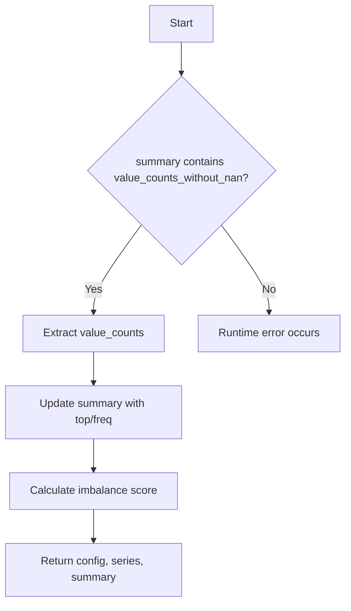

# `describe_boolean_pandas.py`

## `src.ydata_profiling.model.pandas.describe_boolean_pandas.pandas_describe_boolean_1d` · *function*

## Summary:
Updates a summary dictionary with top value and frequency information for boolean data, and computes column imbalance score.

## Description:
This function processes a summary dictionary containing boolean data statistics by extracting value counts, determining the most frequent value and its frequency, and calculating an imbalance score for the column distribution. It serves as a specialized handler for boolean data types in the profiling pipeline.

The function is extracted from inline logic to separate concerns and ensure consistent processing of boolean data characteristics across different profiling contexts. It specifically handles the post-processing of boolean data summaries to enrich them with additional statistical insights.

## Args:
    config (Settings): Configuration settings for the profiling process
    series (pd.Series): The boolean data series being analyzed
    summary (dict): Dictionary containing existing summary statistics including value_counts_without_nan

## Returns:
    Tuple[Settings, pd.Series, dict]: The unchanged config, series, and updated summary dictionary with additional keys added

## Raises:
    None explicitly raised, but may raise runtime exceptions if summary does not contain required keys or if value_counts is empty

## Constraints:
    Preconditions:
    - The summary dictionary must contain a "value_counts_without_nan" key with a pandas Series value
    - The value_counts Series should not be empty to avoid IndexError when accessing index[0] and iloc[0]
    
    Postconditions:
    - The summary dictionary will contain "top", "freq", and "imbalance" keys
    - All input parameters remain unchanged
    - The summary dictionary is modified in-place with new keys

## Side Effects:
    Modifies the summary dictionary in-place by adding "top", "freq", and "imbalance" keys

## Control Flow:


## Examples:
```python
# Typical usage in profiling pipeline
config = Settings()
series = pd.Series([True, False, True, True])
summary = {"value_counts_without_nan": pd.Series([True: 3, False: 1])}
updated_config, updated_series, updated_summary = pandas_describe_boolean_1d(config, series, summary)
# Result: updated_summary contains "top", "freq", and "imbalance" keys
```

