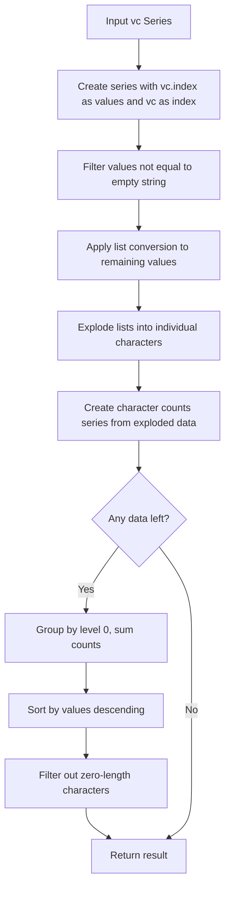
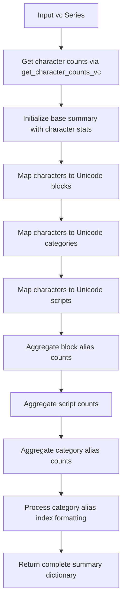
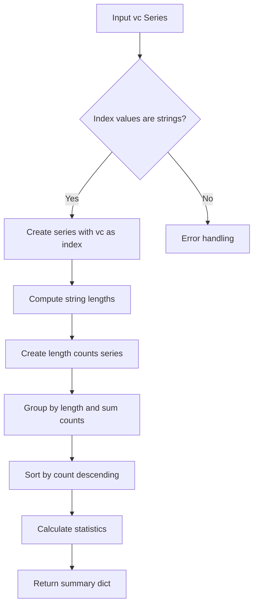
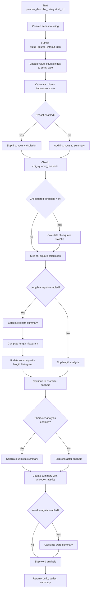

# `describe_categorical_pandas.py`

## `src.ydata_profiling.model.pandas.describe_categorical_pandas.get_character_counts_vc` · *function*

## Summary:
Computes character frequency counts from a categorical value count series by extracting individual characters from categorical values.

## Description:
Processes a pandas Series representing categorical value counts to compute the frequency of individual characters appearing in those categorical values. The function takes a value count series (index = categorical values, values = counts) and returns character-level frequency counts.

## Args:
    vc (pd.Series): A pandas Series where index contains categorical values and values contain their respective counts.

## Returns:
    pd.Series: A pandas Series containing character frequencies, indexed by character and sorted in descending order of frequency. Empty characters are filtered out. Returns empty Series if no characters are found.

## Raises:
    None explicitly raised.

## Constraints:
    Preconditions:
    - Input series should have categorical values as index and numeric counts as values
    - The series should be properly formatted as a value count series
    
    Postconditions:
    - Output series contains only non-empty characters (length > 0)
    - Characters are sorted by frequency in descending order
    - All returned characters have length > 0
    - Returns empty Series if input has no valid characters

## Side Effects:
    None.

## Control Flow:


## Examples:
```python
import pandas as pd

# Example usage
vc = pd.Series([10, 5, 3], index=['hello', 'world', 'foo'])
result = get_character_counts_vc(vc)
# Returns character frequency counts for characters in 'hello', 'world', 'foo'
```

## `src.ydata_profiling.model.pandas.describe_categorical_pandas.get_character_counts` · *function*

## Summary:
Computes character frequency counts from all elements in a pandas Series by concatenating them into a single string.

## Description:
This function takes a pandas Series containing string data and computes the frequency count of each character across all elements. It concatenates all series elements into a single string using the pandas str.cat() method, then creates a Counter object to track character frequencies. This utility is typically used in text analysis and categorical data profiling to understand character distributions within textual columns.

## Args:
    series (pd.Series): A pandas Series containing string elements to analyze for character frequencies

## Returns:
    Counter: A collections.Counter object mapping each unique character to its frequency count across all series elements

## Raises:
    None explicitly raised by this function

## Constraints:
    Preconditions:
    - Input series should contain string-like data (or data that can be converted to strings)
    - The function assumes all elements in the series are compatible with pandas str.cat() operation
    
    Postconditions:
    - Returns a Counter object with character frequencies
    - Empty series will return an empty Counter

## Side Effects:
    None

## Control Flow:
```mermaid
flowchart TD
    A[Input pd.Series] --> B{Series elements}
    B --> C[series.str.cat()]
    C --> D[Counter creation]
    D --> E[Return Counter]
```

## Examples:
```python
import pandas as pd
from collections import Counter

# Basic usage
series = pd.Series(['hello', 'world', 'hello'])
result = get_character_counts(series)
# Returns Counter({'l': 4, 'o': 2, 'h': 2, 'e': 2, 'w': 1, 'r': 1, 'd': 1})

# Empty series
empty_series = pd.Series([], dtype='object')
result = get_character_counts(empty_series)
# Returns Counter()
```

## `src.ydata_profiling.model.pandas.describe_categorical_pandas.counter_to_series` · *function*

## Summary:
Converts a Counter object into a pandas Series with items as the index and their counts as values.

## Description:
This utility function transforms a collections.Counter instance into a pandas Series, making it easier to work with categorical data statistics. It's particularly useful in data profiling scenarios where categorical distributions need to be represented as Series objects for further analysis or display. The function preserves the ordering from Counter.most_common() which sorts items by frequency in descending order.

## Args:
    counter (Counter): A collections.Counter object containing items and their frequencies.

## Returns:
    pd.Series: A pandas Series where:
        - Index contains the items from the counter in descending order of frequency
        - Values contain the corresponding counts from the counter
        - If the counter is empty, returns an empty Series with dtype=object

## Raises:
    None explicitly raised

## Constraints:
    Preconditions:
        - Input must be a collections.Counter object
        - Counter can be empty or contain items
    
    Postconditions:
        - Returns a pandas Series with proper indexing
        - Empty counter results in empty Series with object dtype
        - Items are ordered by frequency (most frequent first)

## Side Effects:
    None

## Control Flow:
```mermaid
flowchart TD
    A[Start counter_to_series] --> B{Is counter empty?}
    B -- Yes --> C[Return empty Series with dtype=object]
    B -- No --> D[Call counter.most_common()]
    D --> E[Unpack items and counts from tuples]
    E --> F[Create Series with counts as values, items as index]
    F --> G[Return Series sorted by frequency (descending)]
```

## Examples:
```python
from collections import Counter
import pandas as pd

# Example 1: Non-empty counter
counter = Counter(['a', 'b', 'c', 'a', 'b', 'a'])
result = counter_to_series(counter)
# Returns: pd.Series([3, 2, 1], index=['a', 'b', 'c']) 
# Note: items are ordered by frequency (descending)

# Example 2: Empty counter
empty_counter = Counter()
result = counter_to_series(empty_counter)
# Returns: pd.Series([], dtype=object)
```

## `src.ydata_profiling.model.pandas.describe_categorical_pandas.unicode_summary_vc` · *function*

## Summary:
Computes comprehensive Unicode character statistics from categorical value counts, including character frequencies, block classifications, script classifications, and category classifications.

## Description:
Processes a pandas Series representing categorical value counts to extract and analyze individual Unicode characters. This function is designed to provide detailed Unicode character breakdowns for categorical data profiling. It handles potential import failures of the `tangled_up_in_unicode` library by falling back to standard library alternatives.

The function is typically called as part of categorical data profiling workflows when detailed Unicode analysis is required. It's used internally by the profiling system to generate rich character-level insights for text-based categorical columns.

## Args:
    vc (pd.Series): A pandas Series where the index contains categorical values and the values represent their respective counts. This follows the standard value count format used throughout the profiling system.

## Returns:
    dict: A comprehensive dictionary containing:
        - n_characters_distinct: Number of unique characters found
        - n_characters: Total count of all characters
        - character_counts: Series with character frequencies
        - category_alias_values: Mapping from characters to Unicode category aliases
        - block_alias_values: Mapping from characters to Unicode block aliases
        - category_alias_counts: Series with category alias frequencies
        - n_category: Number of unique category aliases
        - category_alias_char_counts: Nested mapping of category aliases to character counts
        - block_alias_counts: Series with block alias frequencies
        - n_block_alias: Number of unique block aliases
        - block_alias_char_counts: Nested mapping of block aliases to character counts
        - script_counts: Series with script frequencies
        - n_scripts: Number of unique scripts
        - script_char_counts: Nested mapping of scripts to character counts

## Raises:
    None explicitly raised. The function handles import errors gracefully through try/except blocks.

## Constraints:
    Preconditions:
    - Input series should have categorical values as index and numeric counts as values
    - The series should be properly formatted as a value count series
    - Each categorical value should be a string or convertible to string
    
    Postconditions:
    - Output dictionary contains all expected keys with appropriate data types
    - Character counts are properly aggregated and sorted
    - Category aliases have underscores replaced with spaces where applicable
    - All nested dictionaries contain properly formatted pandas Series

## Side Effects:
    None.

## Control Flow:


## Examples:
```python
import pandas as pd
from src.ydata_profiling.model.pandas.describe_categorical_pandas import unicode_summary_vc

# Example usage with categorical data
vc = pd.Series([10, 5, 3], index=['hello', 'world', 'foo'])
result = unicode_summary_vc(vc)

# Result contains detailed Unicode statistics:
# - Character frequencies
# - Block classifications (e.g., Basic Latin, Latin-1 Supplement)
# - Script classifications (e.g., Latin, Cyrillic)
# - Category classifications (e.g., Letter, Punctuation)
```

## `src.ydata_profiling.model.pandas.describe_categorical_pandas.word_summary_vc` · *function*

## Summary:
Transforms a pandas Series of word counts into normalized word frequency statistics, optionally filtering stop words.

## Description:
This function processes a pandas Series where the index contains words and values represent their counts. It normalizes the words by converting to lowercase, stripping punctuation and whitespace, and optionally filters out stop words. This function is part of the categorical data analysis pipeline for text-based features in ydata-profiling.

## Args:
    vc (pd.Series): A pandas Series where index contains words and values represent their counts.
    stop_words (List[str], optional): A list of stop words to filter out from the results. Defaults to empty list.

## Returns:
    dict: A dictionary containing the key "word_counts" with a pandas Series of normalized word frequencies sorted in descending order. Returns an empty dictionary if no words remain after processing and filtering.

## Raises:
    None explicitly raised

## Constraints:
    Preconditions:
    - vc should be a pandas Series with string indices representing words
    - Values in vc should be numeric counts
    
    Postconditions:
    - Returns a dictionary with processed word counts
    - Word counts are sorted in descending order
    - Stop words are filtered out if provided
    - All words are converted to lowercase
    - Punctuation and whitespace are stripped from words

## Side Effects:
    None

## Control Flow:
```mermaid
flowchart TD
    A[Start word_summary_vc] --> B[Create series from vc index and values]
    B --> C[Convert to lowercase and split into word lists]
    C --> D[Explode word lists into individual words]
    D --> E[Strip punctuation and whitespace from words]
    E --> F[Create word count series with words as index]
    F --> G[Remove null words]
    G --> H[Group by word and sum counts]
    H --> I[Sort by count descending]
    I --> J{Stop words provided?}
    J -- Yes --> K[Convert stop words to lowercase]
    K --> L[Filter stop words from results]
    J -- No --> M[Skip stop word filtering]
    L --> M
    M --> N{Word counts empty?}
    N -- Yes --> O[Return empty dict]
    N -- No --> P[Return {"word_counts": word_counts}]
```

## Examples:
    # Basic usage with word counts
    >>> import pandas as pd
    >>> vc = pd.Series([5, 3, 2], index=['Apple', 'banana', 'cherry'])
    >>> result = word_summary_vc(vc)
    >>> print(result)
    {'word_counts': <Series with apple: 5, banana: 3, cherry: 2>}
    
    # Usage with stop words
    >>> vc = pd.Series([5, 3, 2], index=['the', 'quick', 'brown'])
    >>> result = word_summary_vc(vc, stop_words=['the'])
    >>> print(result)
    {'word_counts': <Series with quick: 3, brown: 2>}
    
    # Empty result case
    >>> vc = pd.Series([1], index=['the'])
    >>> result = word_summary_vc(vc, stop_words=['the'])
    >>> print(result)
    {}
```

## `src.ydata_profiling.model.pandas.describe_categorical_pandas.length_summary_vc` · *function*

## Summary:
Computes comprehensive length statistics for categorical data represented as a value count series.

## Description:
Processes a pandas Series containing categorical values and their counts to calculate descriptive statistics about the length of those categorical values. This function extracts length information from the index of the input series, aggregates counts by length, and computes key statistical measures including maximum, minimum, mean, and median lengths.

The function is typically called as part of categorical data profiling workflows where string length distributions need to be analyzed for character-based features.

## Args:
    vc (pd.Series): A pandas Series where the index contains categorical values and the values represent their counts/frequencies.

## Returns:
    dict: A dictionary containing:
        - "max_length" (int): The maximum length among all categorical values
        - "mean_length" (float): The weighted average length of categorical values
        - "median_length" (float): The weighted median length of categorical values
        - "min_length" (int): The minimum length among all categorical values
        - "length_histogram" (pd.Series): A series indexed by length values with counts representing how many categorical values have that length

## Raises:
    None explicitly raised, but may raise exceptions from underlying pandas/numpy operations if input is malformed.

## Constraints:
    Preconditions:
        - Input must be a pandas Series with hashable index values
        - Index values should be convertible to strings (for .str.len() operation)
        
    Postconditions:
        - Output dictionary always contains all five keys
        - Length histogram is sorted by count in descending order

## Side Effects:
    None

## Control Flow:


## Examples:
```python
import pandas as pd
import numpy as np

# Example usage
vc = pd.Series([5, 3, 2], index=['cat', 'dog', 'elephant'])
result = length_summary_vc(vc)
print(result)
# Output: {'max_length': 8, 'mean_length': 4.75, 'median_length': 3.0, 'min_length': 3, 'length_histogram': ...}
```

## `src.ydata_profiling.model.pandas.describe_categorical_pandas.pandas_describe_categorical_1d` · *function*

## Summary:
Processes and enriches categorical data summary statistics with additional computed metrics and distributions.

## Description:
This function performs comprehensive analysis of categorical data by computing various statistical measures and distributions. It transforms raw categorical data into enriched summary statistics that capture aspects like imbalance, length distributions, character properties, and word frequencies. The function serves as a core component in the categorical data profiling pipeline, applying conditional computations based on configuration settings.

The function is typically called as part of the categorical data analysis workflow when detailed profiling of text-based or discrete variable columns is required. It's designed to be called after basic value counting operations have been performed, specifically after `value_counts_without_nan` has been computed and added to the summary dictionary.

This logic is extracted into its own function to separate concerns: while the initial data preparation and value counting happens elsewhere, this function handles the enrichment of those counts with derived statistics and distributions. This modular approach allows for easier testing, configuration-driven computation, and clean separation between data preparation and statistical analysis.

## Args:
    config (Settings): Configuration object containing various profiling settings, particularly those related to categorical variable analysis (redaction, length analysis, character analysis, word analysis) and numerical thresholds (chi-squared threshold).
    series (pd.Series): A pandas Series containing the categorical data to be analyzed, which will be converted to string type for processing.
    summary (dict): Dictionary containing pre-computed summary statistics including 'value_counts_without_nan' which is used as the basis for further computations.

## Returns:
    Tuple[Settings, pd.Series, dict]: A tuple containing the (potentially modified) configuration, the (potentially modified) series (converted to string), and the updated summary dictionary with additional computed statistics.

## Raises:
    None explicitly raised by this function, though underlying functions may raise exceptions during processing.

## Constraints:
    Preconditions:
        - The summary dictionary must contain a key "value_counts_without_nan" with a pandas Series of categorical values and their counts
        - The series parameter should be compatible with pandas string conversion operations
        - All referenced configuration paths should be valid (config.vars.cat.*, config.vars.num.*)
        
    Postconditions:
        - The series is converted to string type
        - The summary dictionary is updated with additional computed statistics based on configuration flags
        - The returned summary dictionary contains all previously computed values plus new ones

## Side Effects:
    - Modifies the summary dictionary in-place by adding new keys and values
    - May modify the series by converting it to string type
    - May update the config object if it contains mutable configuration values (though typically not in this function)

## Control Flow:


## Examples:
```python
import pandas as pd
from ydata_profiling.config import Settings

# Example usage
config = Settings()
series = pd.Series(['apple', 'banana', 'apple', 'cherry'])
summary = {
    'value_counts_without_nan': pd.Series([2, 1, 1], index=['apple', 'banana', 'cherry'])
}

# Call the function
updated_config, updated_series, updated_summary = pandas_describe_categorical_1d(config, series, summary)

# The summary now contains additional computed statistics
print(updated_summary.keys())
# Will include: 'value_counts_without_nan', 'imbalance', 'first_rows', 'chi_squared', 'length_histogram', etc.
```

