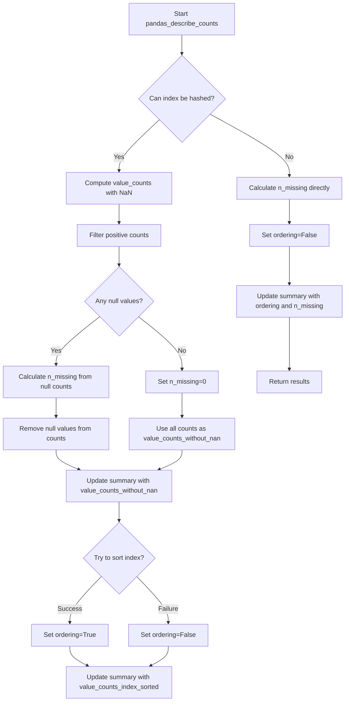

# `describe_counts_pandas.py`

## `src.ydata_profiling.model.pandas.describe_counts_pandas.pandas_describe_counts` · *function*

## Summary:
Analyzes a pandas Series to determine value count properties, hashability, and missing value statistics for data profiling.

## Description:
Processes a pandas Series to compute value counts while handling edge cases such as non-hashable indices and missing values. This function is part of the pandas-specific implementation for describing data characteristics in a profiling system. It determines whether the series index is hashable, computes value counts with and without NaN values, identifies missing value counts, and checks if the index can be sorted.

This function extracts key statistical properties from a pandas Series that are used later in data profiling workflows to understand data distribution, handle missing values appropriately, and determine data characteristics like whether values can be ordered.

## Args:
    config (Settings): Configuration settings for the profiling process
    series (pd.Series): The pandas Series to analyze
    summary (dict): Dictionary to store computed statistics and metadata about the series

## Returns:
    Tuple[Settings, pd.Series, dict]: A tuple containing the unchanged config, unchanged series, and the updated summary dictionary with the following keys:
        - "hashable" (bool): Indicates if the series index is hashable
        - "value_counts_without_nan" (pd.Series): Value counts excluding NaN values (only present when hashable=True)
        - "value_counts_index_sorted" (pd.Series): Value counts with sorted index (only present when hashable=True and sorting succeeds)
        - "ordering" (bool): Indicates if index sorting was successful
        - "n_missing" (int): Count of missing values in the series

## Raises:
    None explicitly raised - uses broad exception handling for hashability check

## Constraints:
    Preconditions:
        - config must be a valid Settings object
        - series must be a pandas Series
        - summary must be a mutable dictionary
    
    Postconditions:
        - The summary dictionary will contain the keys: "hashable", "ordering", and "n_missing"
        - If hashable is True, summary will also contain "value_counts_without_nan" 
        - If hashable is True and sorting succeeds, summary will contain "value_counts_index_sorted"

## Side Effects:
    - Modifies the summary dictionary in-place by adding computed statistics
    - No external I/O operations or state mutations beyond updating the summary

## Control Flow:

## Examples:
    # Basic usage with a simple series
    config = Settings()
    series = pd.Series([1, 2, 2, 3, None])
    summary = {}
    result_config, result_series, result_summary = pandas_describe_counts(config, series, summary)
    
    # The summary will contain:
    # {
    #     "hashable": True,
    #     "value_counts_without_nan": pd.Series([1: 1, 2: 2, 3: 1]),
    #     "ordering": True,
    #     "n_missing": 1
    # }

    # Usage with non-hashable index
    config = Settings()
    series = pd.Series(['a', 'b', 'b', 'c'])
    summary = {}
    result_config, result_series, result_summary = pandas_describe_counts(config, series, summary)
    
    # For non-hashable cases, summary will contain:
    # {
    #     "hashable": False,
    #     "ordering": False,
    #     "n_missing": 0
    # }

