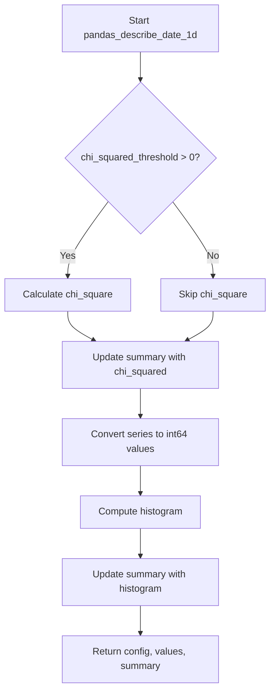

# `describe_date_pandas.py`

## `src.ydata_profiling.model.pandas.describe_date_pandas.pandas_describe_date_1d` · *function*

## Summary
Computes descriptive statistics for a pandas datetime series, including min/max values, range, chi-square test results, and histogram data.

## Description
This function processes a pandas datetime series to calculate key statistical measures and update a summary dictionary with date-related metadata. It serves as a specialized handler for datetime data types in the profiling pipeline, extracting temporal characteristics and preparing them for visualization and analysis.

The function is extracted from inline processing to provide a clean separation of concerns for datetime-specific computations, allowing the main profiling logic to remain agnostic to data type implementations while ensuring consistent datetime handling across the system.

## Args
- config (Settings): Configuration object containing settings for statistical calculations and plotting parameters
- series (pd.Series): A pandas Series containing datetime values to analyze
- summary (dict): Dictionary to be updated with computed statistics and metadata

## Returns
- Tuple[Settings, pd.Series, dict]: A tuple containing the unchanged config, processed integer values (converted from datetime nanoseconds), and the updated summary dictionary

## Raises
- None explicitly raised in the function body

## Constraints
- Preconditions: 
  - The series parameter must contain valid pandas datetime values
  - The config parameter must be a properly initialized Settings object
  - The summary parameter must be a mutable dictionary
- Postconditions:
  - The summary dictionary will contain keys: 'min', 'max', 'range', and potentially 'chi_squared' and 'histogram'
  - The returned values will be integer representations of datetime nanoseconds converted to seconds

## Side Effects
- Modifies the input summary dictionary in-place by updating it with computed statistics
- No external I/O operations or state mutations beyond the summary dictionary modification

## Control Flow


## Examples
```python
# Basic usage
config = Settings()
series = pd.Series([pd.Timestamp('2020-01-01'), pd.Timestamp('2020-12-31')])
summary = {'n_distinct': 365}
config, values, summary = pandas_describe_date_1d(config, series, summary)
# Result: summary contains min, max, range, chi_squared (if threshold > 0), and histogram
```

