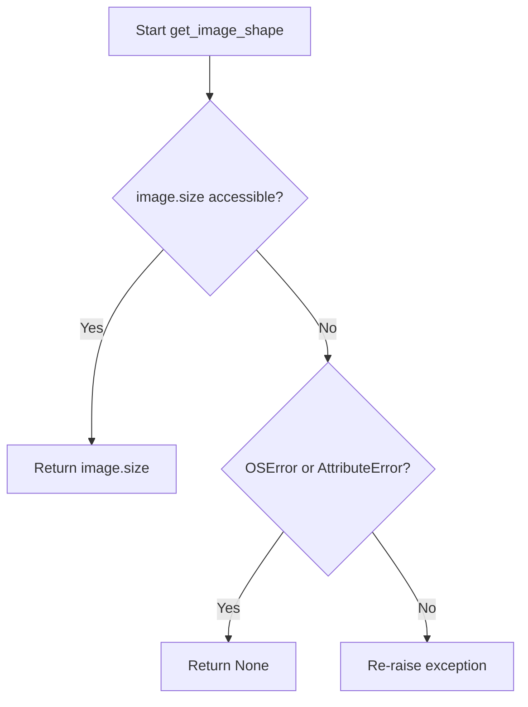
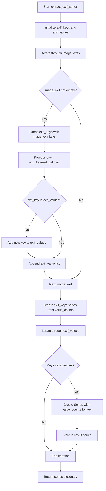
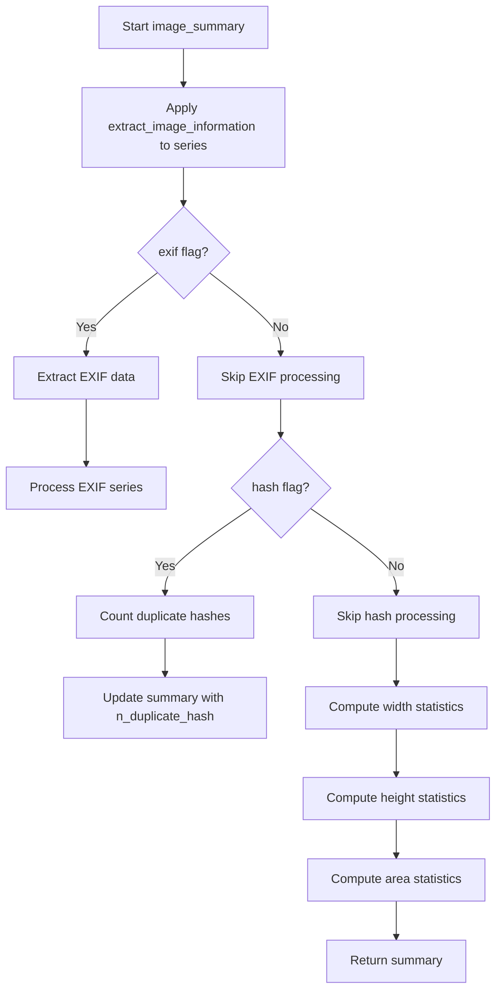
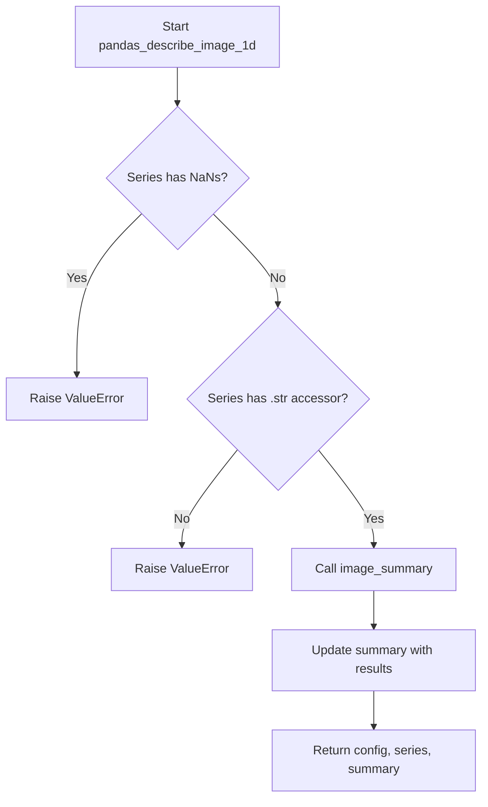

# `describe_image_pandas.py`

## `src.ydata_profiling.model.pandas.describe_image_pandas.open_image` · *function*

## Summary:
Attempts to safely open and load an image file from a given file path, returning a PIL Image object or None if loading fails.

## Description:
This function provides a robust wrapper around PIL's Image.open() method to safely load image files. It is designed to gracefully handle common failures during image loading such as corrupted files, unsupported formats, or invalid paths by catching OSError and AttributeError exceptions and returning None instead of propagating errors. This extraction promotes clean error handling and code reuse throughout the image processing pipeline.

## Args:
    path (Path): A pathlib.Path object pointing to the image file to be opened.

## Returns:
    Optional[Image.Image]: A PIL Image object if the file is successfully opened, or None if the operation fails due to OSError or AttributeError.

## Raises:
    This function does not explicitly raise exceptions but catches and handles OSError and AttributeError internally.

## Constraints:
    Preconditions:
    - The path parameter must be a valid pathlib.Path object
    - The file at the specified path must be readable
    
    Postconditions:
    - The function always returns either a PIL Image object or None
    - No exceptions are propagated from this function

## Side Effects:
    - Performs file I/O operations when accessing the image file
    - No external state mutations or service calls

## Control Flow:
```mermaid
flowchart TD
    A[Call open_image with Path] --> B{Try Image.open(path)}
    B -->|Success| C[Return Image object]
    B -->|OSError/AttributeError| D[Return None]
```

## Examples:
```python
from pathlib import Path
from PIL import Image

# Successful case
image_path = Path("example.jpg")
img = open_image(image_path)
if img is not None:
    print(f"Loaded image with size {img.size}")
else:
    print("Failed to load image")

# Failed case with corrupted file
corrupted_path = Path("corrupted.png")
result = open_image(corrupted_path)
assert result is None
```

## `src.ydata_profiling.model.pandas.describe_image_pandas.is_image_truncated` · *function*

## Summary:
Determines whether an image object is truncated by attempting to load it and catching loading errors.

## Description:
This function tests if an image is corrupted or truncated by attempting to load its pixel data. It serves as a validation step in image processing pipelines to identify malformed images that cannot be properly interpreted. The function is extracted into its own utility to provide a clean interface for checking image integrity without side effects.

## Args:
    image (PIL.Image): A PIL Image object to test for truncation

## Returns:
    bool: True if the image is truncated or cannot be loaded, False if it loads successfully

## Raises:
    None explicitly raised - exceptions are caught internally

## Constraints:
    Preconditions:
        - The input must be a valid PIL Image object
        - The image object should be in a state where .load() can be called
    
    Postconditions:
        - The function does not modify the original image object
        - The function returns a boolean value indicating truncation status

## Side Effects:
    - May trigger I/O operations when calling image.load() if the image data needs to be read from disk
    - No external state mutations or service calls

## Control Flow:
```mermaid
flowchart TD
    A[Start is_image_truncated] --> B{Call image.load()}
    B --> C{Exception Occurs?}
    C -->|Yes| D[Return True]
    C -->|No| E[Return False]
    D --> F[End]
    E --> F[End]
```

## Examples:
```python
from PIL import Image

# Test with a valid image
valid_img = Image.open("valid_image.jpg")
result = is_image_truncated(valid_img)  # Returns False

# Test with a truncated image
truncated_img = Image.open("truncated_image.jpg")
result = is_image_truncated(truncated_img)  # Returns True
```

## `src.ydata_profiling.model.pandas.describe_image_pandas.get_image_shape` · *function*

## Summary:
Retrieves the width and height dimensions of an image object safely, returning None if the operation fails.

## Description:
Extracts the size attribute from a PIL Image object to obtain its width and height dimensions. This function provides safe access to image dimensions by catching potential errors that may occur when accessing the size property of corrupted or improperly loaded images.

## Args:
    image (PIL.Image): A PIL Image object from which to extract dimensions

## Returns:
    Optional[Tuple[int, int]]: A tuple containing (width, height) if successful, or None if the image size cannot be accessed due to an error

## Raises:
    None explicitly raised, but catches OSError and AttributeError internally

## Constraints:
    Preconditions:
        - Input must be a valid PIL Image object
        - Image object must have a size attribute accessible
    
    Postconditions:
        - Function always returns either a tuple of two integers or None
        - Original image object is not modified

## Side Effects:
    None

## Control Flow:


## Examples:
```python
from PIL import Image

# Valid image case
img = Image.open("example.jpg")
shape = get_image_shape(img)  # Returns (width, height) tuple

# Corrupted image case
corrupt_img = Image.new("RGB", (100, 100))  # Create valid image
# If image loading failed or size inaccessible, returns None
shape = get_image_shape(corrupt_img)  # May return None
```

## `src.ydata_profiling.model.pandas.describe_image_pandas.hash_image` · *function*

## Summary:
Computes a perceptual hash of an image using the pHash algorithm, returning the hash as a string or None if hashing fails.

## Description:
This function applies the perceptual hash algorithm (pHash) to an image to generate a unique hash representation that captures the image's visual characteristics. It serves as a utility function for image analysis and comparison in data profiling workflows. The function is designed to gracefully handle image processing errors by returning None when hashing operations fail.

## Args:
    image (PIL.Image): A PIL Image object to be hashed

## Returns:
    Optional[str]: String representation of the perceptual hash if successful, None if hashing fails due to OS or attribute errors

## Raises:
    None explicitly raised, but may propagate OSError or AttributeError from underlying imagehash.phash() call

## Constraints:
    Preconditions:
        - Input must be a valid PIL Image object
        - Image data must be readable and valid for hashing operations
    
    Postconditions:
        - Function returns either a string hash or None
        - Original image object is not modified

## Side Effects:
    None

## Control Flow:
```mermaid
flowchart TD
    A[Start hash_image] --> B{imagehash.phash(image)}
    B -->|Success| C[return str(hash)]
    B -->|OSError/AttributeError| D[return None]
```

## Examples:
```python
from PIL import Image
from ydata_profiling.model.pandas.describe_image_pandas import hash_image

# Valid image case
img = Image.open("example.jpg")
hash_value = hash_image(img)
if hash_value:
    print(f"Image hash: {hash_value}")
else:
    print("Failed to hash image")

# Invalid image case (would return None)
bad_img = None
result = hash_image(bad_img)  # Returns None
```

## `src.ydata_profiling.model.pandas.describe_image_pandas.decode_byte_exif` · *function*

## Summary:
Normalizes EXIF data by converting byte-encoded values to strings.

## Description:
Converts EXIF values that may be stored as bytes into string format for consistent processing. This utility function handles the common case where EXIF metadata can be either string or byte representations, ensuring uniform data types for downstream processing.

## Args:
    exif_val (Union[str, bytes]): EXIF value that may be either a string or bytes object.

## Returns:
    str: The EXIF value as a string. If the input is already a string, it is returned unchanged.

## Raises:
    UnicodeDecodeError: When attempting to decode bytes that contain invalid UTF-8 sequences.

## Constraints:
    Preconditions:
        - Input must be either a string or bytes object
    Postconditions:
        - Output is always a string object
        - Input is not modified

## Side Effects:
    None

## Control Flow:
```mermaid
flowchart TD
    A[Input: exif_val] --> B{isinstance(exif_val, str)?}
    B -- Yes --> C[Return exif_val]
    B -- No --> D[exif_val.decode()]
    D --> C
```

## Examples:
```python
# String input (no change)
result = decode_byte_exif("Camera Model XYZ")
assert result == "Camera Model XYZ"

# Bytes input (decoded)
result = decode_byte_exif(b"Camera Model XYZ")
assert result == "Camera Model XYZ"
```

## `src.ydata_profiling.model.pandas.describe_image_pandas.extract_exif` · *function*

## Summary:
Extracts and normalizes EXIF metadata from PIL Image objects into a readable dictionary format.

## Description:
Retrieves EXIF metadata from an image and converts it into a dictionary mapping human-readable tag names to their corresponding values. This function safely handles cases where EXIF data may not be available or accessible, returning an empty dictionary in such scenarios. The extracted values are normalized to ensure consistent string representation using the decode_byte_exif utility function.

## Args:
    image (PIL.Image): A PIL Image object from which to extract EXIF metadata.

## Returns:
    dict: A dictionary containing EXIF metadata with tag names as keys and their corresponding values. Returns an empty dictionary if no EXIF data is available or accessible.

## Raises:
    None: This function catches and handles AttributeError and OSError exceptions internally.

## Constraints:
    Preconditions:
        - The input must be a valid PIL Image object
    Postconditions:
        - The returned dictionary will always contain string values for all entries
        - The function will never raise exceptions externally

## Side Effects:
    None

## Control Flow:
```mermaid
flowchart TD
    A[Start: extract_exif(image)] --> B{image._getexif() succeeds?}
    B -- Yes --> C{exif_data is not None?}
    C -- Yes --> D[Process EXIF data with TAGS mapping]
    D --> E[Apply decode_byte_exif to values]
    E --> F[Return processed EXIF dict]
    C -- No --> G[Return empty dict]
    B -- No --> H[Return empty dict]
```

## Examples:
```python
from PIL import Image

# Basic usage with an image that has EXIF data
img = Image.open('photo.jpg')
exif_data = extract_exif(img)
print(exif_data)  # {'Make': 'Canon', 'Model': 'EOS 5D Mark IV', ...}

# Usage with an image that has no EXIF data
img_no_exif = Image.open('no_exif_photo.png')
exif_data = extract_exif(img_no_exif)
print(exif_data)  # {}

# Safe usage - handles errors gracefully
try:
    exif_data = extract_exif(invalid_image)
except Exception:
    # This won't happen as exceptions are caught internally
    pass
```

## `src.ydata_profiling.model.pandas.describe_image_pandas.path_is_image` · *function*

## Summary:
Determines whether a file path corresponds to an image file by examining the file's magic numbers.

## Description:
This utility function checks if a given file path points to a valid image file by using Python's built-in `imghdr` module to detect the file type based on its magic numbers. The function is extracted into its own component to provide a clean abstraction for image validation logic, separating concerns from the main image processing pipeline.

## Args:
    p (Path): A pathlib.Path object representing the file path to check

## Returns:
    bool: True if the file at the given path is recognized as an image file by imghdr, False otherwise

## Raises:
    None: This function does not explicitly raise exceptions, though underlying file operations may raise IOError or similar exceptions

## Constraints:
    Preconditions:
        - The Path object must be valid and point to an existing file
        - The file must be readable
    
    Postconditions:
        - Returns a boolean value indicating image status
        - Does not modify the file or its metadata

## Side Effects:
    - May perform file I/O operations to read the file header for type detection
    - No external state mutations or service calls

## Control Flow:
```mermaid
flowchart TD
    A[Start path_is_image] --> B{imghdr.what(p) != None?}
    B -- Yes --> C[Return True]
    B -- No --> D[Return False]
    C --> E[End]
    D --> E
```

## Examples:
```python
from pathlib import Path

# Valid image file
path = Path("image.jpg")
result = path_is_image(path)  # Returns True if jpg is a valid image

# Non-image file
path = Path("document.txt")
result = path_is_image(path)  # Returns False

# Invalid path
path = Path("nonexistent.png")
result = path_is_image(path)  # Returns False (file doesn't exist)
```

## `src.ydata_profiling.model.pandas.describe_image_pandas.count_duplicate_hashes` · *function*

## Summary:
Calculates the total number of duplicate image hash occurrences in a collection of image descriptions.

## Description:
This function analyzes a collection of image descriptions to identify and count duplicate image hashes. It processes the input dictionary to extract all available hash values, determines how many times each hash appears, and computes the total number of duplicate occurrences beyond the unique hashes.

The function is typically used in image profiling workflows where duplicate images need to be identified and quantified. It's likely called as part of a larger image analysis pipeline that processes image metadata and generates descriptive statistics.

## Args:
    image_descriptions (dict): A dictionary containing image description objects, where each object may contain a "hash" key representing an image hash value.

## Returns:
    int: The total count of duplicate hash occurrences. This represents the sum of all duplicate instances beyond the unique hashes (i.e., total occurrences minus the number of unique hashes).

## Raises:
    None explicitly raised in the function body.

## Constraints:
    Preconditions:
    - Input must be a dictionary-like object
    - Each item in the dictionary should be iterable (supporting iteration over keys)
    - Items should support the "hash" key lookup
    
    Postconditions:
    - Returns a non-negative integer (0 or greater)
    - Function execution does not modify the input dictionary

## Side Effects:
    None - This function is pure and has no side effects.

## Control Flow:
```mermaid
flowchart TD
    A[Start count_duplicate_hashes] --> B{image_descriptions}
    B --> C[Extract hashes with "hash" key]
    C --> D[Create pandas Series from hashes]
    D --> E[Calculate value_counts()]
    E --> F[Return counts.sum() - len(counts)]
    F --> G[End]
```

## Examples:
```python
# Example 1: No duplicates
image_descs = [
    {"hash": "abc123"},
    {"hash": "def456"},
    {"hash": "ghi789"}
]
result = count_duplicate_hashes(image_descs)  # Returns 0

# Example 2: With duplicates
image_descs = [
    {"hash": "abc123"},
    {"hash": "def456"},
    {"hash": "abc123"},  # Duplicate
    {"hash": "ghi789"}
]
result = count_duplicate_hashes(image_descs)  # Returns 1 (one duplicate occurrence)
```

## `src.ydata_profiling.model.pandas.describe_image_pandas.extract_exif_series` · *function*

## Summary:
Processes a list of image EXIF metadata dictionaries and aggregates key-value frequency distributions across all images.

## Description:
This function extracts and aggregates EXIF metadata from multiple images to compute frequency distributions for each EXIF tag and its associated values. It's designed to support image profiling by providing statistical summaries of EXIF data characteristics across a collection of images.

The function is typically called during image data analysis workflows when examining metadata consistency and prevalence patterns across multiple images in a dataset.

## Args:
    image_exifs (list): A list of dictionaries containing EXIF metadata from individual images. Each dictionary maps EXIF tag names to their corresponding values.

## Returns:
    dict: A dictionary where keys are EXIF tag names and values are pandas Series containing value counts for each unique value of that EXIF tag. Additionally includes an 'exif_keys' key mapping to a dictionary of EXIF tag frequencies across all images.

## Raises:
    None explicitly raised in the function body.

## Constraints:
    Preconditions:
    - Input must be a list of dictionaries
    - Each dictionary should contain EXIF tag-value pairs
    - All values in the dictionaries should be serializable for pandas Series creation
    
    Postconditions:
    - Returns a dictionary with consistent structure
    - Keys in returned dictionary include all unique EXIF tags from input
    - Values are pandas Series with proper value counts

## Side Effects:
    None.

## Control Flow:


## Examples:
```python
# Basic usage with sample EXIF data
sample_exifs = [
    {'Make': 'Canon', 'Model': 'EOS 5D', 'ExposureTime': '1/125'},
    {'Make': 'Canon', 'Model': 'EOS 7D', 'ExposureTime': '1/250'},
    {'Make': 'Nikon', 'Model': 'D850', 'ExposureTime': '1/125'}
]

result = extract_exif_series(sample_exifs)
# Returns dictionary with value counts for each EXIF tag
# e.g., {'Make': Series({'Canon': 2, 'Nikon': 1}), 'Model': Series({...}), ...}
```

## `src.ydata_profiling.model.pandas.describe_image_pandas.extract_image_information` · *function*

## Summary:
Extracts comprehensive metadata and information from an image file, including basic properties, EXIF data, and perceptual hashes.

## Description:
This function provides a centralized interface for gathering essential image information from a file path. It safely opens the image file, determines if it's truncated, and extracts various metadata based on optional flags. The function is designed to handle image loading failures gracefully by returning a structured dictionary even when the image cannot be opened or processed.

The logic is extracted into its own function to provide a clean abstraction layer for image information gathering, separating concerns from the raw image loading process and enabling selective feature extraction based on configuration flags.

## Args:
    path (Path): A pathlib.Path object pointing to the image file to analyze
    exif (bool): Flag indicating whether to extract EXIF metadata (default: False)
    hash (bool): Flag indicating whether to compute a perceptual hash (default: False)

## Returns:
    dict: A dictionary containing image information with the following possible keys:
        - "opened" (bool): Indicates if the image was successfully opened
        - "truncated" (bool): Indicates if the image is truncated/corrupted (only present if opened=True)
        - "size" (tuple): Image dimensions as (width, height) (only present if opened=True and not truncated)
        - "exif" (dict): EXIF metadata dictionary (only present if exif=True and image is valid)
        - "hash" (str): Perceptual hash string (only present if hash=True and image is valid)

## Raises:
    None explicitly raised - all exceptions are handled internally by the helper functions

## Constraints:
    Preconditions:
        - The path parameter must be a valid pathlib.Path object
        - The file at the specified path must be readable
        
    Postconditions:
        - Always returns a dictionary with at least the "opened" key
        - All returned values are properly typed according to their intended use

## Side Effects:
    - Performs file I/O operations when accessing the image file
    - May trigger additional I/O when calling helper functions like open_image, is_image_truncated, etc.

## Control Flow:
```mermaid
flowchart TD
    A[Start extract_image_information] --> B[open_image(path)]
    B --> C{image != None?}
    C -->|No| D[information["opened"] = False] --> E[Return information]
    C -->|Yes| F[information["opened"] = True]
    F --> G[is_image_truncated(image)]
    G --> H{truncated?}
    H -->|Yes| I[information["truncated"] = True] --> J[Return information]
    H -->|No| K[information["truncated"] = False]
    K --> L[information["size"] = image.size]
    L --> M{exif flag?}
    M -->|Yes| N[extract_exif(image)]
    N --> O[information["exif"] = extracted_data]
    M -->|No| P[Skip EXIF extraction]
    P --> Q{hash flag?}
    Q -->|Yes| R[hash_image(image)]
    R --> S[information["hash"] = hash_value]
    Q -->|No| T[Skip hash extraction]
    T --> U[Return information]
```

## Examples:
```python
from pathlib import Path

# Basic usage - extract only basic information
path = Path("sample.jpg")
info = extract_image_information(path)
print(info)  # {"opened": True, "truncated": False, "size": (1920, 1080)}

# Usage with EXIF extraction
info_with_exif = extract_image_information(path, exif=True)
print(info_with_exif)  # Includes "exif" key with metadata

# Usage with hash extraction
info_with_hash = extract_image_information(path, hash=True)
print(info_with_hash)  # Includes "hash" key with perceptual hash

# Usage with both options
info_full = extract_image_information(path, exif=True, hash=True)
print(info_full)  # Includes all keys

# Handling failed image opening
bad_path = Path("nonexistent.jpg")
info = extract_image_information(bad_path)
print(info)  # {"opened": False}
```

## `src.ydata_profiling.model.pandas.describe_image_pandas.image_summary` · *function*

## Summary:
Computes comprehensive statistical summaries for a collection of images, including dimension statistics, duplicate detection, and EXIF metadata analysis.

## Description:
Processes a pandas Series of image paths to generate detailed statistical summaries including image dimensions (width, height, area), duplicate hash detection, and EXIF metadata analysis. This function serves as the core summarization component in image profiling workflows, aggregating information from individual image analyses into a consolidated report.

The function is extracted into its own component to separate the aggregation logic from the individual image processing logic, allowing for modular development and testing of image analysis features. It orchestrates multiple specialized functions to provide a complete image dataset summary, making it suitable for automated image dataset analysis and quality assessment.

## Args:
    series (pd.Series): A pandas Series containing file paths (as pathlib.Path objects) to images for analysis
    exif (bool): Flag indicating whether to extract and aggregate EXIF metadata from images (default: False)
    hash (bool): Flag indicating whether to compute and count perceptual hash duplicates (default: False)

## Returns:
    dict: A dictionary containing aggregated image statistics with the following possible keys:
        - "n_truncated" (int): Count of images that were detected as truncated/corrupted
        - "image_dimensions" (pd.Series): Series of image dimensions (width, height) tuples
        - "max_width", "mean_width", "median_width", "min_width" (float): Width statistics
        - "max_height", "mean_height", "median_height", "min_height" (float): Height statistics
        - "max_area", "mean_area", "median_area", "min_area" (float): Area statistics
        - "n_duplicate_hash" (int): Count of duplicate image hashes (only present when hash=True)
        - "exif_keys_counts" (dict): EXIF tag frequency distribution (only present when exif=True)
        - "exif_data" (dict): Full EXIF metadata aggregation (only present when exif=True)

## Raises:
    None explicitly raised - all exceptions are handled by underlying helper functions

## Constraints:
    Preconditions:
        - Input series must contain valid pathlib.Path objects pointing to readable image files
        - All paths in the series must be accessible and valid file locations
        
    Postconditions:
        - Always returns a dictionary with at least "n_truncated" and "image_dimensions" keys
        - Statistical values are computed only from valid, non-truncated images
        - When hash=True, returns "n_duplicate_hash" key with integer count
        - When exif=True, returns "exif_keys_counts" and "exif_data" keys with appropriate data structures

## Side Effects:
    - Performs file I/O operations when accessing image files through the underlying extract_image_information function
    - May trigger additional I/O when computing perceptual hashes or extracting EXIF data

## Control Flow:


## Examples:
```python
import pandas as pd
from pathlib import Path

# Basic usage - extract only dimension statistics
image_paths = pd.Series([Path("img1.jpg"), Path("img2.png"), Path("img3.jpeg")])
summary = image_summary(image_paths)
# Returns basic statistics like max_width, mean_height, etc.

# Usage with EXIF extraction
summary_with_exif = image_summary(image_paths, exif=True)
# Includes EXIF metadata analysis in results

# Usage with hash detection
summary_with_hash = image_summary(image_paths, hash=True)
# Includes duplicate hash counting

# Usage with both options
full_summary = image_summary(image_paths, exif=True, hash=True)
# Comprehensive image dataset summary
```

## `src.ydata_profiling.model.pandas.describe_image_pandas.pandas_describe_image_1d` · *function*

## Summary:
Processes a pandas Series of image paths to compute comprehensive statistical summaries including dimensions, duplicates, and EXIF metadata.

## Description:
Validates image data in a pandas Series and computes aggregated statistical summaries for image datasets. This function serves as the pandas-specific entry point for image profiling, performing data validation and delegating the actual image analysis to the `image_summary` function. It is part of a larger image analysis framework that provides automated profiling of image datasets.

The function is extracted into its own component to enforce clear separation between data validation and statistical computation, ensuring that image data is properly validated before analysis while maintaining a clean interface for integration with profiling pipelines.

## Args:
    config (Settings): Configuration object containing profiling settings, particularly image-related variables
    series (pd.Series): Pandas Series containing image file paths (as strings or pathlib.Path objects) to analyze
    summary (dict): Dictionary to be updated with computed image statistics

## Returns:
    Tuple[Settings, pd.Series, dict]: A tuple containing the updated configuration, the original series, and the updated summary dictionary

## Raises:
    ValueError: When the input series contains NaN values or lacks a string accessor (.str)

## Constraints:
    Preconditions:
        - Input series must not contain any NaN values
        - Input series must have a string accessor (.str) available
        - Series elements must be valid file paths pointing to accessible image files
        
    Postconditions:
        - The summary dictionary is updated with image statistics
        - Configuration and series are returned unchanged (except for summary updates)
        - All image processing errors are handled by underlying helper functions

## Side Effects:
    - Performs file I/O operations when accessing image files through the underlying image processing functions
    - Updates the provided summary dictionary with computed statistics
    - May trigger additional I/O when computing perceptual hashes or extracting EXIF data

## Control Flow:


## Examples:
```python
import pandas as pd
from pathlib import Path
from ydata_profiling.config import Settings

# Basic usage
config = Settings()
image_series = pd.Series([Path("image1.jpg"), Path("image2.png")])
summary = {}
config, series, summary = pandas_describe_image_1d(config, image_series, summary)

# With EXIF processing enabled
config.vars.image.exif = True
config, series, summary = pandas_describe_image_1d(config, image_series, summary)
```

