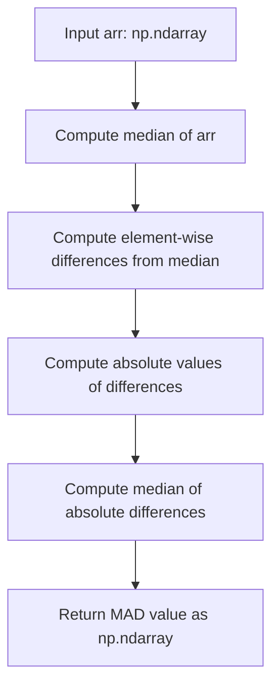
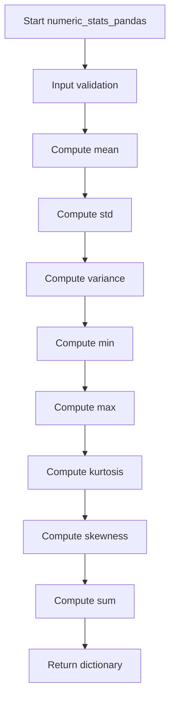
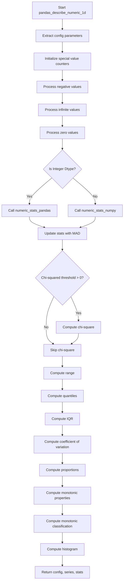

# `describe_numeric_pandas.py`

## `src.ydata_profiling.model.pandas.describe_numeric_pandas.mad` · *function*

## Summary:
Computes the Median Absolute Deviation (MAD) of an array, providing a robust measure of statistical dispersion.

## Description:
The Median Absolute Deviation (MAD) is a robust statistic for measuring the variability of a univariate dataset. It's defined as the median of the absolute deviations from the dataset's median. This function serves as a utility for robust statistical analysis and is used internally by the profiling system to compute reliable measures of spread that are less sensitive to outliers than standard deviation.

The function extracts the MAD calculation into its own utility function to provide a clean, reusable implementation that can be easily tested and maintained independently from other statistical computations.

## Args:
    arr (np.ndarray): Input array of numerical values for which to compute the median absolute deviation. Must contain numeric data.

## Returns:
    np.ndarray: The computed Median Absolute Deviation as a scalar value. The result is returned as a numpy array containing a single value.

## Raises:
    None explicitly raised by this function based on the implementation.

## Constraints:
    Preconditions:
    - Input must be a valid numpy array of numerical values
    - Array should contain at least one element (empty arrays may cause issues with numpy operations)
    
    Postconditions:
    - Returns a single scalar value wrapped in a numpy array
    - Output shape is (1,) for non-empty inputs

## Side Effects:
    None

## Control Flow:


## Examples:
```python
import numpy as np

# Basic usage with small array
data = np.array([1, 2, 3, 4, 5])
result = mad(data)  # Returns array([1.])

# With normally distributed data
large_data = np.random.normal(0, 1, 1000)
mad_value = mad(large_data)  # Robust measure of spread

# With array containing outliers
outlier_data = np.array([1, 2, 3, 4, 100])
mad_outliers = mad(outlier_data)  # Less affected by outliers than standard deviation
```

## `src.ydata_profiling.model.pandas.describe_numeric_pandas.numeric_stats_pandas` · *function*

## Summary:
Computes and returns a dictionary of common descriptive statistics for a numeric pandas Series.

## Description:
This function calculates fundamental statistical measures for a given numeric pandas Series. It serves as a utility for generating basic numeric summaries in data profiling workflows. The function extracts key statistical properties such as central tendency, dispersion, and distribution shape characteristics.

## Args:
    series (pd.Series): A pandas Series containing numeric data for which statistics will be computed.

## Returns:
    Dict[str, Any]: A dictionary containing the following statistical measures:
        - "mean": Arithmetic mean of the series values
        - "std": Standard deviation of the series values  
        - "variance": Variance of the series values
        - "min": Minimum value in the series
        - "max": Maximum value in the series
        - "kurtosis": Kurtosis measure indicating the "tailedness" of the distribution
        - "skewness": Skewness measure indicating the asymmetry of the distribution
        - "sum": Sum of all values in the series

## Raises:
    None explicitly raised in the function body, but underlying pandas methods may raise exceptions for invalid operations.

## Constraints:
    Preconditions:
        - Input series must be a valid pandas Series object
        - Series should contain numeric data for meaningful statistical computation
    Postconditions:
        - Returns a dictionary with exactly 8 keys as listed above
        - All returned values are numeric (float or int) or NaN for undefined statistics

## Side Effects:
    None

## Control Flow:


## Examples:
```python
import pandas as pd
from src.ydata_profiling.model.pandas.describe_numeric_pandas import numeric_stats_pandas

# Basic usage
series = pd.Series([1, 2, 3, 4, 5])
stats = numeric_stats_pandas(series)
print(stats)
# Output: {'mean': 3.0, 'std': 1.414..., 'variance': 2.0, 'min': 1, 'max': 5, 'kurtosis': -1.3, 'skewness': 0.0, 'sum': 15}

# With NaN values
series_with_nan = pd.Series([1, 2, None, 4, 5])
stats = numeric_stats_pandas(series_with_nan)
# Returns statistics excluding NaN values
```

## `src.ydata_profiling.model.pandas.describe_numeric_pandas.numeric_stats_numpy` · *function*

## Summary:
Computes comprehensive numeric statistics for a pandas Series using NumPy operations.

## Description:
This function calculates various descriptive statistics for numeric data represented as a pandas Series. It leverages both value counts and direct array computations to provide a complete statistical profile. The function is designed to work with pre-computed value counts and present values to efficiently calculate weighted statistics while maintaining compatibility with pandas' built-in moment calculations.

## Args:
    present_values (np.ndarray): Array containing the actual numeric values from the series (excluding NaN values)
    series (pd.Series): The original pandas Series object containing the data
    series_description (Dict[str, Any]): Dictionary containing metadata about the series, specifically including "value_counts_without_nan" key

## Returns:
    Dict[str, Any]: Dictionary containing computed statistics with keys:
        - "mean": Weighted average calculated from value counts and their frequencies
        - "std": Standard deviation using sample variance (ddof=1)
        - "variance": Variance using sample variance (ddof=1)
        - "min": Minimum value from the index of value counts
        - "max": Maximum value from the index of value counts
        - "kurtosis": Kurtosis calculated using pandas' kurt() method
        - "skewness": Skewness calculated using pandas' skew() method
        - "sum": Dot product of index values and their corresponding counts

## Raises:
    None explicitly raised in the function body

## Constraints:
    Preconditions:
        - present_values must be a valid NumPy array of numeric values
        - series must be a valid pandas Series object
        - series_description must contain a "value_counts_without_nan" key with valid pandas Series data
        - The index of value_counts_without_nan should be compatible with numeric operations

    Postconditions:
        - All returned statistics are numeric values
        - The returned dictionary always contains all eight statistic keys

## Side Effects:
    None

## Control Flow:
```mermaid
flowchart TD
    A[Start numeric_stats_numpy] --> B{Get value_counts}
    B --> C[Extract index_values from vc.index.values]
    C --> D[Calculate mean using np.average with weights]
    D --> E[Calculate std using np.std with ddof=1]
    E --> F[Calculate variance using np.var with ddof=1]
    F --> G[Calculate min from index_values]
    G --> H[Calculate max from index_values]
    H --> I[Calculate kurtosis using series.kurt()]
    I --> J[Calculate skewness using series.skew()]
    J --> K[Calculate sum using np.dot]
    K --> L[Return statistics dictionary]
```

## Examples:
```python
import numpy as np
import pandas as pd
from collections import defaultdict

# Example usage
values = np.array([1, 2, 2, 3, 3, 3])
series = pd.Series(values)
series_desc = {"value_counts_without_nan": pd.Series([1, 2, 3], index=[1, 2, 3]).value_counts()}

result = numeric_stats_numpy(values, series, series_desc)
print(result)
# Output would include: {'mean': 2.33..., 'std': 0.81..., 'variance': 0.66..., 
#                        'min': 1, 'max': 3, 'kurtosis': -0.6..., 'skewness': 0.0..., 'sum': 11}
```

## `src.ydata_profiling.model.pandas.describe_numeric_pandas.pandas_describe_numeric_1d` · *function*

## Summary:
Computes comprehensive descriptive statistics for a numeric pandas Series, including measures of central tendency, dispersion, distribution shape, and special value counts.

## Description:
This function performs detailed statistical analysis on a numeric pandas Series by calculating various descriptive measures and special value indicators. It handles both integer and floating-point data types differently, computes quantiles and percentiles, evaluates monotonic properties, and generates histogram data for visualization purposes. The function is part of the data profiling pipeline and is typically called as part of the numeric variable summary computation process.

The logic is extracted into its own function to separate the concerns of numeric statistics computation from the broader data profiling workflow, allowing for reuse and easier testing of the statistical computation logic.

## Args:
    config (Settings): Configuration object containing settings for numeric variable analysis, including chi-squared threshold and quantile specifications
    series (pd.Series): A pandas Series containing numeric data to be analyzed
    summary (dict): Dictionary containing pre-computed summary statistics including value counts without NaN values and other metadata

## Returns:
    Tuple[Settings, pd.Series, dict]: A tuple containing the configuration object, the original series, and the updated statistics dictionary with comprehensive numeric measures

## Raises:
    None explicitly raised by this function, though underlying operations may raise exceptions from pandas or numpy operations

## Constraints:
    Preconditions:
        - config must be a valid Settings object with numeric variable configurations
        - series must be a valid pandas Series with numeric data
        - summary must contain "value_counts_without_nan" key with appropriate data
        - summary must contain "n" key representing total count of values
        - summary must contain "n_distinct" key representing unique values count
    
    Postconditions:
        - The returned statistics dictionary contains all computed numeric measures
        - The function properly handles both integer and floating-point data types
        - Special values (negative, infinite, zero) are accurately counted and proportionally measured

## Side Effects:
    None

## Control Flow:


## Examples:
```python
import pandas as pd
import numpy as np
from ydata_profiling.config import Settings

# Create test data
series = pd.Series([1, 2, 3, 4, 5, -2, 0, np.inf, -np.inf])
summary = {
    "value_counts_without_nan": pd.Series([1, 2, 3, 4, 5, -2, 0], index=[1, 2, 3, 4, 5, -2, 0]).value_counts(),
    "n": 9,
    "n_distinct": 7
}

# Configure settings
config = Settings()

# Call the function
updated_config, updated_series, stats = pandas_describe_numeric_1d(config, series, summary)

# Access computed statistics
print(f"Mean: {stats['mean']}")
print(f"Standard deviation: {stats['std']}")
print(f"Number of negative values: {stats['n_negative']}")
print(f"Number of infinite values: {stats['n_infinite']}")
print(f"Monotonic property: {stats['monotonic']}")
```

