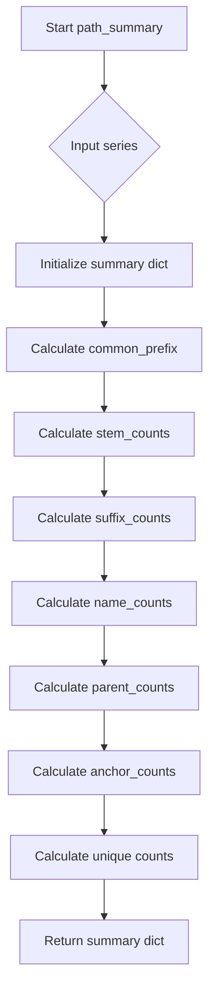
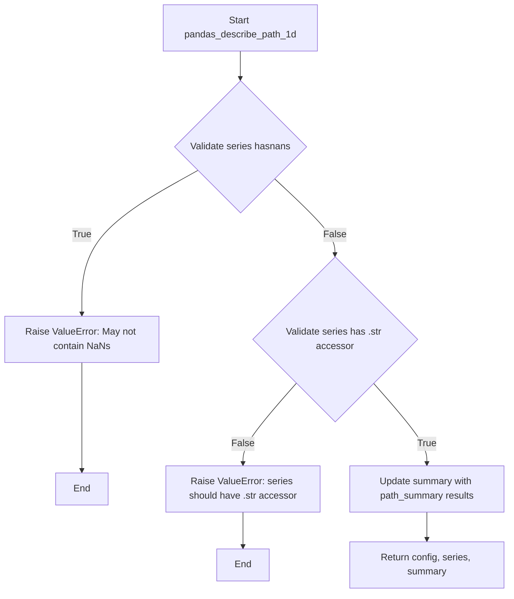

# `describe_path_pandas.py`

## `src.ydata_profiling.model.pandas.describe_path_pandas.path_summary` · *function*

## Summary:
Analyzes a pandas Series of file paths and computes descriptive statistics about path components including prefixes, stems, suffixes, names, parents, and anchors.

## Description:
This function extracts and counts various components from file paths contained in a pandas Series. It's designed to provide statistical insights into path patterns within a dataset, particularly useful for profiling datasets containing file path data. The function is typically called as part of automated data profiling workflows when analyzing columns containing file paths.

The logic is extracted into its own function to separate the path analysis concerns from the broader profiling logic, enabling reuse and easier testing of path-specific analysis functionality.

## Args:
    series (pd.Series): A pandas Series containing file paths as strings

## Returns:
    dict: A dictionary containing:
        - "common_prefix" (str): The longest common prefix among all paths, or "No common prefix" if none exists
        - "stem_counts" (pd.Series): Value counts of path stems (filename without extension)
        - "suffix_counts" (pd.Series): Value counts of file extensions
        - "name_counts" (pd.Series): Value counts of basename components (filename with extension)
        - "parent_counts" (pd.Series): Value counts of parent directory paths
        - "anchor_counts" (pd.Series): Value counts of drive anchors (e.g., "C:" on Windows)
        - "n_stem_unique" (int): Number of unique stems
        - "n_suffix_unique" (int): Number of unique suffixes
        - "n_name_unique" (int): Number of unique names
        - "n_parent_unique" (int): Number of unique parent directories
        - "n_anchor_unique" (int): Number of unique anchors

## Raises:
    None explicitly raised - however, underlying os.path operations may raise OSError for invalid paths

## Constraints:
    Preconditions:
        - Input series should contain string values representing file paths
        - Series should not be empty (though function handles empty series gracefully)
    
    Postconditions:
        - Returns a dictionary with exactly 11 keys as described
        - All count series are pandas Series objects with string indices
        - Unique count values are integers >= 0

## Side Effects:
    None - This function is pure and doesn't perform any I/O or mutate external state

## Control Flow:


## Examples:
```python
import pandas as pd
from src.ydata_profiling.model.pandas.describe_path_pandas import path_summary

# Example with file paths
paths = pd.Series(['/home/user/file1.txt', '/home/user/file2.txt', '/home/user/data.csv'])
result = path_summary(paths)
print(result['common_prefix'])  # Output: "/home/user/"
print(result['n_suffix_unique'])  # Output: 2 (".txt" and ".csv")
```

## `src.ydata_profiling.model.pandas.describe_path_pandas.pandas_describe_path_1d` · *function*

## Summary
Processes a pandas Series containing file paths and computes descriptive statistics about path components, updating the summary dictionary with the results.

## Description
Analyzes a pandas Series of file paths to extract and count various path components including prefixes, stems, suffixes, names, parents, and anchors. This function serves as a pandas-specific implementation for path analysis within the data profiling framework, providing statistical insights into path patterns in datasets.

The logic is extracted into its own function to separate path analysis concerns from broader profiling logic, enabling reuse and easier testing of path-specific analysis functionality. It acts as a bridge between the general path analysis algorithm and the pandas-specific data structures.

## Args
- config (Settings): Configuration object containing profiling settings and parameters
- series (pd.Series): A pandas Series containing file paths as strings
- summary (dict): Dictionary to be updated with computed path statistics

## Returns
- Tuple[Settings, pd.Series, dict]: A tuple containing the unchanged config, the original series, and the updated summary dictionary

## Raises
- ValueError: When the input series contains NaN values or lacks a string accessor (.str)
- TypeError: When the series parameter is not a pandas Series

## Constraints
- Preconditions:
  - The series parameter must be a pandas Series object
  - The series must not contain any NaN values
  - The series must have a string accessor (.str attribute)
  - The series should contain string values representing file paths

- Postconditions:
  - The summary dictionary is updated with path analysis results
  - The returned tuple maintains the original config and series unchanged
  - The summary dictionary contains all path statistics computed by path_summary

## Side Effects
- Modifies the input summary dictionary by updating it with path analysis results
- No external I/O operations or state mutations beyond updating the summary dictionary

## Control Flow


## Examples
```python
import pandas as pd
from ydata_profiling.config import Settings
from src.ydata_profiling.model.pandas.describe_path_pandas import pandas_describe_path_1d

# Create test data
paths = pd.Series(['/home/user/file1.txt', '/home/user/file2.txt', '/home/user/data.csv'])
config = Settings()
summary = {}

# Process the paths
config, series, summary = pandas_describe_path_1d(config, paths, summary)

# Check results
print(summary['common_prefix'])  # Common prefix of paths
print(summary['n_suffix_unique'])  # Count of unique file extensions
```

