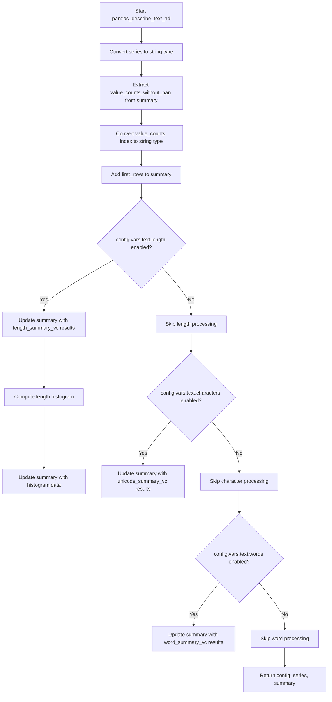

# `describe_text_pandas.py`

## `src.ydata_profiling.model.pandas.describe_text_pandas.pandas_describe_text_1d` · *function*

## Summary:
Processes and enriches text data for profiling by computing length, character, and word statistics based on configuration flags.

## Description:
This function transforms raw text data into a structured summary containing various text analytics. It converts the input series to strings, processes value counts, and conditionally computes text statistics (length, character, word) based on the configuration settings. The function is part of the pandas-specific text profiling pipeline and integrates with the broader ydata-profiling framework for automated data analysis.

The function is extracted from inline logic to provide a clean separation of concerns, allowing the text profiling workflow to be modularized and testable. It encapsulates the specific logic for processing text data in a pandas context, making it reusable across different profiling scenarios.

## Args:
    config (Settings): Configuration object containing analysis settings, specifically the text analysis flags (length, words, characters)
    series (pd.Series): Input pandas Series containing text data to be profiled
    summary (dict): Dictionary containing existing summary statistics and intermediate results, including value_counts_without_nan

## Returns:
    Tuple[Settings, pd.Series, dict]: A tuple containing the updated configuration, the string-converted series, and the enriched summary dictionary with additional text statistics

## Raises:
    None explicitly raised, but may propagate exceptions from underlying operations like pandas conversions or histogram computations

## Constraints:
    Preconditions:
        - config must be a valid Settings object with proper text configuration
        - series must be a pandas Series that can be converted to string type
        - summary must contain the key "value_counts_without_nan" with valid pandas Series data
        
    Postconditions:
        - The returned series is guaranteed to be of string dtype
        - The summary dictionary is guaranteed to contain "first_rows" key with head(5) of the series
        - Conditional text statistics are added to summary only when their respective config flags are enabled

## Side Effects:
    - Modifies the input summary dictionary in-place by updating it with new text statistics
    - Converts input series to string type (in-place modification of series reference)
    - May perform histogram computations that could involve memory allocation

## Control Flow:


## Examples:
```python
import pandas as pd
from ydata_profiling.config import Settings

# Example usage with default configuration
config = Settings()
series = pd.Series(['hello world', 'foo bar', 'baz'])
summary = {
    'value_counts_without_nan': pd.Series([2, 1], index=['hello world', 'foo bar'])
}

# Process text data
updated_config, updated_series, updated_summary = pandas_describe_text_1d(config, series, summary)

# The summary now contains additional text statistics based on config settings
print(updated_summary.keys())  # Includes first_rows, length stats, etc.
```

