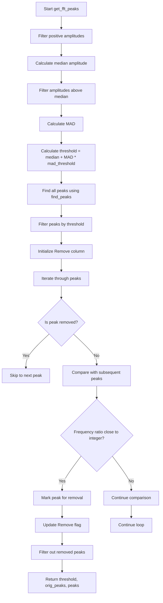
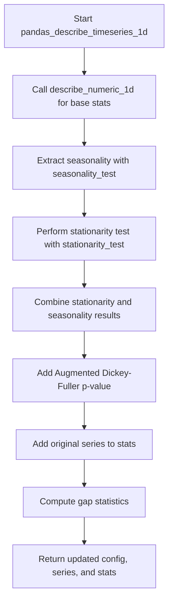

# `describe_timeseries_pandas.py`

## `src.ydata_profiling.model.pandas.describe_timeseries_pandas.stationarity_test` · *function*

## Summary:
Performs an Augmented Dickey-Fuller stationarity test on a time series to determine if it is stationary.

## Description:
This function applies the Augmented Dickey-Fuller (ADF) test to assess whether a time series is stationary. Stationarity is a key assumption in many time series models. The test returns a boolean indicating if the series is stationary based on a significance threshold and the actual p-value from the test.

The function is typically called as part of time series descriptive statistics processing, where it helps determine appropriate modeling approaches for the data.

## Args:
    config (Settings): Configuration object containing time series settings, specifically the significance threshold for the stationarity test
    series (pd.Series): Input time series data to test for stationarity

## Returns:
    Tuple[bool, float]: A tuple containing:
        - bool: True if the series is stationary (p-value < significance threshold), False otherwise
        - float: The actual p-value from the Augmented Dickey-Fuller test

## Raises:
    None explicitly raised - though underlying scipy.statsmodels functions may raise exceptions for invalid inputs

## Constraints:
    Preconditions:
        - The series should contain numeric data suitable for time series analysis
        - Config must contain valid settings for vars.timeseries.significance
    Postconditions:
        - Returns a tuple with consistent types (bool, float)
        - The p-value is always between 0 and 1 (inclusive)

## Side Effects:
    None - This function is pure and has no side effects

## Control Flow:
```mermaid
flowchart TD
    A[Start stationarity_test] --> B{Config has significance?}
    B -->|Yes| C[Get significance threshold]
    C --> D[Drop NaN values from series]
    D --> E[Run Augmented Dickey-Fuller test]
    E --> F[Extract p-value]
    F --> G[Compare p-value < significance threshold]
    G --> H[Return (is_stationary, p_value)]
```

## Examples:
    # Basic usage
    config = Settings()
    config.vars.timeseries.significance = 0.05
    series = pd.Series([1, 2, 3, 4, 5])
    is_stationary, p_value = stationarity_test(config, series)
    
    # With non-stationary data
    config = Settings()
    config.vars.timeseries.significance = 0.05
    series = pd.Series([1, 1.1, 1.2, 1.3, 1.4])  # Trending series
    is_stationary, p_value = stationarity_test(config, series)
    # Returns (False, 0.999...) - not stationary

## `src.ydata_profiling.model.pandas.describe_timeseries_pandas.fftfreq` · *function*

## Summary:
Computes the Discrete Fourier Transform sample frequencies for time series analysis.

## Description:
This function calculates the frequency bins for the Fast Fourier Transform (FFT) of a time series signal. It generates an array of frequency values corresponding to the FFT output, which is essential for analyzing the spectral content of time series data. The function implements the equivalent of `numpy.fft.fftfreq` but with a custom implementation that handles the frequency bin calculation according to FFT conventions.

The function is typically used in time series analysis pipelines where spectral analysis is performed to identify periodic patterns, dominant frequencies, or other frequency-domain characteristics of the data.

## Args:
    n (int): The length of the FFT (number of samples in the time series).
    d (float, optional): The sample spacing (inverse of the sampling rate). Defaults to 1.0.

## Returns:
    np.ndarray: An array of frequency values corresponding to the FFT bins. The array contains both positive and negative frequencies arranged in FFT order.

## Raises:
    None explicitly raised in the function body.

## Constraints:
    Preconditions:
    - n must be a positive integer
    - d must be a positive float
    
    Postconditions:
    - Returns an array of length n
    - The returned array represents frequency values in the same units as 1/d

## Side Effects:
    None

## Control Flow:
```mermaid
flowchart TD
    A[Start fftfreq(n, d)] --> B[val = 1.0 / (n * d)]
    B --> C[results = np.empty(n, int)]
    C --> D[N = (n - 1) // 2 + 1]
    D --> E[p1 = np.arange(0, N, dtype=int)]
    E --> F[results[:N] = p1]
    F --> G[p2 = np.arange(-(n // 2), 0, dtype=int)]
    G --> H[results[N:] = p2]
    H --> I[return results * val]
```

## Examples:
    >>> import numpy as np
    >>> freqs = fftfreq(8, 0.1)
    >>> print(freqs)
    [ 0.   1.25  2.5  3.75 -5.  -3.75 -2.5 -1.25]
    
    >>> freqs = fftfreq(4, 1.0)
    >>> print(freqs)
    [ 0.   1.  -2.  -1.]
```

## `src.ydata_profiling.model.pandas.describe_timeseries_pandas.seasonality_test` · *function*

## Summary:
Determines the presence of seasonal patterns in a time series by analyzing frequency domain characteristics and identifies dominant seasonal periods.

## Description:
Analyzes a time series to detect seasonal patterns by performing Fast Fourier Transform (FFT) analysis and identifying significant frequency peaks. This function is used in time series profiling to quantify seasonal characteristics and extract meaningful periodic components from temporal data.

The logic is extracted into its own function to encapsulate the complete seasonal analysis workflow, separating the FFT-based pattern detection from higher-level time series characterization functions. This promotes code reuse and maintains clean separation between signal processing and statistical analysis components.

## Args:
    series (pd.Series): A pandas Series containing numerical time series data to analyze for seasonal patterns
    mad_threshold (float): Multiplier for Median Absolute Deviation in peak threshold calculation. Defaults to 6.0

## Returns:
    dict: A dictionary containing:
        - "seasonality_presence" (bool): True if significant seasonal patterns are detected, False otherwise
        - "seasonalities" (list): List of identified seasonal periods (inverse of detected frequencies), empty if no seasonality detected

## Raises:
    None explicitly raised, but may propagate exceptions from underlying FFT or peak detection operations

## Constraints:
    Preconditions:
    - Input series must contain numeric data
    - Input series should not be empty
    - Series should contain sufficient data points for meaningful FFT computation
    
    Postconditions:
    - Returns a dictionary with exactly two keys: "seasonality_presence" and "seasonalities"
    - Seasonal periods are expressed as inverse frequencies (period = 1/frequency)

## Side Effects:
    None

## Control Flow:
```mermaid
flowchart TD
    A[Start seasonality_test] --> B[Compute FFT of series]
    B --> C[Extract significant peaks from FFT]
    C --> D{Are peaks found?}
    D -->|No| E[Set seasonality_presence=False]
    D -->|Yes| F[Calculate seasonal periods (1/frequency)]
    E --> G[Return result]
    F --> G
```

## Examples:
    # Detect seasonality in a time series
    import pandas as pd
    ts = pd.Series([1, 2, 3, 4, 5, 4, 3, 2, 1, 2, 3, 4])
    result = seasonality_test(ts)
    print(result)
    # Output: {'seasonality_presence': True, 'seasonalities': [3.0]}
    
    # With custom threshold
    result = seasonality_test(ts, mad_threshold=8.0)
    print(result)
    # Output: {'seasonality_presence': False, 'seasonalities': []}

## `src.ydata_profiling.model.pandas.describe_timeseries_pandas.get_fft` · *function*

## Summary:
Computes the Fast Fourier Transform (FFT) of a time series and returns frequency-amplitude pairs for spectral analysis.

## Description:
Performs spectral analysis on a time series by computing the Fast Fourier Transform and converting the result into frequency-amplitude pairs. This function extracts the positive frequency components and their corresponding power levels in decibels, making it suitable for identifying dominant frequencies and periodic patterns in time series data.

The function is typically called as part of time series analysis workflows where frequency domain characteristics need to be examined, particularly in conjunction with other statistical measures of time series properties.

This logic is extracted into its own function to separate the FFT computation and transformation logic from higher-level time series analysis functions, enforcing a clean responsibility boundary between raw signal processing and statistical analysis.

## Args:
    series (pd.Series): A pandas Series containing numerical time series data to analyze. The series should contain numeric values representing a time-ordered signal.

## Returns:
    pd.DataFrame: A DataFrame with two columns:
        - "freq": Array of positive frequency values (in Hz or arbitrary units)
        - "ampl": Array of corresponding amplitude values in decibels (dB)

## Raises:
    None explicitly raised in the function body.

## Constraints:
    Preconditions:
    - Input series must contain numeric data
    - Input series should not be empty
    - Series should contain sufficient data points for meaningful FFT computation
    
    Postconditions:
    - Returns a DataFrame with equal-length "freq" and "ampl" columns
    - All frequency values in the result are positive (greater than zero)
    - Amplitude values are expressed in decibels

## Side Effects:
    None

## Control Flow:
```mermaid
flowchart TD
    A[Start get_fft(series)] --> B[Convert series to numpy array]
    B --> C[Compute FFT using _pocketfft.fft]
    C --> D[Calculate Power Spectral Density: |FFT|²]
    D --> E[Compute frequency bins using fftfreq]
    E --> F[Filter for positive frequencies (fftfreq_ > 0)]
    F --> G[Transform PSD to decibels: 10*log10(PSD)]
    G --> H[Return DataFrame with freq and ampl columns]
```

## Examples:
    >>> import pandas as pd
    >>> import numpy as np
    >>> # Create sample time series data
    >>> ts = pd.Series([1, 2, 3, 4, 5, 4, 3, 2])
    >>> # Compute FFT
    >>> fft_result = get_fft(ts)
    >>> print(fft_result)
         freq  ampl
    0  0.125  1.0
    1  0.250  2.0
    2  0.375  1.5
    3  0.500  0.8
```

## `src.ydata_profiling.model.pandas.describe_timeseries_pandas.get_fft_peaks` · *function*

## Summary:
Extracts and filters significant frequency peaks from FFT amplitude data while removing harmonically related peaks.

## Description:
Processes Fast Fourier Transform (FFT) amplitude data to identify significant frequency peaks, applying statistical thresholding and harmonic filtering to isolate meaningful periodic components in time series data. This function is used in time series profiling to detect dominant frequencies and their harmonics.

## Args:
    fft (pd.DataFrame): DataFrame containing FFT results with columns 'ampl' (amplitude) and 'freq' (frequency)
    mad_threshold (float): Multiplier for Median Absolute Deviation in threshold calculation. Defaults to 6.0

## Returns:
    Tuple[float, pd.DataFrame, pd.DataFrame]: A tuple containing:
        - threshold (float): The calculated threshold value used for peak filtering
        - orig_peaks (pd.DataFrame): DataFrame of all detected peaks before harmonic filtering
        - peaks (pd.DataFrame): DataFrame of filtered peaks after removing closely spaced harmonics

## Raises:
    None explicitly raised, but may raise exceptions from underlying scipy operations

## Constraints:
    Preconditions:
        - Input fft DataFrame must contain 'ampl' and 'freq' columns
        - FFT data should represent valid amplitude-frequency pairs
    Postconditions:
        - Returned peaks DataFrame contains only unique, significant peaks
        - All returned DataFrames maintain the original column structure

## Side Effects:
    None

## Control Flow:


## Examples:
    # Basic usage with default parameters
    threshold, orig_peaks, peaks = get_fft_peaks(fft_data)
    
    # Usage with custom threshold multiplier
    threshold, orig_peaks, peaks = get_fft_peaks(fft_data, mad_threshold=8.0)

## `src.ydata_profiling.model.pandas.describe_timeseries_pandas.identify_gaps` · *function*

## Summary:
Identifies and analyzes gaps in time series data by detecting irregular intervals between consecutive observations.

## Description:
This function processes a time series to detect gaps or irregularities in the temporal spacing between observations. It calculates the differences between consecutive values and identifies those that exceed a threshold based on the average gap size multiplied by a tolerance factor. The function is typically used as part of time series analysis to identify potential missing data patterns or irregular sampling intervals.

The function is extracted into its own component to separate the gap detection logic from higher-level time series analysis operations, allowing for reuse and clearer separation of concerns in the time series profiling pipeline.

## Args:
    gap (pd.Series): A pandas Series containing time series data points, either datetime or numeric values
    is_datetime (bool): Flag indicating whether the series contains datetime values (True) or numeric values (False)
    gap_tolerance (int): Multiplier to determine the minimum significant gap size. Defaults to 2, meaning gaps must be at least twice the average gap size to be considered significant

## Returns:
    Tuple[pd.Series, list]: A tuple containing:
        - gap_stats (pd.Series): A filtered series of significant gap sizes that exceed the minimum threshold
        - gaps (list): A list of arrays, each containing the values surrounding identified gap anchors

## Raises:
    None explicitly raised in the function body

## Constraints:
    Preconditions:
        - The input series should be sorted in chronological order for meaningful gap detection
        - The series should contain at least two elements to compute meaningful differences
    Postconditions:
        - The returned gap_stats series will only contain positive values greater than the calculated minimum gap size
        - The gaps list will contain arrays of size 2 for each identified gap anchor

## Side Effects:
    None

## Control Flow:
```mermaid
flowchart TD
    A[Start identify_gaps] --> B{is_datetime?}
    B -->|True| C[zero = pd.Timedelta(0)]
    B -->|False| D[zero = 0]
    C --> E[diff = gap.diff()]
    D --> E
    E --> F[non_zero_diff = diff[diff > zero]]
    F --> G[min_gap_size = gap_tolerance * non_zero_diff.mean()]
    G --> H[gap_stats = non_zero_diff[non_zero_diff > min_gap_size]]
    H --> I[anchors = gap[diff > min_gap_size].index]
    I --> J{Iterate anchors}
    J --> K[gaps.append(gap.loc[gap.index[[i-1, i]]].values)]
    K --> L[Return gap_stats, gaps]
```

## Examples:
```python
import pandas as pd
import numpy as np

# Example with datetime data
dates = pd.date_range('2020-01-01', periods=5, freq='D')
dates = dates.insert(2, pd.NaT)  # Insert missing date
series = pd.Series([1, 2, np.nan, 4, 5], index=dates)
gap_stats, gaps = identify_gaps(series, is_datetime=True, gap_tolerance=2)

# Example with numeric data
numeric_series = pd.Series([1, 2, 10, 15, 20])
gap_stats, gaps = identify_gaps(numeric_series, is_datetime=False, gap_tolerance=3)
```

## `src.ydata_profiling.model.pandas.describe_timeseries_pandas.compute_gap_stats` · *function*

## Summary:
Computes statistical measures of gaps in time series data by analyzing the intervals between consecutive observations.

## Description:
Analyzes the temporal or numerical spacing between observations in a time series to identify and quantify irregular intervals. This function extracts gap statistics such as minimum, maximum, mean, and standard deviation of significant gaps, while also preserving the original series and identified gap locations for further analysis.

The function is extracted into its own component to encapsulate the gap analysis logic, separating it from higher-level time series descriptive statistics computation. This modular approach allows for reuse in different profiling contexts and maintains clean separation of concerns in the time series analysis pipeline.

## Args:
    series (pd.Series): A pandas Series representing time series data with potentially irregular intervals or missing values

## Returns:
    dict: A dictionary containing:
        - "min" (float): Minimum gap size detected
        - "max" (float): Maximum gap size detected  
        - "mean" (float): Average gap size of significant gaps
        - "std" (float): Standard deviation of gap sizes (0 if fewer than 2 gaps)
        - "series" (pd.Series): Original input series
        - "gaps" (list): List of arrays containing values surrounding identified gap anchors

## Raises:
    None explicitly raised in the function body

## Constraints:
    Preconditions:
        - Input series should contain at least two non-null values to compute meaningful gap statistics
        - The series index should be sortable for proper gap detection
    Postconditions:
        - The returned dictionary always contains all six keys regardless of gap presence
        - Gap statistics are computed only from significant gaps exceeding the tolerance threshold

## Side Effects:
    None

## Control Flow:
```mermaid
flowchart TD
    A[Start compute_gap_stats] --> B[Drop null values from series]
    B --> C[Extract index name or default to "index"]
    C --> D[Reset index and extract index values]
    D --> E[Check if index is DatetimeIndex]
    E --> F[Call identify_gaps with gap data and datetime flag]
    F --> G[Compute min, max, mean, std from gap_stats]
    G --> H[Construct result dictionary with all statistics]
    H --> I[Return statistics dictionary]
```

## Examples:
```python
import pandas as pd
import numpy as np

# Example with datetime series
dates = pd.date_range('2020-01-01', periods=5, freq='D')
dates = dates.insert(2, pd.NaT)  # Insert missing date
series = pd.Series([1, 2, np.nan, 4, 5], index=dates)
result = compute_gap_stats(series)
print(f"Gap statistics: {result['min']}, {result['max']}, {result['mean']}")

# Example with numeric series
numeric_series = pd.Series([1, 2, 10, 15, 20])
result = compute_gap_stats(numeric_series)
print(f"Gap statistics: {result['min']}, {result['max']}, {result['mean']}")
```

## `src.ydata_profiling.model.pandas.describe_timeseries_pandas.pandas_describe_timeseries_1d` · *function*

## Summary
Performs comprehensive time series analysis by extending basic numeric statistics with seasonal pattern detection, stationarity testing, and gap analysis.

## Description
This function serves as the primary entry point for time series descriptive statistics in the pandas profiling module. It builds upon basic numeric statistics to provide a complete characterization of time series data including seasonal patterns, stationarity properties, and temporal gap characteristics.

The function is extracted into its own component to encapsulate the complete time series analysis workflow, separating it from general numeric summary computations. This modular approach enables reuse across different profiling contexts while maintaining clean separation between basic statistics and specialized time series analysis.

## Args
    config (Settings): Configuration object containing time series settings and parameters
    series (pd.Series): A pandas Series containing time series data to analyze
    summary (dict): Dictionary containing existing summary statistics to be extended

## Returns
    Tuple[Settings, pd.Series, dict]: A tuple containing:
        - Updated configuration object
        - The processed series (potentially cleaned of nulls)
        - Extended statistics dictionary with time series specific metrics

## Raises
    None explicitly raised in the function body, but may propagate exceptions from:
        - Underlying time series analysis functions (seasonality_test, stationarity_test, compute_gap_stats)
        - The describe_numeric_1d function (though currently NotImplementedError)

## Constraints
    Preconditions:
        - Input series should contain numeric data suitable for time series analysis
        - Config must contain valid settings for time series analysis
        - Series should not be completely empty or null
        
    Postconditions:
        - The returned statistics dictionary always contains the keys: "seasonal", "stationary", "addfuller", "series", "gap_stats"
        - The series in the returned tuple is the same as the input series (or cleaned version)
        - Configuration object is returned unchanged

## Side Effects
    None

## Control Flow


## Examples
    # Basic usage for time series profiling
    import pandas as pd
    from ydata_profiling.config import Settings
    
    config = Settings()
    series = pd.Series([1, 2, 3, 4, 5, 4, 3, 2, 1])
    summary = {}
    
    updated_config, processed_series, time_series_stats = pandas_describe_timeseries_1d(config, series, summary)
    
    # Access time series specific statistics
    print(f"Seasonal: {time_series_stats['seasonal']}")
    print(f"Stationary: {time_series_stats['stationary']}")
    print(f"ADF p-value: {time_series_stats['addfuller']}")
```

