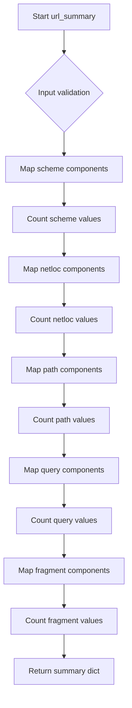
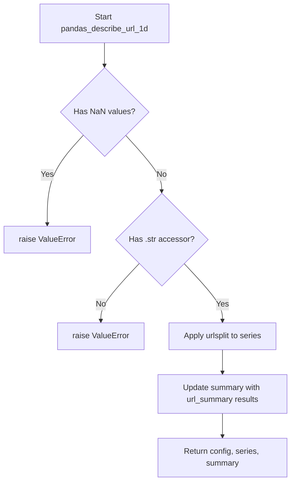

# `describe_url_pandas.py`

## `src.ydata_profiling.model.pandas.describe_url_pandas.url_summary` · *function*

## Summary:
Extracts and counts URL component distributions (scheme, netloc, path, query, fragment) from a pandas Series of URL objects.

## Description:
Processes a pandas Series containing URL objects and computes value counts for each structural component of the URLs. This function is part of the URL analysis pipeline and provides foundational statistics for URL profiling. It's typically called during the descriptive statistics phase when analyzing textual data containing URLs.

## Args:
    series (pandas.Series): A pandas Series containing URL objects (typically created by parsing string URLs with urlsplit).

## Returns:
    dict: A dictionary containing value count series for each URL component:
        - "scheme_counts": Value counts of URL schemes (e.g., 'http', 'https')
        - "netloc_counts": Value counts of URL network locations (e.g., 'www.example.com')
        - "path_counts": Value counts of URL paths (e.g., '/index.html')
        - "query_counts": Value counts of URL query parameters (e.g., '?param=value')
        - "fragment_counts": Value counts of URL fragments (e.g., '#section')

## Raises:
    AttributeError: If any element in the series is not a URL object with scheme, netloc, path, query, or fragment attributes.

## Constraints:
    Preconditions:
        - Input series must contain URL objects that support .scheme, .netloc, .path, .query, and .fragment attributes
        - All elements in the series should be consistently formatted URL objects
    
    Postconditions:
        - Returns a dictionary with exactly five keys: scheme_counts, netloc_counts, path_counts, query_counts, fragment_counts
        - Each value is a pandas Series with index representing the component values and values representing their counts

## Side Effects:
    None

## Control Flow:


## Examples:
```python
import pandas as pd
from urllib.parse import urlsplit

# Create sample URL data
urls = [
    'https://www.example.com/path?query=1#section',
    'http://test.org/page?param=value',
    'https://www.example.com/other'
]
url_series = pd.Series([urlsplit(url) for url in urls])

# Call url_summary
result = url_summary(url_series)
# Returns dictionary with counts for each URL component
```

## `src.ydata_profiling.model.pandas.describe_url_pandas.pandas_describe_url_1d` · *function*

## Summary:
Processes a pandas Series of URLs to extract and summarize structural components like scheme, domain, path, query parameters, and fragments.

## Description:
This function performs URL analysis on a pandas Series by parsing URLs into their constituent components using `urlsplit` and then computing frequency distributions for each component type. It serves as the pandas-specific implementation for URL profiling within the ydata-profiling framework. The function is typically invoked during the descriptive statistics phase when analyzing textual data containing URLs.

The function extracts URL components (scheme, netloc, path, query, fragment) and computes value counts for each component type, updating the summary dictionary with these statistics. It enforces strict validation that the input series contains valid URL data without missing values.

## Args:
    config (Settings): Configuration settings for the profiling process
    series (pd.Series): A pandas Series containing string URLs that will be parsed and analyzed
    summary (dict): Dictionary to be updated with URL component frequency distributions

## Returns:
    Tuple[Settings, pd.Series, dict]: A tuple containing the unchanged config, the modified series with URL objects, and the updated summary dictionary

## Raises:
    ValueError: If the series contains NaN values or does not have a string accessor (.str)

## Constraints:
    Preconditions:
        - Input series must not contain any NaN values
        - Input series must have a .str accessor (i.e., be a string-like pandas Series)
        - All elements in the series must be valid string representations of URLs
        
    Postconditions:
        - The series is transformed to contain urlsplit objects instead of strings
        - The summary dictionary is updated with URL component frequency distributions
        - The returned tuple maintains the same order: (config, processed_series, updated_summary)

## Side Effects:
    None

## Control Flow:


## Examples:
```python
import pandas as pd
from ydata_profiling.config import Settings
from urllib.parse import urlsplit

# Create sample URL data
urls = pd.Series([
    'https://www.example.com/path?query=1#section',
    'http://test.org/page?param=value',
    'https://www.example.com/other'
])

# Initialize configuration and summary
config = Settings()
summary = {}

# Process URLs
config, processed_series, summary = pandas_describe_url_1d(config, urls, summary)

# The summary now contains frequency distributions for URL components
print(summary.keys())  # Shows URL component keys like 'scheme_counts', 'netloc_counts', etc.
```

