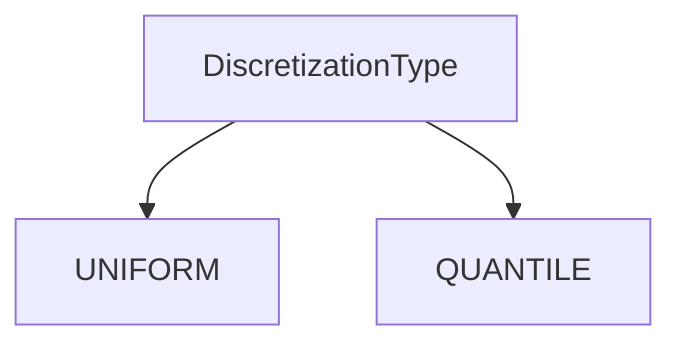
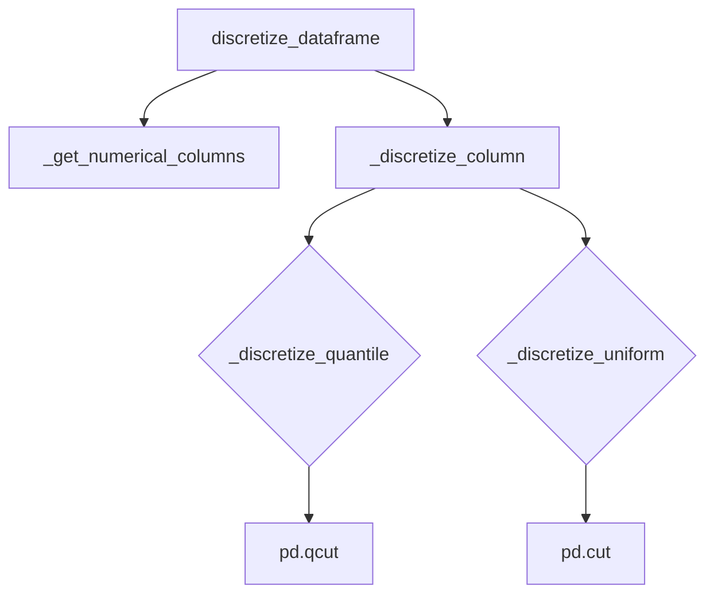

# `discretize_pandas.py`

## `src.ydata_profiling.model.pandas.discretize_pandas.DiscretizationType` · *class*

## Summary:
An enumeration defining discretization methods for data binning operations.

## Description:
The DiscretizationType enum provides a standardized way to specify different discretization approaches when performing data binning. It serves as a type-safe interface for selecting between uniform and quantile-based discretization methods in data processing pipelines.

This enum is typically used in functions or classes that require a discretization strategy parameter, ensuring that only valid discretization methods can be selected at runtime.

## State:
- UNIFORM: Represents uniform discretization method, where bins have equal width intervals
- QUANTILE: Represents quantile discretization method, where bins contain approximately equal numbers of observations

## Lifecycle:
- Creation: Instances are created automatically when accessing enum members (UNIFORM or QUANTILE)
- Usage: Enum members are accessed directly as DiscretizationType.UNIFORM or DiscretizationType.QUANTILE
- Destruction: No explicit cleanup required as enums are immutable and managed by Python's garbage collector

## Method Map:


## Raises:
- No exceptions are raised during initialization as this is a simple enum definition

## Example:
```python
from src.ydata_profiling.model.pandas.discretize_pandas import DiscretizationType

# Create discretization type instances
uniform_method = DiscretizationType.UNIFORM
quantile_method = DiscretizationType.QUANTILE

# Use in a discretization function
def apply_discretization(data, method):
    if method == DiscretizationType.UNIFORM:
        # Apply uniform discretization
        pass
    elif method == DiscretizationType.QUANTILE:
        # Apply quantile discretization
        pass
```

## `src.ydata_profiling.model.pandas.discretize_pandas.Discretizer` · *class*

## Summary:
A class that discretizes numerical columns in pandas DataFrames using quantile or uniform binning methods.

## Description:
The Discretizer class converts continuous numerical data into discrete bins. It supports two discretization approaches: quantile-based binning (where each bin contains approximately the same number of observations) and uniform binning (where bins have equal width ranges). This transformation is commonly used in data preprocessing to create categorical features from continuous variables for analysis or visualization.

This class is typically used by profiling components that require transforming numerical data into discrete representations.

## State:
- discretization_type: Enum value indicating the binning method (expected to be QUANTILE or UNIFORM)
- n_bins: int, number of bins to create for discretization (default: 10)
- reset_index: bool, whether to reset the DataFrame index after discretization (default: False)

## Lifecycle:
- Creation: Instantiate with a discretization method enum, optional n_bins (default 10), and optional reset_index (default False)
- Usage: Call discretize_dataframe() method with a pandas DataFrame to process all numerical columns
- Destruction: No special cleanup required; standard Python garbage collection applies

## Method Map:


## Raises:
- TypeError: If the input dataframe is not a pandas DataFrame
- ValueError: If n_bins is less than or equal to 0
- KeyError: If discretization method enum values are not recognized

## Example:
```python
from src.ydata_profiling.model.pandas.discretize_pandas import Discretizer

# Create discretizer with quantile-based binning
discretizer = Discretizer(method=DiscretizationType.QUANTILE, n_bins=5)
result_df = discretizer.discretize_dataframe(df)
```

### `src.ydata_profiling.model.pandas.discretize_pandas.Discretizer.__init__` · *method*

## Summary:
Initializes a Discretizer instance with discretization configuration parameters.

## Description:
Configures the discretizer with the specified binning method, number of bins, and index reset preference. This constructor sets up the object's state for subsequent discretization operations on pandas DataFrames.

## Args:
    method (DiscretizationType): Discretization method to use, typically QUANTILE or UNIFORM
    n_bins (int): Number of bins to create for discretization, defaults to 10
    reset_index (bool): Whether to reset DataFrame index after discretization, defaults to False

## Returns:
    None: This method initializes instance attributes and does not return a value

## Raises:
    None: This method does not explicitly raise exceptions

## State Changes:
    Attributes READ: None
    Attributes WRITTEN: 
    - self.discretization_type: Stores the discretization method
    - self.n_bins: Stores the number of bins to create
    - self.reset_index: Stores the index reset preference

## Constraints:
    Preconditions: 
    - The method parameter should be a valid DiscretizationType enum value
    - n_bins should be a positive integer
    
    Postconditions:
    - All instance attributes are initialized with provided values or defaults

## Side Effects:
    None: This method performs no I/O operations or external service calls

### `src.ydata_profiling.model.pandas.discretize_pandas.Discretizer.discretize_dataframe` · *method*

## Summary:
Discretizes numerical columns in a pandas DataFrame by converting continuous values into categorical bins while preserving column order and index behavior.

## Description:
Processes a pandas DataFrame by identifying numerical columns and applying discretization to convert continuous values into discrete bins. This method creates a copy of the input DataFrame, discretizes only numerical columns using the configured discretization type (quantile or uniform), and returns the modified DataFrame with preserved column ordering. The method respects the `reset_index` configuration to determine whether to reset the DataFrame index.

This method is designed to be a centralized entry point for discretizing entire DataFrames, handling the iteration over numerical columns and applying the appropriate discretization strategy based on the Discretizer's configuration. The discretization converts continuous numerical values into integer bin indices representing which bin each value falls into.

## Args:
    dataframe (pd.DataFrame): Input pandas DataFrame containing mixed data types to be discretized

## Returns:
    pd.DataFrame: A new DataFrame with numerical columns discretized into bins (represented as integer indices), maintaining original column order and index behavior based on the `reset_index` setting

## Raises:
    None explicitly raised, though underlying pandas operations may raise exceptions for invalid inputs

## State Changes:
    Attributes READ: self.reset_index, self.discretization_type, self.n_bins
    Attributes WRITTEN: None

## Constraints:
    Preconditions:
        - Input dataframe must be a valid pandas DataFrame
        - Numerical columns must contain valid numeric data for discretization
        - Discretization type must be properly initialized (either QUANTILE or UNIFORM)
        - Number of bins must be a positive integer
    
    Postconditions:
        - All numerical columns in the input DataFrame are converted to discrete bin indices (integers)
        - Non-numerical columns remain unchanged
        - Column order is preserved from the original DataFrame
        - Index behavior follows the reset_index configuration

## Side Effects:
    None

### `src.ydata_profiling.model.pandas.discretize_pandas.Discretizer._discretize_column` · *method*

## Summary:
Selects and applies the appropriate discretization method (quantile or uniform) to convert a numerical pandas Series into discrete bins.

## Description:
This method serves as a dispatcher that routes column discretization requests to either quantile-based or uniform binning methods based on the configured discretization type. It is called internally by the `discretize_dataframe` method when processing numerical columns in a DataFrame.

## Args:
    column (pd.Series): A pandas Series containing numerical data to be discretized into bins.

## Returns:
    pd.Series: A pandas Series containing integer bin indices representing which discretization bin each value belongs to.

## Raises:
    None explicitly raised, though underlying pandas operations may raise exceptions for invalid inputs.

## State Changes:
    Attributes READ: self.discretization_type, self.n_bins
    Attributes WRITTEN: None

## Constraints:
    Preconditions:
        - Input column must contain numerical data
        - self.discretization_type must be either DiscretizationType.QUANTILE or DiscretizationType.UNIFORM
        - self.n_bins must be a positive integer specifying the number of bins to create
    
    Postconditions:
        - Output series contains integer bin indices corresponding to the discretization method applied
        - Each bin index represents the appropriate bin assignment for the input values

## Side Effects:
    None

### `src.ydata_profiling.model.pandas.discretize_pandas.Discretizer._descritize_quantile` · *method*

## Summary:
Converts a continuous numerical column into discrete quantile-based bins by assigning each value to its corresponding bin index.

## Description:
This method performs quantile-based discretization on a pandas Series by dividing the data into equally-sized bins according to quantiles. It is used internally by the Discretizer class when the discretization type is set to QUANTILE.

## Args:
    column (pd.Series): A pandas Series containing numerical data to be discretized into quantile bins.

## Returns:
    pd.Series: A pandas Series containing integer bin indices for each value in the input column, where each index represents which quantile bin the value belongs to.

## Raises:
    None explicitly raised, though underlying pandas operations may raise exceptions for invalid inputs.

## State Changes:
    Attributes READ: self.n_bins
    Attributes WRITTEN: None

## Constraints:
    Preconditions:
        - Input column must contain numerical data
        - self.n_bins must be a positive integer
        - Column should not be empty or contain only NaN values
    
    Postconditions:
        - Output series contains integer values from 0 to (n_bins - 1)
        - Each value in the output corresponds to the quantile bin index of the respective input value

## Side Effects:
    None

### `src.ydata_profiling.model.pandas.discretize_pandas.Discretizer._descritize_uniform` · *method*

## Summary:
Performs uniform discretization on a pandas Series by dividing the data into equally-sized bins based on value ranges.

## Description:
This method applies uniform discretization to numerical data by partitioning the value range into a specified number of equally-sized bins. It is called internally by the discretizer when the discretization type is set to UNIFORM. The method leverages pandas' `pd.cut()` function to perform the actual binning operation.

## Args:
    column (pd.Series): Input pandas Series containing numerical data to be discretized

## Returns:
    np.ndarray: A numpy array containing discrete bin indices (integers) for each input value, where each index represents which bin the value falls into

## Raises:
    None explicitly raised, though underlying pandas operations may raise exceptions for invalid inputs

## State Changes:
    Attributes READ: self.n_bins
    Attributes WRITTEN: None

## Constraints:
    Preconditions:
    - Input column must be a valid pandas Series with numerical data
    - self.n_bins must be a positive integer specifying the number of bins to create
    - Column values should not contain infinite or NaN values that would cause issues in binning
    
    Postconditions:
    - Output array contains integer bin indices starting from 0
    - Each bin index corresponds to a unique bin interval
    - The number of bins equals self.n_bins (or fewer if duplicates are dropped due to the "duplicates='drop'" parameter)

## Side Effects:
    None - This method is pure and does not cause any I/O operations or external service calls

### `src.ydata_profiling.model.pandas.discretize_pandas.Discretizer._get_numerical_columns` · *method*

## Summary:
Returns a list of column names containing numerical data types from the input DataFrame.

## Description:
This method filters the provided DataFrame to identify columns with numerical data types and returns their names as a list. It is used during the discretization process to determine which columns require numerical processing.

## Args:
    dataframe (pd.DataFrame): Input DataFrame to analyze for numerical columns

## Returns:
    List[str]: List of column names that contain numerical data types

## Raises:
    None explicitly raised

## State Changes:
    Attributes READ: None
    Attributes WRITTEN: None

## Constraints:
    Preconditions: The input dataframe must be a valid pandas DataFrame
    Postconditions: The returned list contains only column names from the input DataFrame that have numerical dtypes

## Side Effects:
    None

