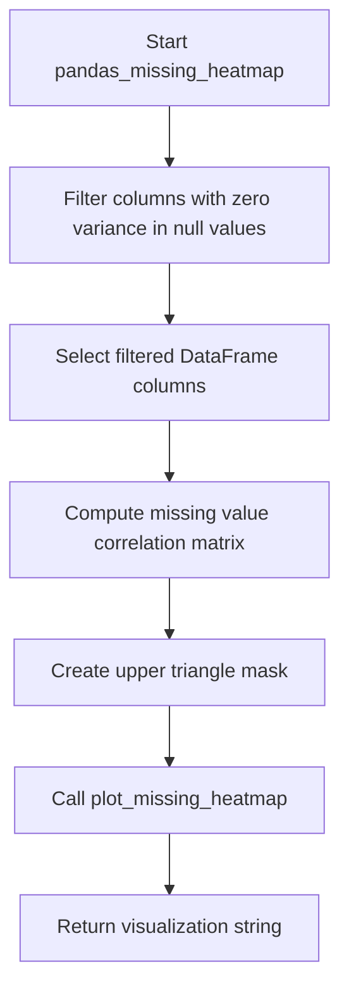

# `missing_pandas.py`

## `src.ydata_profiling.model.pandas.missing_pandas.pandas_missing_bar` · *function*

## Summary:
Generates a string representation of a missing data bar chart visualization for a pandas DataFrame.

## Description:
Processes a pandas DataFrame to calculate missing value statistics and generates a visual representation of missing data patterns across columns. This function serves as a bridge between the pandas data processing layer and the visualization layer in the profiling system.

The function extracts missing value information from the DataFrame by calculating non-null counts for each column, then delegates the visualization generation to the plotting layer. This approach separates data processing concerns from visualization rendering, enabling flexible reuse of visualization logic across different data backends.

## Args:
    config (Settings): Configuration object containing visualization parameters such as chart dimensions, styling options, and display preferences for the missing data chart.
    df (pd.DataFrame): Input pandas DataFrame containing the dataset to analyze for missing values.

## Returns:
    str: String representation of a bar chart visualization showing missing value patterns for each column in the DataFrame. The output typically contains HTML or SVG content representing the missing data visualization.

## Raises:
    None: This function does not explicitly raise exceptions, though underlying functions may raise exceptions related to invalid configurations or data issues.

## Constraints:
    Preconditions:
    - config must be a valid Settings object with appropriate configuration for visualization
    - df must be a valid pandas DataFrame that supports operations like .isnull() and .sum()

    Postconditions:
    - Returns a properly formatted string representation of the missing data visualization
    - The returned string contains valid visualization content that can be embedded in reports

## Side Effects:
    - Creates matplotlib figures internally for visualization generation
    - May perform I/O operations when config.html.inline is False (saving files to assets path)
    - Closes matplotlib figures after processing to prevent memory leaks

## Control Flow:
```mermaid
flowchart TD
    A[Start pandas_missing_bar] --> B{Validate inputs}
    B --> C[Calculate notnull_counts]
    C --> D[Prepare parameters for plot_missing_bar]
    D --> E[Call plot_missing_bar]
    E --> F{Check config.html.inline}
    F -->|True| G[Generate inline image (SVG/PNG)]
    F -->|False| H[Save to assets path and return file reference]
    G --> I[Return string representation]
    H --> I
```

## Examples:
```python
import pandas as pd
from ydata_profiling.config import Settings

# Create sample DataFrame with missing values
df = pd.DataFrame({
    'A': [1, 2, None, 4],
    'B': [None, 2, 3, 4],
    'C': [1, None, None, 4]
})

# Configure settings
config = Settings()

# Generate missing data bar chart
visualization_string = pandas_missing_bar(config, df)
print(visualization_string)  # Outputs HTML/SVG string representation
```

## `src.ydata_profiling.model.pandas.missing_pandas.pandas_missing_matrix` · *function*

## Summary
Generates a missing data matrix visualization for a pandas DataFrame, showing patterns of missing values across all variables.

## Description
Creates a matrix-style visualization that displays the presence or absence of missing values for each column in the input DataFrame. This visualization helps identify systematic patterns in missing data, such as whether missing values occur together across columns or appear randomly. The function serves as a pandas-specific interface that prepares the required data format and delegates to the visualization layer.

This function is typically called during data profiling when the "matrix" missing data visualization option is enabled in the configuration. It extracts column names, identifies missing values using pandas' `notnull()` method, and passes this information to the plotting system.

The function acts as a bridge between the pandas DataFrame processing layer and the visualization rendering layer, ensuring that the data is properly formatted for the missing data visualization engine.

## Args
- config (Settings): Configuration object containing profiling settings including missing data visualization preferences and rendering options
- df (pd.DataFrame): Input DataFrame containing the data to analyze for missing value patterns

## Returns
- str: String representation of the missing data matrix visualization, typically formatted as HTML or SVG that can be embedded in profiling reports

## Raises
- None explicitly raised by this function, though underlying plotting functions may raise exceptions related to invalid configurations or unsupported formats

## Constraints
- Preconditions:
  - config must be a valid Settings instance with proper initialization
  - df must be a valid pandas DataFrame
- Postconditions:
  - Function returns a string representation of a visualization that follows the configured style and format

## Side Effects
- Creates matplotlib figures internally for visualization generation
- May generate temporary files if html.inline is False and assets_path is configured
- Modifies global matplotlib state during figure creation

## Control Flow
```mermaid
flowchart TD
    A[pandas_missing_matrix called] --> B[Extract column names from df]
    B --> C[Compute notnull values using df.notnull()]
    C --> D[Get number of rows using len(df)]
    D --> E[Call plot_missing_matrix with prepared data]
    E --> F[Return string representation of visualization]
```

## Examples
```python
from ydata_profiling.config import Settings
import pandas as pd

# Create sample data with missing values
df = pd.DataFrame({
    'A': [1, 2, None, 4],
    'B': [None, 2, 3, 4],
    'C': [1, None, None, 4]
})

# Configure settings with missing diagram enabled
config = Settings()

# Generate missing matrix visualization
result = pandas_missing_matrix(config, df)
print(result)  # Returns HTML/SVG string representation
```

## `src.ydata_profiling.model.pandas.missing_pandas.pandas_missing_heatmap` · *function*

## Summary:
Generates a heatmap visualization showing correlations between missing value patterns across DataFrame columns.

## Description:
Creates a correlation heatmap that visualizes relationships between missing data patterns in different columns of a DataFrame. This function filters out columns with no variation in missing values, computes pairwise correlations between missing value patterns, and generates a masked heatmap visualization.

The function is part of the pandas-specific missing data analysis pipeline and serves as a bridge between data processing and visualization components. It extracts the core logic of missing data correlation computation to enable reuse in different contexts while maintaining clean separation between data processing and visualization concerns.

## Args:
    config (Settings): Configuration object containing profiling settings and visualization options
    df (pd.DataFrame): Input DataFrame containing the dataset to analyze for missing value patterns

## Returns:
    str: HTML string representation of the missing data correlation heatmap visualization

## Raises:
    None explicitly raised by this function, though underlying functions may raise exceptions

## Constraints:
    Preconditions:
        - config must be a valid Settings object with proper plotting configuration
        - df must be a valid pandas DataFrame
    Postconditions:
        - Returns a string containing the visualization (HTML or image data)
        - All columns with constant missing value patterns are excluded from analysis

## Side Effects:
    - Creates matplotlib figures for visualization
    - May perform file I/O operations if config.html.inline is False
    - Closes matplotlib figures after saving

## Control Flow:


## Examples:
    # Basic usage
    config = Settings()
    df = pd.DataFrame({'A': [1, None, 3], 'B': [None, 2, 3], 'C': [1, 2, None]})
    heatmap_html = pandas_missing_heatmap(config, df)
    print(heatmap_html)  # Prints HTML string of heatmap visualization

