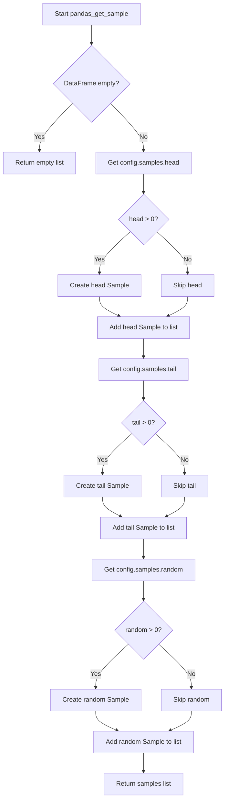

# `sample_pandas.py`

## `src.ydata_profiling.model.pandas.sample_pandas.pandas_get_sample` · *function*

## Summary
Creates a list of sample data points (head, tail, and random) from a pandas DataFrame based on configuration settings.

## Description
Generates multiple sample views of a pandas DataFrame according to the sampling configuration specified in the Settings object. This function extracts the first rows (head), last rows (tail), and random rows (random) from the input DataFrame, creating Sample objects for each requested view. The function respects the configuration limits for each sample type and handles edge cases such as empty DataFrames.

This logic is extracted into its own function to separate the concerns of sample generation from presentation logic, allowing for reuse across different profiling contexts and ensuring consistent sampling behavior regardless of how the samples are ultimately displayed.

## Args
- config (Settings): Configuration object containing sampling parameters (head, tail, random counts)
- df (pd.DataFrame): Input pandas DataFrame to sample from

## Returns
- List[Sample]: A list of Sample objects representing different views of the input DataFrame. Each Sample contains:
  - id: String identifier ("head", "tail", or "random")
  - data: DataFrame slice containing the sampled rows
  - name: Human-readable description of the sample type
  - caption: Optional caption (defaults to None)

## Raises
- None explicitly raised by this function

## Constraints
- Preconditions:
  - config must be a valid Settings object with properly initialized samples configuration
  - df must be a valid pandas DataFrame
- Postconditions:
  - Returns an empty list if the input DataFrame is empty
  - Returns a list containing 0-3 Sample objects depending on configuration settings
  - All returned Sample objects have valid data and proper identifiers

## Side Effects
- None

## Control Flow


## Examples
```python
from ydata_profiling.config import Settings
import pandas as pd

# Create sample DataFrame
df = pd.DataFrame({'A': range(100), 'B': range(100, 200)})

# Configure sampling
config = Settings(samples=Samples(head=5, tail=3, random=2))

# Get samples
samples = pandas_get_sample(config, df)

# Result contains 3 Sample objects:
# - Head sample with first 5 rows
# - Tail sample with last 3 rows  
# - Random sample with 2 random rows
```

