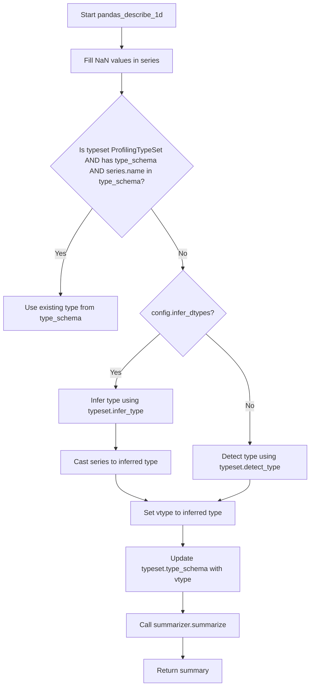
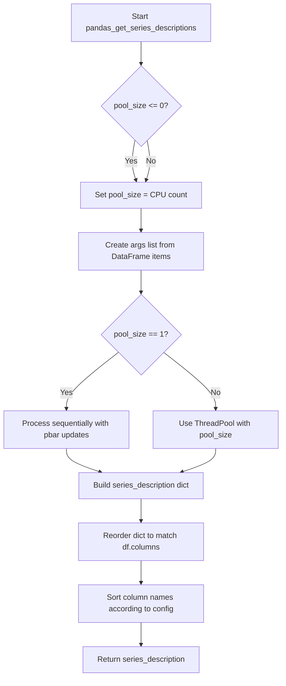

# `summary_pandas.py`

## `src.ydata_profiling.model.pandas.summary_pandas.pandas_describe_1d` · *function*

## Summary
Determines the data type of a pandas Series and generates a statistical summary using the appropriate summarizer.

## Description
This function performs type inference and validation for a pandas Series, then generates a comprehensive statistical summary. It handles different scenarios for determining data types based on existing type information, configuration settings, and automatic type detection. The function is part of the pandas-specific profiling workflow and serves as a bridge between type detection and statistical summarization.

The function is typically called during the univariate analysis phase of data profiling when processing individual columns of a DataFrame. It ensures proper type handling before passing data to the summarizer component.

This logic is extracted into its own function to separate concerns between type determination and statistical summarization, allowing for cleaner code organization and easier testing of type inference logic independently from the summarization process.

## Args
- config (Settings): Configuration object containing profiling settings including type inference preferences
- series (pd.Series): The pandas Series to analyze and summarize
- summarizer (BaseSummarizer): The summarizer instance responsible for generating statistical summaries
- typeset (VisionsTypeset): Type detection and casting system for determining and managing data types

## Returns
- dict: A dictionary containing the statistical summary of the Series, with keys and values dependent on the specific summarizer implementation and data type

## Raises
- None explicitly raised in the function body

## Constraints
- Preconditions: 
  - config must be a valid Settings instance
  - series must be a valid pandas Series
  - summarizer must be a valid BaseSummarizer instance
  - typeset must be a valid VisionsTypeset instance
- Postconditions:
  - The series will have NaN values replaced with np.nan (though this is an in-place operation on a copy)
  - The typeset.type_schema will be updated with the determined type for the series name
  - The returned dictionary will contain the statistical summary for the series

## Side Effects
- Modifies the typeset.type_schema dictionary by adding/updating the type information for the series name
- Calls the summarizer.summarize method which may perform I/O operations or external service calls depending on the summarizer implementation

## Control Flow


## Examples
```python
import pandas as pd
from ydata_profiling.config import Settings
from ydata_profiling.model.summarizer import BaseSummarizer
from visions import VisionsTypeset

# Example usage
config = Settings()
series = pd.Series([1, 2, 3, 4, 5])
summarizer = BaseSummarizer()
typeset = VisionsTypeset()

result = pandas_describe_1d(config, series, summarizer, typeset)
print(result)
```

## `src.ydata_profiling.model.pandas.summary_pandas.pandas_get_series_descriptions` · *function*

## Summary:
Processes all columns in a pandas DataFrame to generate descriptive statistics and metadata for each series using parallel processing.

## Description:
This function iterates through all columns in a pandas DataFrame and generates detailed statistical descriptions for each series. It leverages multiprocessing/threading capabilities to improve performance when processing large datasets. The function handles both single-threaded and multi-threaded execution paths based on configuration settings, and ensures proper ordering of results according to column names.

The function extracts column descriptions by calling `describe_1d` for each series, which provides detailed statistical summaries based on the data type and configuration. This logic is separated into its own function to enable parallel processing and to encapsulate the complexity of handling different execution modes (single vs multi-threaded).

## Args:
    config (Settings): Configuration object containing processing parameters including pool_size for parallel execution
    df (pandas.DataFrame): Input pandas DataFrame containing the data to be described
    summarizer (BaseSummarizer): Summarizer instance responsible for generating statistical summaries
    typeset (VisionsTypeset): Typeset instance for type detection and validation
    pbar (tqdm): Progress bar instance for tracking processing progress

## Returns:
    dict: A dictionary mapping column names (str) to their respective descriptive statistics and metadata dictionaries. Each entry contains the full statistical description for the corresponding column.

## Raises:
    ValueError: When an invalid sort parameter is provided to the configuration

## Constraints:
    Preconditions:
        - config must be a valid Settings object with appropriate configuration
        - df must be a valid pandas DataFrame
        - summarizer must be a valid BaseSummarizer instance
        - typeset must be a valid VisionsTypeset instance
        - pbar must be a valid tqdm progress bar instance
    
    Postconditions:
        - All columns in the input DataFrame will be processed and described
        - The returned dictionary will contain entries for all DataFrame columns
        - Column order in the result will match the DataFrame column order after sorting

## Side Effects:
    - Updates the progress bar status and position during processing
    - May spawn multiple threads/processes for parallel execution
    - Calls external functions like describe_1d and sort_column_names

## Control Flow:


## Examples:
```python
# Basic usage with a DataFrame
config = Settings()
df = pandas.DataFrame({'A': [1, 2, 3], 'B': ['x', 'y', 'z']})
summarizer = BaseSummarizer()
typeset = VisionsTypeset()
pbar = tqdm(total=len(df.columns))

result = pandas_get_series_descriptions(config, df, summarizer, typeset, pbar)
print(result)
# Returns a dictionary with descriptions for each column
```

