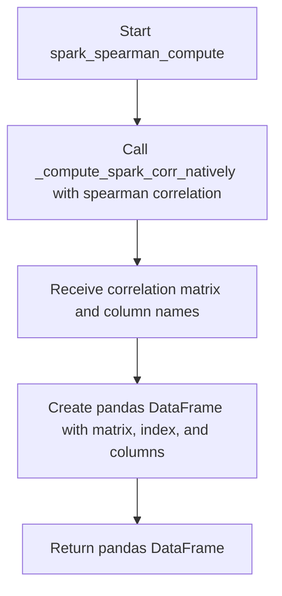
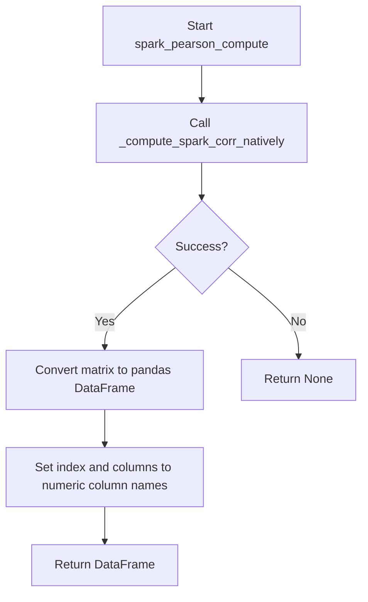
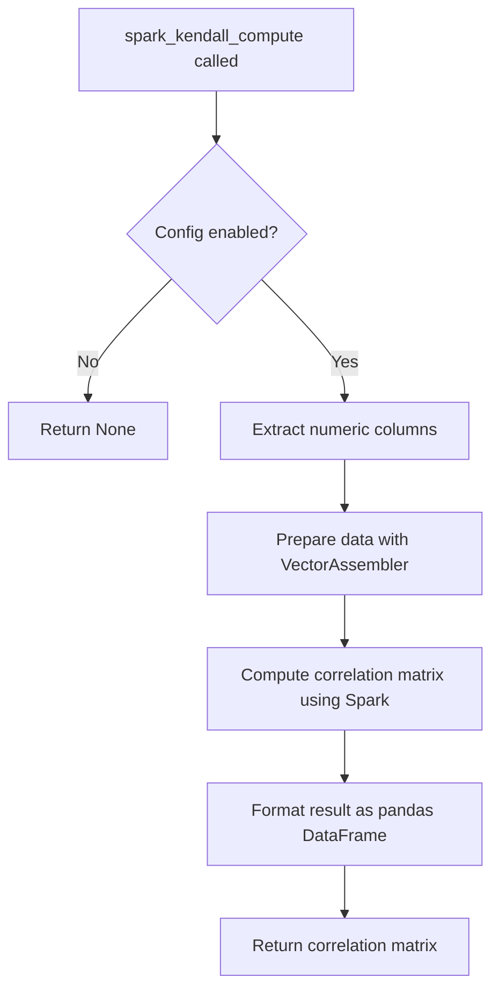
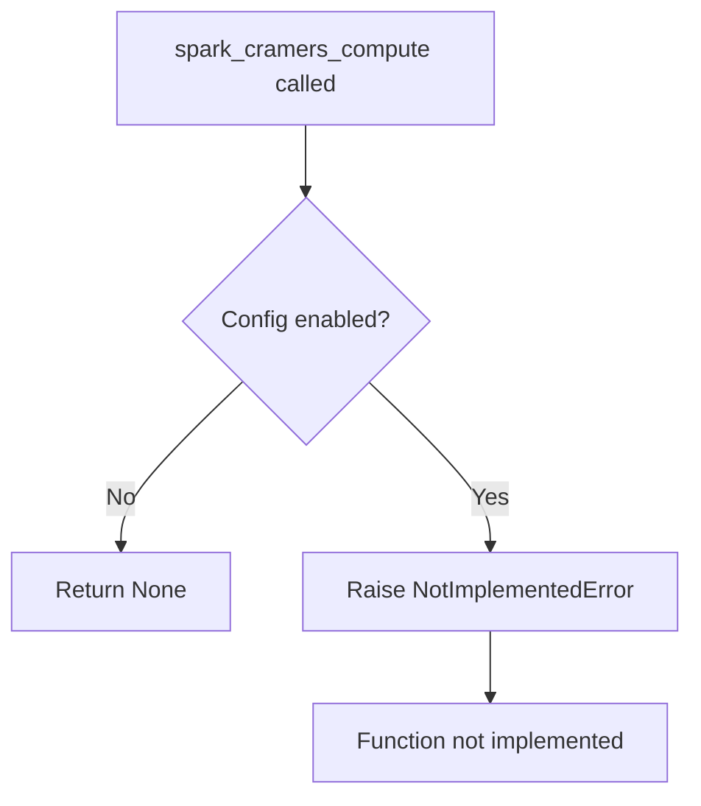
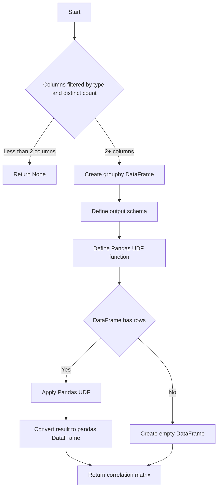

# `correlations_spark.py`

## `src.ydata_profiling.model.spark.correlations_spark.spark_spearman_compute` · *function*

## Summary:
Computes the Spearman rank correlation matrix for numeric columns in a Spark DataFrame and returns it as a pandas DataFrame.

## Description:
This function calculates Spearman rank correlation coefficients between numeric columns in a Spark DataFrame. It leverages the `_compute_spark_corr_natively` helper function to perform the actual correlation computation using Spark's distributed computing capabilities, then formats the result as a pandas DataFrame with appropriate row and column labels.

## Args:
    config (Settings): Configuration settings for the profiling process
    df (DataFrame): Input Spark DataFrame containing the data for correlation computation
    summary (dict): Dictionary containing column metadata with column names as keys and their descriptions as values

## Returns:
    Optional[pd.DataFrame]: A pandas DataFrame representing the Spearman correlation matrix where rows and columns correspond to numeric columns from the input DataFrame. Returns None if no numeric columns are available for correlation computation.

## Raises:
    None explicitly raised in the function body

## Constraints:
    Preconditions:
        - config must be a valid Settings object
        - df must be a valid Spark DataFrame
        - summary must be a dictionary with column names as keys and column descriptions as values
    Postconditions:
        - Returns a symmetric correlation matrix with values between -1 and 1
        - Matrix dimensions match the number of numeric columns in the DataFrame
        - Row and column indices correspond to numeric column names

## Side Effects:
    None

## Control Flow:


## Examples:
    # Compute Spearman correlation matrix for a Spark DataFrame
    correlation_df = spark_spearman_compute(config, spark_df, column_summary)
    
    # Result will be a pandas DataFrame with correlation coefficients
    # between numeric columns, where diagonal elements are 1.0
```

## `src.ydata_profiling.model.spark.correlations_spark.spark_pearson_compute` · *function*

## Summary:
Computes the Pearson correlation matrix for numeric columns in a Spark DataFrame and returns it as a pandas DataFrame.

## Description:
This function computes Pearson correlations for numeric columns in a Spark DataFrame. It serves as a specialized wrapper that delegates the actual computation to `_compute_spark_corr_natively` with the Pearson correlation type parameter. The resulting correlation matrix is returned as a pandas DataFrame with appropriate indexing.

The function is part of a suite of correlation computation functions (Pearson, Spearman, Kendall, Phi-K, Cramér's V) designed to work with Spark DataFrames in the ydata-profiling library. It enables efficient correlation analysis on large datasets that are too big for traditional pandas-based approaches.

## Args:
    config (Settings): Configuration object containing profiling settings and options
    df (DataFrame): Input Spark DataFrame containing the data for correlation computation
    summary (dict): Dictionary containing column metadata with column names as keys and their descriptions as values

## Returns:
    Optional[pd.DataFrame]: A pandas DataFrame representing the Pearson correlation matrix where rows and columns correspond to numeric columns from the input DataFrame. Returns None if no numeric columns are present or if computation fails.

## Raises:
    None explicitly documented in function signature

## Constraints:
    Preconditions:
        - config must be a valid Settings object
        - df must be a valid Spark DataFrame
        - summary must be a dictionary with column names as keys and column descriptions as values
    Postconditions:
        - Returns a symmetric correlation matrix with values between -1 and 1
        - Matrix dimensions equal the number of numeric columns in the DataFrame
        - Row and column indices match the numeric column names

## Side Effects:
    None

## Control Flow:


## Examples:
    # Basic usage for computing Pearson correlations
    config = Settings()
    correlation_matrix = spark_pearson_compute(config, spark_df, column_summary)
    
    # Handle potential None return when no numeric columns exist
    result = spark_pearson_compute(config, spark_df, column_summary)
    if result is not None:
        print(result)
    else:
        print("No numeric columns found for correlation computation")

## `src.ydata_profiling.model.spark.correlations_spark._compute_spark_corr_natively` · *function*

## Summary:
Computes a correlation matrix for numeric columns in a Spark DataFrame using native Spark correlation methods.

## Description:
This function extracts numeric columns from a DataFrame and computes their correlation matrix using Spark's built-in correlation functionality. It serves as a helper function for computing various types of correlations (Pearson, Spearman, etc.) in a distributed Spark environment. The function is designed to work with the ydata-profiling library's correlation analysis pipeline.

## Args:
    df (DataFrame): Input Spark DataFrame containing the data for correlation computation
    summary (dict): Dictionary containing column metadata with column names as keys and their descriptions as values
    corr_type (str): Type of correlation to compute (e.g., 'pearson', 'spearman')

## Returns:
    tuple: A tuple containing:
        - matrix (ArrayType): The computed correlation matrix as a 2D array
        - interval_columns (list): List of column names that were used in the correlation computation (numeric columns)

## Raises:
    None explicitly raised in the function body

## Constraints:
    Preconditions:
        - df must be a valid Spark DataFrame
        - summary must be a dictionary with column names as keys and column descriptions as values
        - corr_type must be a valid correlation method supported by Spark's Correlation.corr method
    Postconditions:
        - Returns a correlation matrix only for numeric columns
        - The returned matrix dimensions match the number of numeric columns

## Side Effects:
    None

## Control Flow:
```mermaid
flowchart TD
    A[Start _compute_spark_corr_natively] --> B[Extract variable types from summary]
    B --> C[Filter numeric columns]
    C --> D[Select numeric columns from DataFrame]
    D --> E[Prepare VectorAssembler arguments]
    E --> F{Spark version ≥ 2.4.0?}
    F -->|Yes| G[Add handleInvalid=skip to assembler args]
    F -->|No| H[Skip handleInvalid configuration]
    H --> I[Create VectorAssembler]
    I --> J[Transform DataFrame to vector format]
    J --> K[Compute correlation matrix using Correlation.corr]
    K --> L[Return (matrix, interval_columns)]
```

## Examples:
    # Basic usage for Pearson correlation
    matrix, columns = _compute_spark_corr_natively(df, summary, "pearson")
    
    # Usage for Spearman correlation  
    matrix, columns = _compute_spark_corr_natively(df, summary, "spearman")

## `src.ydata_profiling.model.spark.correlations_spark.spark_kendall_compute` · *function*

## Summary
Computes Kendall's rank correlation coefficient matrix for numeric variables in a PySpark DataFrame.

## Description
The `spark_kendall_compute` function calculates Kendall's rank correlation coefficient for numeric variables within a PySpark DataFrame. This function is part of the data profiling framework's correlation analysis pipeline, specifically designed for Spark environments where native correlation computation is required.

Kendall's tau is a non-parametric measure of ordinal association between two variables, making it particularly suitable for detecting monotonic relationships in ranked data. Unlike Pearson correlation which measures linear relationships, Kendall's tau evaluates how well the ordering of two variables matches.

The function follows the established pattern in the module where correlation computations are performed using PySpark's built-in statistical functions. It processes the input DataFrame by selecting only numeric columns, prepares the data using VectorAssembler, and computes the correlation matrix using Spark's Correlation.corr method with the Kendall correlation method.

This function is typically called by the profiling system when Kendall correlation analysis is configured in the Settings, and serves as one of several correlation computation methods (alongside Pearson, Spearman, Cramér's V, and Phi-K) available for Spark-based data analysis.

## Args
    config (Settings): Configuration settings controlling correlation analysis behavior, including flags for calculation, thresholds, and binning parameters. The function should consult the correlations["kendall"] setting to determine if Kendall correlation computation should be performed.
    df (DataFrame): Input PySpark DataFrame containing variables to correlate. The function expects this DataFrame to contain numeric variables suitable for Kendall correlation analysis.
    summary (dict): Pre-computed summary statistics about the dataset, containing metadata that may influence correlation computation such as variable types, missing values, and distributions.

## Returns
    Optional[pd.DataFrame]: A pandas DataFrame representing the Kendall correlation matrix for numeric variables in the input DataFrame. The matrix is symmetric with correlation values ranging from -1 to 1, where -1 indicates perfect negative correlation, 0 indicates no correlation, and 1 indicates perfect positive correlation. Returns None if correlation computation is disabled or not applicable according to the configuration settings.

## Raises
    None: This function does not explicitly raise exceptions beyond those potentially raised by underlying PySpark operations.

## Constraints
    Preconditions:
    - The input DataFrame must be a valid PySpark DataFrame
    - The config parameter must contain valid correlation settings
    - The summary dictionary must contain variable type information
    - The DataFrame should contain at least one numeric column for meaningful correlation computation
    
    Postconditions:
    - Returns a symmetric pandas DataFrame with correlation values between -1 and 1
    - When computation is disabled or not applicable, returns None
    - Handles edge cases such as insufficient data gracefully through underlying Spark operations

## Side Effects
    None: This function does not perform any I/O operations or mutate external state. It operates purely on the input DataFrame and configuration parameters.

## Control Flow


## Examples
```python
from ydata_profiling.config import Settings
from pyspark.sql import SparkSession
import pandas as pd

# Initialize Spark session
spark = SparkSession.builder.appName("CorrelationExample").getOrCreate()

# Create sample numeric data
data = [
    (1, 2, 3),
    (2, 4, 1),
    (3, 1, 5),
    (4, 5, 2),
    (5, 3, 4)
]
columns = ["col_a", "col_b", "col_c"]
df = spark.createDataFrame(data, columns)

# Configure settings for Kendall correlation
settings = Settings()
settings.correlations["kendall"] = True  # Enable Kendall correlation

# Compute Kendall correlation matrix
try:
    correlation_matrix = spark_kendall_compute(settings, df, {})
    print(correlation_matrix)
except Exception as e:
    print(f"Error computing Kendall correlation: {e}")

# Output would be a pandas DataFrame showing correlation coefficients
# between col_a, col_b, and col_c
```

## `src.ydata_profiling.model.spark.correlations_spark.spark_cramers_compute` · *function*

## Summary
Placeholder function for computing Cramér's V correlation matrix in PySpark environments.

## Description
The `spark_cramers_compute` function is a placeholder implementation for computing Cramér's V correlation coefficient specifically for PySpark DataFrames. This function is part of the data profiling framework's correlation analysis pipeline and is intended to provide Spark-native computation of Cramér's V, a measure of association between categorical variables.

Based on the naming convention and architectural patterns in the codebase, this function should follow the same structure as other correlation compute functions (`spark_pearson_compute`, `spark_spearman_compute`) but apply Cramér's V correlation methodology. It is designed to operate on PySpark DataFrames and return correlation results in pandas DataFrame format.

This function is currently not implemented and raises NotImplementedError, indicating that it requires a concrete implementation to perform actual Cramér's V correlation computation in Spark environments.

## Args
    config (Settings): Configuration settings controlling correlation analysis behavior, including flags for calculation, thresholds, and binning parameters. The function should consult the correlations["cramers"] setting to determine if computation should be performed.
    df (DataFrame): Input PySpark DataFrame containing variables to correlate. The function expects this DataFrame to contain categorical variables suitable for Cramér's V computation.
    summary (dict): Pre-computed summary statistics about the dataset, containing metadata that may influence correlation computation such as variable types, missing values, and distributions.

## Returns
    Optional[pandas.DataFrame]: Placeholder return type indicating that this function should return a Cramér's V correlation matrix representing associations between categorical variables. Returns None if correlation computation is disabled or not applicable. In the current implementation, this function raises NotImplementedError instead of returning a value.

## Raises
    NotImplementedError: Raised by the current implementation to indicate that Cramér's V correlation computation has not yet been implemented for Spark environments. This is a placeholder function requiring concrete implementation.

## Constraints
    Preconditions:
    - The input DataFrame must be a valid PySpark DataFrame
    - The config parameter must contain valid correlation settings
    - The summary dictionary must contain variable type information
    
    Postconditions:
    - When implemented, should return a symmetric pandas DataFrame with correlation values between 0 and 1
    - When computation is disabled or not applicable, should return None
    - Should handle edge cases such as insufficient data gracefully

## Side Effects
    None: This function does not perform any I/O operations or mutate external state. It operates purely on the input DataFrame and configuration parameters.

## Control Flow


## Examples
```python
from ydata_profiling.config import Settings
from pyspark.sql import SparkSession
import pandas

# Initialize Spark session
spark = SparkSession.builder.appName("CorrelationExample").getOrCreate()

# Create sample categorical data
data = [
    ("A", "X", 1),
    ("B", "Y", 2),
    ("A", "X", 3),
    ("C", "Z", 4)
]
columns = ["category_a", "category_b", "numeric_col"]
df = spark.createDataFrame(data, columns)

# Configure settings for Cramér's V correlation
settings = Settings()
settings.correlations["cramers"] = True  # Enable Cramér's V

# This currently raises NotImplementedError
try:
    correlation_matrix = spark_cramers_compute(settings, df, {})
    print(correlation_matrix)
except NotImplementedError:
    print("Cramér's V correlation computation not yet implemented for Spark")
```

## `src.ydata_profiling.model.spark.correlations_spark.spark_phi_k_compute` · *function*

## Summary:
Computes phi-k correlation matrix for categorical and numerical columns in a Spark DataFrame.

## Description:
This function calculates phi-k correlations between categorical and numerical variables in a Spark DataFrame. It filters columns based on their data types and distinct value counts, then applies a Pandas UDF to compute the correlation matrix using the phik library. The result is returned as a pandas DataFrame representing the correlation matrix.

## Args:
    config (Settings): Configuration object containing categorical maximum correlation distinct threshold
    df (DataFrame): Input Spark DataFrame containing the data
    summary (dict): Dictionary containing column summary statistics with keys as column names and values as dictionaries with 'type' and 'n_distinct' keys

## Returns:
    Optional[pd.DataFrame]: Correlation matrix as pandas DataFrame if sufficient columns exist, None otherwise

## Raises:
    None explicitly raised

## Constraints:
    Preconditions:
    - config.categorical_maximum_correlation_distinct must be defined
    - df must be a valid Spark DataFrame
    - summary must contain column metadata with 'type' and 'n_distinct' fields
    
    Postconditions:
    - Returns None when fewer than 2 columns meet selection criteria
    - Returns a square correlation matrix when columns are selected
    - Matrix dimensions equal number of selected columns

## Side Effects:
    None

## Control Flow:


## Examples:
    # Basic usage
    config = Settings()
    spark_df = spark.createDataFrame(data, schema)
    summary = {"col1": {"type": "Numeric", "n_distinct": 5}, "col2": {"type": "Categorical", "n_distinct": 3}}
    result = spark_phi_k_compute(config, spark_df, summary)
    # Returns correlation matrix or None if insufficient columns

