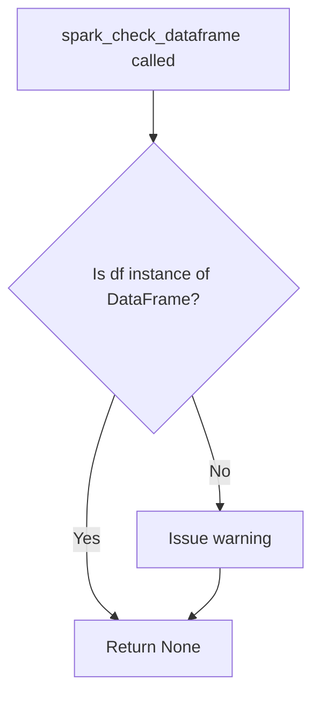
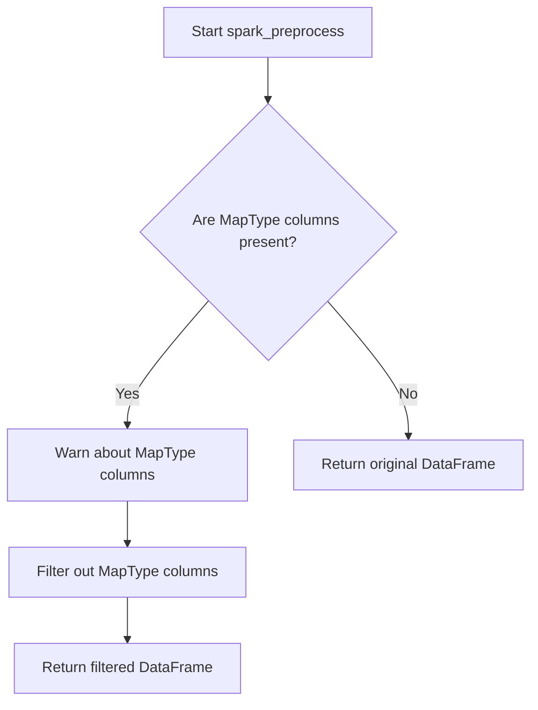

# `dataframe_spark.py`

## `src.ydata_profiling.model.spark.dataframe_spark.spark_check_dataframe` · *function*

## Summary:
Validates that the input is a PySpark DataFrame and issues a warning if validation fails.

## Description:
This function performs a type validation check to ensure the input parameter is a PySpark DataFrame instance. It is specifically designed for use in Spark-based data profiling workflows where type safety is critical. When the input is not of the expected type, it issues a warning rather than raising an exception, allowing the processing to continue while alerting users to potential type mismatches.

The validation logic is extracted into its own function to maintain clean separation of concerns, enabling type checking to be decoupled from the core profiling operations. This design choice makes the code more modular and easier to test independently.

## Args:
    df (DataFrame): A dataframe object to validate. This parameter is expected to be a PySpark DataFrame (pyspark.sql.DataFrame).

## Returns:
    None: This function does not return any value. It only performs validation and issues warnings when validation fails.

## Raises:
    None: This function does not raise exceptions. It issues warnings instead when validation fails.

## Constraints:
    Preconditions:
    - The input parameter `df` should be a PySpark DataFrame instance
    - The function assumes that `pyspark.sql.DataFrame` is available in the environment
    
    Postconditions:
    - Function completes execution regardless of validation outcome
    - No modifications are made to the input DataFrame

## Side Effects:
    - Issues a warning message via Python's warnings module when validation fails
    - No I/O operations or external state mutations occur

## Control Flow:


## Examples:
```python
from pyspark.sql import SparkSession
from pyspark.sql.types import StructType, StructField, StringType, IntegerType

# Valid usage - no warning issued
spark = SparkSession.builder.appName("test").getOrCreate()
df = spark.createDataFrame([(1, "Alice"), (2, "Bob")], ["id", "name"])
spark_check_dataframe(df)  # No warning

# Invalid usage - warning issued
import pandas as pd
pandas_df = pd.DataFrame({'a': [1, 2, 3], 'b': [4, 5, 6]})
spark_check_dataframe(pandas_df)  # Warning issued: "df is not of type pyspark.sql.dataframe.DataFrame"
```

## `src.ydata_profiling.model.spark.dataframe_spark.spark_preprocess` · *function*

## Summary:
Filters out MapType columns from Spark DataFrames to ensure compatibility with profiling operations.

## Description:
Processes Spark DataFrames by identifying and removing columns with MapType data, which are not supported by the profiling framework. This function acts as a preprocessing step to ensure downstream profiling operations can execute successfully on Spark DataFrames.

The function is part of the Spark-specific data processing pipeline and is called during the preprocessing phase of data profiling for Spark environments. It specifically addresses compatibility issues with MapType columns that cannot be properly analyzed by the profiling framework due to their complex nested structure.

## Args:
    config (Settings): Configuration settings object for the profiling process (currently unused in this implementation).
    df (DataFrame): Input Spark DataFrame to be processed, potentially containing MapType columns.

## Returns:
    DataFrame: A Spark DataFrame with MapType columns removed. If no MapType columns are present, returns the original DataFrame unchanged.

## Raises:
    None: This implementation does not explicitly raise exceptions, though underlying Spark operations may raise exceptions.

## Constraints:
    Preconditions:
    - config must be a valid Settings object
    - df must be a valid Spark DataFrame
    - df.columns must be accessible
    
    Postconditions:
    - All columns with MapType data are removed from the returned DataFrame
    - Non-MapType columns are preserved in their original order
    - If no MapType columns exist, the original DataFrame is returned unchanged

## Side Effects:
    - Issues a warning via Python's warnings module when MapType columns are detected and removed
    - The warning message appears to be incomplete in the current implementation (should indicate which columns were removed)
    - No modifications are made to the original DataFrame (returns a new DataFrame)

## Control Flow:


## Examples:
```python
# Basic usage with DataFrame containing MapType columns
from pyspark.sql import SparkSession
from ydata_profiling.config import Settings

spark = SparkSession.builder.appName("test").getOrCreate()
config = Settings()

# Create DataFrame with MapType column
data = [("Alice", {"age": 30, "city": "NYC"}), ("Bob", {"age": 25, "city": "LA"})]
df = spark.createDataFrame(data, ["name", "attributes"])

# Process DataFrame (MapType column will be removed)
processed_df = spark_preprocess(config, df)
# Result contains only 'name' column, 'attributes' column removed

# Usage with DataFrame without MapType columns
simple_data = [("Alice", 30), ("Bob", 25)]
simple_df = spark.createDataFrame(simple_data, ["name", "age"])
result_df = spark_preprocess(config, simple_df)
# Result is identical to simple_df

# Edge case: DataFrame with multiple MapType columns
map_data = [
    ("Alice", {"age": 30, "city": "NYC"}, {"hobby": "reading"}),
    ("Bob", {"age": 25, "city": "LA"}, {"hobby": "swimming"})
]
multi_map_df = spark.createDataFrame(map_data, ["name", "personal", "interests"])
result_multi = spark_preprocess(config, multi_map_df)
# Result contains only 'name' column, both 'personal' and 'interests' columns removed
```

