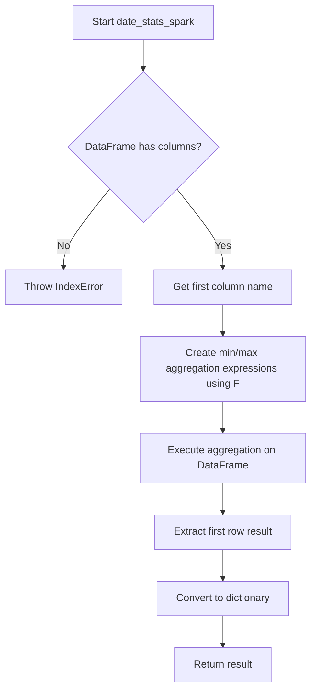
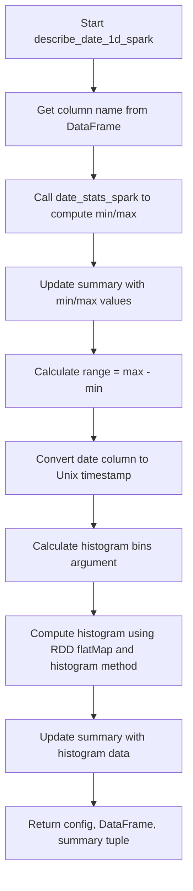

# `describe_date_spark.py`

## `src.ydata_profiling.model.spark.describe_date_spark.date_stats_spark` · *function*

## Summary:
Computes minimum and maximum date values from a single-column Spark DataFrame.

## Description:
Extracts the earliest and latest date values from a single date column in a Spark DataFrame. This function is part of the date profiling workflow for Spark dataframes and provides basic temporal range statistics. The summary parameter is currently unused in the implementation.

## Args:
    df (DataFrame): A PySpark DataFrame containing exactly one column of date/datetime values.
    summary (dict): A dictionary containing summary configuration or metadata (currently unused in implementation).

## Returns:
    dict: A dictionary containing two keys: 'min' with the earliest date value and 'max' with the latest date value.

## Raises:
    IndexError: When the DataFrame has no columns.
    AttributeError: When the DataFrame column operations fail due to invalid column references.

## Constraints:
    Preconditions:
    - The input DataFrame must contain exactly one column
    - The column must contain date or datetime values that can be processed by Spark's min/max functions
    - The DataFrame must be a valid PySpark DataFrame
    
    Postconditions:
    - Returns a dictionary with exactly two keys: 'min' and 'max'
    - Both values are properly formatted date/datetime objects from Spark

## Side Effects:
    None: This function performs no I/O operations or external state mutations.

## Control Flow:


## Examples:
```python
# Basic usage
from pyspark.sql import SparkSession
from pyspark.sql.functions import col
spark = SparkSession.builder.appName("test").getOrCreate()
df = spark.createDataFrame([(datetime(2020, 1, 1),), (datetime(2023, 12, 31),)], ["date_col"])
result = date_stats_spark(df, {})
print(result)  # {'min': datetime(2020, 1, 1), 'max': datetime(2023, 12, 31)}
```

## `src.ydata_profiling.model.spark.describe_date_spark.describe_date_1d_spark` · *function*

## Summary:
Processes date column data in Spark DataFrames to compute temporal statistics and histogram data for profiling.

## Description:
Computes comprehensive date statistics and histogram data for a single date column in a PySpark DataFrame. This function serves as the Spark-specific implementation for date profiling, extracting temporal ranges, converting dates to Unix timestamps for numerical processing, and calculating histogram bins for visualization purposes. It's designed to work within the ydata-profiling framework for Spark environments.

The function extracts temporal range information (minimum and maximum dates), computes the date range, converts date values to Unix timestamps for numerical operations, and calculates histogram data for visualization. This logic is separated from inline processing to maintain clean architectural boundaries between data transformation and statistical computation.

## Args:
    config (Settings): Configuration object containing plotting settings, specifically histogram bin configuration
    df (DataFrame): PySpark DataFrame containing exactly one date/datetime column to profile
    summary (dict): Dictionary containing existing summary statistics and metadata

## Returns:
    Tuple[Settings, DataFrame, dict]: A tuple containing the updated configuration, DataFrame with Unix timestamp conversion applied, and updated summary dictionary with computed statistics including min, max, range, and histogram data

## Raises:
    IndexError: When the input DataFrame has no columns
    AttributeError: When DataFrame column operations fail due to invalid column references
    ValueError: When date conversion to Unix timestamp fails

## Constraints:
    Preconditions:
    - The input DataFrame must contain exactly one column
    - The single column must contain valid date or datetime values
    - The DataFrame must be a valid PySpark DataFrame instance
    - Config must contain valid plot.histogram.bins setting
    
    Postconditions:
    - The returned DataFrame has the date column converted to Unix timestamp integers
    - The summary dictionary contains updated keys: 'min', 'max', 'range', and 'histogram'
    - The histogram data in summary is a tuple of (histogram_counts_array, bin_edges_array)

## Side Effects:
    None: This function operates purely on the input parameters and returns new objects without modifying external state.

## Control Flow:


## Examples:
```python
# Basic usage in Spark profiling context
from pyspark.sql import SparkSession
from pyspark.sql.functions import col
from ydata_profiling.config import Settings

spark = SparkSession.builder.appName("test").getOrCreate()
config = Settings()

# Create sample date DataFrame
df = spark.createDataFrame([
    ("2020-01-01",),
    ("2020-06-15",),
    ("2020-12-31",)
], ["date_col"])

summary = {"n_distinct": 3}

# Process date data
updated_config, processed_df, updated_summary = describe_date_1d_spark(config, df, summary)

# Access computed statistics
print(f"Min date: {updated_summary['min']}")
print(f"Max date: {updated_summary['max']}")
print(f"Date range: {updated_summary['range']}")
print(f"Histogram data: {updated_summary['histogram']}")
```

