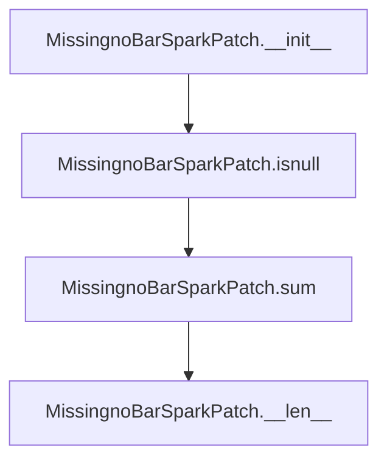
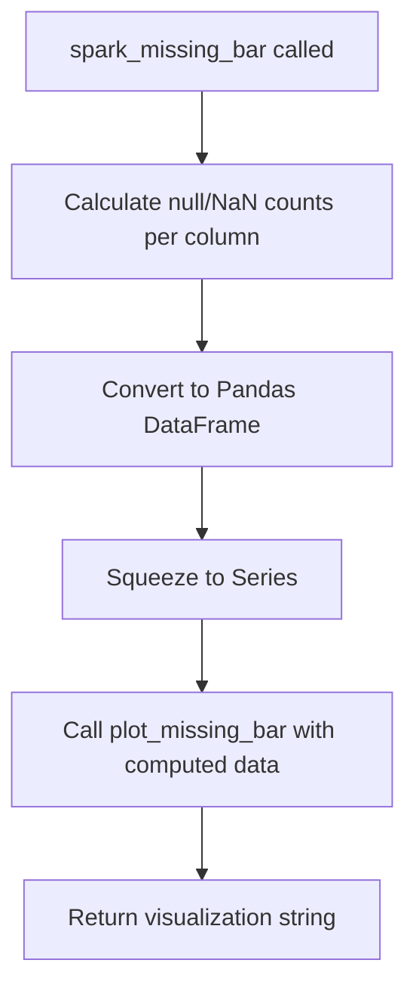
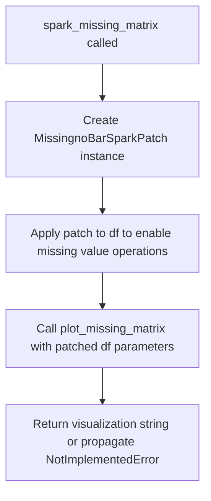
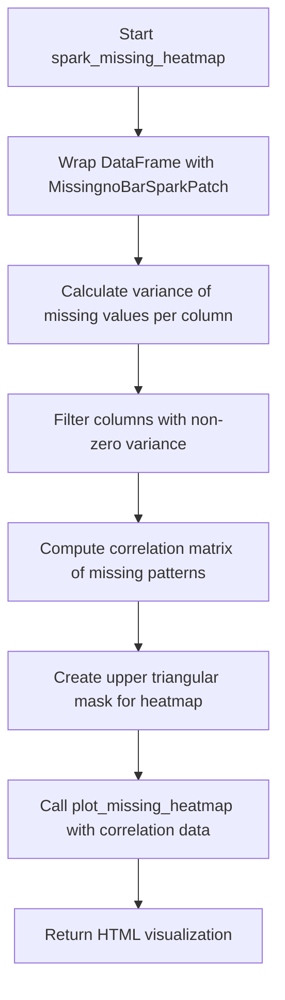

# `missing_spark.py`

## `src.ydata_profiling.model.spark.missing_spark.MissingnoBarSparkPatch` · *class*

## Summary:
A Spark DataFrame patch class that enables missing data bar chart visualization for PySpark DataFrames.

## Description:
The `MissingnoBarSparkPatch` class serves as a compatibility layer that allows PySpark DataFrames to work with the missing data visualization system originally designed for pandas DataFrames. It patches the standard pandas-like operations (.isnull(), .sum()) to return appropriate Spark-compatible results, enabling the generation of missing data bar charts for distributed Spark datasets.

This class is specifically used in the context of data profiling with PySpark DataFrames where traditional pandas operations are not available. It maintains the interface expected by the missing data visualization pipeline while adapting to Spark's distributed computing model.

## State:
- `df` (DataFrame): The underlying PySpark DataFrame being wrapped
- `columns` (List[str], optional): Column names to analyze for missing values
- `original_df_size` (int, optional): Original size of the DataFrame before any transformations

## Lifecycle:
- Creation: Instantiate with a PySpark DataFrame and optional metadata parameters
- Usage: Used internally by the missing data visualization pipeline when processing Spark DataFrames
- Destruction: No explicit cleanup required; relies on Spark's garbage collection

## Method Map:


## Raises:
- No explicit exceptions raised during initialization
- The class assumes valid DataFrame input and handles operations gracefully

## Example:
```python
from pyspark.sql import DataFrame
from src.ydata_profiling.model.spark.missing_spark import MissingnoBarSparkPatch

# Create a Spark DataFrame
spark_df = spark.createDataFrame([(1, None), (2, 3), (None, 4)], ["A", "B"])

# Create the patch instance
patch = MissingnoBarSparkPatch(spark_df, columns=["A", "B"], original_df_size=3)

# The patch allows chaining operations expected by the visualization system
result = patch.isnull().sum()
```

### `src.ydata_profiling.model.spark.missing_spark.MissingnoBarSparkPatch.__init__` · *method*

## Summary:
Initializes a MissingnoBarSparkPatch instance with Spark DataFrame and configuration parameters.

## Description:
This constructor method sets up the instance with the required Spark DataFrame and optional configuration parameters for missing data visualization. It serves as the entry point for initializing the patch with the necessary data and metadata.

## Args:
    df (DataFrame): The Spark DataFrame containing the data to analyze for missing values.
    columns (List[str], optional): List of column names to analyze. If None, all columns are analyzed. Defaults to None.
    original_df_size (int, optional): The original size of the DataFrame before any filtering or processing. If None, the size is determined automatically. Defaults to None.

## Returns:
    None: This method initializes instance attributes and does not return a value.

## Raises:
    None: This method does not explicitly raise exceptions.

## State Changes:
    Attributes READ: None
    Attributes WRITTEN: 
    - self.df: Assigned the input DataFrame
    - self.columns: Assigned the input columns list
    - self.original_df_size: Assigned the input original DataFrame size

## Constraints:
    Preconditions:
    - df must be a valid PySpark DataFrame
    - columns, if provided, must be a list of strings representing column names
    - original_df_size, if provided, must be a positive integer
    
    Postconditions:
    - All instance attributes are properly initialized with the provided values
    - The instance is ready for subsequent operations in the missing data analysis pipeline

## Side Effects:
    None: This method performs only local attribute assignments and has no external side effects.

### `src.ydata_profiling.model.spark.missing_spark.MissingnoBarSparkPatch.isnull` · *method*

## Summary:
Returns the patch instance itself to enable method chaining for PySpark DataFrame missing data operations.

## Description:
This method overrides the standard PySpark DataFrame `.isnull()` behavior to return the patch instance (`self`) instead of a DataFrame. This enables method chaining patterns required by the missing data visualization pipeline in Spark environments. The method is part of the `MissingnoBarSparkPatch` class that patches PySpark DataFrame operations to work with the ydata-profiling missing data visualization system.

## Args:
    None: This method takes no arguments beyond the implicit `self` parameter.

## Returns:
    Any: Returns the patch instance (`self`) to enable fluent interface patterns for method chaining.

## Raises:
    None: This method does not raise any exceptions.

## State Changes:
    Attributes READ: None - this method does not read any instance attributes
    Attributes WRITTEN: None - this method does not modify any instance attributes

## Constraints:
    Preconditions:
    - The method should only be called on instances of `MissingnoBarSparkPatch`
    - The patch instance must have been properly initialized with a PySpark DataFrame
    
    Postconditions:
    - The method always returns the same instance (`self`)
    - The returned instance maintains all patch properties for subsequent method calls

## Side Effects:
    None: This method performs no I/O operations or external state mutations.

### `src.ydata_profiling.model.spark.missing_spark.MissingnoBarSparkPatch.sum` · *method*

## Summary:
Returns the underlying Spark DataFrame wrapped by this patch object.

## Description:
This method provides access to the original Spark DataFrame that was wrapped by the MissingnoBarSparkPatch. It is part of a patching mechanism that allows missing data visualization functions to operate on Spark DataFrames while maintaining compatibility with the expected interface.

## Args:
    None

## Returns:
    DataFrame: The underlying Spark DataFrame that this patch object wraps.

## Raises:
    None

## State Changes:
    Attributes READ: self.df
    Attributes WRITTEN: None

## Constraints:
    Preconditions: The patch object must have been initialized with a valid Spark DataFrame
    Postconditions: The returned DataFrame maintains the same schema and data as the original

## Side Effects:
    None

### `src.ydata_profiling.model.spark.missing_spark.MissingnoBarSparkPatch.__len__` · *method*

## Summary:
Returns the original DataFrame size to support container protocol compliance for Spark missing data visualization.

## Description:
Implements the Python `__len__` magic method to enable container protocol compliance for the `MissingnoBarSparkPatch` class. This method allows the patched DataFrame wrapper to behave like a container with a defined length, which is required by certain visualization libraries and data analysis tools that expect container-like behavior.

The method returns the pre-computed `original_df_size` that was stored during instance initialization. This patching mechanism is specifically designed for PySpark environments where standard pandas missing data visualization operations need to be adapted for Spark DataFrames.

## Args:
    None: This method takes no arguments beyond the implicit `self`.

## Returns:
    Optional[int]: The original DataFrame size as stored in `self.original_df_size`, or None if not set.

## Raises:
    None: This method does not explicitly raise exceptions.

## State Changes:
    Attributes READ: 
    - self.original_df_size: The stored original DataFrame size used for length calculation
    Attributes WRITTEN: None

## Constraints:
    Preconditions:
    - The instance must have been properly initialized with a valid `original_df_size` value
    - The `original_df_size` attribute should be either an integer or None
    
    Postconditions:
    - The method will return the value stored in `self.original_df_size`
    - No modifications are made to the instance state

## Side Effects:
    None: This method performs no I/O operations, external service calls, or mutations to objects outside the instance.

## `src.ydata_profiling.model.spark.missing_spark.spark_missing_bar` · *function*

## Summary:
Computes and generates a bar chart visualization of missing data patterns for Spark DataFrame columns.

## Description:
Processes a Spark DataFrame to calculate null and NaN value counts for each column, then generates a bar chart visualization representing these missing value patterns. This function is part of the data profiling pipeline for Spark DataFrames and provides a quick visual assessment of data quality issues.

The function extracts the core logic of missing data visualization into a dedicated component to separate data processing from visualization concerns, enabling reuse across different Spark DataFrame analysis contexts.

## Args:
    config (Settings): Configuration object containing visualization parameters such as chart dimensions, styling options, and display preferences for the missing data chart.
    df (DataFrame): Input Spark DataFrame containing the dataset to analyze for missing values.

## Returns:
    str: String representation of the missing data bar chart visualization, typically in HTML or image format depending on the configuration settings.

## Raises:
    None: This function does not explicitly raise exceptions, though underlying operations may raise Spark or Pandas-related exceptions.

## Constraints:
    Preconditions:
    - config must be a valid Settings object with appropriate configuration for visualization
    - df must be a valid Spark DataFrame with columns that support null checking operations
    - df must have a countable number of rows

    Postconditions:
    - Returns a properly formatted string representation of the missing data visualization
    - The returned visualization accurately reflects the null/NaN value distribution across DataFrame columns

## Side Effects:
    - Converts Spark DataFrame to Pandas DataFrame internally for processing
    - Generates matplotlib figures and potentially saves files to disk if configured
    - May perform I/O operations when saving images to assets directory

## Control Flow:


## Examples:
    # Basic usage
    from ydata_profiling.config import Settings
    from pyspark.sql import SparkSession
    
    spark = SparkSession.builder.appName("test").getOrCreate()
    df = spark.createDataFrame([(1, None), (2, "value"), (None, "another")], ["col1", "col2"])
    config = Settings()
    
    visualization = spark_missing_bar(config, df)
    print(visualization)
```

## `src.ydata_profiling.model.spark.missing_spark.spark_missing_matrix` · *function*

## Summary
Generates a missing data matrix visualization for PySpark DataFrames by applying a Spark-compatible patch transformation.

## Description
This function creates a matrix-style visualization displaying the presence or absence of missing values for each column in a PySpark DataFrame. It serves as an adapter that bridges PySpark's distributed computing model with the standard missing data visualization system.

The function applies the `MissingnoBarSparkPatch` transformation to the input PySpark DataFrame, making it compatible with the existing visualization pipeline, then invokes `plot_missing_matrix` to generate the visualization. This enables data profiling workflows to visualize missing value patterns when working with large distributed datasets in Spark.

## Args
- config (Settings): Configuration object containing profiling settings including missing data visualization preferences and rendering options
- df (DataFrame): PySpark DataFrame containing the data to analyze for missing value patterns

## Returns
- str: String representation of the missing data matrix visualization, typically formatted as HTML or other visualization-ready format that can be embedded in profiling reports

## Raises
- NotImplementedError: The underlying `missing_matrix` function is not yet implemented, causing this function to raise NotImplementedError when executed

## Constraints
- Preconditions: 
  - config must be a valid Settings instance with proper initialization
  - df must be a valid PySpark DataFrame with columns that support missing value analysis
- Postconditions: 
  - Function attempts to return a string representation of a visualization that follows the configured style and format

## Side Effects
- None directly observable

## Control Flow


## Examples
```python
from ydata_profiling.config import Settings
from pyspark.sql import SparkSession

# Initialize Spark session
spark = SparkSession.builder.appName("MissingDataExample").getOrCreate()

# Create sample Spark DataFrame with missing values
spark_df = spark.createDataFrame([
    (1, None, "A"),
    (2, 3, "B"),
    (None, 4, "C"),
    (5, 6, None)
], ["col1", "col2", "col3"])

# Configure settings
config = Settings()

# Attempt to generate missing matrix visualization
# Note: This will raise NotImplementedError due to missing implementation
try:
    result = spark_missing_matrix(config, spark_df)
    print(result)
except NotImplementedError as e:
    print(f"Missing matrix visualization not yet implemented: {e}")
```

## `src.ydata_profiling.model.spark.missing_spark.spark_missing_heatmap` · *function*

## Summary
Generates a heatmap visualization showing correlations between missing data patterns across columns in a PySpark DataFrame.

## Description
Creates a correlation heatmap that visualizes how missing values are distributed and correlated across different columns in a Spark DataFrame. This function processes the DataFrame through a Spark-specific patch to enable missing data analysis, filters out columns with no variance in missing data patterns, computes the correlation matrix of missing value patterns, and generates a heatmap visualization.

The function is part of the data profiling pipeline for PySpark DataFrames and provides insights into missing data mechanisms (e.g., whether missing values occur together across columns). It specifically identifies columns where missing values show variation (non-zero variance) and analyzes their inter-correlations.

## Args
- config (Settings): Configuration object containing profiling settings and visualization options
- df (DataFrame): PySpark DataFrame to analyze for missing data patterns

## Returns
- str: HTML string representation of the missing data heatmap visualization

## Raises
- None explicitly raised by this function
- Exceptions may propagate from underlying operations like Spark DataFrame operations or visualization functions

## Constraints
- Preconditions:
  - config must be a valid Settings object with appropriate missing data visualization configuration
  - df must be a valid PySpark DataFrame
- Postconditions:
  - Returns a valid HTML string representation of the heatmap
  - The returned visualization accurately reflects missing data correlations in the input DataFrame

## Side Effects
- Creates matplotlib figures and potentially saves temporary files during visualization generation
- May perform Spark computations to calculate missing data patterns and correlations

## Control Flow


## Examples
```python
from ydata_profiling.config import Settings
from pyspark.sql import SparkSession

# Initialize Spark session
spark = SparkSession.builder.appName("MissingDataAnalysis").getOrCreate()

# Create sample DataFrame with missing values
data = [(1, None), (2, 3), (None, 4), (5, 6)]
df = spark.createDataFrame(data, ["A", "B"])

# Configure settings
config = Settings()

# Generate missing data heatmap
heatmap_html = spark_missing_heatmap(config, df)
print(heatmap_html)
```

