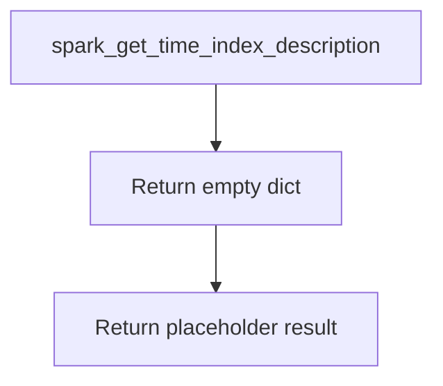

# `timeseries_index_spark.py`

## `src.ydata_profiling.model.spark.timeseries_index_spark.spark_get_time_index_description` · *function*

## Summary:
Returns an empty dictionary as a placeholder implementation for time index description extraction.

## Description:
This function is a placeholder implementation for extracting time index descriptive statistics from a PySpark DataFrame. It currently returns an empty dictionary and raises NotImplementedError when attempting to delegate to the base implementation. This function is part of the Spark-specific profiling module and follows the pattern of incomplete implementations that will be completed later.

## Args:
    config (Settings): Configuration object containing profiling settings and parameters
    df (DataFrame): Spark DataFrame containing the time series data
    table_stats (dict): Pre-computed statistics about the dataset structure and content

## Returns:
    dict: An empty dictionary representing the current placeholder implementation

## Raises:
    NotImplementedError: Raised when attempting to access the base implementation that is not yet implemented

## Constraints:
    Preconditions:
        - config must be a valid Settings object
        - df must be a valid PySpark DataFrame
        - table_stats must be a dictionary with appropriate keys
    
    Postconditions:
        - Always returns a dictionary (empty in current implementation)

## Side Effects:
    None: This function is stateless and does not modify external state or perform I/O operations

## Control Flow:


## Examples:
```python
# Basic usage - returns empty dict
config = Settings()
df = spark.createDataFrame([(1, '2023-01-01'), (2, '2023-01-02')], ['id', 'timestamp'])
table_stats = {'nrows': 2, 'ncols': 2}

result = spark_get_time_index_description(config, df, table_stats)
print(result)  # Prints: {}

# This demonstrates the current limitation
try:
    result = spark_get_time_index_description(config, df, table_stats)
    # Currently returns {} but would eventually provide time index info
except NotImplementedError:
    print("Implementation not yet complete")
```

