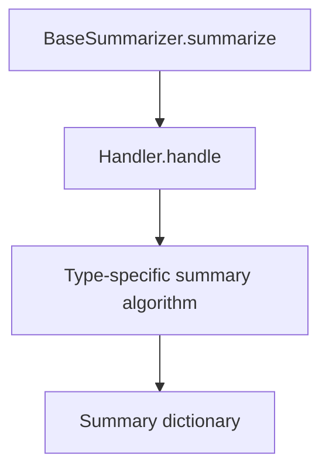
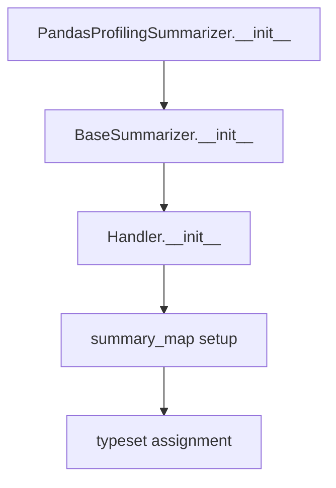

# `summarizer.py`

## `src.ydata_profiling.model.summarizer.BaseSummarizer` · *class*

## Summary:
A base class for data summarization that dispatches type-specific summary functions using a handler pattern.

## Description:
The BaseSummarizer class provides a standardized interface for generating descriptive statistics and summaries of data series based on their inferred data types. It leverages the Handler pattern to dynamically select and apply appropriate summary algorithms from the ydata_profiling.model.summary_algorithms module based on the detected data type of a pandas Series.

This class serves as the foundation for type-aware data profiling operations, enabling polymorphic behavior where different data types (numeric, categorical, text, etc.) are processed with their respective specialized summary functions while maintaining a consistent interface. It acts as a bridge between the type inference system and the specific summary algorithms.

## State:
- Inherits all state from Handler base class including:
  - mapping: Dict[str, List[Callable]] - Maps data type names to lists of callable summary functions
  - typeset: VisionsTypeset - Contains type hierarchy information for function propagation

## Lifecycle:
- Creation: Instantiated with default parameters from Handler parent class; no special construction required
- Usage: Call summarize() method with configuration, pandas Series, and data type to generate a summary dictionary
- Destruction: Relies on Python's garbage collection; no explicit cleanup needed

## Method Map:


## Raises:
- Inherited from Handler.handle(): Exceptions may be raised by the type-specific summary functions when processing data
- No explicit exceptions defined in BaseSummarizer.__init__ or summarize method

## Example:
```python
# Create a summarizer instance (inherited from Handler)
summarizer = BaseSummarizer()

# Summarize a numeric series
config = Settings()
series = pd.Series([1, 2, 3, 4, 5])
summary = summarizer.summarize(config, series, Numeric)  # where Numeric is a VisionsBaseType subclass

# The result would be a dictionary containing statistical summary information
# such as count, mean, std, min, max, etc. for numeric data
```

### `src.ydata_profiling.model.summarizer.BaseSummarizer.summarize` · *method*

## Summary:
Returns a type-specific summary dictionary for a pandas Series by dispatching to appropriate summary algorithms based on data type.

## Description:
This method serves as the primary interface for generating descriptive statistics and metadata for a pandas Series. It leverages the Handler's type dispatch mechanism to select and apply the correct summary algorithm based on the inferred data type. The method is typically invoked during data profiling pipelines when detailed statistical summaries are required for individual variables.

The method acts as a thin wrapper around the Handler's `handle` method, extracting only the summary portion of the result tuple. This design allows for clean separation between the dispatch logic and the actual summary generation, while maintaining flexibility for future extensions.

## Args:
    config (Settings): Configuration object containing profiling settings and options
    series (pd.Series): The pandas Series to summarize
    dtype (Type[VisionsBaseType]): The inferred data type class for the series

## Returns:
    dict: A dictionary containing type-specific summary statistics and metadata for the series

## Raises:
    None explicitly raised - exceptions may be raised by underlying summary algorithms

## State Changes:
    Attributes READ: None
    Attributes WRITTEN: None

## Constraints:
    Preconditions:
    - The BaseSummarizer instance must be properly initialized with a valid Handler mapping
    - The dtype parameter must correspond to a registered type in the Handler's mapping
    - The series parameter must be a valid pandas Series object
    
    Postconditions:
    - Returns a dictionary containing summary statistics for the provided series
    - The returned dictionary structure varies based on the data type being summarized

## Side Effects:
    None - this method is stateless and does not perform I/O or mutate external state

## `src.ydata_profiling.model.summarizer.PandasProfilingSummarizer` · *class*

## Summary:
A type-aware data summarizer that maps data types to their respective summary algorithms for pandas profiling.

## Description:
The PandasProfilingSummarizer class is a specialized implementation of BaseSummarizer that provides type-specific summary functions for different data categories. It serves as a dispatcher that routes data series to appropriate summary algorithms based on their inferred data types using the Visions type system.

This class enables efficient and polymorphic data profiling by organizing summary functions into categories (Numeric, DateTime, Text, etc.) and associating them with their respective data type handlers. It is designed to work with the ydata-profiling framework's type inference system to automatically select the most appropriate summary algorithm for each column's data type.

## State:
- summary_map: Dict[str, List[Callable]] - Maps data type names to lists of callable summary functions for that type
- typeset: VisionsTypeset - Contains type hierarchy information for function propagation (inherited from Handler)

## Lifecycle:
- Creation: Instantiate with a VisionsTypeset object; the summary_map is populated with type-specific summary functions
- Usage: The summarizer is typically used internally by the profiling pipeline to generate descriptive statistics for each column
- Destruction: Relies on Python's garbage collection; no explicit cleanup required

## Method Map:


## Raises:
- None explicitly raised in __init__
- Exceptions may be raised by the type-specific summary functions during summarize() calls

## Example:
```python
# Create a summarizer instance
from visions import VisionsTypeset
from ydata_profiling.config import Settings

typeset = VisionsTypeset()
summarizer = PandasProfilingSummarizer(typeset)

# The summarizer is typically used internally by the profiling system
# to process columns of different data types with appropriate algorithms
```

### `src.ydata_profiling.model.summarizer.PandasProfilingSummarizer.__init__` · *method*

## Summary:
Initializes a PandasProfilingSummarizer with type-specific summary function mappings and configures type inheritance handling.

## Description:
Configures the summarizer with a mapping of data types to their respective summary algorithms and initializes the type handling infrastructure. This method establishes the relationship between data types and their appropriate summary functions, enabling the summarizer to dispatch processing to the correct algorithm based on the inferred data type of each column.

The method creates a comprehensive mapping of data type categories (Numeric, DateTime, Text, etc.) to their corresponding summary functions, then delegates to the parent Handler class to complete the type hierarchy processing and function propagation.

## Args:
    typeset (VisionsTypeset): A Visions type system instance containing type hierarchy information used to construct the dependency graph for function propagation.

## Returns:
    None

## Raises:
    None explicitly raised by this method.
    Exceptions may be raised by the type-specific summary functions during summarize() calls.

## State Changes:
    Attributes READ: None
    Attributes WRITTEN: 
    - self.mapping: Set to the summary_map dictionary containing type-to-function mappings
    - self.typeset: Set to the provided typeset parameter

## Constraints:
    Preconditions:
    - typeset must be a valid VisionsTypeset object containing type hierarchy information
    - typeset.base_graph must be a valid NetworkX graph with proper dependencies

    Postconditions:
    - self.mapping is initialized with the provided summary_map
    - self.typeset is initialized with the provided typeset
    - The mapping has been completed with inherited functions from parent types through _complete_dag()

## Side Effects:
    Calls self._complete_dag() which processes the type hierarchy to propagate function mappings through the dependency graph.

## `src.ydata_profiling.model.summarizer.format_summary` · *function*

## Summary:
Converts profiling summary data into a JSON-serializable dictionary format by recursively normalizing complex data types.

## Description:
The `format_summary` function standardizes profiling results into a uniform dictionary format suitable for serialization and interchange. It handles the conversion of complex internal data structures (like `BaseDescription` objects, pandas Series, and numpy arrays) into basic Python types that can be easily serialized to JSON or other formats.

This function extracts profiling analysis results and ensures consistent output formatting regardless of the internal representation used during analysis. It's particularly useful for preparing profiling results for web APIs, file exports, or other serialization scenarios.

## Args:
    summary (Union[BaseDescription, dict]): Either a `BaseDescription` object containing profiling results or a dictionary of profiling data to be normalized and formatted.

## Returns:
    dict: A dictionary representation of the profiling summary where all nested data structures have been converted to JSON-serializable formats. Specifically:
    - `BaseDescription` objects are converted to dictionaries using `asdict()`
    - `pandas.Series` objects are converted to dictionaries via `.to_dict()`
    - Tuples containing exactly two numpy arrays are converted to dictionaries with "counts" and "bin_edges" keys
    - All other values remain unchanged

## Raises:
    None explicitly raised by this function.

## Constraints:
    Preconditions:
    - The input `summary` parameter must be either a `BaseDescription` instance or a dictionary
    - All nested values within the summary must be compatible with the formatting logic
    
    Postconditions:
    - The returned dictionary contains only basic Python data types (dict, list, str, int, float, bool, None)
    - All pandas Series are converted to dictionaries
    - All numpy arrays are converted to lists
    - All tuples containing two numpy arrays are converted to dictionaries with "counts" and "bin_edges" keys

## Side Effects:
    None

## Control Flow:
```mermaid
flowchart TD
    A[Start format_summary] --> B{Input is BaseDescription?}
    B -- Yes --> C[Convert to dict using asdict()]
    B -- No --> D[Skip conversion]
    C --> E[Apply fmt() to all items]
    D --> E
    E --> F[Return formatted dict]
```

## Examples:
```python
# Example 1: Formatting a BaseDescription object
from ydata_profiling.model import BaseDescription
description = BaseDescription()
# ... populate description with analysis results ...
formatted = format_summary(description)
# Returns a fully formatted dictionary ready for serialization

# Example 2: Formatting a dictionary with numpy arrays
input_dict = {
    "variable_stats": {"count": 100, "missing": 5},
    "histogram": ([1, 2, 3], [0.1, 0.2, 0.3])
}
formatted = format_summary(input_dict)
# Returns: {"variable_stats": {"count": 100, "missing": 5}, "histogram": {"counts": [1, 2, 3], "bin_edges": [0.1, 0.2, 0.3]}}

# Example 3: Formatting a dictionary with pandas Series
import pandas as pd
input_dict = {
    "series_data": pd.Series([1, 2, 3])
}
formatted = format_summary(input_dict)
# Returns: {"series_data": [1, 2, 3]}
```

## `src.ydata_profiling.model.summarizer._redact_column` · *function*

## Summary:
Redacts sensitive data from column summary dictionaries by replacing specific fields with anonymized placeholders.

## Description:
This function removes potentially sensitive information from column summary data by redacting specific fields that may contain detailed statistics, character counts, or sample data. It processes two categories of fields differently: fields where dictionary keys are redacted (using REDACTED_0, REDACTED_1, etc.) and fields where dictionary values are redacted (using the original keys but redacted values). The function is designed to be used internally within the profiling system to protect sensitive data while maintaining the structural integrity of column summaries.

## Args:
    column (Dict[str, Any]): A dictionary containing column summary data that may contain sensitive fields to be redacted. Expected to contain various statistical fields like character counts, value counts, and sample data.

## Returns:
    Dict[str, Any]: The same dictionary with specified sensitive fields redacted. Fields that are redacted will contain anonymized placeholder values while maintaining the overall dictionary structure.

## Raises:
    None explicitly raised.

## Constraints:
    Preconditions:
    - Input must be a dictionary
    - Fields to be redacted (keys_to_redact and values_to_redact) should be string keys
    - Values in the redacted fields should be either dictionaries or other data types that can be processed by the redaction functions
    
    Postconditions:
    - The returned dictionary maintains the same keys as the input
    - Sensitive fields are replaced with redacted versions following the pattern REDACTED_0, REDACTED_1, etc.
    - Non-sensitive fields remain unchanged
    - The structure of nested dictionaries is preserved

## Side Effects:
    None.

## Control Flow:
```mermaid
flowchart TD
    A[Start _redact_column] --> B[Process keys_to_redact fields]
    B --> C{Field exists in column?}
    C -- No --> D[Skip field]
    C -- Yes --> E{Values are all dicts?}
    E -- Yes --> F[Apply redact_key to each dict value]
    E -- No --> G[Apply redact_key to field value]
    F --> H[Update column[field]]
    G --> H
    H --> I[Next keys_to_redact field?]
    I -- Yes --> B
    I -- No --> J[Process values_to_redact fields]
    J --> K{Field exists in column?}
    K -- No --> L[Skip field]
    K -- Yes --> M{Values are all dicts?}
    M -- Yes --> N[Apply redact_value to each dict value]
    M -- No --> O[Apply redact_value to field value]
    N --> P[Update column[field]]
    O --> P
    P --> Q[Next values_to_redact field?]
    Q -- Yes --> J
    Q -- No --> R[Return column]
```

## Examples:
```python
# Example usage with a column dictionary containing sensitive data
column_data = {
    "block_alias_char_counts": {"key1": "value1", "key2": "value2"},
    "first_rows": {"row1": "data1", "row2": "data2"},
    "value_counts_without_nan": {"cat1": 10, "cat2": 5}
}

redacted_column = _redact_column(column_data)
# Result would have:
# - block_alias_char_counts: {"REDACTED_0": "value1", "REDACTED_1": "value2"}
# - first_rows: {"row1": "REDACTED_0", "row2": "REDACTED_1"}  
# - value_counts_without_nan: {"REDACTED_0": 10, "REDACTED_1": 5}
```

## `src.ydata_profiling.model.summarizer.redact_summary` · *function*

## Summary
Redacts sensitive information from categorical and text variable summaries based on configuration settings.

## Description
Processes a summary dictionary to redact potentially sensitive data from categorical and text variables according to the redaction configuration. This function iterates through all variables in the summary and applies redaction to those that match specific type criteria and have redaction enabled in the configuration.

The function is called during the profiling report generation process to ensure sensitive data is not exposed in the final report output. It specifically targets categorical variables when `config.vars.cat.redact` is True and text variables when `config.vars.text.redact` is True.

## Args
    summary (dict): A dictionary containing variable summaries with a "variables" key mapping to variable data
    config (Settings): Configuration object containing redaction settings for categorical and text variables

## Returns
    dict: The same summary dictionary with potentially redacted variable data

## Raises
    None explicitly raised

## Constraints
    Preconditions:
    - summary must be a dictionary containing a "variables" key with variable data
    - config must be a valid Settings instance with properly initialized configuration objects
    - Each variable in summary["variables"] must be a dictionary with a "type" key

    Postconditions:
    - The returned dictionary is identical to the input summary dictionary
    - Variables that meet redaction criteria have their data redacted in-place within the summary structure
    - Variables that don't meet redaction criteria remain unchanged

## Side Effects
    None

## Control Flow
```mermaid
flowchart TD
    A[Start redact_summary] --> B[Iterate through summary[\"variables\"]]
    B --> C{config.vars.cat.redact AND col[\"type\"] == \"Categorical\"?}
    C -- Yes --> D[Call _redact_column(col)]
    C -- No --> E{config.vars.text.redact AND col[\"type\"] == \"Text\"?}
    E -- Yes --> F[Call _redact_column(col)]
    E -- No --> G[Continue to next variable]
    D --> H[Modify col in-place with redacted data]
    F --> H
    H --> I[Next variable?]
    I -- Yes --> B
    I -- No --> J[Return summary]
```

## Examples
```python
# Example usage with redaction enabled for categorical variables
from src.ydata_profiling.config import Settings

# Configure redaction for categorical variables
config = Settings(vars=Univariate(cat=CatVars(redact=True)))

# Process summary with categorical variables
summary = {
    "variables": {
        "category_col": {
            "type": "Categorical",
            "value_counts": {"A": 10, "B": 5},
            "description": "Category variable"
        }
    }
}

# Apply redaction
redacted_summary = redact_summary(summary, config)
# The category_col variable will have its sensitive data redacted in-place

# Example with redaction disabled (no changes)
config_no_redact = Settings(vars=Univariate(cat=CatVars(redact=False)))
redacted_summary = redact_summary(summary, config_no_redact)
# Summary remains unchanged
```

