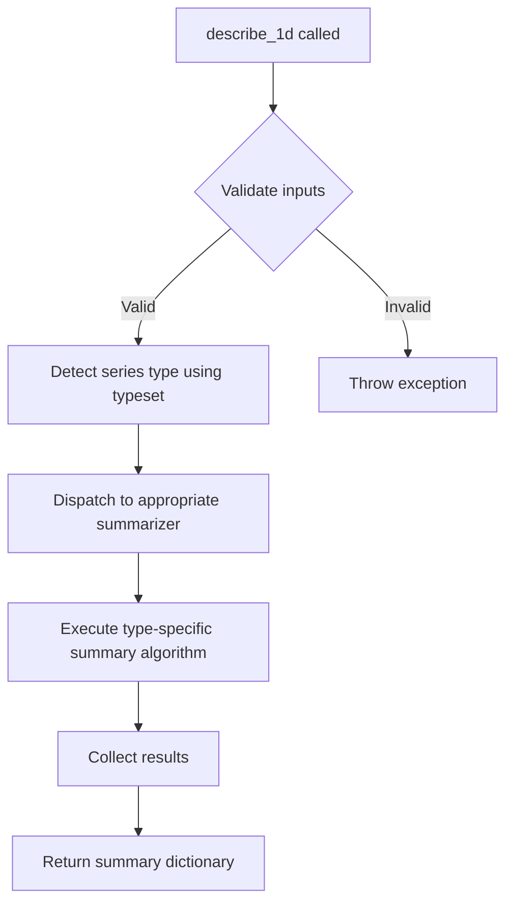
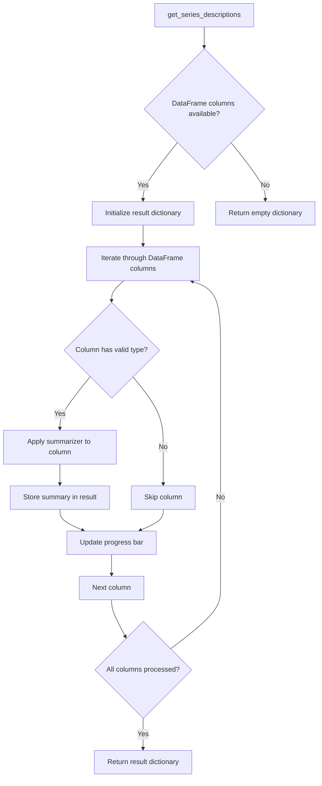

# `summary.py`

## `src.ydata_profiling.model.summary.describe_1d` · *function*

## Summary
Describes a one-dimensional data series by generating comprehensive statistical and type-specific summaries using configured summarization algorithms.

## Description
The `describe_1d` function serves as the core entry point for generating descriptive statistics and summaries of individual data series within a dataset. It orchestrates the process of analyzing a single column/series of data by leveraging type inference, configuration settings, and specialized summarization algorithms to produce a rich set of descriptive metrics.

This function is designed to be part of a larger profiling pipeline where individual series are analyzed independently to build a comprehensive understanding of each variable's characteristics. It encapsulates the logic for applying appropriate summary algorithms based on the detected data type of the series.

## Args
- config (Settings): Configuration object containing profiling settings such as report title, analysis parameters, and processing options
- series (Any): A pandas Series or equivalent data structure representing a single variable/column of data to be described
- summarizer (BaseSummarizer): An instance of BaseSummarizer that handles dispatching type-specific summary functions based on data type detection
- typeset (VisionsTypeset): A type system that provides type inference capabilities and maintains the hierarchy of supported data types

## Returns
- dict: A comprehensive dictionary containing descriptive statistics and metadata about the input series, including:
  - Basic counts and statistics (count, missing values, unique values)
  - Type-specific metrics (mean, median, mode, variance for numeric data, etc.)
  - Distribution information and frequency tables
  - Data quality indicators and anomalies
  - Metadata about the series (name, type, size)

## Raises
- NotImplementedError: Currently raised by the stub implementation indicating this function requires implementation

## Constraints
- Preconditions:
  - The `config` parameter must be a valid Settings instance with properly initialized configuration values
  - The `series` parameter must be a valid pandas Series or compatible data structure
  - The `summarizer` parameter must be a properly initialized BaseSummarizer instance
  - The `typeset` parameter must be a valid VisionsTypeset instance with proper type definitions
- Postconditions:
  - The returned dictionary will contain all relevant descriptive statistics for the input series
  - The function will handle all data type variations through the summarizer's type dispatch mechanism

## Side Effects
- None directly observable from this function
- The function may indirectly cause side effects through the summarizer's type-specific algorithms
- May utilize progress bars or logging if enabled in the configuration

## Control Flow


## Examples
```python
from ydata_profiling.config import Settings
from ydata_profiling.model.summarizer import BaseSummarizer
from visions import VisionsTypeset
import pandas as pd

# Create configuration
config = Settings()

# Create a sample series
series = pd.Series([1, 2, 3, 4, 5])

# Initialize summarizer and typeset (these would normally be created by the profiling system)
summarizer = BaseSummarizer()
typeset = VisionsTypeset()

# Generate description (this would be implemented in practice)
# description = describe_1d(config, series, summarizer, typeset)
# print(description)
```

## `src.ydata_profiling.model.summary.get_series_descriptions` · *function*

## Summary
Processes DataFrame series to generate type-aware descriptive summaries using configured profiling components.

## Description
This function is designed to iterate through each series (column) in a DataFrame and generate comprehensive descriptive statistics by applying type-specific summarization algorithms. It serves as a key component in the data profiling pipeline that coordinates between type inference, configuration settings, and summary generation.

The function leverages the provided BaseSummarizer to dispatch appropriate summary functions based on data types determined by the VisionsTypeset, while respecting the configuration parameters from Settings. It is intended to return a dictionary mapping each series name to its corresponding descriptive summary.

## Args
- config (Settings): Configuration object containing profiling settings and parameters that control analysis behavior
- df (Any): Input DataFrame containing the data to be profiled, typically a pandas DataFrame
- summarizer (BaseSummarizer): Type-aware summarization engine that uses a handler pattern to apply appropriate summary functions based on data types
- typeset (VisionsTypeset): Type inference system that identifies and categorizes data types for each series in the DataFrame
- pbar (tqdm): Progress bar iterator for tracking analysis completion status

## Returns
- dict: Dictionary mapping series names to their descriptive summary dictionaries containing type-specific statistics and metadata (implementation pending)

## Raises
- NotImplementedError: Currently raised by the function implementation (to be replaced with actual implementation)

## Constraints
- Preconditions:
  - All input parameters must be properly initialized and not None
  - DataFrame must be compatible with pandas operations
  - Typeset must be properly configured with supported data type definitions
- Postconditions:
  - Upon implementation, will return a dictionary with one entry per DataFrame column
  - Each entry will contain a complete summary for its respective series

## Side Effects
- Updates the progress bar state during execution (when implemented)
- Performs type inference operations on DataFrame columns (when implemented)
- Invokes summarizer functions that may generate statistics or metadata (when implemented)

## Control Flow


## Examples
```python
from ydata_profiling.config import Settings
from ydata_profiling.model.summarizer import BaseSummarizer
from visions import VisionsTypeset
from tqdm import tqdm
import pandas as pd

# Setup (conceptual - actual implementation needed)
config = Settings()
df = pd.DataFrame({'col1': [1, 2, 3], 'col2': ['a', 'b', 'c']})
summarizer = BaseSummarizer()
typeset = VisionsTypeset()
pbar = tqdm(total=len(df.columns))

# Function is not yet implemented
try:
    descriptions = get_series_descriptions(config, df, summarizer, typeset, pbar)
except NotImplementedError:
    print("Implementation pending")
```

