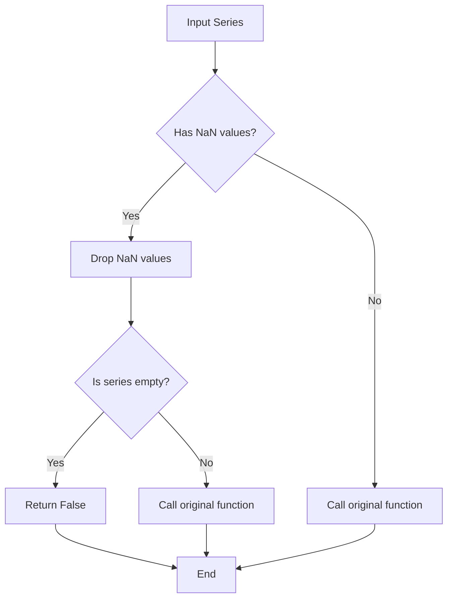
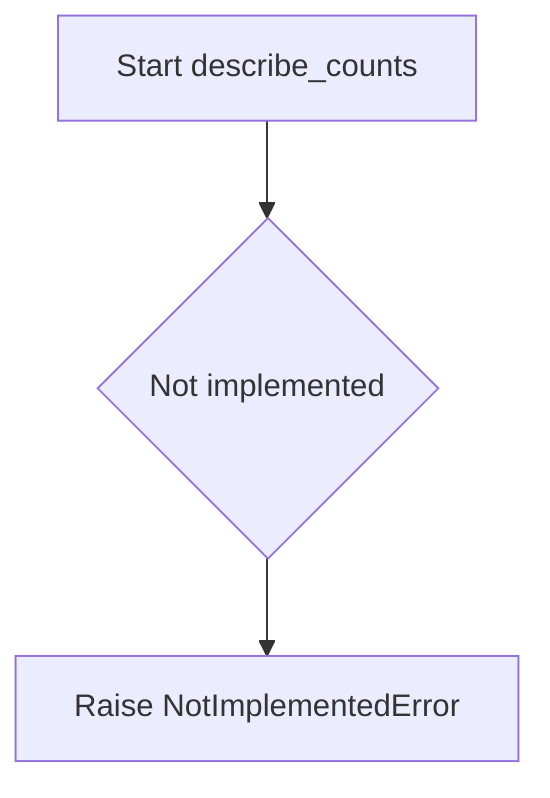
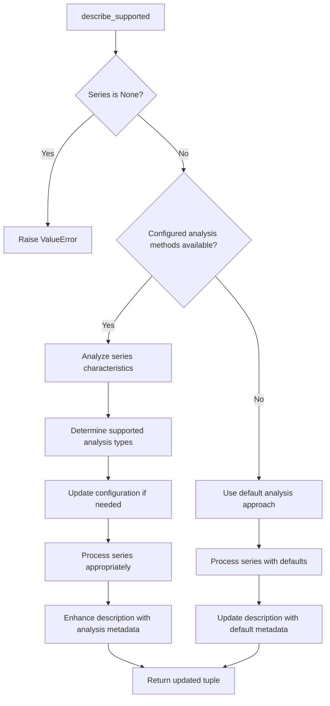
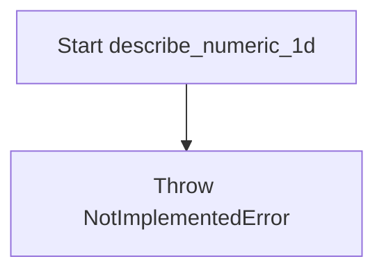
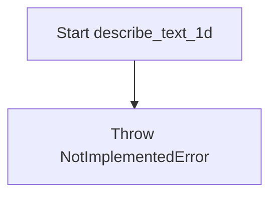
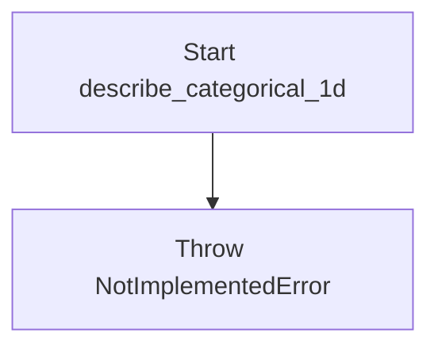
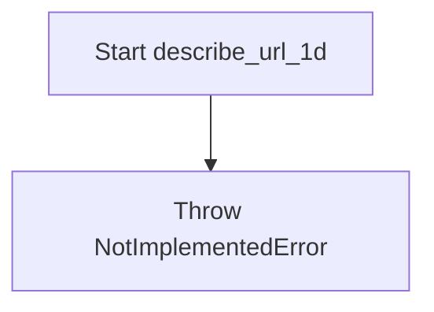
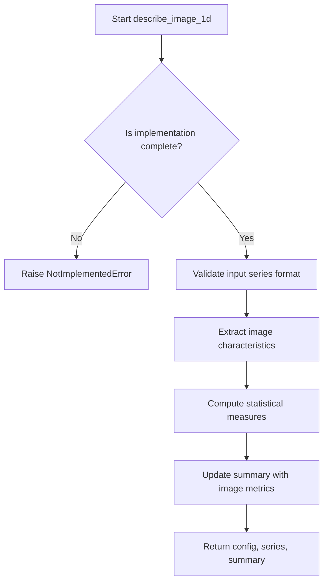
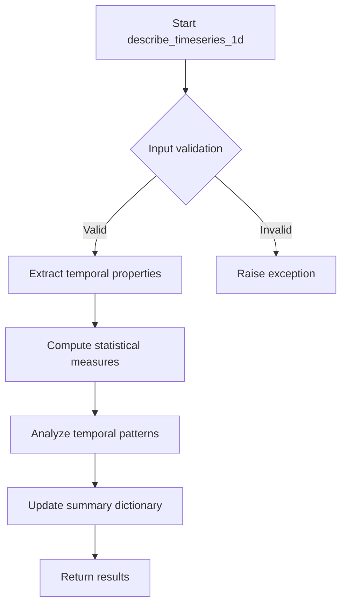

# `summary_algorithms.py`

## `src.ydata_profiling.model.summary_algorithms.func_nullable_series_contains` · *function*

## Summary:
Decorator that preprocesses pandas Series by removing NaN values before passing them to statistical analysis functions.

## Description:
This decorator wraps statistical analysis functions to handle pandas Series containing NaN values gracefully. When a Series has missing values, the decorator removes them and checks if the resulting Series is empty. If empty, it returns False immediately; otherwise, it delegates to the original function with the cleaned data.

## Args:
    fn (Callable): The statistical analysis function to be decorated, expected to accept (config: Settings, series: pd.Series, state: dict, *args, **kwargs) and return a boolean value.

## Returns:
    Callable: A wrapper function that processes the input Series by removing NaN values before calling the original function.

## Raises:
    None explicitly raised - any exceptions come from the wrapped function `fn`.

## Constraints:
    Preconditions:
    - The wrapped function `fn` must accept arguments in the form (config: Settings, series: pd.Series, state: dict, *args, **kwargs)
    - The `series` parameter must be a pandas Series object
    
    Postconditions:
    - If the input series contains only NaN values, the decorator returns False without calling the wrapped function
    - If the input series has valid values (after NaN removal), the wrapped function is called with the cleaned series

## Side Effects:
    None - This decorator doesn't perform I/O operations or mutate external state.

## Control Flow:


## Examples:
```python
@func_nullable_series_contains
def my_statistical_test(config, series, state, *args, **kwargs):
    # Statistical test logic here
    return True

# Usage:
result = my_statistical_test(settings, series_with_nans, state_dict)
# If series_with_nans contains only NaN values, result will be False
# If series_with_nans has valid values, result will be determined by the test logic
```

## `src.ydata_profiling.model.summary_algorithms.histogram_compute` · *function*

## Summary:
Computes histogram statistics for numerical data profiling with configurable binning strategies.

## Description:
This function generates histogram data for numerical variables in data profiling reports. It intelligently determines the number of bins based on configuration settings and data characteristics, handling edge cases like excessive bin counts by adjusting the bin calculation strategy. The function is designed to be reusable across different numerical data types in the profiling pipeline.

## Args:
    config (Settings): Configuration object containing plot settings including histogram-specific parameters like bin count limits and density options.
    finite_values (np.ndarray): Array of numerical values with infinite values removed, used for histogram computation.
    n_unique (int): Number of unique values in the dataset, used to determine appropriate bin count.
    name (str, optional): Key name to store the histogram result in the returned dictionary. Defaults to "histogram".
    weights (np.ndarray, optional): Weights for each value in finite_values, used for weighted histogram computation. Must match the number of bins if provided.

## Returns:
    dict: Dictionary containing the computed histogram with the specified name as key. The value is a tuple of (histogram_counts, bin_edges) from numpy.histogram.

## Raises:
    None explicitly raised in the function body.

## Constraints:
    Preconditions:
        - finite_values must be a numpy array of numerical values with no infinite values
        - n_unique must be a positive integer representing unique values count
        - config must be a valid Settings object with proper plot.histogram configuration
    Postconditions:
        - Returns a dictionary with exactly one entry (the histogram data)
        - The returned histogram data follows numpy.histogram format (counts, bin_edges)

## Side Effects:
    None - This function is pure and doesn't modify external state or perform I/O operations.

## Control Flow:
```mermaid
flowchart TD
    A[Start histogram_compute] --> B{hist_config.bins == 0?}
    B -- Yes --> C[bins_arg = "auto"]
    B -- No --> D[bins_arg = min(hist_config.bins, n_unique)]
    C --> E[bins = np.histogram_bin_edges(finite_values, bins=bins_arg)]
    D --> E
    E --> F{len(bins) > hist_config.max_bins?}
    F -- Yes --> G[bins = np.histogram_bin_edges(finite_values, bins=hist_config.max_bins)]
    G --> H{weights provided and length matches max_bins?}
    H -- Yes --> I[weights = weights]
    H -- No --> J[weights = None]
    I --> K
    J --> K
    K --> L[np.histogram with computed bins and weights]
    L --> M[Return stats dict with histogram data]
    F -- No --> N[np.histogram with computed bins and weights]
    N --> M
```

## Examples:
    # Basic usage with default parameters
    config = Settings()
    values = np.array([1, 2, 2, 3, 3, 3])
    result = histogram_compute(config, values, n_unique=3)
    # Returns: {'histogram': (histogram_counts, bin_edges)}
    
    # Usage with custom name and weights
    weights = np.array([1.0, 2.0, 1.0, 3.0, 2.0, 1.0])
    result = histogram_compute(config, values, n_unique=3, name="custom_hist", weights=weights)
    # Returns: {'custom_hist': (histogram_counts, bin_edges)}
```

## `src.ydata_profiling.model.summary_algorithms.chi_square` · *function*

## Summary:
Computes the chi-square test statistic for goodness of fit using either a provided histogram or by generating one from raw data.

## Description:
This function performs a chi-square goodness of fit test to assess whether sample data fits a theoretical distribution. It accepts either raw data values or a pre-computed histogram and returns the test results as a dictionary. This utility is commonly used in statistical data profiling to evaluate distributional properties.

## Args:
    values (Optional[numpy.ndarray]): Array of raw data values to compute histogram from if no histogram is provided. Defaults to None.
    histogram (Optional[numpy.ndarray]): Pre-computed histogram array to use for the chi-square test. Defaults to None.

## Returns:
    dict: Dictionary containing the chi-square test results. The exact keys depend on scipy.stats.chisquare's return structure, typically including 'statistic' and 'pvalue'.

## Raises:
    None explicitly raised in the function body.

## Constraints:
    Preconditions:
    - If values is provided, it should be a valid numpy array
    - If histogram is provided, it should be a valid numpy array
    - At least one of values or histogram should be provided for meaningful computation

    Postconditions:
    - Returns a dictionary with chi-square test statistics
    - The returned dictionary contains the results of scipy.stats.chisquare

## Side Effects:
    None.

## Control Flow:
```mermaid
flowchart TD
    A[Start chi_square] --> B{histogram provided?}
    B -->|Yes| C[Return chisquare(histogram)]
    B -->|No| D[Compute bins from values]
    D --> E[Compute histogram from values]
    E --> F[Return chisquare(histogram)]
```

## Examples:
```python
# Using raw values
import numpy as np
result = chi_square(values=np.array([1, 2, 2, 3, 3, 3]))

# Using pre-computed histogram
hist = np.array([1, 2, 3])
result = chi_square(histogram=hist)
```

## `src.ydata_profiling.model.summary_algorithms.series_hashable` · *function*

## Summary:
Decorator that conditionally executes wrapped functions based on series hashability.

## Description:
A decorator that wraps profiling functions to skip execution when the series is not hashable. This prevents errors when performing operations that require hashable data types on non-hashable series.

## Args:
    fn (Callable[[Settings, pd.Series, dict], Tuple[Settings, pd.Series, dict]]): The profiling function to wrap, which takes configuration, series, and summary dictionary and returns updated versions of these.

## Returns:
    Callable[[Settings, pd.Series, dict], Tuple[Settings, pd.Series, dict]]: A wrapped function that conditionally executes the original function based on hashability.

## Raises:
    None explicitly raised - delegates any exceptions from the wrapped function.

## Constraints:
    Preconditions:
    - The summary dictionary must contain a "hashable" key with a boolean value
    - The input function must accept (Settings, pd.Series, dict) arguments and return (Settings, pd.Series, dict)
    
    Postconditions:
    - If summary["hashable"] is False, returns inputs unchanged
    - If summary["hashable"] is True, returns result of wrapped function

## Side Effects:
    None - This is a pure decorator that doesn't perform I/O or mutate external state.

## Control Flow:
```mermaid
flowchart TD
    A[series_hashable decorator] --> B{summary["hashable"]}
    B -- False --> C[Return inputs unchanged]
    B -- True --> D[Execute wrapped function]
    D --> E[Return function result]
    C --> F[End]
    E --> F
```

## Examples:
```python
@series_hashable
def calculate_mode(config: Settings, series: pd.Series, summary: dict) -> Tuple[Settings, pd.Series, dict]:
    # This function will only execute if summary["hashable"] is True
    mode_value = series.mode().iloc[0] if not series.empty else None
    summary["mode"] = mode_value
    return config, series, summary
```

## `src.ydata_profiling.model.summary_algorithms.series_handle_nulls` · *function*

## Summary:
Decorator that removes null values from pandas Series before passing them to summary algorithms in ydata-profiling.

## Description:
This decorator standardizes null value handling for summary algorithms by automatically dropping NaN values from input Series before processing. It ensures that downstream summary functions operate on clean data without null entries, while preserving the original function's behavior and metadata through functools.wraps. This is particularly useful in data profiling contexts where null handling needs to be consistent across different statistical calculations.

## Args:
    fn (Callable[[Settings, pd.Series, dict], Tuple[Settings, pd.Series, dict]]): The summary algorithm function to be wrapped. This function should accept configuration (Settings), a pandas Series, and a summary dictionary, returning a tuple of updated configuration, processed series, and updated summary.

## Returns:
    Callable[[Settings, pd.Series, dict], Tuple[Settings, pd.Series, dict]]: A decorated version of the input function that automatically handles null values in the input Series by dropping them before execution.

## Raises:
    None explicitly raised - delegates any exceptions from the wrapped function.

## Constraints:
    Preconditions:
    - Input series must be a valid pandas Series object
    - Function `fn` must accept exactly three parameters: Settings, pd.Series, dict
    - Function `fn` must return a tuple of exactly three elements: Settings, pd.Series, dict
    
    Postconditions:
    - If input series contains null values, they are removed before calling the wrapped function
    - If input series contains no null values, the series is passed unchanged to the wrapped function
    - The returned tuple maintains the same structure as the wrapped function's return value

## Side Effects:
    None - This function only modifies the input data by removing null values and doesn't perform any I/O operations or mutate external state.

## Control Flow:
```mermaid
flowchart TD
    A[series_handle_nulls decorator] --> B{series.hasnans?}
    B -->|Yes| C[series.dropna()]
    B -->|No| C
    C --> D[fn(config, series, summary)]
    D --> E[Return result]
```

## Examples:
```python
# Example usage in a summary algorithm
@series_handle_nulls
def calculate_mean(config: Settings, series: pd.Series, summary: dict) -> Tuple[Settings, pd.Series, dict]:
    mean_value = series.mean()
    summary['mean'] = mean_value
    return config, series, summary

# When called with a series containing nulls:
# series = pd.Series([1, 2, None, 4])
# The decorator will drop the null value before calling calculate_mean
```

## `src.ydata_profiling.model.summary_algorithms.named_aggregate_summary` · *function*

## Summary:
Computes and returns basic statistical summary metrics (maximum, mean, median, minimum) for a given data series with keys prefixed by a specified identifier.

## Description:
This function calculates fundamental descriptive statistics for a pandas Series and returns them in a dictionary format with prefixed keys. It serves as a utility for data profiling operations where consistent statistical naming conventions are required.

## Args:
    series (pd.Series): Input data series containing numeric values for statistical computation
    key (str): String prefix used to format the dictionary keys in the returned summary

## Returns:
    dict: Dictionary containing four statistical measures with keys formatted as "max_{key}", "mean_{key}", "median_{key}", and "min_{key}"

## Raises:
    None explicitly raised in the function body

## Constraints:
    Preconditions:
        - Input series must be a valid pandas Series object
        - Series should contain numeric data for meaningful statistical computation
    Postconditions:
        - Returned dictionary always contains exactly four key-value pairs
        - Keys are always formatted as "statistic_key" where statistic is one of max, mean, median, min

## Side Effects:
    None

## Control Flow:
```mermaid
flowchart TD
    A[Start named_aggregate_summary] --> B[Initialize summary dict]
    B --> C[Compute max_{key}]
    C --> D[Compute mean_{key}]
    D --> E[Compute median_{key}]
    E --> F[Compute min_{key}]
    F --> G[Return summary dict]
```

## Examples:
```python
# Basic usage
series = pd.Series([1, 2, 3, 4, 5])
result = named_aggregate_summary(series, "age")
# Returns: {'max_age': 5, 'mean_age': 3.0, 'median_age': 3, 'min_age': 1}

# With different data
values = pd.Series([10.5, 20.3, 15.7])
result = named_aggregate_summary(values, "score")
# Returns: {'max_score': 20.3, 'mean_score': 15.5, 'median_score': 15.7, 'min_score': 10.5}
```

## `src.ydata_profiling.model.summary_algorithms.describe_counts` · *function*

## Summary:
Template function for count-based statistical analysis in data profiling.

## Description:
This function serves as a placeholder for implementing count-based descriptive statistics algorithms within the data profiling framework. It follows the standard pattern used by other summary algorithms in the module by accepting configuration, data series, and summary dictionary parameters, and returning updated versions of these objects.

The function is intended to compute count-related metrics such as unique value frequencies, distribution counts, and other statistical measures derived from counting operations on the input data series. It is part of a family of summary algorithms that process data series to extract meaningful statistical insights.

## Args:
    config (Settings): Configuration object containing profiling settings and parameters
    series (Any): Input data series to analyze for count statistics  
    summary (dict): Dictionary containing existing summary statistics that will be updated with count metrics

## Returns:
    Tuple[Settings, Any, dict]: A tuple containing the (configuration, series, summary dictionary) which will be updated with count-based statistics

## Raises:
    NotImplementedError: This function is not yet implemented and raises this exception when called

## Constraints:
    Preconditions:
        - config must be a valid Settings object
        - series must be a valid data series (pandas Series, numpy array, or compatible type)
        - summary must be a mutable dictionary object
    
    Postconditions:
        - When implemented, the summary dictionary will contain count-based metrics
        - The returned configuration and series will reflect any processing performed

## Side Effects:
    - None specified (when not implemented)
    - When implemented, will modify the summary dictionary in-place

## Control Flow:


## Examples:
```python
# This function is not yet implemented and will raise NotImplementedError
# when called in its current state
config = Settings()
series = pd.Series([1, 2, 2, 3, 3, 3])
summary = {}

# This call would raise NotImplementedError:
# describe_counts(config, series, summary)

# Expected usage pattern once implemented:
# config, series, summary = describe_counts(config, series, summary)
# # summary would contain count-based statistics like:
# # - unique value counts
# # - frequency distributions  
# # - other count-derived metrics
```

## `src.ydata_profiling.model.summary_algorithms.describe_supported` · *function*

## Summary
Determines appropriate statistical descriptions and analysis methods for a data series, currently raising NotImplementedError.

## Description
The `describe_supported` function is designed to analyze a data series and its associated metadata to determine what types of descriptive statistics and analytical methods are appropriate for that series. It evaluates the series' data type, distribution characteristics, and configuration settings to select suitable profiling approaches.

This function serves as a placeholder in the profiling pipeline that will eventually determine which analysis methods are supported for a given series. It is extracted into its own component rather than being inlined because it encapsulates the logic for determining analysis suitability, separating concerns between data characterization and actual analysis execution.

In a completed implementation, this function would:
1. Analyze the characteristics of the input series (data type, cardinality, distribution)
2. Determine which statistical measures and visualizations are appropriate
3. Adjust configuration settings based on series properties
4. Potentially transform or filter the series for optimal analysis
5. Enhance the series description with metadata for downstream processing

## Args
- config (Settings): Configuration object containing profiling settings that influence which analyses are performed
- series (Any): Input data series (typically a pandas Series) to be analyzed and described
- series_description (dict): Dictionary containing metadata and existing descriptions for the series, including type information and preliminary statistics

## Returns
- Tuple[Settings, Any, dict]: A tuple containing:
  - Updated configuration settings that may have been adjusted based on series characteristics
  - The processed series (potentially transformed or filtered)
  - An updated series description dictionary with additional analysis-ready metadata

## Raises
- NotImplementedError: Raised by the current implementation indicating that the function is not yet implemented

## Constraints
- Preconditions:
  - All input parameters must be properly initialized and not None
  - The series parameter must be compatible with pandas operations
  - The series_description dictionary must be properly formatted with expected keys
- Postconditions:
  - Upon implementation, will return a tuple with updated configuration, processed series, and enhanced description
  - The returned configuration may reflect adjustments made based on series characteristics
  - The returned description will contain additional metadata appropriate for the series type

## Side Effects
- None directly observable (the function is primarily computational)
- May indirectly affect downstream processing through configuration updates
- Could potentially modify the series_description dictionary in-place

## Control Flow


## Examples
```python
from ydata_profiling.config import Settings
import pandas as pd

# Basic usage - currently raises NotImplementedError
config = Settings()
series = pd.Series([1, 2, 3, 4, 5])
series_description = {'type': 'numeric', 'count': 5}

# This will raise NotImplementedError in current implementation
try:
    updated_config, processed_series, enhanced_description = describe_supported(config, series, series_description)
    print("Analysis methods determined successfully")
except NotImplementedError:
    print("Function not yet implemented - placeholder for future implementation")

# Expected behavior after implementation:
# - Config might be updated to disable certain analyses for sparse data
# - Series might be filtered or transformed for better analysis
# - Description would include analysis-specific metadata
```

## `src.ydata_profiling.model.summary_algorithms.describe_generic` · *function*

## Summary
Placeholder function that raises NotImplementedError, intended to be overridden by type-specific implementations in a multimethod system.

## Description
This function serves as a placeholder in a multimethod dispatch system for computing descriptive statistics and summary information for data series. It is decorated with @multimethod and is intended to be overridden by specific implementations that handle different data types (numeric, categorical, datetime, etc.).

The function follows a consistent interface pattern where configuration settings, a data series, and an existing summary dictionary are processed to return updated configuration, processed series, and extended summary information. Specific implementations are registered for different data types using the multimethod decorator.

When called directly, this function raises NotImplementedError because it is not meant to be invoked directly but rather through the multimethod dispatch mechanism that selects the appropriate type-specific implementation.

## Args
- config (Settings): Configuration object containing profiling settings and parameters
- series (Any): Input data series to be described (can be of any data type)
- summary (dict): Existing summary dictionary to be extended with new information

## Returns
- Tuple[Settings, Any, dict]: A tuple containing:
  - Updated configuration object
  - Processed data series (potentially transformed)
  - Extended summary dictionary with new descriptive statistics

## Raises
- NotImplementedError: This function raises NotImplementedError when called directly, as it is intended to be overridden by specific implementations

## Constraints
- Preconditions: The config parameter must be a valid Settings object, series must be a valid data series, and summary must be a dictionary
- Postconditions: The returned tuple maintains the expected structure and types

## Side Effects
- None: This function does not perform any I/O operations or mutate external state

## Control Flow
```mermaid
flowchart TD
    A[describe_generic called] --> B{Is implementation defined?}
    B -- No --> C[Raise NotImplementedError]
    B -- Yes --> D[Dispatch to specific implementation]
    D --> E[Process config, series, summary]
    E --> F[Return (config, series, summary)]
```

## Examples
```python
# This function is not meant to be called directly
# Instead, it's part of a multimethod system where specific implementations exist

from ydata_profiling.config import Settings
import pandas as pd

# Create test data
df = pd.DataFrame({'col1': [1, 2, 3, 4, 5]})
series = df['col1']
config = Settings()
summary = {}

# This would raise NotImplementedError if called directly
# but would work through the multimethod dispatch system:
# describe_generic(config, series, summary)  # Would raise NotImplementedError

# Actual usage happens through the multimethod system:
# Specific implementations are registered for different data types
```

## `src.ydata_profiling.model.summary_algorithms.describe_numeric_1d` · *function*

## Summary
Placeholder function for describing single-dimensional numeric data in data profiling.

## Description
This function is a placeholder for processing numeric data in a profiling context. It is intended to be part of a multi-method dispatch system for handling different data types in data profiling workflows.

The function signature follows the established pattern of other describe_* functions in the profiling library, taking configuration, a data series, and a summary dictionary as inputs, and returning the same tuple structure.

## Args
    config (Settings): Configuration settings that control the profiling behavior and thresholds
    series (Any): A pandas Series or other data structure containing numeric data to be analyzed
    summary (dict): Dictionary containing existing summary statistics that will be updated with new findings

## Returns
    Tuple[Settings, Any, dict]: Returns a tuple containing the configuration, series, and summary dictionary in that order

## Raises
    NotImplementedError: This function is not yet implemented and raises this exception when called

## Constraints
    Preconditions:
        - The series parameter must be a valid data structure containing numeric values
        - The summary parameter must be a mutable dictionary
        - Config must be a valid Settings object

## Side Effects
    None: This function does not perform any I/O operations or mutate external state beyond what is defined in its eventual implementation

## Control Flow


## `src.ydata_profiling.model.summary_algorithms.describe_text_1d` · *function*

## Summary:
Placeholder function for describing single-dimensional text data in data profiling.

## Description:
This function serves as a placeholder for processing text data in a profiling context. It is part of a multi-method dispatch system designed to handle different data types uniformly in data profiling workflows. Based on the naming convention and pattern of similar functions (describe_numeric_1d, describe_categorical_1d, describe_boolean_1d), this function is intended to compute descriptive statistics and summary information specifically for text data series.

The function signature follows the established pattern in the profiling library, taking configuration, a data series, and a summary dictionary as inputs, and returning a tuple with the same structure.

## Args:
    config (Settings): Configuration settings that control the profiling behavior and thresholds
    series (Any): A data structure containing text data to be analyzed (likely a pandas Series)
    summary (dict): Dictionary containing existing summary statistics that will be updated with new findings

## Returns:
    Tuple[Settings, Any, dict, Any]: Returns a tuple containing the configuration, series, summary dictionary, and an additional value in that order

## Raises:
    NotImplementedError: This function is not yet implemented and raises this exception when called

## Constraints:
    Preconditions:
        - The series parameter must be a valid data structure containing text values
        - The summary parameter must be a mutable dictionary
        - Config must be a valid Settings object

## Side Effects:
    None: This function does not perform any I/O operations or mutate external state beyond what is defined in its eventual implementation

## Control Flow:


## Notes:
This function is currently unimplemented and raises NotImplementedError. It should be implemented to provide text-specific descriptive statistics for data profiling purposes, following the same pattern as other describe_* functions in the module.

## `src.ydata_profiling.model.summary_algorithms.describe_date_1d` · *function*

## Summary:
Analyzes and summarizes date/time data in a one-dimensional series for statistical profiling.

## Description:
This function processes datetime data series to compute descriptive statistics and summary information. It is part of a multi-method dispatch system designed to handle different data types uniformly in data profiling workflows. The function follows the same pattern as other describe_* functions in the profiling library, providing standardized analysis for temporal data types.

## Args:
    config (Settings): Configuration settings for the profiling process that control various aspects of the analysis behavior and thresholds
    series (Any): Input data series containing date/time values to analyze, typically a pandas Series with datetime dtype
    summary (dict): Dictionary containing existing summary statistics that will be updated with new findings related to date/time data

## Returns:
    Tuple[Settings, Any, dict]: A tuple containing the updated configuration, processed series, and updated summary dictionary in that order. The summary dictionary will contain date/time-specific statistics and metadata.

## Raises:
    NotImplementedError: Currently always raised as the implementation is not yet completed

## Constraints:
    Preconditions:
        - config must be a valid Settings object
        - series should contain date/time values or be convertible to datetime
        - summary should be a mutable dictionary
    
    Postconditions:
        - The returned summary dictionary will contain datetime-specific statistics
        - The returned series will be processed appropriately for temporal data

## Side Effects:
    None directly observable, but may modify the summary dictionary in-place with datetime-related statistics

## Control Flow:
```mermaid
flowchart TD
    A[Start describe_date_1d] --> B{Series is datetime?}
    B -- Yes --> C[Compute datetime stats]
    B -- No --> D[Convert to datetime]
    D --> C
    C --> E[Update summary dict]
    E --> F[Return (config, series, summary)]
```

## Examples:
```python
# Typical usage in profiling pipeline
config = Settings()
series = pd.Series(['2023-01-01', '2023-01-02', '2023-01-03'])
summary = {}
config, processed_series, summary = describe_date_1d(config, series, summary)
```

## `src.ydata_profiling.model.summary_algorithms.describe_categorical_1d` · *function*

## Summary:
Placeholder function for describing single-dimensional categorical data.

## Description:
This function is a placeholder for processing categorical data in a profiling context. It is intended to be part of a multi-method dispatch system for handling different data types in data profiling workflows.

## Args:
    config (Settings): Configuration settings that control the profiling behavior and thresholds
    series (pd.Series): A pandas Series containing categorical data to be analyzed
    summary (dict): Dictionary containing existing summary statistics that will be updated with new findings

## Returns:
    Tuple[Settings, pd.Series, dict]: Returns a tuple containing the configuration, series, and summary dictionary in that order

## Raises:
    NotImplementedError: This function is not yet implemented and raises this exception when called

## Constraints:
    Preconditions:
        - The series parameter must be a valid pandas Series object
        - The summary parameter must be a mutable dictionary
        - Config must be a valid Settings object

## Side Effects:
    None: This function does not perform any I/O operations or mutate external state beyond what is defined in its eventual implementation

## Control Flow:


## `src.ydata_profiling.model.summary_algorithms.describe_url_1d` · *function*

## Summary:
Placeholder function for describing single-dimensional URL data in data profiling.

## Description:
This function is a placeholder for processing URL data in the ydata profiling library's data analysis framework. It follows the established pattern of other `describe_*_1d` functions in the module, implementing a multi-method dispatch system for handling different data types during automated data profiling.

The function is part of a larger profiling architecture where different data types are handled by specialized functions. URL data analysis would typically involve parsing URLs to extract components like protocol, domain, path, and other structural elements, then calculating statistics about these components.

This function serves as a placeholder that must be implemented to support URL data profiling capabilities in the ydata profiling library.

## Args:
    config (Settings): Configuration settings that control the profiling behavior and thresholds for URL analysis
    series (Any): A data structure containing URL data to be analyzed (typically a pandas Series with URL strings)
    summary (dict): Dictionary containing existing summary statistics that will be updated with URL-specific findings

## Returns:
    Tuple[Settings, Any, dict]: Returns a tuple containing the configuration, series, and summary dictionary in that order. The function currently raises NotImplementedError.

## Raises:
    NotImplementedError: This function is not yet implemented and raises this exception when called

## Constraints:
    Preconditions:
        - The series parameter must be a valid data structure containing URL-formatted data
        - The summary parameter must be a mutable dictionary
        - Config must be a valid Settings object

    Postconditions:
        - When implemented, this function will process URL data and update the summary dictionary with URL-specific statistics
        - The configuration and series parameters will be returned unchanged (unless the implementation modifies them)

## Side Effects:
    None: This function does not perform any I/O operations or mutate external state beyond what is defined in its eventual implementation

## Control Flow:


## Examples:
```python
# Typical usage pattern in profiling workflow
config = Settings()
url_series = pd.Series(['https://example.com', 'http://test.org'])
summary = {}

# This will raise NotImplementedError until implemented
try:
    result = describe_url_1d(config, url_series, summary)
except NotImplementedError:
    print("URL analysis functionality not yet implemented")

# Expected behavior once implemented:
# - Parse URLs in the series
# - Extract URL components (protocol, domain, path, etc.)
# - Calculate statistics about URL structure
# - Update summary with URL-specific metrics
```

## `src.ydata_profiling.model.summary_algorithms.describe_file_1d` · *function*

## Summary:
Placeholder function for 1D file/data series descriptive analysis in the profiling pipeline.

## Description:
This function is intended to process 1D data series for file-level descriptive statistics within the ydata-profiling framework. It represents a placeholder implementation that currently raises NotImplementedError, indicating it's not yet fully implemented in the codebase.

The function follows a standard pattern in data profiling systems where configuration settings, data series, and summary dictionaries are processed to generate enhanced statistical information. It is designed to be part of a multi-method dispatch system for handling various data types in profiling workflows.

## Args:
    config (Settings): Configuration settings object containing profiling parameters and options
    series (Any): Input data series or file content to be analyzed (could be pandas Series, numpy array, or other iterable)
    summary (dict): Dictionary containing existing summary statistics that would be updated with new findings

## Returns:
    Tuple[Settings, Any, dict]: A tuple containing:
        - Updated configuration settings (Settings)
        - Processed data series or transformed data (Any)  
        - Enhanced summary dictionary with new statistical information (dict)

## Raises:
    NotImplementedError: Always raised as this function is not yet implemented

## Constraints:
    Preconditions:
        - config must be a valid Settings object from ydata_profiling.config
        - series should be compatible with data analysis operations
        - summary should be a mutable dictionary object
    
    Postconditions:
        - When implemented, function should return a properly formatted tuple with updated values
        - Configuration settings should be appropriately modified based on analysis
        - Summary dictionary should contain enhanced statistical information

## Side Effects:
    None: This function is designed to be pure and not modify external state directly

## Control Flow:
```mermaid
flowchart TD
    A[Start describe_file_1d] --> B{Implementation complete?}
    B -- No --> C[Raise NotImplementedError]
    B -- Yes --> D[Process config settings]
    C --> E[Return tuple]
    D --> F[Analyze series data]
    F --> G[Update summary statistics]
    G --> H[Return (updated_config, processed_series, updated_summary)]
```

## Examples:
```python
# This function is not yet implemented and will raise NotImplementedError
config = Settings()
series = pd.Series([1, 2, 3, 4, 5])
summary = {}

try:
    result = describe_file_1d(config, series, summary)
except NotImplementedError:
    print("describe_file_1d function is not yet implemented")
```

## `src.ydata_profiling.model.summary_algorithms.describe_path_1d` · *function*

## Summary:
Placeholder function for 1-dimensional path analysis that currently raises NotImplementedError.

## Description:
This function is a placeholder implementation for analyzing 1-dimensional data paths or sequences. It is designed to be part of a multimethod dispatch system for handling different data types in 1D profiling scenarios. Currently, it simply raises NotImplementedError to indicate that the implementation is pending.

The function follows the standard pattern of returning a tuple of (Settings, Any, dict) which suggests it's meant to be part of a data profiling pipeline where configuration, data, and summary statistics are processed and updated sequentially.

## Args:
    config (Settings): Configuration object containing profiling settings and parameters
    series (Any): Input data series to analyze, typically a pandas Series or similar 1D array-like structure  
    summary (dict): Existing summary statistics dictionary to be updated with path analysis results

## Returns:
    Tuple[Settings, Any, dict]: Function signature indicates it should return updated configuration, processed data, and updated summary dictionary, but currently raises NotImplementedError

## Raises:
    NotImplementedError: This function is not yet implemented and always raises this exception

## Constraints:
    Preconditions:
        - config must be a valid Settings object
        - series should be compatible with 1D data analysis operations
        - summary should be a mutable dictionary object
    
    Postconditions:
        - Function would return updated configuration, data, and summary objects if implemented
        - All input parameters would remain unchanged except for return values

## Side Effects:
    None: This function does not perform any I/O operations or external state mutations in its current implementation

## Control Flow:
```mermaid
flowchart TD
    A[Start describe_path_1d] --> B{Is implemented?}
    B -- No --> C[Raise NotImplementedError]
    B -- Yes --> D[Process series data]
    D --> E[Extract path characteristics]
    E --> F[Update summary dictionary]
    F --> G[Return (config, series, summary)]
```

## Examples:
```python
# Usage example (will raise NotImplementedError)
config = Settings()
series = pd.Series([1, 2, 3, 4, 5])
summary = {}

try:
    config, processed_series, updated_summary = describe_path_1d(config, series, summary)
except NotImplementedError:
    print("Path analysis implementation is pending")
```

## `src.ydata_profiling.model.summary_algorithms.describe_image_1d` · *function*

## Summary:
Processes 1-dimensional image data and generates descriptive statistical summaries for data profiling.

## Description:
This function is designed to analyze 1-dimensional image data series and extract meaningful statistical properties for inclusion in data profiling reports. It follows the standard pattern of data profiling functions by accepting configuration, input data, and summary metadata, then returning updated versions of these elements.

As a placeholder, this function currently raises NotImplementedError to indicate incomplete implementation. A complete implementation would process image data (typically pixel intensity values in 1D format) and compute appropriate descriptive statistics such as min/max values, mean, standard deviation, histogram bins, or other relevant image characteristics.

## Args:
    config (Settings): Configuration settings for the profiling process, including various analysis parameters and thresholds that may influence how image data is processed
    series (Any): Input data series representing 1-dimensional image data, typically containing pixel intensity values or similar image features that can be analyzed numerically
    summary (dict): Dictionary containing existing summary statistics and metadata that will be augmented with image-specific metrics and properties

## Returns:
    Tuple[Settings, Any, dict]: A tuple containing:
        - Updated configuration object (potentially modified based on image analysis requirements)
        - Processed series data (possibly normalized, transformed, or validated)
        - Updated summary dictionary with newly computed image statistics and metadata

## Raises:
    NotImplementedError: This function currently raises this exception as it is not yet implemented

## Constraints:
    Preconditions:
        - The series parameter should contain valid 1D image data representation suitable for statistical analysis
        - The config parameter must be a properly initialized Settings object from the ydata_profiling.config module
        - The summary parameter should be a mutable dictionary object that can accept new key-value pairs
    
    Postconditions:
        - When implemented, the returned summary dictionary will contain image-specific statistical measures
        - When implemented, the configuration may be adjusted to accommodate image-specific analysis parameters

## Side Effects:
    None: This function does not perform any I/O operations or external state mutations in its current implementation

## Control Flow:


## Examples:
    # Usage in profiling pipeline (placeholder)
    try:
        config, processed_series, updated_summary = describe_image_1d(
            config=settings,
            series=image_data_series,
            summary=current_summary
        )
    except NotImplementedError:
        # Handle unimplemented functionality gracefully
        print("Image 1D analysis not yet implemented")
        # Continue with alternative processing methods
```

## `src.ydata_profiling.model.summary_algorithms.describe_boolean_1d` · *function*

## Summary:
Analyzes and summarizes boolean data in a one-dimensional series for statistical profiling.

## Description:
This function processes boolean data series to compute descriptive statistics and summary information. It follows the same pattern as other describe_* functions in the profiling library, providing standardized analysis for boolean data types. The function is designed to be part of a multi-method dispatch system for handling different data types uniformly.

## Args:
    config (Settings): Configuration settings for the profiling process
    series (Any): Input data series containing boolean values to analyze
    summary (dict): Dictionary containing existing summary statistics to be updated

## Returns:
    Tuple[Settings, Any, dict]: A tuple containing the updated configuration, processed series, and updated summary dictionary

## Raises:
    NotImplementedError: Currently always raised as the implementation is not yet completed

## Constraints:
    Preconditions:
        - config must be a valid Settings object
        - series should contain boolean values or be convertible to boolean
        - summary should be a mutable dictionary
    
    Postconditions:
        - The returned summary dictionary will contain boolean-specific statistics
        - The returned series will be processed appropriately for boolean data

## Side Effects:
    None directly observable, but may modify the summary dictionary in-place

## Control Flow:
```mermaid
flowchart TD
    A[Start describe_boolean_1d] --> B{Series is boolean?}
    B -- Yes --> C[Compute boolean stats]
    B -- No --> D[Convert to boolean]
    D --> C
    C --> E[Update summary dict]
    E --> F[Return (config, series, summary)]
```

## Examples:
```python
# Typical usage in profiling pipeline
config = Settings()
series = pd.Series([True, False, True, False])
summary = {}
config, processed_series, summary = describe_boolean_1d(config, series, summary)
```

## `src.ydata_profiling.model.summary_algorithms.describe_timeseries_1d` · *function*

## Summary:
Analyzes and summarizes univariate time series data by computing descriptive statistics and temporal patterns.

## Description:
This function processes a univariate time series dataset to extract meaningful statistical properties and temporal characteristics. It serves as a core component in automated data profiling for time series analysis, providing essential summary statistics that characterize the temporal behavior of the data.

The function is designed to be part of a larger data profiling pipeline where time series data needs to be analyzed for pattern recognition, anomaly detection, or general characterization. It's typically invoked when processing time series columns in datasets during automated profiling workflows.

This logic is extracted into its own function to maintain clean separation of concerns, allowing the time series analysis to be modular and reusable across different profiling contexts while keeping the main profiling logic focused on general data characteristics.

## Args:
    config (Settings): Configuration object containing profiling settings and parameters that control the analysis behavior
    series (Any): Time series data in various formats (pandas Series, numpy array, or list) representing a single temporal variable
    summary (dict): Dictionary containing existing summary statistics that will be updated with new time series metrics

## Returns:
    Tuple[Settings, Any, dict]: A tuple containing:
        - Updated configuration object (potentially modified based on analysis)
        - Processed series data (may be transformed or filtered)
        - Updated summary dictionary with time series specific statistics added

## Raises:
    NotImplementedError: When the function has not yet been implemented

## Constraints:
    Preconditions:
        - config must be a valid Settings object with appropriate time series configuration
        - series should contain numeric temporal data suitable for time series analysis
        - summary should be a mutable dictionary that can accept new key-value pairs
    
    Postconditions:
        - The returned summary dictionary will contain time series specific metrics
        - The function preserves the temporal order of the input series
        - Configuration object may be modified to reflect analysis results

## Side Effects:
    None: This function is designed to be pure and not modify external state directly

## Control Flow:


## Examples:
```python
# Typical usage in a profiling workflow
config = Settings()
series = pd.Series([1, 2, 3, 4, 5], index=pd.date_range('2020-01-01', periods=5))
summary = {}

updated_config, processed_series, updated_summary = describe_timeseries_1d(config, series, summary)
```

