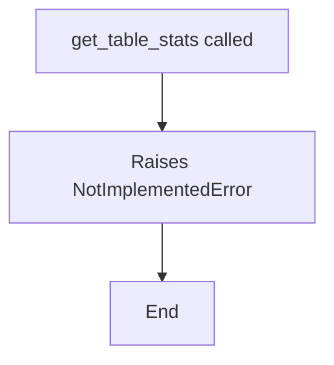

# `table.py`

## `src.ydata_profiling.model.table.get_table_stats` · *function*

## Summary
Placeholder function for computing table-level statistics from variable-level statistics and configuration.

## Description
This function is currently unimplemented and raises NotImplementedError. Based on its signature and naming convention, it is intended to aggregate variable-level statistics into comprehensive table-level metadata and summary statistics according to provided configuration settings.

The function signature suggests it will serve as a key component in a data profiling pipeline where individual column analyses are consolidated into overall dataset characterization.

## Args
- config (Settings): Configuration object containing profiling settings and options
- df (Any): The dataframe or data structure being profiled
- variable_stats (dict): Dictionary containing pre-computed statistics for each variable/column

## Returns
- dict: Table-level statistics dictionary (function not yet implemented)

## Raises
- NotImplementedError: Always raised by this function as it is not yet implemented

## Constraints
- Preconditions: All arguments must be properly initialized
- Postconditions: Function will return a dictionary of table statistics (when implemented)

## Side Effects
- None: Function is stateless

## Control Flow

