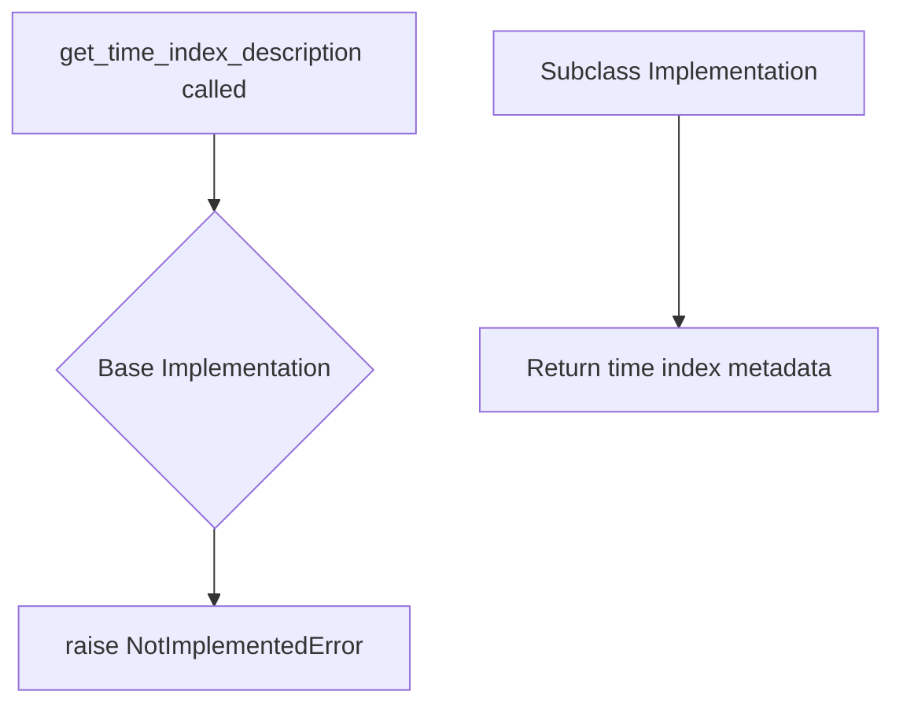

# `timeseries_index.py`

## `src.ydata_profiling.model.timeseries_index.get_time_index_description` · *function*

## Summary:
Returns a dictionary describing the time index properties of a DataFrame for time series analysis.

## Description:
This function serves as an abstract interface for extracting temporal metadata from time series data. It is designed to be implemented by subclasses to provide specific time index descriptions based on the underlying data structure and configuration. The function takes configuration settings, a DataFrame, and statistical summaries to return structured information about temporal characteristics.

This function is part of a larger time series analysis framework where different implementations may handle various time index formats (datetime, integer-based, etc.) and provide domain-specific metadata.

## Args:
    config (Settings): Configuration object containing analysis settings and parameters for time series processing
    df (Any): Input DataFrame or data structure containing time series data with potential time index
    table_stats (dict): Dictionary containing statistical summaries and metadata about the table/dataframe

## Returns:
    dict: A dictionary containing structured metadata about time index properties including temporal characteristics, frequency information, and data quality indicators

## Raises:
    NotImplementedError: Raised by this base implementation to indicate that subclasses must override this method with specific time index analysis logic

## Constraints:
    Preconditions: All input parameters must be provided and compatible with expected types
    Postconditions: The returned dictionary should contain standardized keys for time index metadata

## Side Effects:
    None: This function does not perform any I/O operations or mutate external state

## Control Flow:


## Examples:
```python
# Usage in a time series analysis context
try:
    time_desc = get_time_index_description(config, df, table_stats)
    print(f"Time index type: {time_desc.get('index_type')}")
except NotImplementedError:
    # This indicates the specific implementation is missing
    print("Time index description not implemented for this data type")

# Expected return structure (example):
expected_structure = {
    'index_type': 'datetime',  # or 'integer', 'period', etc.
    'frequency': 'daily',      # inferred frequency
    'start_date': '2023-01-01',
    'end_date': '2023-12-31',
    'data_quality': {'missing_values': 0.0, 'gaps': 0}
}
```

